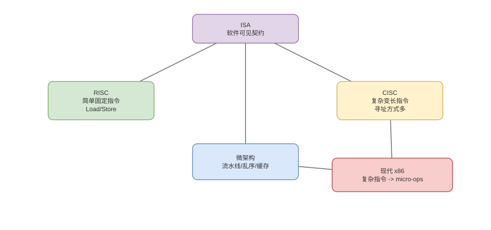

# ISA、指令编码与寻址方式

> 基线：ISA 是软件可见契约；指令长度、寄存器和寻址方式共同决定代码密度、译码难度与实现空间。

## 01-ISA契约
Q: 一套 ISA 通常规定哪些软件可见内容？
A:
- 指令操作与编码、通用/专用寄存器、数据类型、寻址方式和 PC/标志寄存器语义。
- 特权级、异常与中断入口、原子指令、内存一致性模型以及系统调用所依赖的机制。
- ABI 在 ISA 之上进一步规定参数寄存器、栈、调用者保存规则和二进制格式，不应与 ISA 混为一谈。
- 缓存大小、流水线、预测器通常是微架构细节，不属于普通程序可依赖的 ISA 结果。

## 02-指令字段
Q: 一条机器指令的编码通常包含什么，CPU 怎样知道字段边界？
A:
- 常见字段有 opcode、源/目标寄存器编号、立即数、寻址模式和功能扩展位。
- 固定长度 ISA 可按固定位置并行切字段，译码规则简单；变长 ISA 需判断前缀和长度，前端边界识别更复杂。
- 立即数位宽与指令长度有限，较大常量可能需多条指令构造或从常量池加载。
- 指令编码是字节序列，反汇编必须知道 ISA、模式和起始边界，任意偏移解析可能得到不同结果。

## 03-寻址方式
Q: 立即、寄存器、直接、间接、基址加偏移寻址分别解决什么？
A:
- 立即数把常量放在指令中；寄存器寻址直接使用寄存器值，速度快且编码紧凑。
- 直接寻址把地址/偏移写入指令；寄存器间接把寄存器内容当地址，支持指针。
- 基址+偏移适合栈帧字段、对象成员和数组；变址/比例因子可形成 `base+index*scale+disp`。
- 寻址计算得到虚拟有效地址，之后仍要经过权限、TLB、缓存和对齐检查，并非“算出地址就到内存”。

## 04-LoadStore
Q: Load/Store 架构与可直接对内存运算的 ISA 有何差异？
A:
- Load/Store 只允许 load/store 访问内存，算术逻辑在寄存器间完成，数据通路和流水线依赖更规整。
- 某些 CISC 指令可把内存操作数与计算组合，代码密度高，但内部常拆为地址生成、加载和执行微操作。
- “一条复杂指令”不等于一个周期完成，异常、跨页和缓存未命中会让内部步骤更复杂。
- 编译器关心的是吞吐、依赖和编码成本，不会机械地以指令条数最少为唯一目标。

## 05-RISC与CISC
Q: RISC/CISC 的经典差异和现代边界是什么？
A:
- RISC 倾向固定长度、较多寄存器、简单寻址和 Load/Store；CISC 倾向变长编码、复杂寻址和历史兼容。
- RISC 便于宽取指译码与流水线，CISC 常有更好代码密度，但这只是设计倾向。
- 现代 x86 将复杂指令译为 µops，现代 ARM 也有复杂指令和多级乱序后端，两者已非“简单对复杂”的绝对二分。
- 性能要比较具体微架构、编译器和 workload，不能推出 RISC 必然快或 x86 必然耗电。

## 06-微操作
Q: x86 指令译成 micro-ops 后，µop 与架构指令是什么关系？
A:
- 一条架构指令可译成一个或多个 µop，简单 µop 进入统一调度后端；复杂/罕见指令可能调用微码序列。
- 多条简单指令也可能在前端或后端融合，实际 µop 数并不等于源代码或机器指令数。
- 精确异常要求最终仍按架构指令边界提交，即使内部已经乱序执行许多 µop。
- perf 的 instructions、uops 和 cycles 是不同口径，分析前必须确认计数事件。

## 07-ABI边界
Q: ISA、调用约定和系统调用 ABI 为什么不能混为一谈？
A:
- ISA 提供寄存器和指令；函数 ABI 规定参数、返回值、栈对齐及 caller/callee-saved；syscall ABI 又规定系统调用号与入口寄存器。
- 同一 ISA 可有多个 OS/语言 ABI，32/64 位模式也可不同；编译器与链接器共同遵守目标 ABI。
- 普通函数 call 不改变特权级，syscall 是受控特权入口，保存/破坏寄存器规则也不同。
- 二进制兼容问题常发生在 ABI 或库符号层，不一定是 ISA 不兼容。

## 08-图与误区
Q: 如何从软件到硬件定位 ARM、x86、JVM 字节码和 µop？
A:
- JVM 字节码是虚拟机指令，解释器或 JIT 将其变成本机 ARM/x86 ISA 指令；CPU 前端再可能译成内部 µop。
- ISA 对软件稳定，µop 是厂商微架构实现细节，不能作为跨型号编程接口。
- JIT 可针对具体 CPU 特性生成 SIMD、原子和分支序列，因此 Java 性能仍受底层 ISA/微架构影响。
- “字节码就是机器码”和“x86 指令直接由 ALU 执行”都跳过了关键层次。

