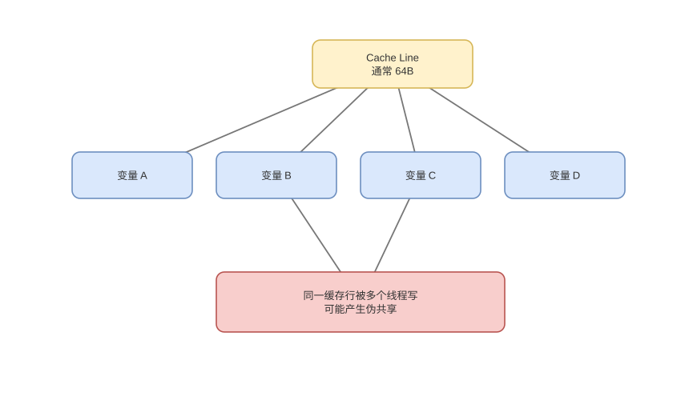

# 局部性、Cache 映射与写策略

> 基线：Cache 以 line 为单位用 tag/index/offset 定位；命中率只是性能的一部分，还要看命中时间与 miss penalty。

## 01-层次与AMAT
Q: 多级存储为何有效，平均访存时间怎样表达？
A:
- 寄存器/L1 小而快，L2/L3 更大更慢，DRAM 和持久存储容量继续增加；每层缓存下层一部分内容。
- 它依赖时间局部性和空间局部性，让多数请求由靠近 CPU 的小层满足。
- 单层近似 `AMAT=hitTime+missRate×missPenalty`；多级需把下层平均成本递归代入。
- 降 miss rate 若显著增加 hit time 未必更快，CPU 关键路径尤其重视 L1 延迟。

## 02-CacheLine
Q: CPU 为什么以 Cache Line 而不是变量为单位搬运？
A:
- DRAM/片上互连启动一次请求有固定成本，批量传输相邻字节能摊薄开销并利用空间局部性。
- line 常见 64B 但不是跨架构保证；地址低位选 line 内 byte offset。
- 修改一个字节仍需获得整行的写权限，一致性和 false sharing 也以 line 为粒度。
- 顺序扫描可消费整行，链表随机追逐常只用一小部分，形成带宽与缓存容量浪费。

## 03-地址拆分
Q: 组相联 Cache 如何把地址拆成 tag、set index 和 block offset？
A:
- line 大小为 `2^b` 字节时低 b 位是 offset；set 数为 `2^s` 时再取 s 位作为 set index；其余高位为 tag。
- 访问先选 set，再并行比较各 way 的 valid+tag，命中 way 后由 offset 选择字节。
- 物理索引/标记还是虚拟索引涉及 TLB 并行与别名约束，L1 常用 VIPT 等折中。
- 地址位划分依容量、line 和 associativity，不应背某个固定 6/8/其余位。

## 04-映射方式
Q: direct-mapped、fully associative 和 set-associative 如何权衡？
A:
- 直接映射每个块只有一个位置，命中快、硬件简单，但两个热点同 set 会反复冲突。
- 全相联可放任意 line，冲突少却需比较所有 tag，面积和能耗高，适合很小结构如部分 TLB。
- N 路组相联在一个 set 内选 N 个位置，是命中延迟、冲突和硬件成本折中。
- 提高路数主要减少 conflict miss，不能消除首次 compulsory miss 和容量不足 capacity miss。

## 05-替换策略
Q: Cache set 满时怎样选择 victim，为什么硬件不总用精确 LRU？
A:
- 精确 LRU 需记录每个 way 的完整相对次序，路数高时更新和编码成本很大。
- 硬件常用 pseudo-LRU、tree-PLRU、随机或基于重用预测的近似策略，在成本与命中率间平衡。
- dirty victim 若采用 write-back，替换前要写回下层，增加 miss penalty 和缓冲压力。
- 软件无法通常精确控制硬件替换，只能通过布局、分块和工作集减少冲突。

## 06-写策略
Q: Write-through/Write-back 与 Write-allocate/No-write-allocate 分别控制什么？
A:
- write-through 每次写同时下传，简单但带宽大；write-back 只改缓存并置 dirty，逐出时批量写回。
- write-allocate 在写 miss 时先把 line 拉入再写，适合后续重用；no-write-allocate 可直接写下层，避免污染。
- 常见组合是 write-back+write-allocate，流式非临时写可使用特殊指令绕过/弱化缓存污染。
- 写缓冲让 CPU 不必等下层完成，但缓冲满或顺序约束会反压流水线。

## 07-预取
Q: 硬件预取如何提升性能，又可能怎样伤害性能？
A:
- 预取器识别顺序/stride 等访问模式，在需求发生前把未来 line 请求到缓存，隐藏内存延迟。
- 预测准确且及时可把 demand miss 变 hit；太早会被逐出，太晚仍阻塞。
- 错误预取消耗内存带宽、占 cache 容量并驱逐有用数据，多核下还会争用共享资源。
- 指针追逐、随机 hash 和数据依赖地址难以预取，软件重排或批量化更重要。

## 08-3C与优化
Q: 如何按 3C 模型解释 cache miss，并选择优化手段？
A:
- compulsory miss 是首次访问，可预取/一次多用；capacity miss 是工作集超过容量，可分块/缩小数据。
- conflict miss 是映射冲突，可改布局、padding 或提高相联度；多核还可加入 coherence miss 分类。
- 优化前用 PMU 观察 cache level、MPKI 和带宽，不能把所有慢访存都叫 L1 miss。
- 数组分块、SoA/AoS 选择、冷热字段拆分，本质是让需要的数据以更少 line、更好复用进入缓存。

