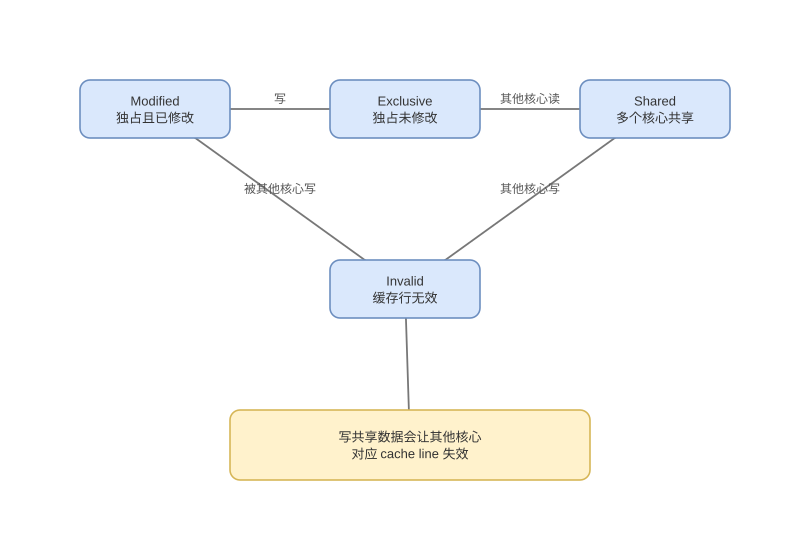

# MESI、Store Buffer 与内存屏障

> 基线：缓存一致性约束单地址副本，内存一致性模型约束多地址操作的可观察顺序，原子性又是第三个维度。

## 01-一致性问题
Q: 私有 Cache 为什么必须使用 coherence protocol？
A:
- 同一物理 line 可同时存在于多个核心，若一个核心写而其他仍读旧副本，会破坏共享内存语义。
- 协议跟踪每个 line 的权限/脏状态，通过 snoop 或 directory 传递读、独占和失效消息。
- coherence 通常保证对单个地址的写形成所有核心一致的顺序，并最终传播新值。
- 它不自动规定不同地址写入的观察顺序，也不让 `x++` 成为原子操作。

## 02-MESI状态
Q: MESI 四种状态分别表示什么权限和数据关系？
A:
- M：本核独占且已修改，内存可能旧；E：本核独占且干净，可静默升级为 M。
- S：可能多核共享且干净，写前必须使其他副本失效并取得独占。
- I：该副本不可用，读取需重新请求；状态属于每条 cache line，不是变量或线程状态。
- MOESI 的 O 等扩展允许脏数据由 owner 共享，具体协议依处理器。

## 03-读写事务
Q: 两个核心先共享读取同一 line，随后其中一个写入会发生什么？
A:
- 初始读请求让两核获得 S 副本；写核发出 upgrade/read-for-ownership，请求其他 sharer 将副本置 I。
- 收到足够确认后写核获得 M/独占写权限，再在本地修改；之后其他核读需向 owner/下层取最新数据。
- 失效往返有延迟，写核可用 store buffer 暂存而先继续执行，具体可见时刻因此更复杂。
- 多核轮流写会让 line 所有权 ping-pong，带宽和延迟远高于本地 cache hit。

## 04-伪共享
Q: false sharing 为什么在逻辑不共享变量时仍会变慢？
A:
- 一致性追踪粒度是 line，不是字段；不同核心写同一 line 中不同计数器仍需互相失效。
- 每次所有权转移让写等待互连消息，并驱逐对方整行，导致高 CPU、低 IPC 和一致性流量。
- padding/对齐、per-thread shard 和批量汇总可把独立写热点分开；仅加 volatile 通常不会解决。
- padding 依赖实际 line/布局且增加内存，需通过 perf c2c、PMU 或基准确认。

## 05-StoreBuffer
Q: Store Buffer 为什么存在，它如何让另一个核心暂时看不到写？
A:
- 写取得 line 独占权限可能很慢，CPU 先把地址和值放入 store buffer，让本核后续指令继续。
- 本核 load 可从 buffer 转发自己的新值，而其他核心尚未收到/应用该写，产生观察差异。
- buffer 最终按硬件规则排出到 cache coherence domain；满时写路径会停顿。
- 这不是“写直接绕过缓存到主存”，也说明可见性不能用“是否刷新主内存”解释。

## 06-内存模型
Q: Sequential Consistency 与较弱硬件内存模型有何区别？
A:
- SC 要求所有线程操作仿佛按某个全局顺序交错，且每线程程序顺序不变，最易推理。
- 弱模型允许某些 load/store 在其他核心看来重排，以利用 store buffer、乱序和缓存，换取性能。
- x86 TSO 相对较强但仍允许典型 Store→Load 观察；ARM 等可允许更多重排，需要更精确屏障。
- 编译器也会在语言规则允许时重排，硬件模型与语言 memory model 必须共同考虑。

## 07-屏障与原子
Q: acquire、release 和 full fence 分别建立什么顺序？
A:
- release 保证它之前的读写不移到发布之后；acquire 保证获取之后的读写不移到获取之前。
- 若 acquire 读到对应 release 发布的值，语言/ISA 协议可建立跨线程 happens-before，使先前初始化可见。
- full fence 提供更强双向排序，成本可能包括阻止流水、等待缓冲或发特殊一致性操作。
- 原子 RMW 同时需要不可分割更新与规定内存序；fence 只排序普通操作，不把复合读改写自动变原子。

## 08-正确性审查
Q: “volatile 直接读写主内存”和“有 MESI 就线程安全”为什么都错？
A:
- 现代缓存是正常路径，volatile 的核心是语言可见性/有序性，JIT 映射到目标 ISA 的原子指令和屏障。
- MESI 让单地址副本协调，但 `i++` 仍是 load、add、store，多线程可丢更新。
- coherence、consistency、atomicity 分别回答副本、顺序和不可分割性，必须分层表述。
- 正确并发代码应使用锁/原子/语言同步原语，而非手写“刷缓存”假想步骤。

