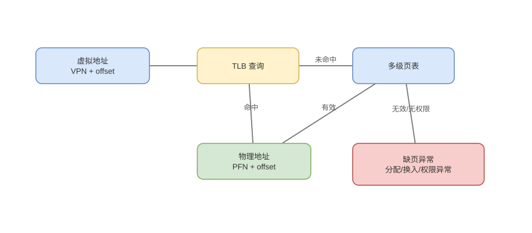

# 页表、TLB、Page Walk 与 Huge Page

> 基线：每次 Load/Store 使用虚拟地址，TLB 缓存翻译；未命中不是立即缺页，先由 page walk 查权威页表。

## 01-地址拆分
Q: 分页系统怎样把虚拟地址翻译为物理地址？
A:
- 虚拟地址拆为 virtual page number 和 page offset；页表把 VPN 映射到 physical frame number。
- 翻译后 PFN 与原 offset 拼成物理地址，页内偏移不变，因此页大小决定 offset 位数。
- PTE 还包含 present、读写执行、用户/内核、accessed/dirty 等权限和状态位。
- 地址空间可比物理内存大，未映射页不占物理 frame；虚拟连续也不要求物理连续。

## 02-多级页表
Q: 为什么使用多级页表而不是给整个虚拟空间分配一个平坦数组？
A:
- 64 位虚拟空间的平坦 PTE 数巨大，即使进程只用少数区域也要占用大量内存。
- 多级页表按虚拟地址各级索引逐层指向下一级，只为实际使用的地址范围分配中间页。
- 代价是 TLB miss 时可能产生多次依赖内存读取；硬件 page-walk cache 会缓存中间结果。
- 页表级数和有效地址位数依 ISA/模式，不能把 x86-64 某个四/五级配置当普遍定律。

## 03-TLB
Q: TLB 中保存什么，命中和未命中分别发生什么？
A:
- TLB 缓存 VPN→PFN、权限以及地址空间标识等，通常分 I-TLB/D-TLB 和多级结构。
- 命中后快速得到物理地址并进行权限检查；未命中触发硬件或软件 page table walk。
- walk 找到 valid PTE 后回填 TLB并重试访问；只有 PTE 不在场或权限异常才进入 OS fault handler。
- 所以 TLB miss、minor fault、major fault 是三个成本和机制不同的事件。

## 04-Cache并行
Q: TLB 翻译和 L1 Cache 查询怎样并行，VIPT 有什么约束？
A:
- 若 L1 等完整物理地址后再索引，会把 TLB 延迟串到 hit path；VIPT 用未翻译的页内 offset 位先索引 set。
- 同时 TLB 产生物理 tag，随后与 cache tag 比较，减少总延迟。
- set index 必须落在页内 offset 可稳定的位范围，否则同一物理页的虚拟别名可能映射不同 set。
- 更大 L1 容量、路数、页大小与命中延迟因此存在结构约束。

## 05-缺页
Q: present=0 或权限不符后，硬件和 OS 如何协作？
A:
- CPU 产生同步 page fault，提供 fault address、访问类型和异常 PC，禁止该指令错误提交。
- OS 检查 VMA/映射语义：可分配零页、执行 COW、从文件/交换读入，或认定非法访问。
- 更新 PTE 并做必要 TLB invalidation 后返回，原指令重试；磁盘 IO 会让线程阻塞并调度。
- 缺页是按需分页机制，不等同段错误；major/minor 取决于是否需要慢存储 IO。

## 06-TLB失效
Q: 修改页表后为什么需要 TLB shootdown？
A:
- 各核心 TLB 可能仍缓存旧映射或权限，单纯写内存中的 PTE 不会自动让所有副本立即消失。
- 内核向运行该地址空间的相关核心发送 IPI，让其按页、范围或整个地址空间失效，并等待确认。
- shootdown 是跨核同步，频繁 mmap/munmap、权限变更和页迁移可能形成明显开销。
- ASID/PCID 让不同地址空间条目带标签，减少上下文切换时全量 flush，但标识复用仍需管理。

## 07-HugePage
Q: Huge Page 如何降低 TLB 压力，又会引入什么代价？
A:
- 一个 TLB entry 覆盖更大地址范围，相同 entry 数能映射更大工作集，page walk 和 TLB miss 减少。
- 适合大而连续、长期驻留的 heap、数据库 buffer；透明大页可自动合并但行为和延迟不总可预测。
- 大页增加内部碎片、分配/压缩难度，COW 或迁移一次影响更多数据，缺页延迟也可能更大。
- 是否有效取决于工作集与访问模式，应观察 dTLB miss 和延迟而不是只开启配置。

## 08-结构图与误区
Q: 如何区分页表、TLB、CPU Cache 和 OS 页缓存？
A:
- 页表是地址翻译权威结构；TLB 缓存翻译；CPU Cache 缓存物理内存中的指令/数据 line；页缓存缓存文件页。
- 一次访存可同时 TLB hit 却 data cache miss，也可反过来受 VIPT 等实现影响，二者不是同一缓存。
- `malloc` 成功不代表所有物理页已分配，首次触碰可能 fault；RSS 与虚拟地址空间也不同。
- 随机大内存访问可能同时打爆 TLB 和 cache，性能分析要分别看事件。

