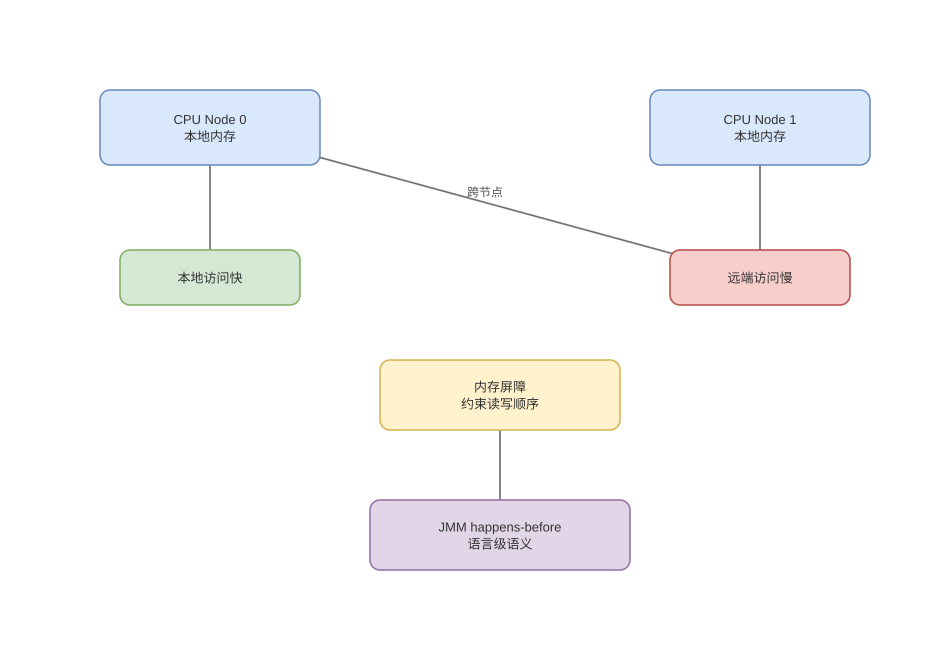

# 对齐、对象布局与 NUMA 亲和性

> 基线：对齐约束单次访问边界，布局决定 cache 密度，NUMA 决定物理页离哪个 CPU/控制器更近。

## 01-对齐原因
Q: 为什么数据类型通常要求按自然边界对齐？
A:
- 对齐使一个标量落在硬件可高效读取的总线/缓存边界内，地址低位也可直接选择字节。
- 未对齐值可能跨 cache line 或页，需要两次访问和拼接；某些 ISA/指令会异常，另一些只是更慢。
- SIMD load、原子操作和 DMA 可能有更强对齐要求，语言普通标量规则不能覆盖所有指令。
- 对齐是 ABI 和硬件共同约定，不能把“4 字节类型必然 4 字节对齐”当跨平台定律。

## 02-结构体Padding
Q: 编译器为什么在字段之间和结构体尾部插入 padding？
A:
- 每字段起始地址需满足其 alignment，编译器在前一字段后补空洞；整体 alignment 通常取成员最大或 ABI 上限。
- 尾部补齐保证结构体数组中每个元素的同字段仍对齐。
- 重排字段按较大对齐聚合常能缩小对象，但 ABI、反射、序列化和 cache 热度可能限制重排。
- `sizeof` 包括 padding，不等于字段 payload 相加；packed 会省空间却可能产生慢/非法访问。

## 03-Java对象
Q: Java 对象布局为什么不能只按字段大小相加？
A:
- 对象通常含 mark word、klass pointer 等 header，随后是实例字段和满足对象对齐的尾 padding。
- compressed oops/class pointers、JVM 位宽、字段重排和继承都会改变布局；数组还含长度并连续保存元素或引用。
- 引用数组连续的是引用，目标对象仍可能分散；基本类型数组更能利用连续 payload。
- 应用 JOL/目标 JVM 实测，不应把某版本的 12/16 字节对象头写成永久规范。

## 04-AoS与SoA
Q: Array of Structures 和 Structure of Arrays 如何影响缓存与 SIMD？
A:
- AoS 把一个对象的各字段放一起，适合每次处理完整对象；只扫一个字段时会把无关字段带入 cache。
- SoA 把同字段连续排列，适合列式扫描和 SIMD，可一次 line/向量处理多个同类值。
- SoA 更新单个实体需访问多个数组，代码和生命周期管理更复杂；混合 AoSoA 可按块折中。
- 选择由访问模式决定，不是 SoA 永远更快；冷热字段拆分是后端常见等价优化。

## 05-NUMA拓扑
Q: NUMA 系统中的 local 与 remote memory 是什么？
A:
- 多 socket 系统每个节点有本地内存控制器和 DRAM，CPU 访问本地节点延迟低、带宽高。
- 访问另一节点物理页需经过 socket 互连，占用远端控制器与链路，延迟和争用更大。
- 地址空间仍统一，普通 load/store 语义不变，因此功能测试看不出页面实际归属。
- LLC、核心、NUMA node 和 socket 拓扑不必一一简单对应，应读取系统 topology。

## 06-FirstTouch
Q: first-touch 分配策略怎样影响服务的 NUMA 性能？
A:
- OS 常在页面第一次被写时把物理页分配到当前执行 CPU 所属节点，而不是 malloc 调用时决定全部位置。
- 单线程初始化、随后多节点工作会把页面集中在初始化节点，其他线程长期远程访问。
- 可让各 worker 并行触碰自己负责区间，或使用 numactl/mbind、线程亲和性与内存策略。
- 线程迁移后数据不自动立即跟随，自动 NUMA balancing 的采样迁移也有成本。

## 07-亲和与复制
Q: NUMA 优化为何不能只“绑核”？
A:
- 线程绑核若内存页仍在远端，只会稳定地产生远程访问；必须同时考虑 CPU affinity、页面放置和设备 IRQ。
- 只读热点可按节点复制，写热点复制则需要一致性/归并；共享计数器仍会跨 socket ping-pong。
- 网络队列、IRQ、应用线程和其缓冲区放同一节点可改善数据局部性，但过度固定会导致负载不均。
- 优化目标是减少关键路径远程访问而非追求零远程访问。

## 08-图与审查
Q: 对齐、Cache Line 和 NUMA 应怎样分层表达？
A:
- 对齐关注一个值是否跨自然/指令边界，Cache Line 关注缓存传输与一致性粒度，NUMA 关注物理页到 CPU 的拓扑距离。
- padding 可为对齐或避免伪共享，但会增加 footprint，进而恶化 cache/TLB；优化维度可能互相冲突。
- “内存访问都是 O(1)”只描述渐进阶数，无法反映本地 L1、远端 DRAM 等数量级差异。
- 先用 JOL/perf/numastat 验证布局和远程访问，再修改字段或绑定策略。

