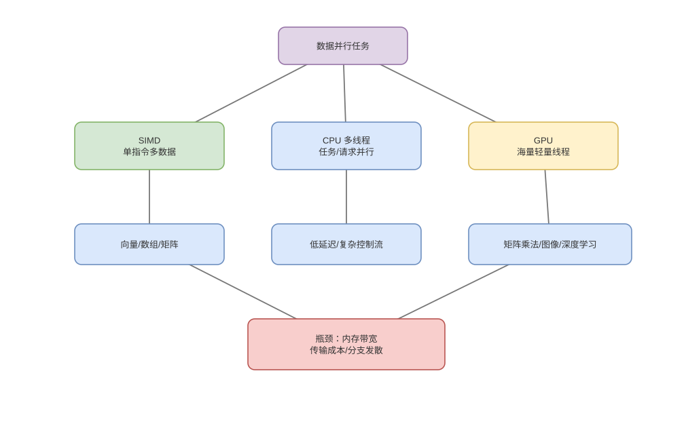

# SIMD、SIMT、GPU 内存与并行边界

> 基线：SIMD 用宽执行单元处理多个 lane，GPU 用大量线程束隐藏延迟；二者都要求足够规则的数据并行。

## 01-SIMD表示
Q: SIMD 寄存器和 lane 在硬件上如何工作？
A:
- 一条向量指令读取宽寄存器，把它划为多个 8/16/32/64 位 lane，同一操作并行作用于各 lane。
- 例如 256-bit 寄存器可同时处理 8 个 32-bit 值，理论算术吞吐提高但 load/store 也要供应数据。
- lane 宽度、指令集合和实际执行端口依 ISA/微架构；某些宽指令会影响频率或分多 µop 执行。
- SIMD 不改变 O(n)，而是降低每批元素的指令数和循环控制开销。

## 02-自动向量化
Q: 编译器/JIT 在什么条件下能自动向量化循环？
A:
- 循环迭代之间需无真实依赖或可做归约，内存访问最好连续/固定 stride，边界和别名可证明安全。
- 编译器生成向量主体加处理剩余元素的 scalar tail，并可能做运行时 alias/alignment check。
- 指针别名、复杂分支、方法调用和未知步长会阻碍；报告/反汇编可验证，而非看到数组就假定 SIMD。
- Java JIT 可自动向量化部分热点，Vector API 提供更显式但仍具平台适配的表达。

## 03-Gather与分支
Q: 随机访存和分支为什么削弱 SIMD 收益？
A:
- 连续 load 一次取相邻 lane，gather/scatter 需要多个地址和 cache line，常受内存延迟而非算术吞吐限制。
- 分支可转为 mask/predicate 让所有 lane 执行后选择结果，但两条路径工作都可能发生。
- 数据重排、分桶和压缩有效元素可提高 lane 利用率，但转换本身有成本。
- 小规模或控制流复杂任务使用标量可能更快，必须以整体端到端测量。

## 04-GPU执行模型
Q: GPU 的 thread、warp/wavefront、block 和 SM 如何对应？
A:
- 软件启动大量线程，硬件把固定数量线程组成 warp/wavefront，以 SIMT 方式共同发射指令。
- 多个 warp/block 驻留在 SM/CU，调度器在某 warp 等内存时切换到其他 ready warp 隐藏延迟。
- block 内线程可用 shared memory 和 barrier 协作，block 间通常通过 kernel 边界或更昂贵机制同步。
- 术语和宽度依厂商，核心思想是大量并发上下文换取吞吐。

## 05-WarpDivergence
Q: GPU warp divergence 怎样产生，为什么不是普通 CPU 分支预测问题？
A:
- 同一 warp 的线程在条件分支走不同路径时，硬件通常用 mask 分别执行各路径，再汇合。
- 路径串行化使部分 lane 空闲，实际吞吐下降；它不是每线程拥有完全独立指令流的理想 MIMD。
- CPU 少量线程主要用分支预测推测一条路径，GPU 更强调同 warp 控制流一致。
- 可按数据类型分组或改算法减少 divergence，但不应为极小分支牺牲大量额外工作。

## 06-GPU内存
Q: GPU global、shared、register/local 和 cache 层次如何影响 kernel？
A:
- global memory 容量大、延迟高；合并相邻线程访问可形成 coalesced transaction，提高带宽利用。
- shared memory 位于片上、由 block 显式共享，速度快但容量有限并可能有 bank conflict。
- registers 每线程最快但数量过多降低 occupancy；“local memory”常是线程私有语义却可能落到显存。
- 纹理/只读 cache 等路径依架构，优化应围绕访问模式而非只背层次名称。

## 07-数据搬运
Q: CPU→GPU 数据传输为什么常决定是否值得 offload？
A:
- 离散 GPU 经 PCIe 搬运，固定启动和同步延迟对小任务占比很高；kernel launch 也有固定成本。
- 批量、异步 stream、pinned memory 和计算/传输重叠可摊薄，但 pinned page 会增加系统资源压力。
- unified memory 提供统一寻址，不代表零成本；page migration/fault 可能在运行时产生抖动。
- 只有计算强度和规模足够，节省的计算时间才能覆盖提交、复制与同步。

## 08-工程选型
Q: SIMD、多线程和 GPU 应如何选择与组合？
A:
- 低延迟、控制复杂、小数据优先 CPU；单核规则数组先考虑 SIMD；独立任务用多核线程并行。
- 大规模规则矩阵/向量、高 arithmetic intensity 且能批量搬运时 GPU 优势明显。
- 三者可叠加：多核每核 SIMD，CPU 准备数据并异步提交 GPU；瓶颈会转移到内存或互连。
- “并行度越高越快”错误，Amdahl 定律、同步、带宽和尾部不均衡都会限制。

