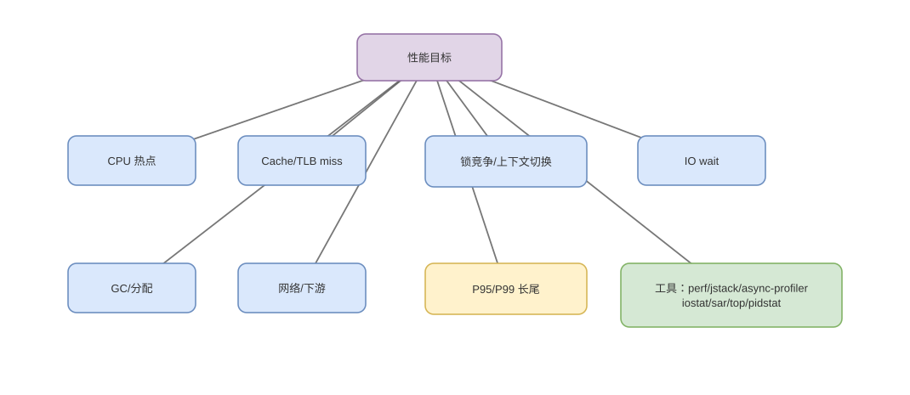

# CPU 时间、CPI、Roofline 与 PMU 定位

> 基线：性能结论必须拆成指令数、周期、前后端停顿和数据搬运；利用率不是完成有效工作的同义词。

## 01-CPU时间公式
Q: `CPU Time = Instruction Count × CPI × Cycle Time` 应怎样用于分析？
A:
- 指令数由算法、编译器和执行路径决定；CPI 汇总依赖、端口、分支和缓存等待；cycle time 是频率倒数。
- 优化任一因子可能伤害另一项，例如向量化减少指令却提高每条复杂度，深流水提高频率却增加 mispredict penalty。
- wall time 还含阻塞、调度和其他 CPU 竞争，公式主要描述该 workload 使用的 CPU 执行周期。
- 比较机器时不能只看 GHz，应比较相同工作量的 instructions、cycles 和实际时间。

## 02-IPC边界
Q: IPC/CPI 如何解释，为什么 IPC 可能大于 1？
A:
- CPI 是平均每条 retired instruction 用的周期，IPC 近似其倒数；超标量每周期可退休多条，因此 IPC>1。
- 最大 IPC 受 retire/dispatch width 限制，实际受分支、依赖、端口、前端和内存限制。
- SMT 下核心 cycles 被两个逻辑线程共享，事件口径可能按线程或核心计，不能直接相加。
- 高 IPC 不必代表任务更快，若执行了更多无用指令，总时间仍可能更长。

## 03-Latency与Throughput
Q: 指令 latency、reciprocal throughput 和端口占用有什么区别？
A:
- latency 是结果到依赖消费者可用的周期，决定串行依赖链；throughput 是独立指令稳态可多快开始/完成。
- 流水化乘法可 latency 4 周期但每周期接收一条，独立乘法吞吐高，链式乘法仍受 4 周期限制。
- 多种 µop 竞争同一 execution port 会形成结构瓶颈，即使数据无依赖。
- 查指令表只能给理论上限，真实还受前端、缓存和频率状态影响。

## 04-TopDown
Q: Top-Down 微架构分析怎样把 pipeline slots 分类？
A:
- Retiring 表示有效或坏推测后仍退休的工作；Bad Speculation 包括误预测/机器清除浪费。
- Frontend Bound 表示后端拿不到足够 µops，可能是 I-cache、ITLB、译码或 µop cache。
- Backend Bound 表示 µops 已到但等执行资源或数据，可再分 core bound 与 memory bound。
- 分类帮助缩小方向，不是根因本身；需继续结合具体 PMU、调用栈和 workload。

## 05-缓存指标
Q: Cache miss rate、MPKI、带宽和 stall cycles 为什么要一起看？
A:
- miss rate 受总访问数分母影响；MPKI 按每千条指令归一，便于比较，但仍不说明每次 miss 是否被并行隐藏。
- 内存级并行高时多个 miss 重叠，miss 多却 stall 不一定同比；依赖链的一个 miss 可让核心长时间停。
- 带宽接近平台上限说明吞吐受数据搬运，低带宽高延迟可能是随机访问/低并行。
- LLC miss、DRAM read、dTLB miss 和 remote NUMA 要分层，不能用单个“cache-misses”解释全部。

## 06-Roofline
Q: Roofline 模型中的 arithmetic intensity 如何判断 compute-bound 还是 memory-bound？
A:
- arithmetic intensity 是每搬运一字节数据执行多少运算；可达性能受 `min(峰值算力, 带宽×强度)` 限制。
- 强度低时增加 ALU/SIMD 宽度无效，应减少数据搬运、提高复用或压缩；强度高才可能接近计算峰值。
- 模型需选择正确存储层级和实际字节流量，cache 重用会改变看到的 intensity。
- 它给上界和方向，不包含分支、依赖、同步和尾延迟全部细节。

## 07-频率功耗
Q: 为什么 CPU 100% 利用率下主频仍会变化？
A:
- DVFS/turbo 根据活跃核心、功耗、电流和温度动态选择频率；AVX 等宽向量可能触发不同频率区间。
- thermal throttling、power limit 和云虚机 steal 会让相同代码周期/秒变化。
- 利用率只表示时间未 idle，不说明 retiring 比例；自旋和 cache miss 等待也可表现高利用。
- 基准需记录实际 frequency、温度和绑核，长短测试结果可能不同。

## 08-定位闭环
Q: 面对“CPU 高、P99 上升”，怎样建立硬件到代码的证据链？
A:
1. 先确认 user/sys/iowait、运行队列、频率和是否单核热点，区分计算、内核和排队。
2. 用 profiler/perf 找热点调用栈，再用 cycles、instructions、branches、cache/TLB 等验证微架构假设。
3. 结合输入分布、GC/锁/系统调用和 NUMA，做一次只改变单因素的实验并比较吞吐与 P99。
4. 避免仅凭 PMU 猜代码；事件可能 multiplex、skid 或虚拟化不准，最终以业务工作量和可复现实验验收。

