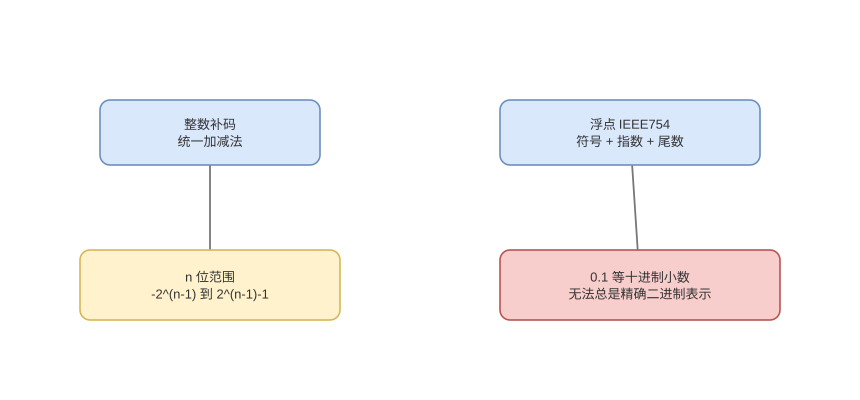

# 整数、补码、端序与 IEEE 754

> 基线：位模式的含义由类型与解释规则决定；整数溢出、浮点舍入和端序是三个不同问题。

## 01-无符号与有符号
Q: 同一个 n 位模式为什么既可表示无符号数也可表示补码有符号数？
A:
- 位本身没有正负；无符号按 `Σ bit_i*2^i` 解释，补码最高位权重为 `-2^(n-1)`。
- 无符号范围 `0..2^n-1`，补码范围 `-2^(n-1)..2^(n-1)-1`，负数多一个。
- 加法电路都做模 `2^n` 运算，区别主要在比较、扩展、除法和溢出判定的解释。
- 跨类型转换若只保留位模式，数值语义可能突变，尤其负数转无符号。

## 02-补码统一
Q: 补码为什么能用同一加法器完成加减法？
A:
- `x-y` 可表示为 `x + (~y+1)`，即加上 y 的二进制补码；最高位进位按固定宽度丢弃。
- 零只有全 0 一种表示，简化比较和规范化；符号扩展只需复制最高位。
- `MIN_VALUE` 没有对应正数，取负仍回绕自身；这是非对称范围而非 CPU 算错。
- 语言可能定义回绕、未定义行为或抛异常，硬件位运算不能替代语言规范。

## 03-整数溢出
Q: 如何判断补码加法发生有符号溢出？
A:
- 两个同号操作数相加却得到异号结果时发生有符号溢出；硬件可用最高位进位关系产生 overflow flag。
- 无符号溢出关注最高位 carry，和有符号 overflow 不是同一标志。
- 加法结果位模式仍确定，但若业务需要数学整数，应在运算前后做范围检查或提升位宽。
- 乘法、长度相加和时间换算更容易溢出，安全代码不能只检查结果是否为负。

## 04-端序
Q: 大端、小端具体改变什么，不改变什么？
A:
- 它规定多字节值各字节在递增内存地址中的顺序：大端高位字节在低地址，小端低位字节在低地址。
- 单字节没有端序；寄存器内的数值算术也不按“从左/右字节”逐个执行。
- 网络协议和文件格式必须显式约定端序，不能直接序列化本机结构体并假设跨平台一致。
- 位字段布局、结构体 padding 和浮点格式还受 ABI/格式规范影响，不能仅靠端序推断。

## 05-IEEE754结构
Q: IEEE 754 二进制浮点的 sign、exponent、fraction 如何组成数值？
A:
- 普通规格化数近似为 `(-1)^sign × 1.fraction × 2^(exponent-bias)`，指数采用偏置编码。
- fraction 省略规格化数前导 1，提高有效精度；指数全 0/全 1 留给次正规数、零、无穷和 NaN。
- float/double 的位宽决定指数范围和有效二进制位数，范围与精度是不同维度。
- 浮点不是“带小数点的定点整数”，相邻可表示数间距会随指数增大。

## 06-舍入与误差
Q: 为什么 0.1 不能被二进制浮点精确表示，误差怎样传播？
A:
- 0.1 的二进制展开无限循环，有限 fraction 只能取邻近值；输入转换时已经发生第一次舍入。
- 每次运算的精确结果还要舍入到目标格式，结合顺序改变可能得到不同末位，因此浮点加法不满足数学结合律。
- 默认 round-to-nearest ties-to-even 减少统计偏差，但不能消除累计误差和灾难性消减。
- 比较应按业务使用容差或更稳定算法，不能一概用固定 epsilon 处理所有数量级。

## 07-特殊值
Q: NaN、Infinity、正负零和 subnormal 有什么语义边界？
A:
- 除零或溢出可产生正负无穷，非法运算可产生 NaN；NaN 与任何值包括自身比较相等通常为 false。
- +0 与 -0 数值比较相等，但 `1/+0` 与 `1/-0` 可得到不同符号无穷，符号信息仍有意义。
- 次正规数在接近零时取消隐含前导 1，提供 gradual underflow，但某些硬件处理更慢或启用 flush-to-zero。
- 序列化、排序和哈希必须定义 NaN payload 与零符号语义，不能假设普通全序。

## 08-工程选型
Q: 金额、计数和科学计算应怎样选择数值表示？
A:
- 有界计数优先足够宽整数并检查溢出；无限精度整数用软件大数，代价是分配与多字运算。
- 精确十进制金额用最小货币单位整数或 decimal/BigDecimal，并显式指定 scale 与舍入模式。
- 科学计算和统计使用浮点，接受误差模型并做数值稳定性分析；不要用字符串模拟所有算术。
- `new BigDecimal(0.1)` 会带入 double 的近似位，通常使用十进制字符串或 `valueOf`。

