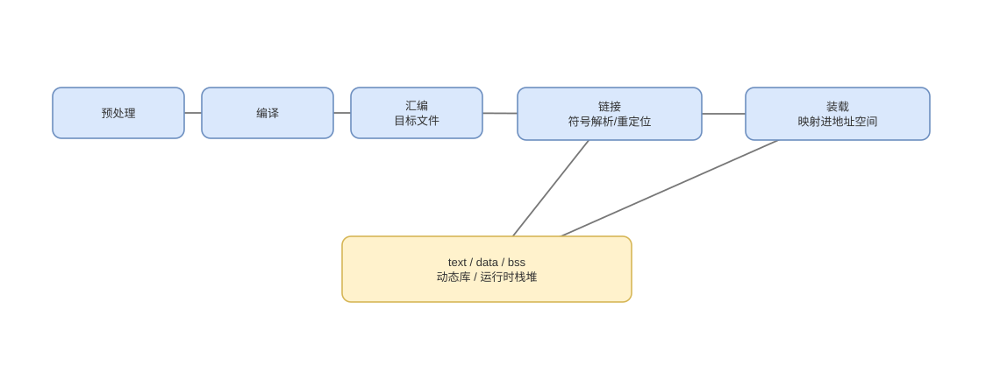

# 编译、链接、ELF 与动态装载

> 基线：源代码到运行进程跨越编译器、汇编器、链接器、装载器和动态链接器；“段”和“进程内存区域”需分层理解。

## 01-完整流水
Q: C/C++ 源码变成正在运行的机器指令经历哪些阶段？
A:
- 预处理处理宏/include，编译生成 IR/汇编并优化，汇编生成含机器码、符号和重定位的目标文件。
- 链接器合并 section、解析符号、布局地址并处理重定位，输出可执行文件或共享库。
- 内核装载器建立进程地址空间和初始栈，映射解释器；动态链接器加载依赖、完成动态重定位。
- 最终进入启动代码，再调用运行库初始化和 `main`，不是文件映射后直接跳到源码第一行。

## 02-Section与Segment
Q: ELF section 和 program segment 有什么区别？
A:
- section 面向链接视图，如 `.text/.rodata/.data/.bss/.symtab/.rela*`，便于按内容合并和重定位。
- program header segment 面向装载视图，描述哪些文件范围映射到何种虚拟地址与 R/W/X 权限。
- 多个相邻 section 可被归入一个 LOAD segment；运行时并不需要所有调试/符号 section。
- `.bss` 通常只记录大小而不在文件存大量零，装载映射为零初始化内存。

## 03-符号解析
Q: 链接器的符号解析解决什么问题，强弱符号和可见性为何重要？
A:
- 目标文件中的调用/全局变量引用先是未决符号，链接器在目标文件与库中寻找满足规则的定义。
- 静态库通常按需抽取成员，命令行顺序可能影响能否解析；重复强定义通常报错，弱符号规则依平台而异。
- symbol visibility 控制符号能否被其他对象绑定，也影响优化与动态覆盖。
- C++ 名字修饰、ABI 和版本化决定二进制符号是否兼容，函数名看起来相同不代表可链接。

## 04-重定位
Q: 重定位项为何存在，链接器具体修正什么？
A:
- 编译单个目标文件时不知道函数/数据最终地址，只能在机器码或数据槽留下占位，并记录 relocation 类型、符号和加数。
- 链接布局完成后，根据绝对、PC-relative、GOT-relative 等规则写入正确位移或地址。
- 指令字段位宽有限，地址过远可能需要 thunk/veneer；位置无关代码尽量使用相对寻址和 GOT。
- 重定位不是简单“把所有地址加基址”，类型由 ISA 编码和链接模型共同决定。

## 05-静态与动态
Q: 静态链接与动态链接如何权衡？
A:
- 静态链接把所需库代码纳入产物，部署独立、启动依赖少，但文件大、库安全更新需重新发布。
- 动态链接让多个进程映射同一只读代码页，并可独立升级库，但引入 ABI、搜索路径和装载重定位问题。
- 共享库通常要求 PIC，数据与外部符号经 GOT/PLT 或等价机制间接定位。
- “动态库一定更省总内存/一定更慢”都不绝对，要考虑共享命中、私有脏页、启动与调用模式。

## 06-PLT与GOT
Q: ELF 动态调用中的 PLT/GOT 和 lazy binding 大致如何工作？
A:
- GOT 保存运行时解析后的地址，PIC 通过相对方式访问 GOT，避免修改只读代码页中的绝对地址。
- 外部函数调用可先进入 PLT 桩；首次调用由解析器查符号并把真实地址写入 GOT，后续直接跳转。
- lazy binding 降低未使用符号的启动成本，却把首次调用延迟和解析时机推迟；可配置启动时全部绑定。
- RELRO 等安全机制限制 GOT 可写窗口，具体机制随平台和链接选项变化。

## 07-装载与ASLR
Q: 内核装载 ELF 时如何形成进程初始地址空间？
A:
- 校验 ELF 与 program headers，把 LOAD segment 以页粒度映射到虚拟地址，设置 R/W/X 权限，不必立即读入所有页。
- 建立用户栈，放置 argv、envp 和 auxiliary vector；动态可执行文件先把控制交给指定 interpreter。
- ASLR 随机化主程序、共享库、栈等基址；PIE/PIC 使代码可在不同地址运行。
- 首次访问文件页可能触发缺页按需加载，装载“完成”不等于所有代码已进入物理内存。

## 08-Java边界
Q: Java 类加载/JIT 与本地编译链接有哪些相似和不同？
A:
- class 文件含字节码、常量池和符号引用，类加载经历加载、验证、准备、解析、初始化，解析可延迟。
- JVM 解释或 JIT 生成本机代码，并维护代码缓存、调用点和反优化元数据，不直接等同 ELF 静态链接。
- JNI 共享库仍走本地动态装载和 ABI，符号、端序与调用约定问题依然存在。
- “Java 没有链接”不准确；它有语言/虚拟机级解析，只是时间与产物形式不同。

