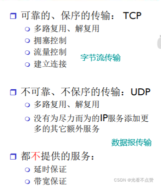
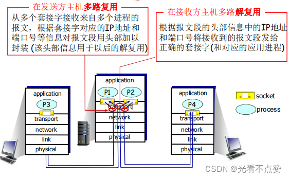
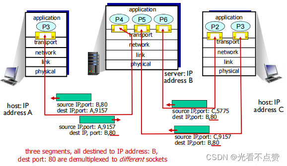
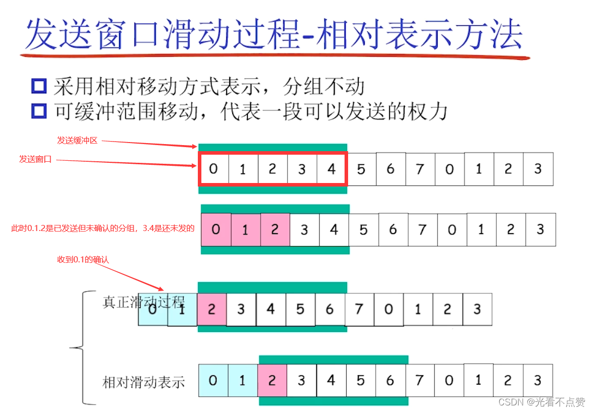
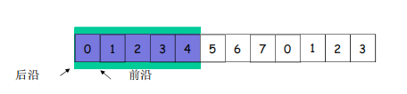
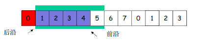
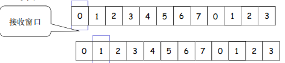
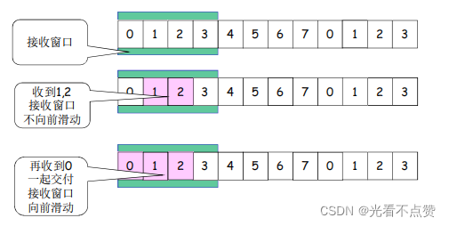
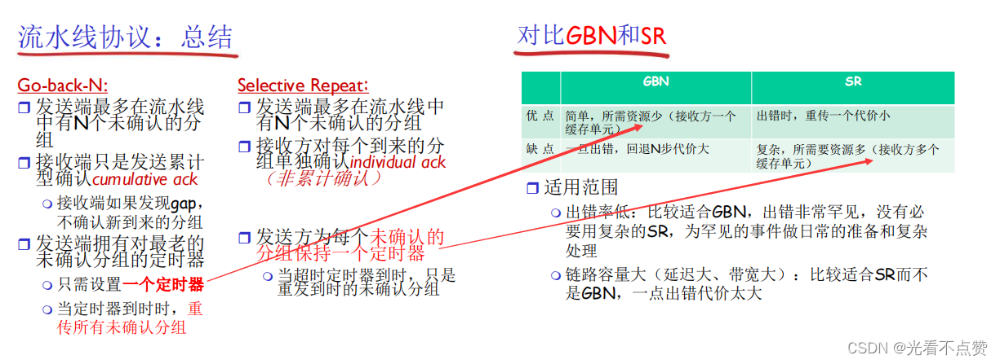

# TCP 与 UDP 对比
## 概念卡

Q: TCP 和 UDP 的核心区别是什么？
A:
- TCP 面向连接，提供可靠、有序、字节流传输
- UDP 无连接，不保证可靠、不保证有序，保留报文边界
- TCP 有拥塞控制、流量控制、重传、确认、连接管理
- UDP 头部简单、开销小、延迟低，常用于 DNS、音视频、游戏、QUIC 底层
- 面试表达：TCP 追求可靠有序，UDP 追求简单低延迟，是否可靠可由应用层自己设计

## 报文边界卡

Q: 为什么说 TCP 是字节流，UDP 是报文？
A:
- TCP 只保证字节按顺序到达，不保留应用 write/send 的消息边界
- 应用层必须自己设计协议边界，例如固定长度、分隔符、长度字段
- UDP 一次 sendto 对应一个 datagram，接收端按报文读取
- UDP 报文过大可能被 IP 分片，丢任意分片都会导致整个报文不可用
- 面试坑：TCP 粘包/拆包不是 TCP 错误，而是字节流语义下应用协议没有正确分帧

## 使用场景卡

Q: 什么场景适合 TCP，什么场景适合 UDP？
A:
- TCP 适合文件传输、HTTP/1.1/2、数据库连接、消息队列等可靠性优先场景
- UDP 适合 DNS、实时音视频、游戏、监控打点等低延迟或可容忍丢包场景
- QUIC 基于 UDP，在应用层实现可靠传输、拥塞控制、多路复用和 TLS 集成
- 内网高性能 RPC 通常仍以 TCP 为主，也可能使用 UDP/QUIC 做特定优化
- 选择标准是可靠性、延迟、顺序、连接成本、穿透和业务补偿能力

## UDP可靠性卡

Q: UDP 如果需要可靠传输，可以怎么做？
A:
- 应用层增加序列号，识别乱序和重复
- 增加 ACK/NACK，确认收到或请求重传
- 增加超时重传和重试上限
- 增加滑动窗口控制发送速率和在途数据
- 增加拥塞控制，避免把网络打爆
- 面试边界：一旦把这些都做全，就会重新发明很多 TCP/QUIC 的机制

## 工程实践卡

Q: 后端开发中如何处理 TCP 粘包/拆包？
A:
- 固定长度协议：每条消息固定字节数，简单但浪费空间
- 分隔符协议：用换行等分隔，适合文本协议，但要处理转义和非法输入
- 长度字段协议：消息头带 body 长度，是二进制协议常用方案
- HTTP 通过 Content-Length、Transfer-Encoding 等方式表达边界
- Netty 等框架提供 LengthFieldBasedFrameDecoder 等解码器处理分帧

## 正确性审查卡

Q: TCP/UDP 对比有哪些常见误区？
A:
- “UDP 一定不可靠”：不完整。UDP 本身不保证可靠，应用层可以实现可靠性
- “TCP 没有消息边界是粘包 bug”：错误。TCP 本来就是字节流
- “UDP 一定比 TCP 快”：不一定。丢包、分片、应用层重传和拥塞控制都会影响
- “TCP 适合所有场景”：错误。实时性极强且可容忍丢包时 UDP/QUIC 可能更合适
- “UDP 不需要连接所以没有状态”：协议层无连接，但应用和 NAT/防火墙仍可能维护状态