# TCP 可靠传输与滑动窗口
## 可靠性卡
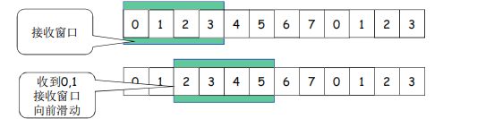

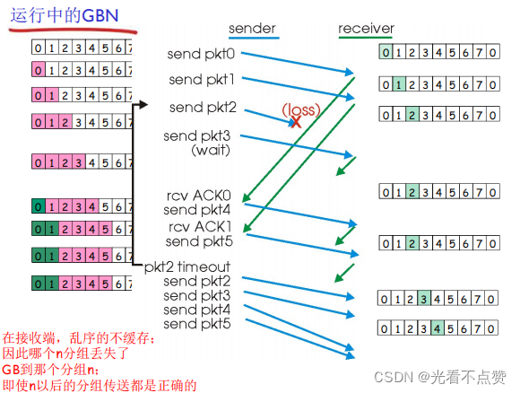
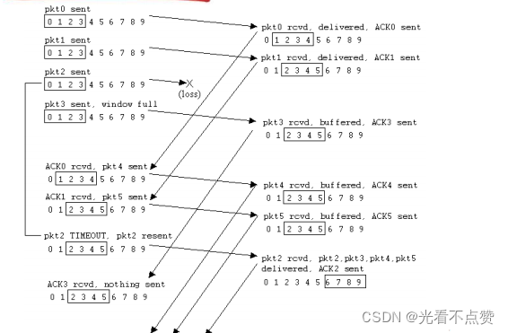
Q: TCP 如何实现可靠传输？
A:
- 序列号标识字节流位置，接收方可发现丢失、乱序和重复
- ACK 确认已收到的数据，通常使用累计确认
- 超时重传处理长时间未确认的数据
- 快速重传通过重复 ACK 提前判断丢包
- 校验和检测传输中的比特错误
- 滑动窗口允许多个报文在途，提高吞吐

## 序列号卡
Q: TCP 序列号和确认号如何理解？
A:
- TCP 序列号按字节编号，不是按报文编号
- SYN 和 FIN 也会消耗一个序列号
- ACK 号表示接收方期望收到的下一个字节序号
- 累计确认意味着 ACK N 表示 N 之前的字节都已按序收到
- 面试坑：TCP 是字节流，所以序列号管理的是字节范围

## 滑动窗口卡

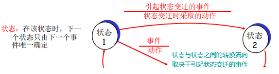

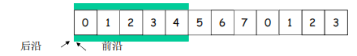

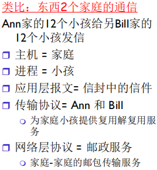
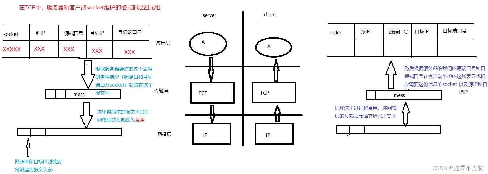

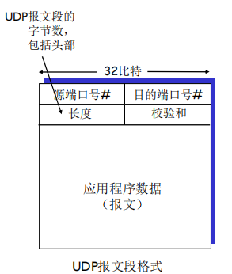

Q: TCP 滑动窗口解决什么问题？
A:
- 如果每发送一个报文都等 ACK，链路利用率很低
- 滑动窗口允许发送方在未收到 ACK 前连续发送多个字节范围
- ACK 到达后窗口向前滑动，新的数据可以继续发送
- 窗口大小受接收方接收窗口和拥塞窗口共同限制
- 面试表达：滑动窗口是可靠性和吞吐之间的关键机制

## 重传卡
Q: 超时重传和快速重传有什么区别？
A:
- 超时重传依赖 RTO，超过估算超时时间还没收到 ACK 就重发
- 快速重传在收到多个重复 ACK 后推测某段丢失，提前重发
- 超时通常说明网络问题更严重，会触发更强的拥塞控制反应
- 快速重传通常配合快速恢复，避免完全回到慢启动
- RTO 根据 RTT 动态估计，不是固定常量

## 乱序与重复卡
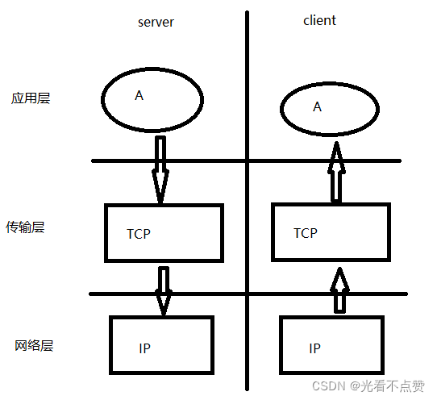

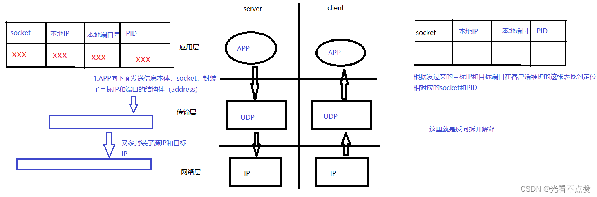
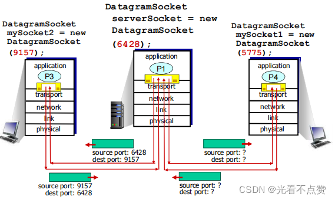
Q: TCP 接收方如何处理乱序和重复数据？
A:
- 按序到达的数据可以推进 ACK
- 乱序到达的数据通常会被缓存，等待缺失字节到达后再交付应用
- 重复数据可根据序列号识别并丢弃
- 接收方返回累计 ACK，提示发送方自己期待的下一个字节
- SACK 选项可以告诉发送方哪些非连续块已经收到，提升丢包恢复效率

## 正确性审查卡
Q: TCP 可靠传输有哪些常见误区？
A:
- “TCP 不会丢数据”：不严谨。网络会丢，TCP 通过重传尽力恢复；连接断开后应用仍要处理失败
- “ACK 表示某个包收到”：不准确。ACK 号确认的是字节序号之前的数据
- “滑动窗口只由接收方决定”：错误。实际发送受接收窗口和拥塞窗口共同限制
- “重传越多越好”：错误。过度重传会加剧拥塞
- “TCP 保证消息边界”：错误。TCP 只保证字节流可靠有序