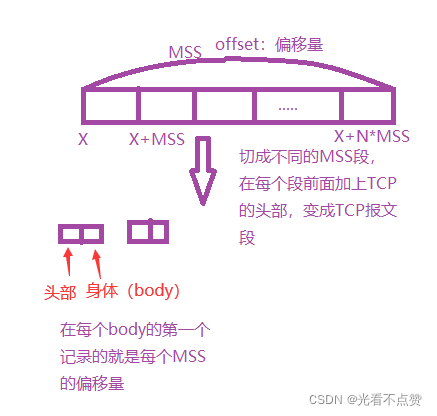
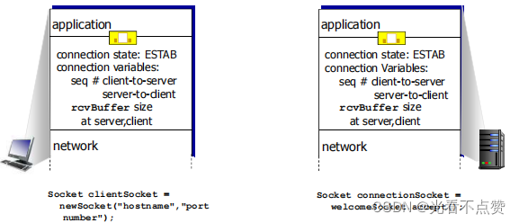
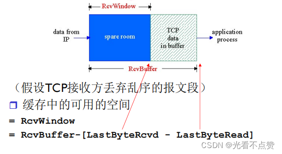
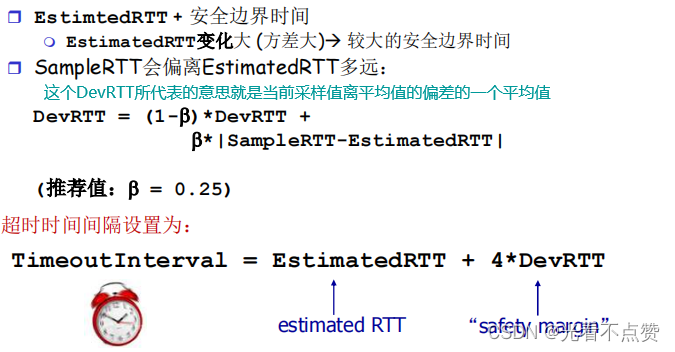
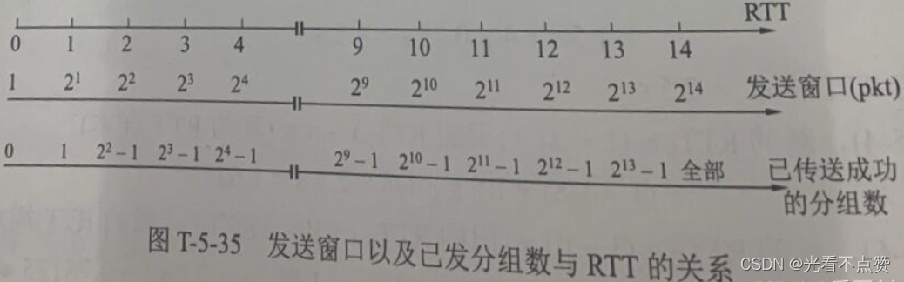
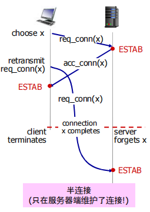
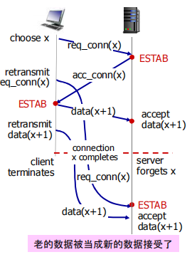
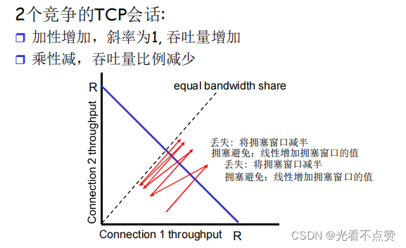
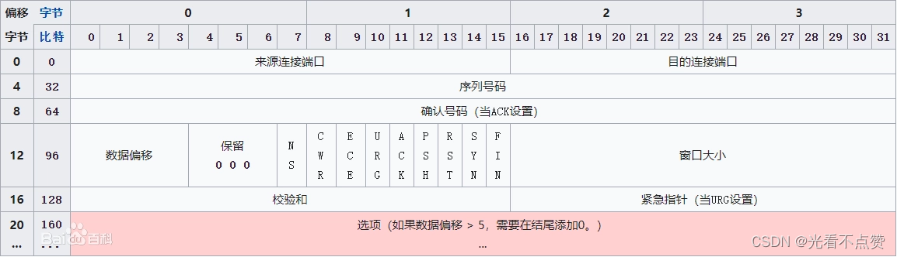

# TCP 流量控制与拥塞控制
## 对比卡

Q: TCP 流量控制和拥塞控制有什么区别？
A:
- 流量控制保护接收方，避免发送方把接收缓冲区打满
- 拥塞控制保护网络，避免过多数据注入网络导致路由器队列拥塞和丢包
- 流量控制主要看接收窗口 rwnd
- 拥塞控制主要看拥塞窗口 cwnd
- 发送窗口通常受 `min(rwnd, cwnd)` 限制

## 流量控制卡

Q: TCP 接收窗口 rwnd 是如何工作的？
A:
- 接收方根据接收缓冲区剩余空间通告 rwnd
- 发送方根据 rwnd 控制未确认数据量，避免接收方缓冲区溢出
- 如果接收窗口为 0，发送方会停止发送数据
- 为避免窗口更新丢失，发送方会发送零窗口探测
- 面试表达：流控是端到端的接收能力反馈

## 慢启动卡

Q: TCP 慢启动如何工作？为什么叫慢启动？
A:
- 连接开始时 cwnd 较小，先谨慎探测网络容量
- 每收到 ACK，cwnd 增长，整体近似指数增长
- 达到慢启动阈值 ssthresh 后进入拥塞避免
- 它叫慢启动是相对一开始就打满网络而言，实际增长可能很快
- 面试边界：慢启动是为了探测可用带宽，避免新连接突然注入大量数据

## 拥塞避免卡
Q: TCP 拥塞避免、快速重传、快速恢复大致如何配合？
A:
- 拥塞避免阶段 cwnd 近似线性增长
- 收到多个重复 ACK 时触发快速重传，推测发生局部丢包
- 快速恢复将 ssthresh 降低，并避免完全回到初始慢启动
- 如果发生超时，通常认为拥塞更严重，cwnd 会被更大幅度降低
- 面试表达：TCP 用丢包/延迟等信号推断拥塞，并动态调整发送速率

## BBR 卡

Q: 传统丢包型拥塞控制和 BBR 思路有什么不同？
A:
- 传统 Reno/CUBIC 等主要把丢包视为拥塞信号
- Bufferbloat 场景下，等到丢包时队列可能已经很长，延迟很高
- BBR 估计瓶颈带宽和最小 RTT，试图在不过度排队的情况下接近最大吞吐
- BBR 更关注带宽时延积，而不是单纯等丢包
- 面试边界：BBR 不是所有场景都绝对更好，公平性和具体网络环境仍会影响效果

## 正确性审查卡

Q: 流量控制和拥塞控制有哪些常见误区？
A:
- “流量控制和拥塞控制是一回事”：错误。一个保护接收端，一个保护网络
- “慢启动很慢”：不准确。它是从小窗口开始指数探测
- “丢包一定是网络拥塞”：不一定。无线错误、设备故障、限速策略都可能丢包
- “拥塞窗口由接收方通告”：错误。cwnd 是发送方根据网络状况维护
- “带宽高就不会拥塞”：错误。瓶颈链路、队列、突发流量都会造成拥塞