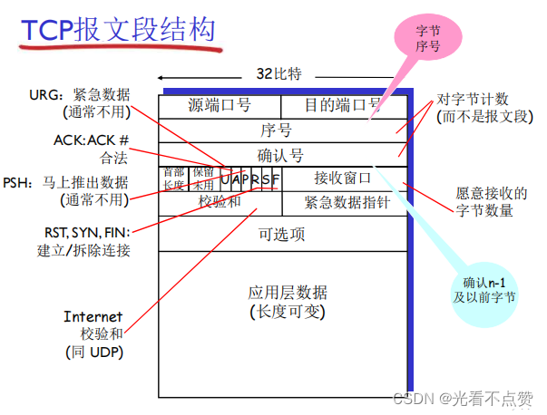
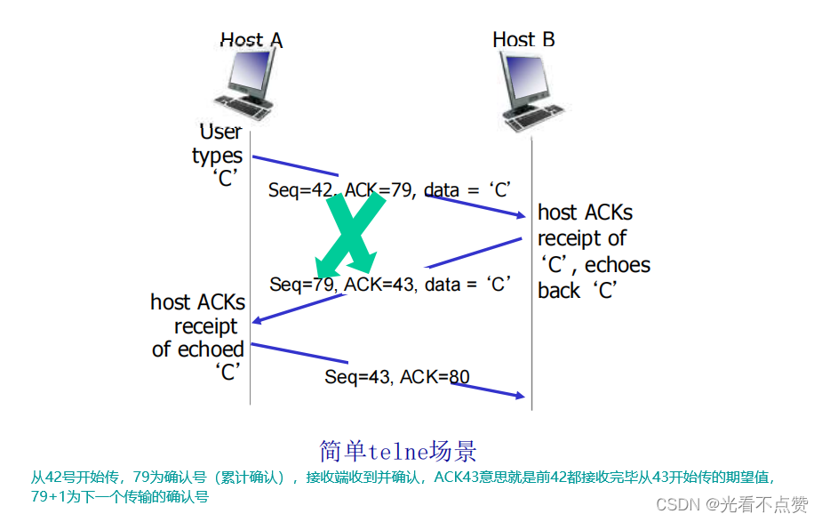
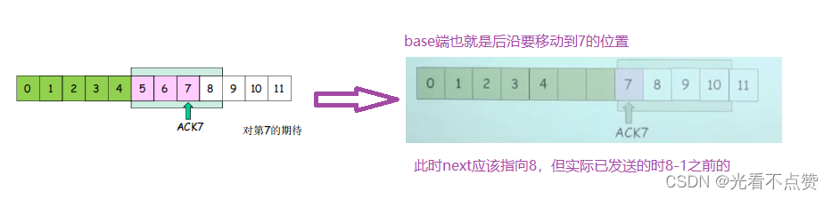
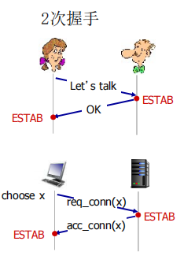
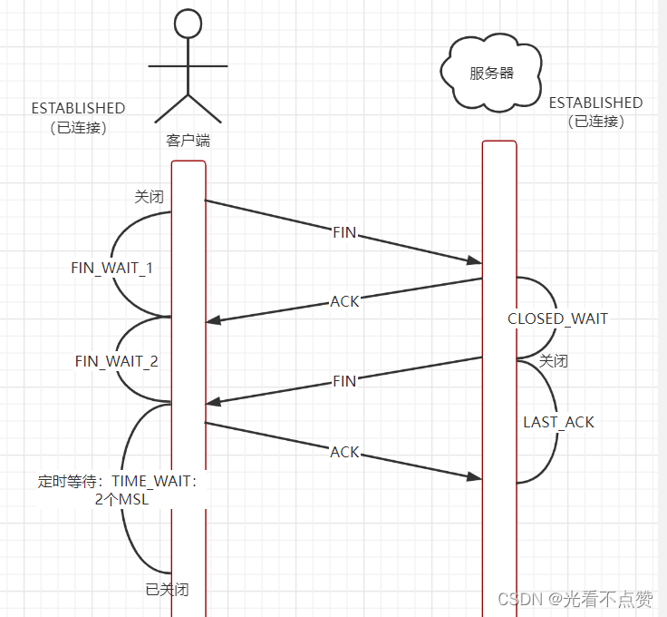
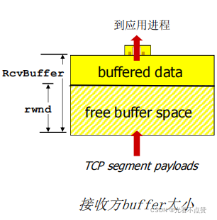
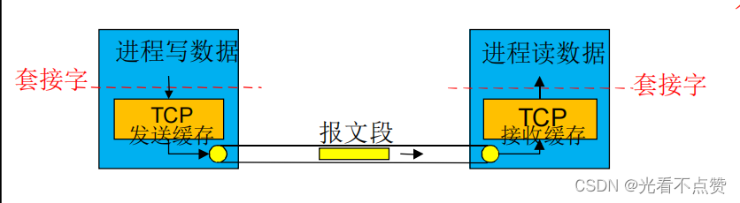
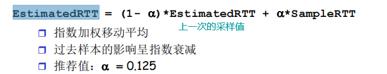

# TCP 连接管理
## 三次握手卡

Q: TCP 三次握手的过程是什么？
A:
- 客户端发送 SYN，进入 SYN_SENT，携带客户端初始序列号
- 服务端收到后返回 SYN+ACK，进入 SYN_RCVD，携带服务端初始序列号并确认客户端序列号
- 客户端再发送 ACK，进入 ESTABLISHED，服务端收到 ACK 后也进入 ESTABLISHED
- 三次握手同步双方初始序列号，并确认双方收发能力
- 面试表达：三次握手不是“打招呼三次”，而是建立可靠字节流所需的状态同步

## 二次握手卡

Q: 为什么 TCP 建立连接需要三次握手，而不是两次？
A:
- 两次握手时，服务端无法确认客户端是否收到了自己的 SYN+ACK
- 旧的延迟 SYN 可能到达服务端，服务端误以为新连接并分配资源
- 三次握手让双方都确认对方的发送和接收能力
- 第三次 ACK 也让服务端确认客户端认可服务端的初始序列号
- 面试边界：核心不是“次数越多越安全”，而是双方状态和序列号同步必须闭环

## 四次挥手卡

Q: TCP 四次挥手的过程是什么？为什么通常是四次？
A:
- 主动关闭方发送 FIN，表示自己不再发送数据
- 被动关闭方回复 ACK，表示收到关闭请求
- 被动关闭方应用处理完剩余数据后发送 FIN
- 主动关闭方回复 ACK，之后进入 TIME_WAIT
- 因为 TCP 是全双工，两个方向的数据流需要分别关闭，所以 FIN 和 ACK 常分开

## TIME_WAIT 卡

Q: TIME_WAIT 为什么存在？为什么通常是 2MSL？
A:
- TIME_WAIT 确保最后一个 ACK 丢失时，对端重发 FIN 还能被正确响应
- 它也让旧连接中的延迟报文在网络中自然消失，避免污染后续相同四元组连接
- 2MSL 表示报文在网络中最大生存时间的两倍，覆盖双向残留报文
- TIME_WAIT 通常出现在主动关闭连接的一方
- 面试注意：TIME_WAIT 不是无用状态，盲目调小会带来协议正确性风险

## SYN泛洪卡
Q: SYN Flood 攻击是什么？有哪些缓解方式？
A:
- 攻击者大量发送 SYN，但不完成第三次握手
- 服务端维护大量半连接状态，SYN 队列被占满，正常连接受影响
- 缓解方式包括 SYN cookies、调大 backlog、降低重试、限流、清洗和防火墙策略
- SYN cookies 在不保存完整半连接状态的情况下编码必要信息到初始序列号
- 面试表达：这是利用 TCP 握手状态消耗服务端资源的 DoS 攻击

## 正确性审查卡

Q: TCP 连接管理有哪些常见误区？
A:
- “三次握手是为了加密”：错误。加密是 TLS 的事
- “四次挥手一定严格四个包”：不一定。ACK 和 FIN 可能合并，状态机才是关键
- “TIME_WAIT 一定在服务端”：错误。通常在主动关闭方
- “TIME_WAIT 越少越好”：不完整。它消耗资源，但有协议正确性价值
- “SYN 队列和 accept 队列是一回事”：错误。半连接队列和全连接队列不同