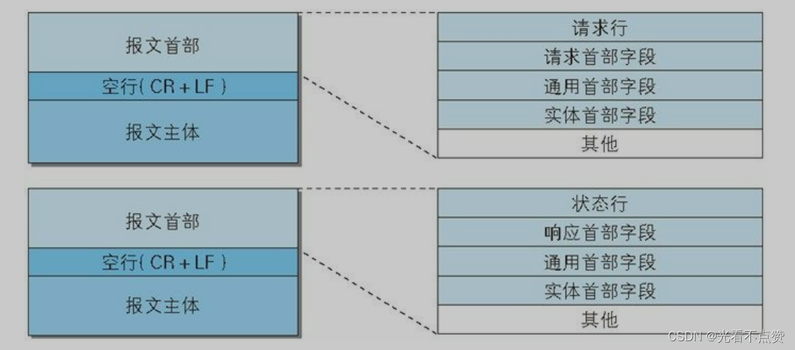
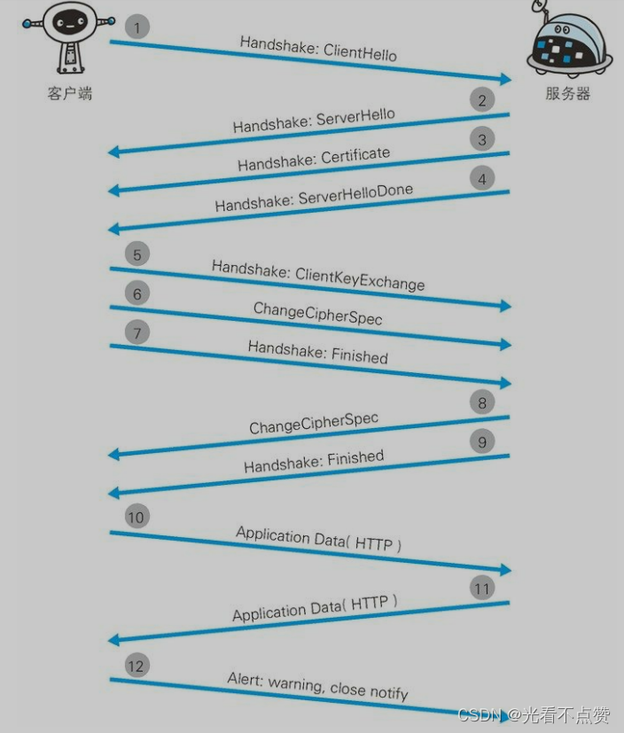
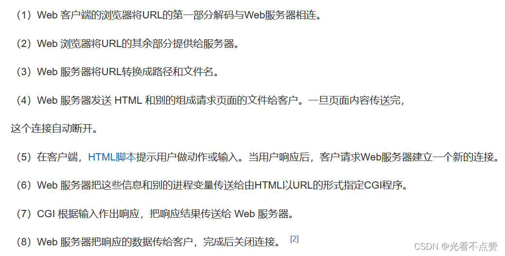
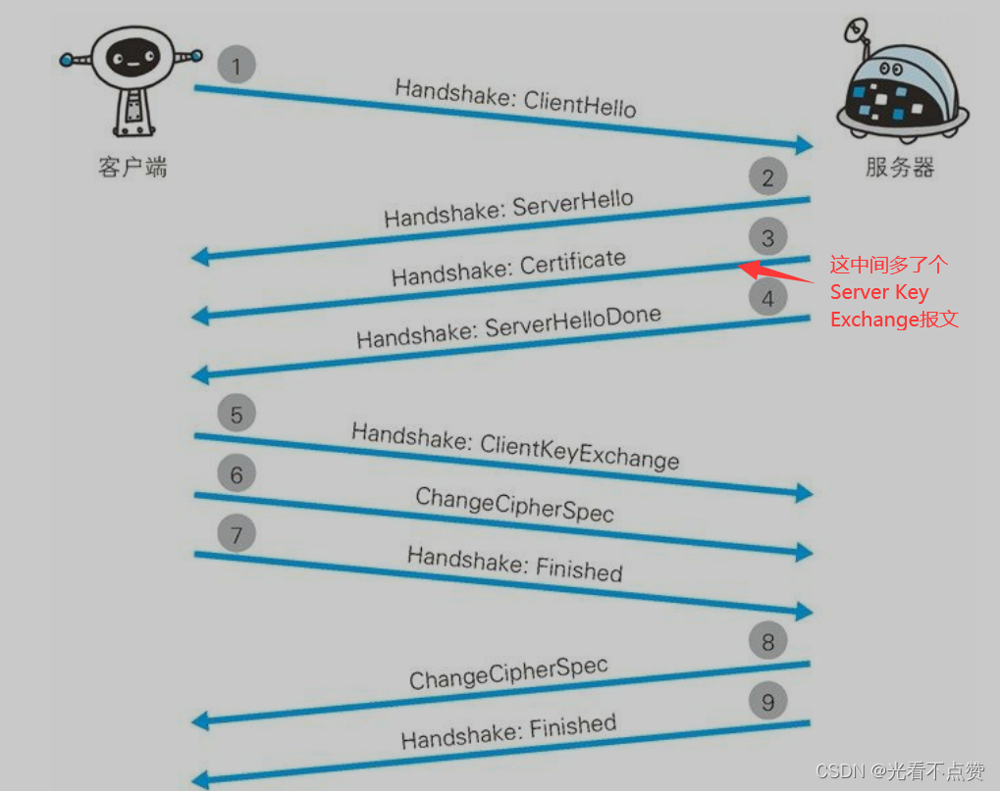

# HTTPS 与 TLS
## 概念卡

Q: HTTPS 相比 HTTP 解决了什么问题？
A:
- 机密性：通过加密防止内容被窃听
- 完整性：通过 MAC/AEAD 防止内容被篡改
- 身份认证：通过证书证明服务端身份，防止中间人伪装
- HTTPS = HTTP over TLS，默认端口 443
- 面试表达：HTTPS 不是新应用协议，而是 HTTP 加上 TLS 安全层

## 证书卡

Q: 浏览器如何验证服务器证书可信？
A:
- 服务器返回证书链，包含服务器证书和中间 CA 证书
- 浏览器验证证书链能否追溯到本地信任的根 CA
- 校验证书域名是否匹配访问域名
- 校验证书有效期、用途、签名算法和吊销状态
- 验证通过后，浏览器才信任该公钥属于目标服务器

## 握手卡

Q: TLS 握手的核心目标是什么？
A:
- 协商 TLS 版本、加密套件和随机数
- 验证服务器身份
- 通过非对称密码或密钥交换算法协商会话密钥
- 后续应用数据使用对称加密传输，因为对称加密性能更高
- 面试重点：非对称加密主要用于认证和密钥协商，不用于加密全部业务数据

## RSA/ECDHE 卡

Q: RSA 握手和 ECDHE 握手有什么关键区别？
A:
- 传统 RSA 握手中，客户端用服务器公钥加密预主密钥，服务器用私钥解密
- 如果服务器私钥未来泄露，历史抓包可能被解密，不具备前向安全
- ECDHE 通过临时椭圆曲线 Diffie-Hellman 协商密钥
- 即使服务器长期私钥泄露，历史会话密钥也难以恢复，具备前向安全
- 现代 TLS 更偏向 ECDHE，TLS 1.3 移除了很多旧的不安全选项

## 性能卡
Q: HTTPS 为什么会增加开销？如何优化？
A:
- TLS 握手增加 RTT 和 CPU 加解密成本
- 证书链验证和密钥交换也有计算开销
- 优化方式包括连接复用、会话恢复、TLS 1.3、OCSP stapling、硬件加速和合理证书链
- HTTP/2/3 与 TLS 配合也能减少连接和握手成本
- 面试边界：现代硬件下 TLS 对称加密成本通常可控，更多要关注握手和连接管理

## 正确性审查卡
Q: HTTPS/TLS 有哪些常见误区？
A:
- “HTTPS 防止所有攻击”：错误。它保护传输链路，不解决 XSS、CSRF、业务越权等应用漏洞
- “HTTPS 全程用非对称加密”：错误。业务数据主要用对称加密
- “证书只是为了加密”：不完整。证书核心还包括身份认证
- “有证书就一定安全”：不一定。还要看域名匹配、证书链、协议版本和配置
- “TLS 握手每个请求都发生”：不一定。连接复用和会话恢复会减少握手成本