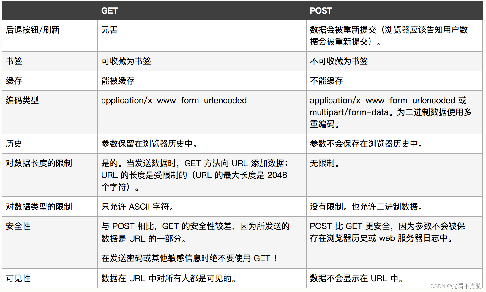
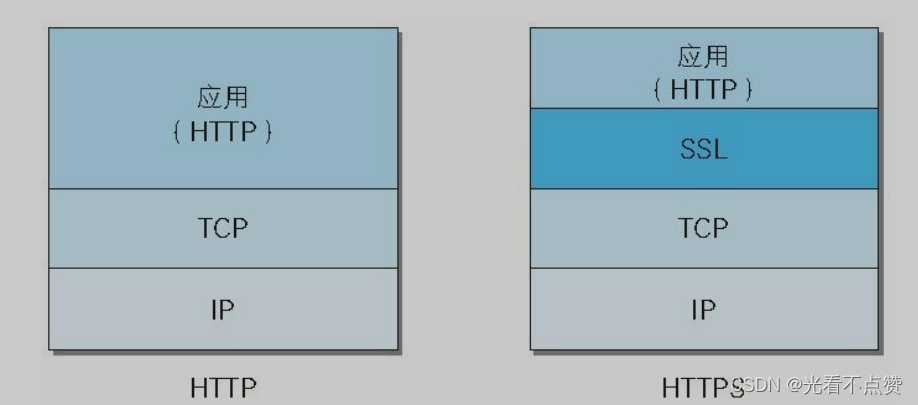
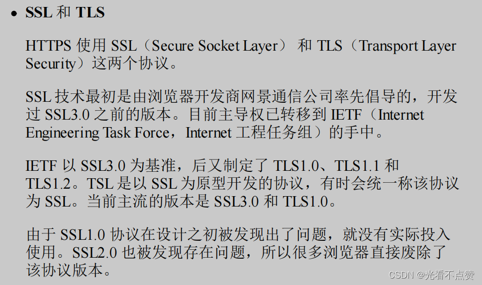
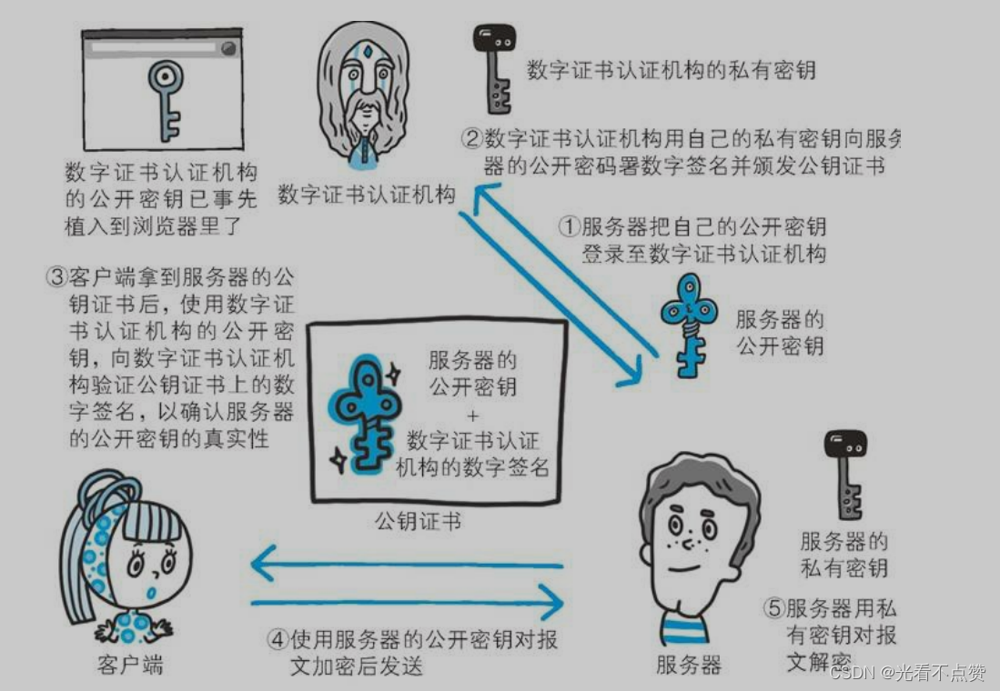
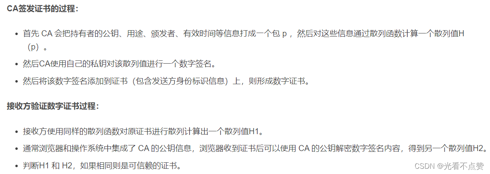
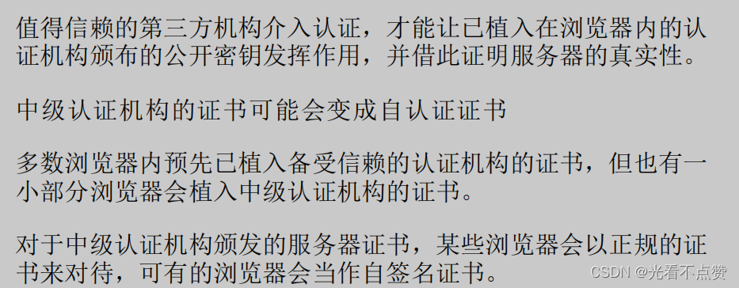
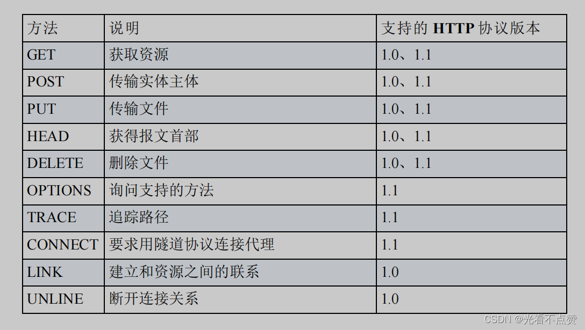

# Web 常见攻击
## XSS 卡
Q: XSS 是什么？如何防护？
A:
- XSS 是攻击者把恶意脚本注入页面，在用户浏览器中执行
- 反射型来自请求参数，存储型写入数据库后影响更多用户，DOM 型发生在前端 DOM 操作中
- 防护核心是输出编码、输入校验、富文本白名单、CSP 和避免拼接 HTML
- Cookie 设置 HttpOnly 可降低脚本窃取 Cookie 风险
- 面试表达：XSS 的本质是“把不可信数据当代码执行”

## CSRF 卡
Q: CSRF 是什么？为什么 SameSite Cookie 能缓解它？
A:
- CSRF 利用用户已登录态，让用户浏览器向目标站点发起非预期请求
- 攻击者不一定能读响应，但能借浏览器自动携带 Cookie 发请求
- SameSite 限制跨站请求携带 Cookie，从源头降低风险
- 其他防护包括 CSRF token、校验 Origin/Referer、重要操作二次验证
- 面试边界：CSRF 重点是“借用身份发请求”，XSS 是“执行脚本”

## SQL注入卡

Q: SQL 注入和网络安全有什么关系？如何防护？
A:
- SQL 注入属于应用层输入处理漏洞，但常和 HTTP 参数传递一起被问
- 攻击者构造输入改变 SQL 语义，读取或修改非授权数据
- 防护核心是参数化查询/预编译，不拼接 SQL
- 还要做最小权限、输入校验、错误信息脱敏和审计
- 面试注意：只靠过滤关键字不可靠，参数化才是主线

## DoS与DDoS卡
Q: DoS/DDoS 攻击有哪些常见类型？如何缓解？
A:
- 流量型攻击消耗带宽，例如 UDP flood
- 协议型攻击消耗连接或协议状态，例如 SYN flood
- 应用层攻击消耗业务资源，例如大量复杂查询或登录请求
- 缓解方式包括限流、黑白名单、验证码、WAF、CDN/高防、SYN cookies、连接队列调优
- 面试表达：不同层攻击消耗的资源不同，防护也要分层

## 中间人卡

Q: 中间人攻击如何发生？HTTPS 如何缓解？
A:
- 攻击者位于客户端和服务器之间，拦截、篡改或伪造通信
- HTTP 明文传输时容易被窃听和篡改
- HTTPS 通过证书验证服务器身份，防止攻击者伪装成目标服务器
- TLS 加密和完整性保护防止内容被读取或篡改
- 如果用户忽略证书警告、安装恶意根证书或服务端配置错误，仍可能有风险

## 正确性审查卡

Q: Web 安全有哪些常见误区？
A:
- “用了 HTTPS 就不会有 XSS/CSRF”：错误。HTTPS 保护传输，不替代应用安全
- “CSRF 能读取用户数据”：通常不对。CSRF 主要是发起状态改变请求，读响应受同源策略限制
- “过滤 script 就能防 XSS”：不够。事件属性、URL、富文本、DOM API 都可能绕过
- “DDoS 只靠应用限流就能解决”：不完整。大流量攻击需要网络和高防能力
- “SQL 注入只发生在查询接口”：错误。任何拼接 SQL 的写入、排序、过滤都可能被注入