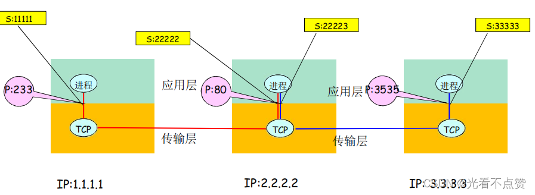
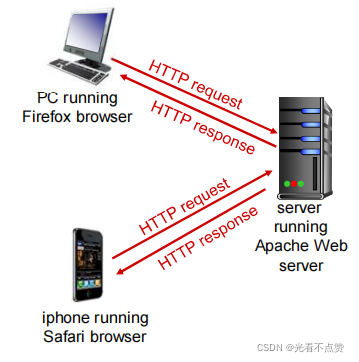
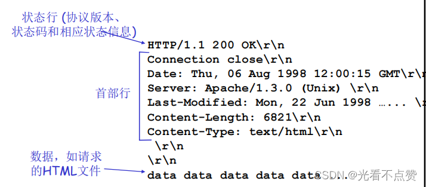
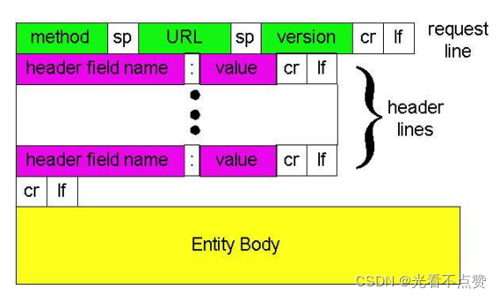
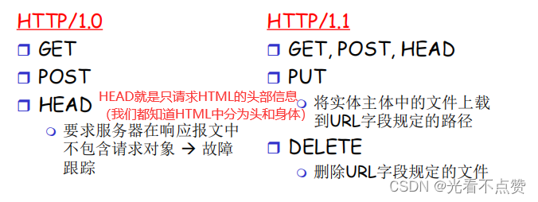
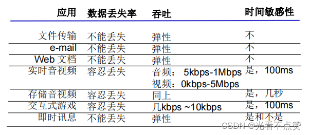
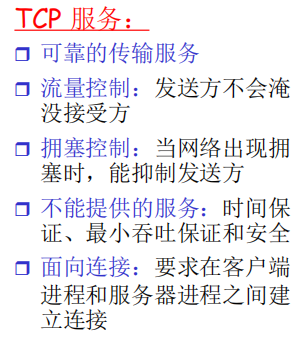
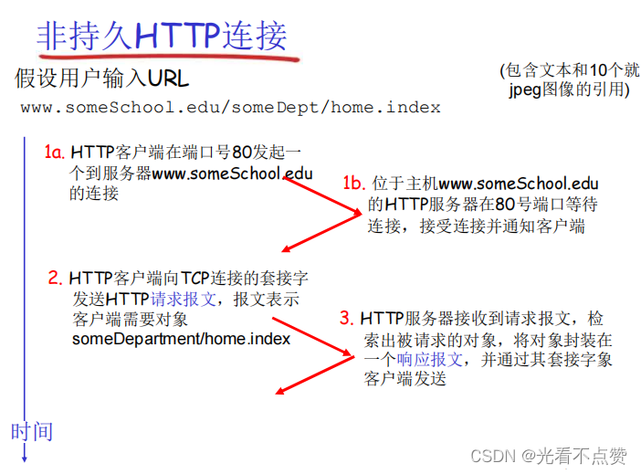

# DNS 解析
## 概念卡

Q: DNS 解决什么问题？为什么不能只用 IP？
A:
- DNS 把人类可读域名解析成 IP 地址
- 域名比 IP 更稳定，后端可以更换机器、机房、CDN，而用户访问域名不变
- DNS 支持负载均衡、容灾、地域调度和服务发现
- IP 会变化，域名是更适合暴露给用户和业务系统的抽象
- 面试表达：DNS 是互联网命名系统，也是流量调度入口之一

## 解析流程卡

Q: 浏览器访问域名时 DNS 解析大致经过哪些缓存和服务器？
A:
- 先查浏览器 DNS 缓存、操作系统缓存、hosts 文件
- 未命中则请求本地 DNS 解析器
- 本地 DNS 可能递归查询根域名服务器、顶级域服务器、权威域名服务器
- 得到记录后按 TTL 缓存结果并返回客户端
- 真实链路中还可能有公共 DNS、运营商 DNS、企业 DNS 和 CDN DNS 调度

## 递归迭代卡
Q: DNS 递归查询和迭代查询有什么区别？
A:
- 递归查询是客户端把解析任务交给 DNS 服务器，希望对方返回最终结果
- 迭代查询是 DNS 服务器返回下一步应该问谁，由查询方继续问
- 客户端到本地 DNS 通常是递归
- 本地 DNS 到根/TLD/权威服务器之间常用迭代
- 面试重点：递归强调“帮我查到底”，迭代强调“告诉我下一站”

## 记录类型卡

Q: 常见 DNS 记录 A、AAAA、CNAME、MX、TXT 分别是什么？
A:
- A：域名到 IPv4 地址
- AAAA：域名到 IPv6 地址
- CNAME：别名记录，把一个域名指向另一个域名
- MX：邮件交换记录，指定邮件服务器
- TXT：文本记录，常用于域名验证、SPF、DKIM 等
- 面试边界：CNAME 最终仍要解析到 A/AAAA 才能连接

## 工程实践卡
Q: DNS 解析可能导致哪些线上问题？
A:
- TTL 过长导致故障切换不及时
- TTL 过短增加解析压力和延迟
- 运营商 DNS 劫持或缓存污染导致解析到错误地址
- 客户端、本地 DNS、JVM DNS 缓存可能让变更不立即生效
- 多 IP 返回时客户端负载均衡策略、连接复用和失败重试都会影响实际流量分布

## 正确性审查卡
Q: DNS 有哪些常见误区？
A:
- “DNS 只发生在浏览器里”：错误。任何按域名访问的客户端都可能触发 DNS
- “改了 DNS 记录立刻全球生效”：错误。缓存和 TTL 会导致传播延迟
- “CNAME 直接返回 IP”：错误。CNAME 是别名，还要继续解析
- “DNS 负载均衡一定均匀”：不一定。缓存、地域、客户端策略都会影响
- “DNS 成功代表服务可用”：不够。还要 TCP/TLS/HTTP 等后续链路成功