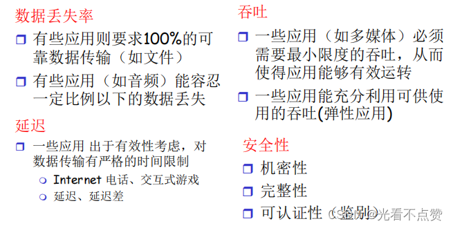
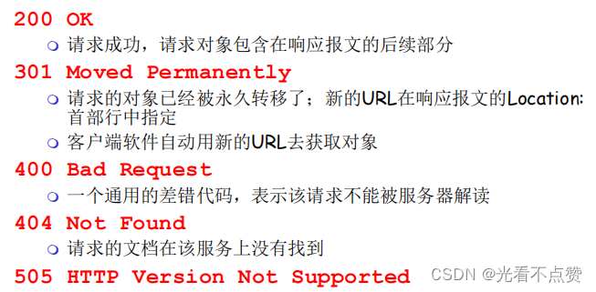
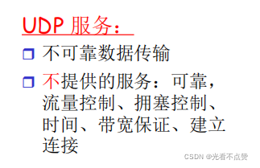
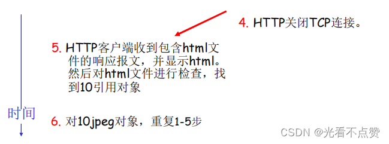

# HTTP 基础与缓存
## 概念卡

Q: HTTP 是什么？它和 TCP 的关系是什么？
A:
- HTTP 是应用层协议，定义请求和响应的语义、头部、方法、状态码和缓存规则
- TCP 是传输层协议，提供可靠有序字节流
- HTTP/1.1 和 HTTP/2 通常运行在 TCP 之上
- HTTPS 是 HTTP over TLS，TLS 再运行在 TCP 之上
- HTTP/3 运行在 QUIC 之上，而 QUIC 基于 UDP

## 方法卡
Q: GET 和 POST 有什么区别？面试时如何避免背八股？
A:
- GET 语义是获取资源，应安全且幂等；POST 常用于提交资源或触发处理，语义不要求幂等
- GET 参数常放 URL，POST 常放 body，但这不是协议本质限制
- GET 更容易被浏览器、代理和 CDN 缓存，POST 默认不用于普通缓存
- GET URL 长度受客户端/服务器实现限制，POST body 更适合大内容
- 面试重点：区别首先是语义和幂等性，其次才是参数位置和缓存行为

## 状态码卡
Q: 常见 HTTP 状态码如何分类？
A:
- 2xx 表示成功：200 OK、201 Created、204 No Content
- 3xx 表示重定向：301 永久、302 临时、304 缓存未修改
- 4xx 表示客户端错误：400 参数错误、401 未认证、403 无权限、404 不存在、429 限流
- 5xx 表示服务端错误：500 内部错误、502 网关收到无效响应、503 服务不可用、504 网关超时
- 面试表达：状态码要体现错误责任边界，不能所有失败都返回 200 或 500

## 缓存卡

Q: HTTP 强缓存和协商缓存有什么区别？
A:
- 强缓存通过 Cache-Control/Expires 判断本地缓存是否仍可直接使用
- 强缓存命中时不会向服务器发送请求
- 协商缓存通过 ETag/If-None-Match 或 Last-Modified/If-Modified-Since 向服务器确认资源是否变化
- 未变化返回 304，客户端继续使用本地缓存
- ETag 通常比 Last-Modified 更精确，但生成和比较也有成本

## Cookie/Session卡
Q: Cookie、Session、Token 有什么区别？
A:
- Cookie 是浏览器存储并随请求发送的小段数据
- Session 通常把登录状态存在服务端，客户端 Cookie 保存 session id
- Token 通常由客户端持有，服务端验证签名或查状态，适合无状态认证或跨服务传递
- Cookie 要关注 HttpOnly、Secure、SameSite，减少 XSS/CSRF 风险
- 面试边界：JWT 无状态方便扩展，但撤销、续期、泄露和权限变更要额外设计

## 正确性审查卡

Q: HTTP 基础有哪些常见误区？
A:
- “GET 一定不能有 body”：规范没有绝对禁止，但语义和兼容性上不推荐
- “POST 一定比 GET 安全”：错误。安全性来自 HTTPS、认证授权和服务端校验
- “Session 一定比 Token 好”：不一定。取决于状态管理、扩展性和安全需求
- “304 是重定向”：不准确。304 是缓存协商结果，不表示跳转到新地址
- “HTTP 是有状态协议”：HTTP 本身无状态，状态通常由 Cookie/Session/Token 维护