# 分层模型与网络性能
## 概念卡
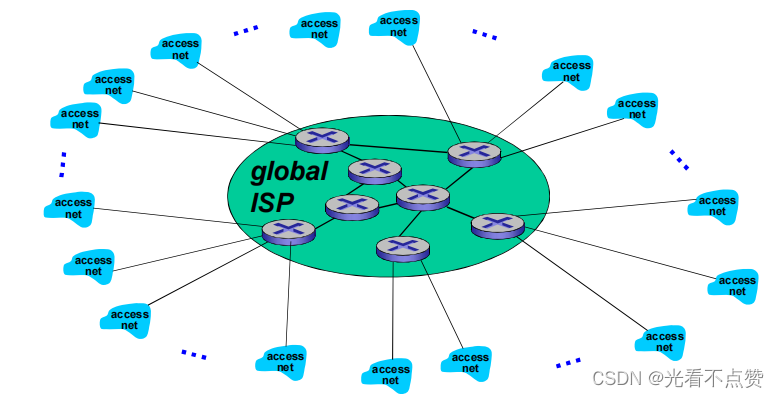
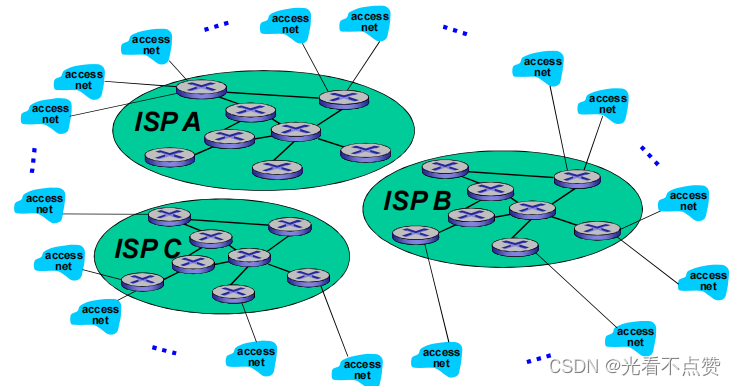
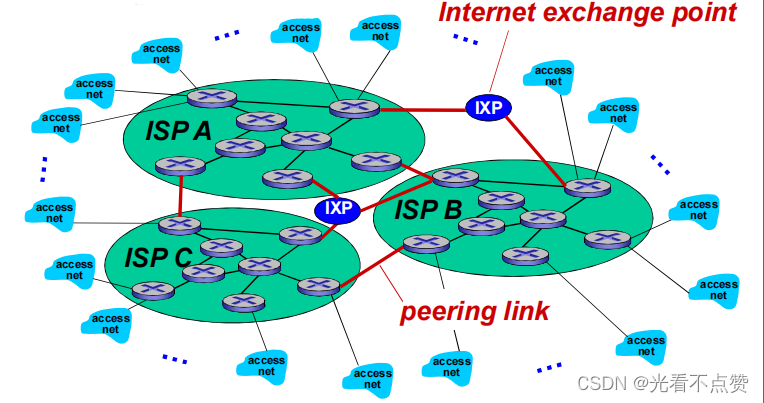
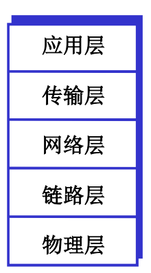
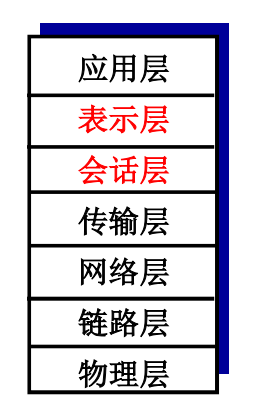

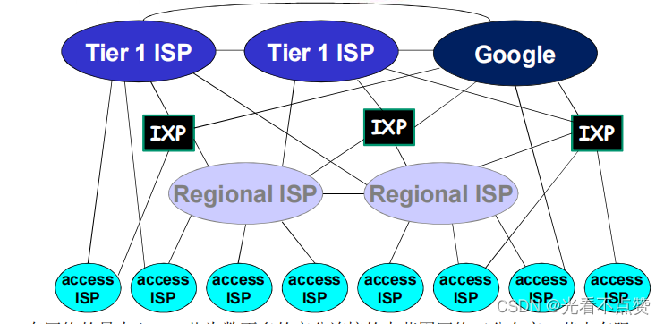
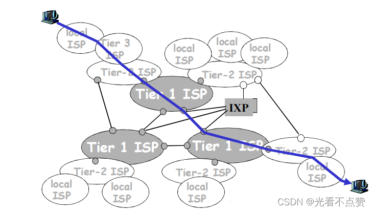
Q: OSI 七层和 TCP/IP 四层模型分别如何理解？后端面试应该怎么说？
A:
- OSI 七层是教学和分析模型：物理层、数据链路层、网络层、传输层、会话层、表示层、应用层
- TCP/IP 常按四层理解：链路层、网络层、传输层、应用层
- 后端开发最常深挖的是网络层 IP/路由、传输层 TCP/UDP、应用层 HTTP/DNS/TLS
- 分层的价值是屏蔽下层细节、定义清晰接口、让各层可以独立演进
- 面试表达：不要只背层名，要能说“HTTP 基于 TCP/TLS，TCP 基于 IP，IP 基于链路层帧传输”

## 封装卡
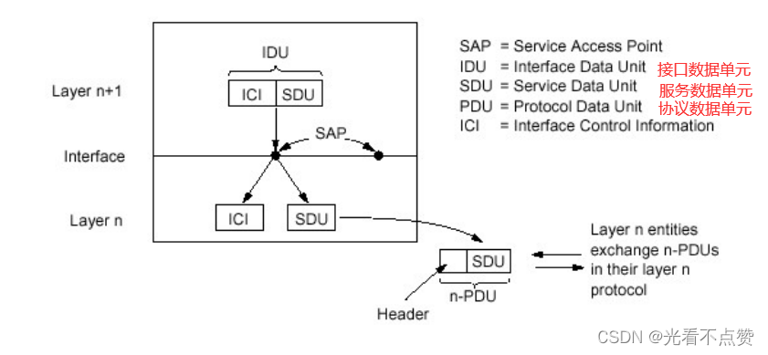
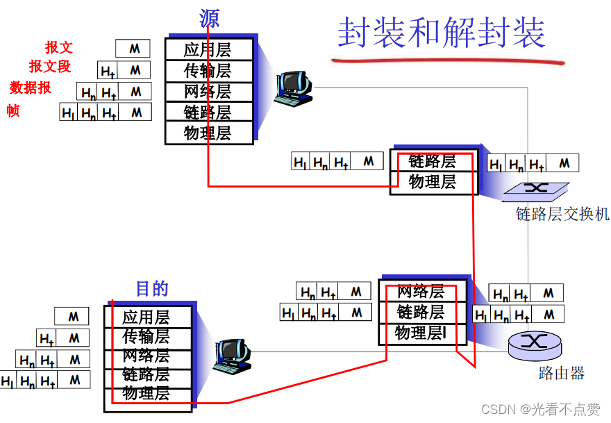
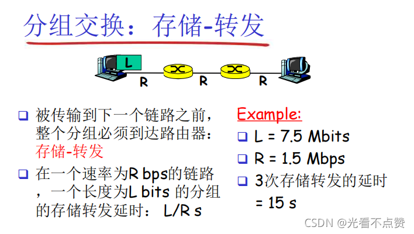
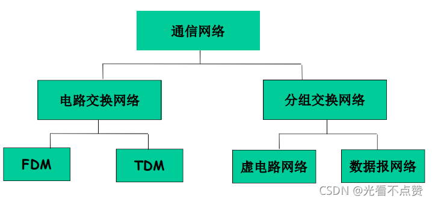
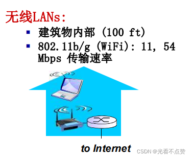
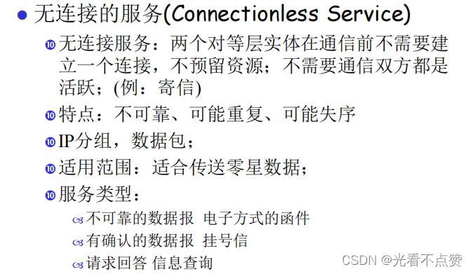
Q: 数据从应用发出到网卡发送，中间经历了什么封装过程？
A:
- 应用层生成 HTTP/DNS/RPC 等应用报文
- 传输层加 TCP/UDP 头，形成 segment/datagram，负责端口、可靠性或无连接传输
- 网络层加 IP 头，形成 IP 数据报，负责跨网络寻址和路由
- 链路层加以太网帧头/帧尾，负责同一链路内传输和 MAC 地址交付
- 接收端按相反方向逐层解封装，最终交给目标进程

## 性能指标卡
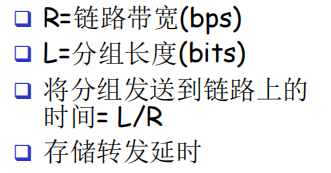
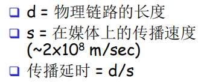
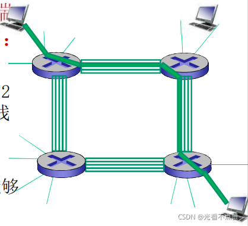
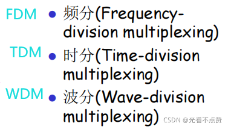
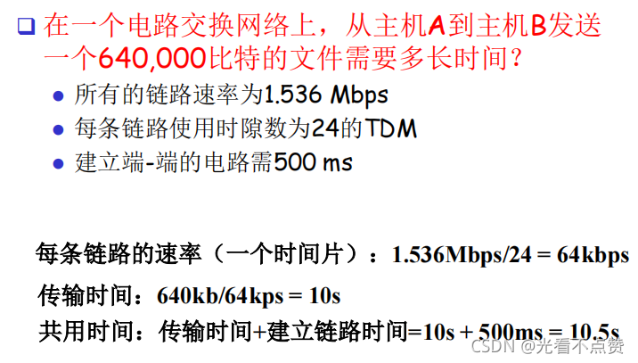
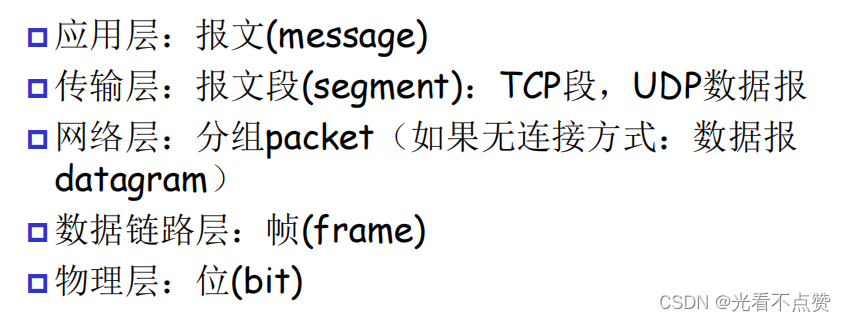
Q: 带宽、吞吐量、延迟、RTT、抖动分别是什么意思？
A:
- 带宽是链路理论传输能力，例如 100Mbps
- 吞吐量是实际单位时间成功传输的数据量，受链路、拥塞、协议和应用处理影响
- 延迟是数据从源到目的经历的时间，包括处理、排队、传输和传播延迟
- RTT 是一次往返时间，TCP 握手、重传超时、HTTP 请求体验都受它影响
- 抖动是延迟波动，对音视频、实时通信特别敏感

## 排队延迟卡
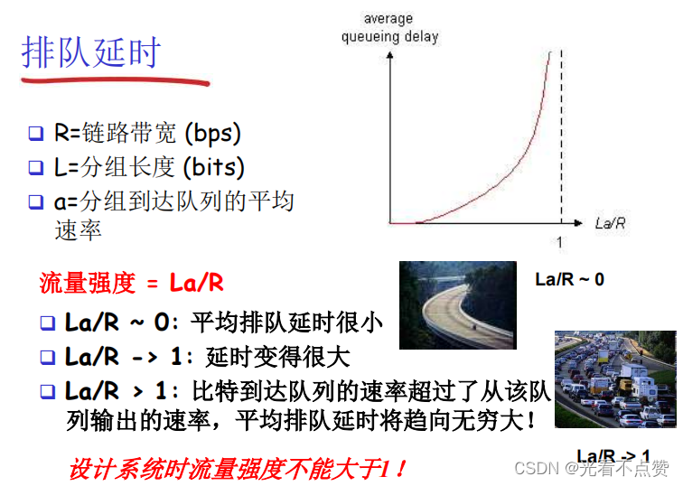

Q: 为什么网络延迟在高负载下会突然恶化？
A:
- 当到达速率接近链路或服务处理能力时，队列开始堆积
- 流量强度越接近 1，排队延迟增长越快
- 队列满后会丢包，TCP 再重传，进一步加重拥塞
- 高负载下平均延迟之外还要看 P95/P99，因为尾延迟会显著影响用户体验
- 工程上要做限流、排队长度控制、超时、重试退避和容量规划

## 工程实践卡
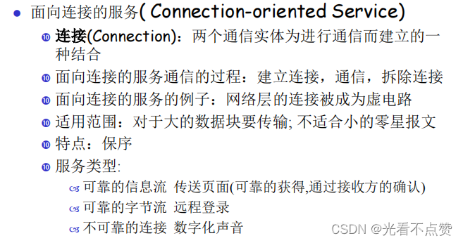
Q: 后端排查“接口慢”时，网络层面应该看哪些因素？
A:
- DNS 解析耗时、连接建立耗时、TLS 握手耗时、首包时间和响应下载时间
- 是否跨地域、跨机房、经过代理/CDN/网关/负载均衡
- TCP 是否发生重传、丢包、拥塞窗口过小或连接频繁新建
- 服务端 accept 队列、连接数、TIME_WAIT、文件描述符是否异常
- 面试亮点：接口慢不等于业务代码慢，要把客户端、网络、网关、服务端和下游拆开看

## 正确性审查卡
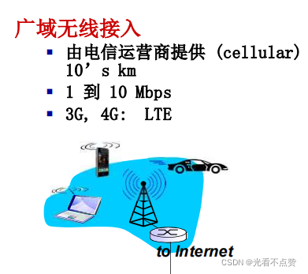
Q: 网络分层和性能有哪些常见误区？
A:
- “带宽高延迟就一定低”：错误。带宽和延迟是不同维度
- “TCP/IP 就是 OSI 七层”：不准确。TCP/IP 是实际互联网协议栈，OSI 更偏参考模型
- “吞吐量等于带宽”：错误。吞吐量受端到端瓶颈和协议影响
- “网络慢只能找网络团队”：不完整。连接复用、超时重试、序列化、网关配置都可能由应用侧影响
- “平均延迟好就没问题”：不够。线上更要关注尾延迟和抖动