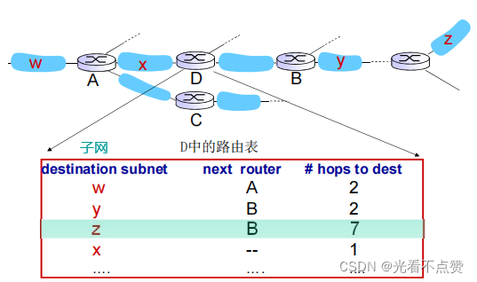
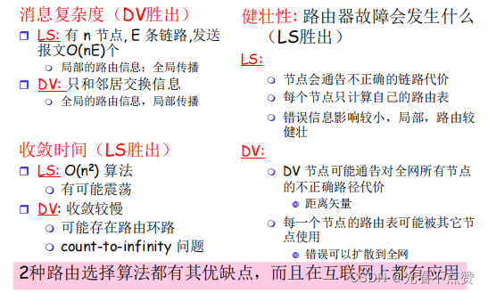
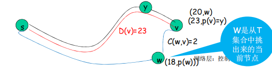
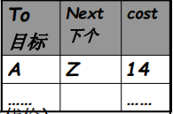
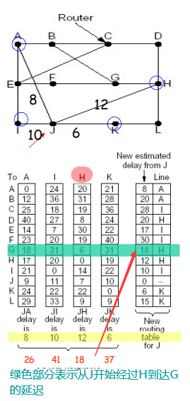
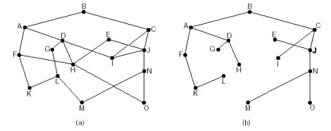
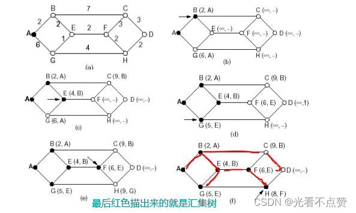
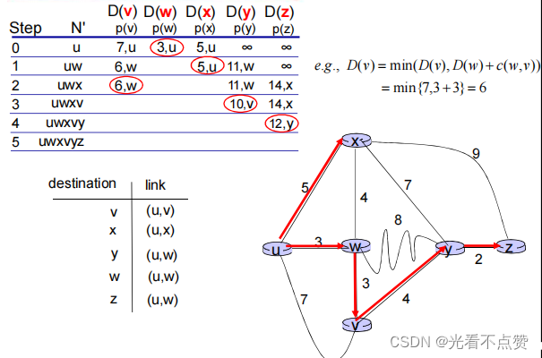
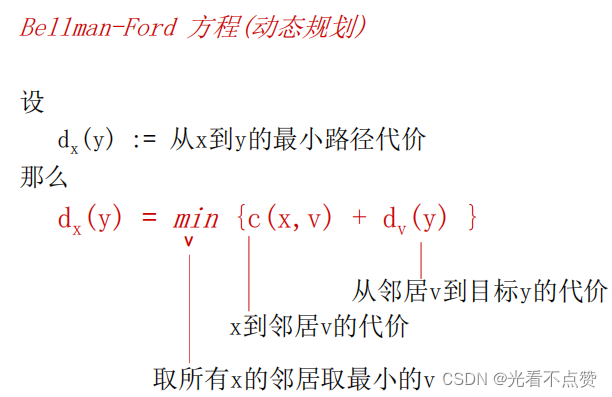
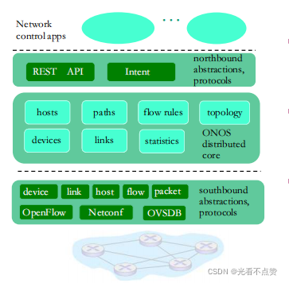

# ARP ICMP 与路由
## ARP 卡

Q: ARP 解决什么问题？它的基本流程是什么？
A:
- ARP 用于在同一局域网内根据目标 IP 找到目标 MAC 地址
- 主机先查 ARP 缓存，找不到就广播 ARP Request
- 拥有该 IP 的主机返回 ARP Reply，告知自己的 MAC
- 发送方缓存 IP 到 MAC 的映射，并封装以太网帧发送
- 跨网段通信时，ARP 查询的是默认网关的 MAC，而不是远端主机 MAC

## ICMP 卡

Q: ICMP 有什么作用？ping 和 traceroute 分别怎么用到它？
A:
- ICMP 用于网络层差错报告和诊断
- ping 通常发送 ICMP Echo Request，收到 Echo Reply 判断可达和 RTT
- traceroute 利用 TTL 逐跳递增，路由器 TTL 归零返回 ICMP Time Exceeded
- 某些网络会禁 ICMP，所以 ping 不通不一定代表 TCP/HTTP 不通
- 面试表达：ICMP 是排障工具的重要基础，但不是业务连通性的唯一判断

## 路由卡

Q: 路由器转发 IP 数据报的核心依据是什么？
A:
- 路由器根据目标 IP 查路由表
- 使用最长前缀匹配选择最具体的路由项
- 找到下一跳和出接口后，重新封装链路层帧发出
- IP 层 TTL 会递减，防止环路中无限转发
- 路由器转发时通常不会关心 TCP/HTTP 业务语义

## 路由协议卡

Q: RIP、OSPF、BGP 大致有什么区别？
A:
- RIP 是距离矢量协议，按跳数度量，简单但规模和收敛能力有限
- OSPF 是链路状态协议，自治系统内部使用，基于拓扑计算最短路径
- BGP 是自治系统之间的路径向量协议，强调策略、可控性和互联网规模
- 内部网关协议更关注性能和收敛，外部网关协议更关注策略和自治
- 面试边界：后端开发不一定要能配置 BGP，但要理解跨运营商/跨地域路由可能影响延迟和可用性

## 排障卡

Q: 从网络层排查“访问不通”可以按什么顺序？
A:
- 查本机 IP、网关、DNS、路由表是否正确
- ping 网关、目标 IP 或中间节点判断基础可达性
- traceroute/mtr 看路径在哪一跳异常
- nc/telnet/curl 验证目标端口和应用协议是否可达
- 抓包看 ARP、DNS、TCP SYN/SYN-ACK、TLS 握手是否正常

## 正确性审查卡

Q: ARP、ICMP、路由有哪些常见误区？
A:
- “ARP 能解析任意互联网 IP 的 MAC”：错误。ARP 只在本链路内解析，跨网段解析网关 MAC
- “ping 不通服务一定不可用”：不一定。ICMP 可能被禁，TCP 端口仍可达
- “traceroute 显示的路径一定完整准确”：不一定。防火墙、负载均衡、ICMP 限制都会影响结果
- “路由器根据域名转发”：错误。路由器主要根据 IP 前缀转发
- “TTL 是时间单位”：历史名字如此，实际是跳数限制