# IP 地址子网与 NAT
## IP 卡

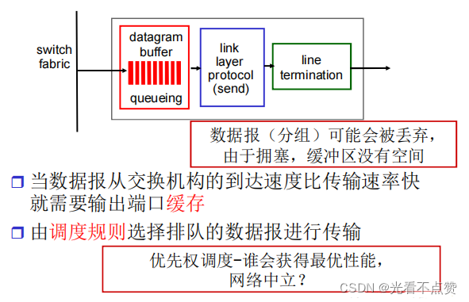
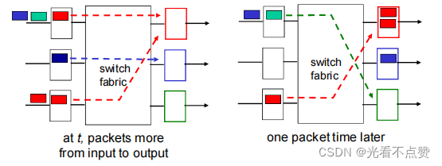

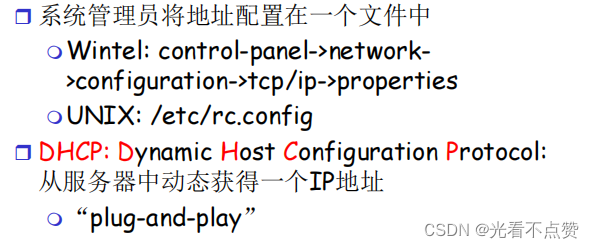
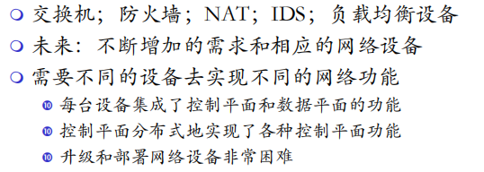
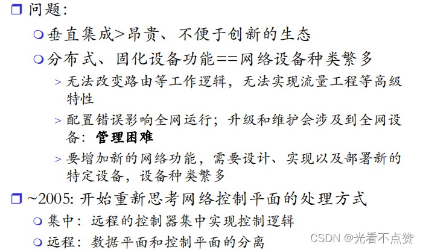
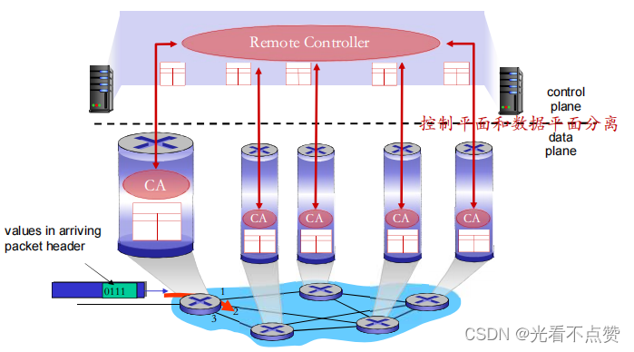
Q: IP 地址和端口分别解决什么问题？
A:
- IP 地址用于定位网络中的主机或接口
- 端口用于定位主机上的具体进程或 socket
- TCP/UDP 连接通常由五元组标识：源 IP、源端口、目标 IP、目标端口、协议
- 同一台机器可以有多个 IP，同一个进程也可以监听多个端口
- 面试表达：IP 负责“到哪台机器”，端口负责“交给哪个应用”

## 子网卡

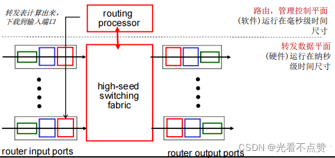
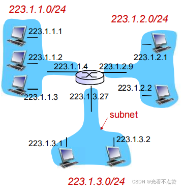
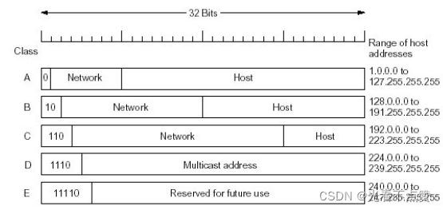

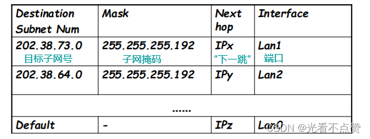

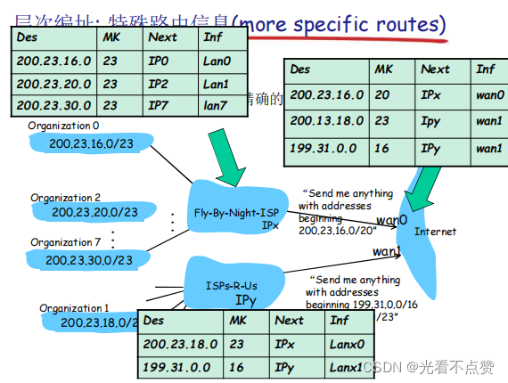

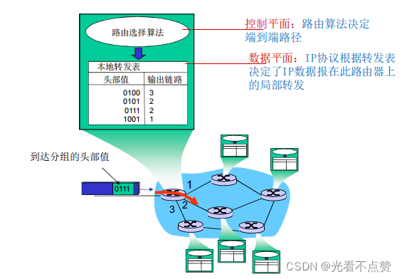
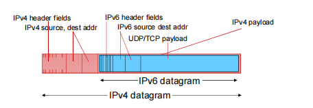
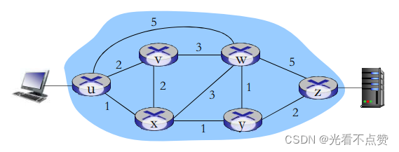

Q: 子网掩码和 CIDR 解决什么问题？
A:
- 子网掩码用于区分 IP 地址中的网络号和主机号
- CIDR 用斜杠表示网络前缀长度，例如 `192.168.1.0/24`
- 同一子网内主机可通过二层网络直接通信，跨子网需要路由器转发
- 路由表根据最长前缀匹配选择下一跳
- 面试重点：CIDR 支持更灵活的地址聚合，减少路由表规模

## NAT 卡

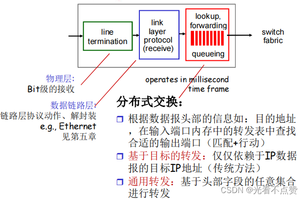
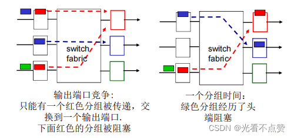
Q: NAT 的作用是什么？它带来了哪些问题？
A:
- NAT 把内网私有地址转换成公网地址，缓解 IPv4 地址不足
- 多个内网连接可通过不同源端口复用同一个公网 IP
- NAT 隐藏内网结构，但不是严格安全边界
- 问题包括端到端连接被破坏、P2P/回调困难、排障复杂、需要 NAT 穿透
- IPv6 的普及目标之一就是减少对 NAT 的依赖，恢复端到端寻址能力

## DHCP 卡

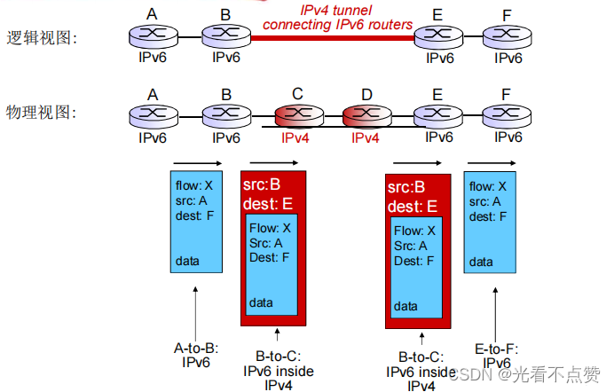
Q: DHCP 获取地址的基本过程是什么？
A:
- Discover：客户端广播寻找 DHCP 服务器
- Offer：服务器提供可用 IP、网关、DNS、租约等信息
- Request：客户端请求使用某个 Offer
- ACK：服务器确认租约生效
- 面试边界：DHCP 不只分配 IP，还会下发默认网关、DNS 服务器等上网必要配置

## 工程实践卡

Q: 服务部署时遇到“本机能访问，别的机器不能访问”，网络侧如何排查？
A:
- 检查服务监听地址：是否只绑定 `127.0.0.1` 而不是 `0.0.0.0` 或具体内网 IP
- 检查端口是否监听、进程是否存在、容器端口是否映射
- 检查安全组、防火墙、iptables、云厂商 ACL
- 检查目标 IP 是否在同一网络、路由是否可达、NAT/网关是否正确
- 检查应用协议是否匹配，例如 HTTP/HTTPS、TCP/UDP 端口是否混用

## 正确性审查卡

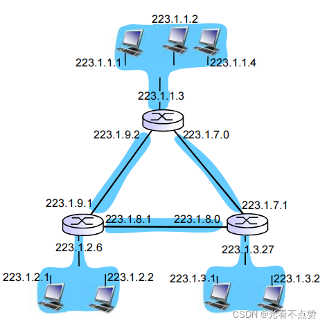

Q: IP、子网、NAT 有哪些常见错误说法？
A:
- “同一个局域网就是同一个网段”：不一定。二层连接和三层子网不是完全同义
- “NAT 等于防火墙”：错误。NAT 是地址转换，安全控制要靠防火墙/ACL
- “端口定位机器”：错误。IP 定位主机，端口定位进程
- “CIDR 越小主机越少”：错误。前缀长度越小，网络范围越大
- “绑定 localhost 和绑定 0.0.0.0 一样”：错误。localhost 只接受本机访问