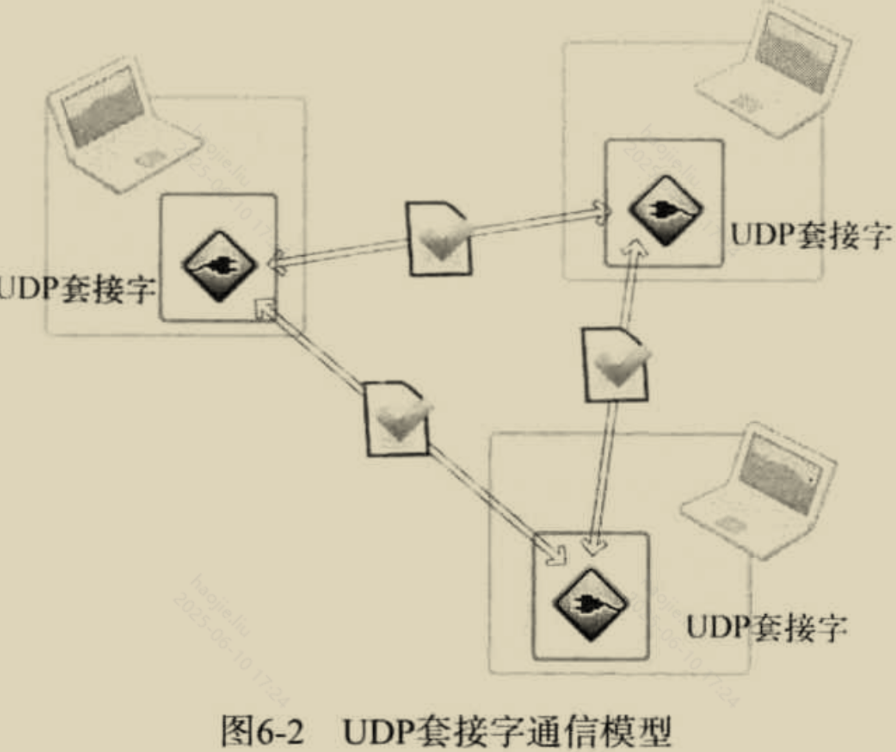
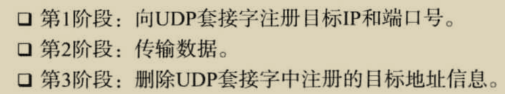
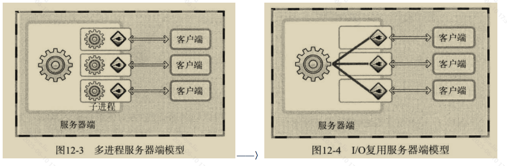
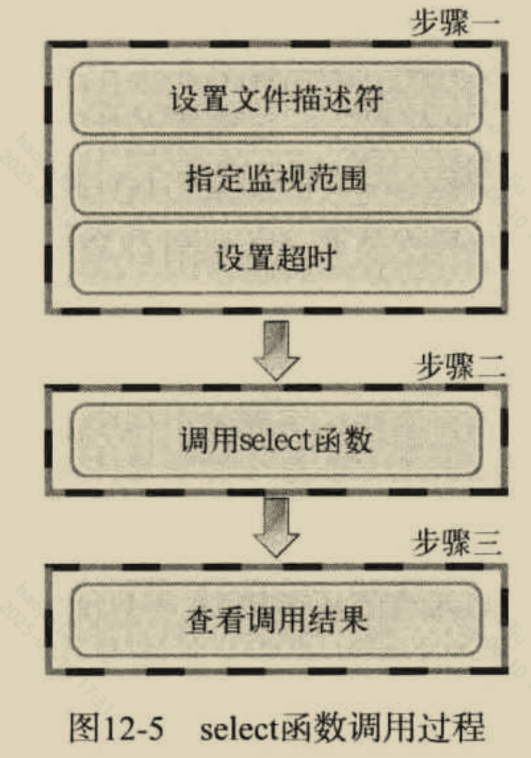
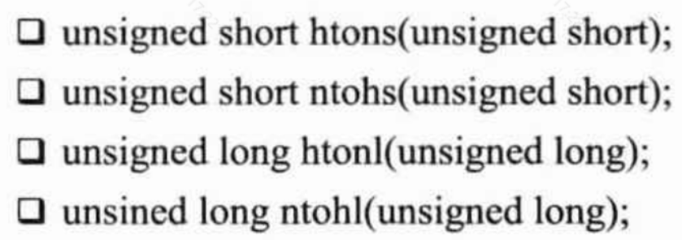
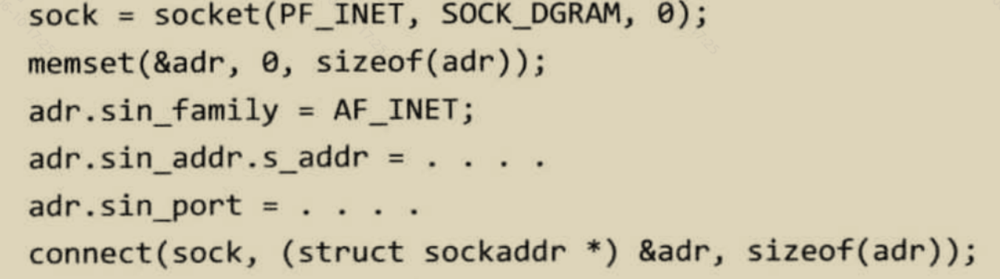
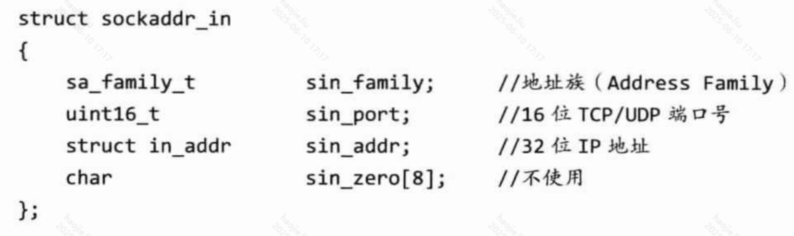
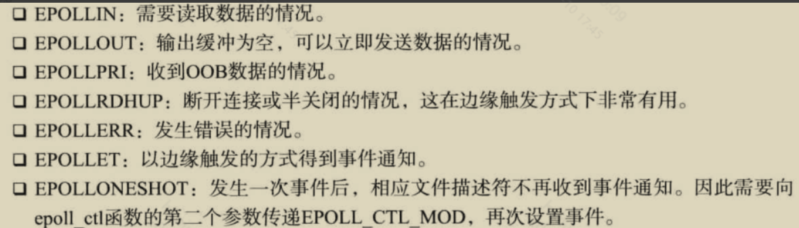
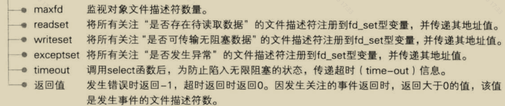

# Socket 与 IO 多路复用
## Socket卡

Q: Socket 是什么？服务端 TCP 编程基本调用顺序是什么？
A:
- Socket 是应用进程使用传输层服务的编程接口
- TCP 服务端通常调用 socket、bind、listen、accept、read/write、close
- bind 绑定本地 IP 和端口
- listen 让 socket 进入监听状态，并维护连接队列
- accept 从已完成连接队列取出一个连接 socket，用于后续读写

## 客户端卡

Q: TCP 客户端 connect 时发生什么？
A:
- 客户端创建 socket 后调用 connect
- 内核发起 TCP 三次握手
- connect 成功后，socket 进入 ESTABLISHED，可以 read/write
- connect 失败可能来自网络不可达、连接被拒绝、超时、防火墙拦截等
- 非阻塞 connect 会先返回 EINPROGRESS，后续通过可写事件和错误码判断结果

## 阻塞与非阻塞卡

Q: 阻塞 IO、非阻塞 IO、IO 多路复用有什么区别？
A:
- 阻塞 IO 中 read/accept 没有数据或连接时会阻塞当前线程
- 非阻塞 IO 没准备好时立即返回 EAGAIN/EWOULDBLOCK
- IO 多路复用用 select/poll/epoll 监听多个 fd 的就绪事件
- 多路复用不等于异步 IO，真正读写通常仍由应用线程发起
- 面试表达：多路复用解决的是“一个线程如何等待多个 fd 就绪”

## select/poll/epoll卡

Q: select、poll、epoll 有什么区别？
A:
- select 使用 fd_set，有 fd 数量限制，每次调用需要拷贝和遍历
- poll 用数组表示 fd，没有固定 fd_set 限制，但仍要线性扫描
- epoll 在内核维护关注列表，就绪事件通过 ready list 返回，适合大量连接
- epoll 避免每次重复传入全部 fd，事件通知效率更高
- 面试边界：连接数少时差异不明显，epoll 优势在大量 fd 和高并发事件驱动场景

## 工程实践卡

Q: 一个高并发 TCP 服务端要关注哪些内核和应用参数？
A:
- 文件描述符上限 ulimit
- listen backlog、SYN 队列、accept 队列
- TCP keepalive、TIME_WAIT、端口范围和连接复用
- 读写缓冲区大小、应用层限流和反压
- 线程模型、事件循环是否被阻塞、慢连接和大包处理

## 正确性审查卡
Q: Socket 和 IO 多路复用有哪些常见误区？
A:
- “listen 后连接就能读写”：错误。还要 accept 得到连接 socket
- “非阻塞 IO 就是异步 IO”：错误。非阻塞只是调用立即返回，读写仍由应用发起
- “epoll 一定比 select 快”：不一定。少量 fd 下差异不大，epoll 也有管理成本
- “端口被占用一定是服务没停”：可能是其他进程监听，也可能涉及 TIME_WAIT/复用配置
- “accept 返回的是监听 socket”：错误。accept 返回新的连接 socket