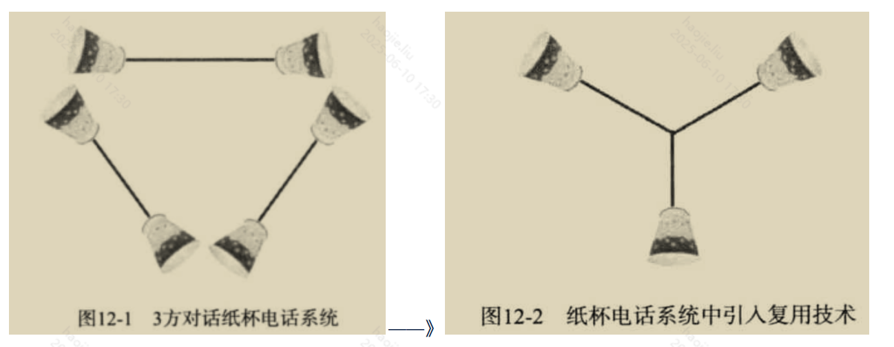
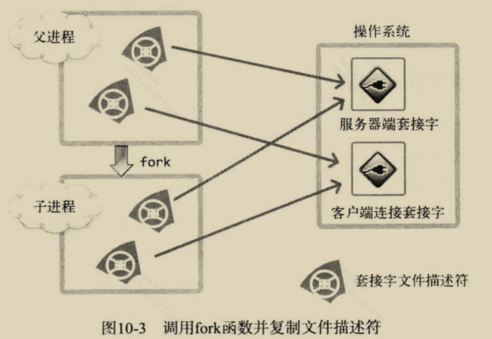
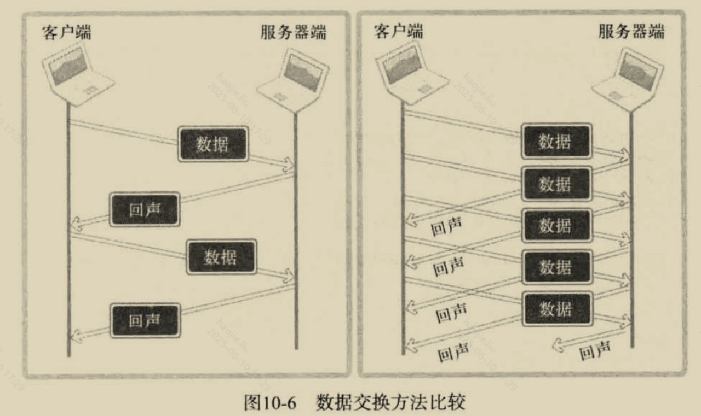
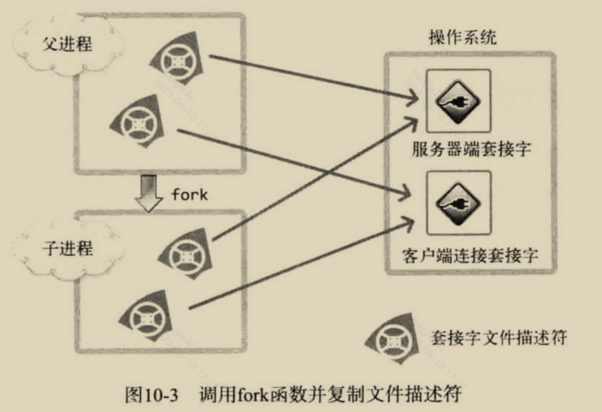
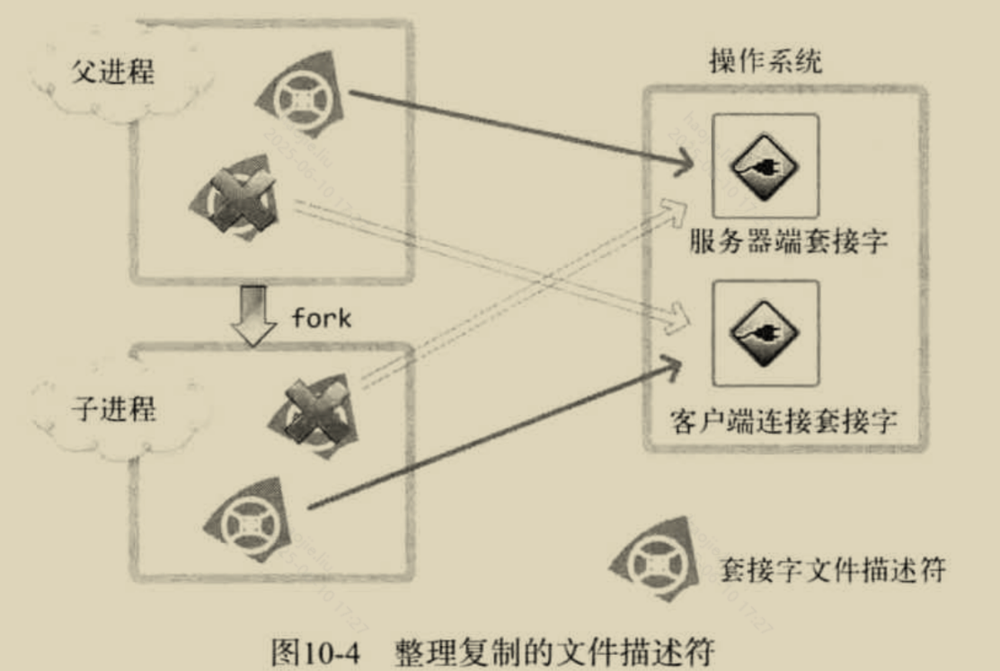
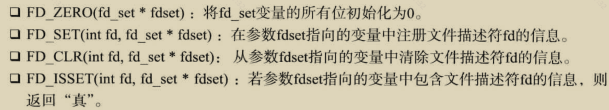
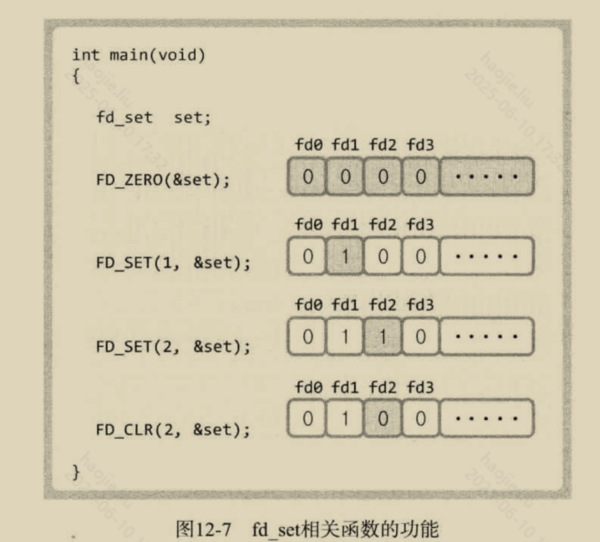
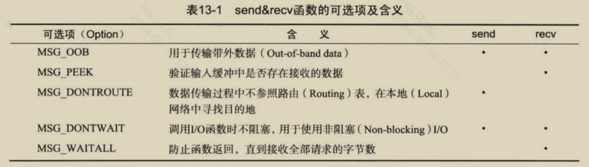

# epoll 与高性能网络
## epoll机制卡

Q: epoll 的核心数据结构和工作方式是什么？
A:
- epoll_create 创建 epoll 实例
- epoll_ctl 把 fd 注册、修改或删除到 epoll 实例
- epoll_wait 等待就绪事件
- 内核维护关注 fd 集合和就绪队列，事件发生时把就绪 fd 放入 ready list
- 应用只处理返回的就绪事件，避免每次扫描全部 fd

## LT/ET卡
Q: epoll 的水平触发 LT 和边缘触发 ET 有什么区别？
A:
- LT：只要 fd 仍处于就绪状态，epoll_wait 会反复返回该事件
- ET：只有状态从未就绪变为就绪时通知一次
- ET 模式下必须使用非阻塞 fd，并在一次事件中循环读/写直到 EAGAIN
- LT 编程简单，不容易漏事件；ET 减少重复通知，但更容易写错
- 面试表达：ET 性能潜力更高，但正确性要求也更高

## 惊群卡

Q: epoll 惊群是什么？如何缓解？
A:
- 多个线程或进程同时等待同一个监听 fd 时，一个连接到来可能唤醒多个等待者
- 只有一个能成功 accept，其余被无效唤醒，造成上下文切换浪费
- 新内核和 EPOLLEXCLUSIVE 可缓解部分场景
- 也可采用主线程 accept 后分发、SO_REUSEPORT 多监听队列等设计
- 面试边界：惊群是否严重取决于内核版本、模型和负载

## Reactor卡
Q: Reactor 网络模型是什么？
A:
- Reactor 用事件循环等待 IO 就绪事件
- 事件分发器把 accept/read/write 事件交给对应 handler
- 单 Reactor 单线程简单，但业务处理阻塞会影响所有连接
- 主从 Reactor 或多 Reactor 多线程可以把连接接受、IO 处理和业务线程池拆开
- Netty 本质上就是基于 Reactor 思想的高性能网络框架

## 性能边界卡

Q: epoll 服务端为什么仍可能性能差？
A:
- 事件循环里执行阻塞业务逻辑，导致无法及时处理其他 fd
- ET 模式没有读到 EAGAIN，导致事件丢失或连接卡住
- 写缓冲无限堆积，没有反压，导致内存膨胀
- 频繁小包写入，未做批量、缓冲或 TCP_NODELAY/Nagle 权衡
- GC、日志同步、锁竞争、下游慢调用都可能拖垮网络线程

## 正确性审查卡

Q: epoll 有哪些常见误区？
A:
- “epoll 是异步 IO”：不准确。epoll 是 IO 就绪通知，多数读写仍是同步非阻塞
- “ET 一定比 LT 好”：不一定。ET 更难写对，收益取决于场景
- “epoll_wait 返回可读就一定能读到数据”：不一定。并发读、错误、关闭都可能影响，要处理返回值
- “Reactor 线程可以直接跑耗时业务”：错误。耗时业务应投递到业务线程池或异步化
- “高性能网络只靠 epoll”：不够。协议设计、缓冲、线程模型、GC、内核参数都关键