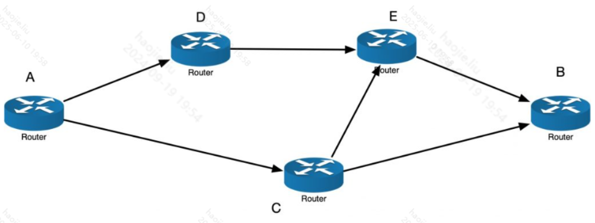
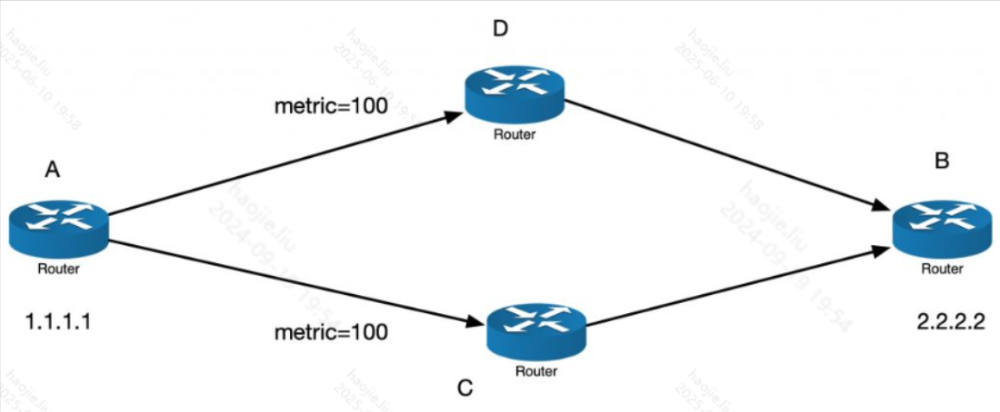
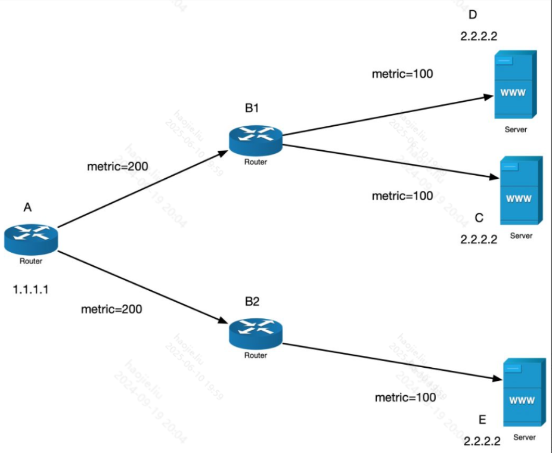
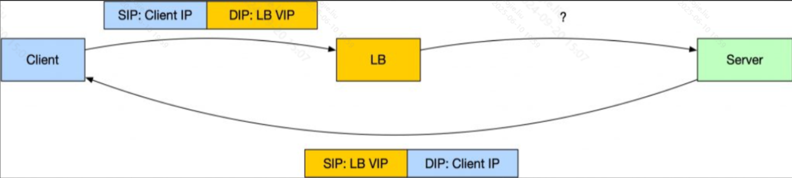
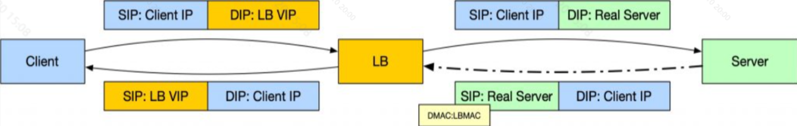
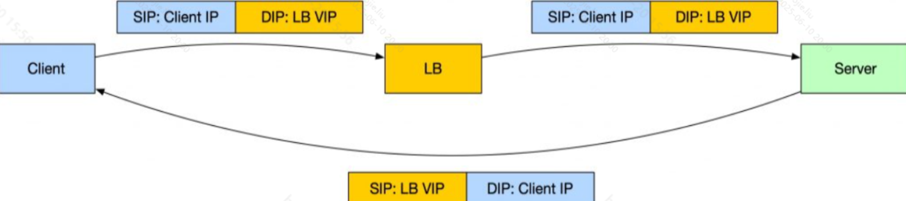
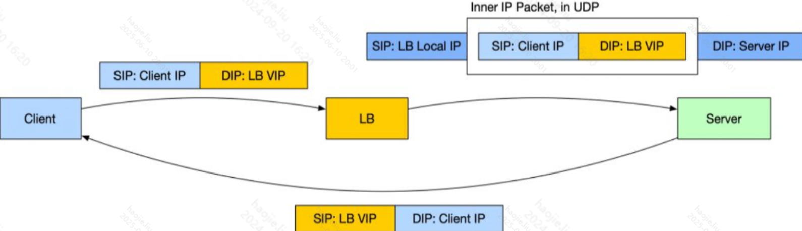

# 四层与七层负载均衡
## 核心区别卡
Q: 四层负载均衡和七层负载均衡的核心区别是什么？
A:
- 四层负载均衡工作在传输层，主要看 IP、端口和 TCP/UDP 连接信息
- 七层负载均衡工作在应用层，能理解 HTTP Host、Path、Header、Cookie 等语义
- 四层通常转发性能更高、延迟更低，对业务协议侵入小
- 七层路由能力更强，适合灰度、按路径转发、Header 路由、鉴权和限流
- 面试表达：四层更像连接级流量分发，七层更像请求级流量治理

## 选择场景卡

Q: 生产中如何选择四层负载均衡还是七层负载均衡？
A:
- 只需要把 TCP/UDP 流量分散到后端，优先考虑四层
- 需要按域名、路径、Header、Cookie、用户维度做路由，选择七层
- 高并发低延迟入口常用四层承接，后面再接七层网关做业务治理
- HTTPS 如果在 LB 终止 TLS，LB 必须具备七层能力或至少参与 TLS 卸载
- 面试边界：不是四层一定优于七层，而是性能、语义能力、运维复杂度之间取舍

## 长连接保持卡
Q: 负载均衡如何处理长连接和会话保持？
A:
- 四层常按五元组哈希，让同一连接稳定落到同一后端
- 七层可以按 Cookie、Header、用户 ID 或一致性哈希做会话保持
- 长连接场景要避免后端扩缩容导致大量连接迁移或断开
- 如果应用依赖本地会话，会话保持能缓解问题，但更推荐把状态外置到 Redis、数据库或共享存储
- 面试表达：会话保持是工程折中，不是解决状态一致性的根本方案

## 转发模式卡

Q: Full NAT、SNAT、DNAT、DSR 这些负载均衡转发模式有什么区别？
A:
- DNAT 改目标地址，把客户端请求转发到真实后端
- SNAT 改源地址，让后端响应回到负载均衡器，便于统一管理连接
- Full NAT 同时改源和目标，网络拓扑要求低，但 LB 承担完整回流压力
- DSR 让请求经 LB，响应由后端直接回客户端，回包性能高但网络和配置约束更强
- 面试边界：转发模式的关键是回包是否经过 LB，以及是否要求 LB 和后端处在特定网络拓扑中

## 高可用卡
Q: 负载均衡本身如何保证高可用？
A:
- 多实例部署，避免单个 LB 成为入口单点
- 使用健康检查剔除异常后端，并控制探测间隔、超时和失败阈值
- 入口层可用 Keepalived、VIP、BGP、DNS 或云厂商 SLB 做容灾
- 配置变更需要灰度发布，避免一次性下发错误规则导致全站故障
- 面试表达：负载均衡高可用不只是多机器，还包括健康检查、配置一致性和故障切流

## 正确性审查卡
Q: 四层/七层负载均衡有哪些常见误区？
A:
- “四层不能做任何策略”：不完整。四层也能基于连接、源地址、端口和哈希做策略
- “七层一定慢到不能用”：错误。七层成本更高，但可通过连接复用、缓存、内核优化和横向扩展支撑大流量
- “用了 LB 就不需要限流熔断”：错误。LB 解决分发，不等于解决下游保护
- “会话保持能解决所有状态问题”：错误。状态仍然绑在后端，扩缩容和故障迁移会受影响
- “DSR 一定最好”：错误。它回包性能高，但排障、网络约束和后端配置复杂度更高