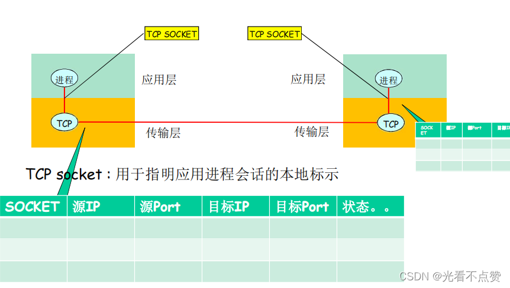
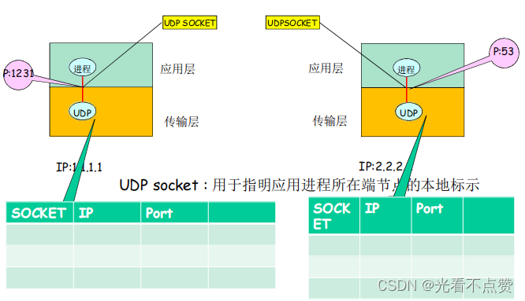
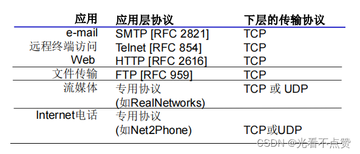
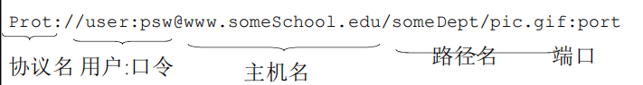
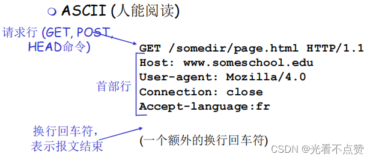
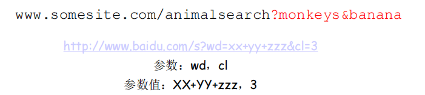
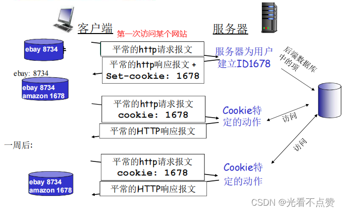
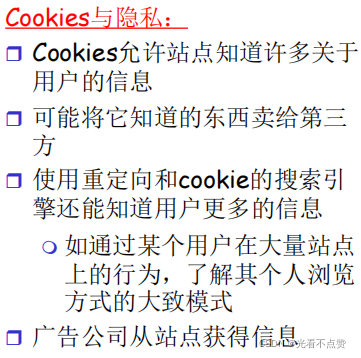

# 计算机网络 | 应用层（上）

type: Post
status: Published
date: 2022/06/30
summary: C/S模式（客户-服务器模式）
tags: 计算机网络
category: 技术分享

# 第二章 应用层

## 一、应用层协议原理

### 1.网络应用的体系结构

- C/S模式（客户-服务器模式）
- 对等模式：P2P（peer to peer）
- 混合体：上面两种模式的混合体

### 1.1 客户-服务器（C/S）体系结构

- 服务器

> 服务器一直在运行，固定的IP和端口号，数据中心进行扩展
> 
- 客户端

> 主动与服务器进行通信，与互联网有间歇性连接，可以是动态的IP地址，不直接与其他客户端通信
> 
- 缺点

> 当客户端达到一定数量时，服务器性能出现断崖式下降，因为可扩展性差
> 

### 1.2 对等体（P2P）体系结构

> 就记住一点，即每个结点都可以作为客户端或服务器，任意端系统可以通信，扩展性大大增大。例如迅雷、百度云都是此原理
> 

### 1.3 混合体

```
使用两种结构分门别类的进行:
对于文件搜索我们可以集中在服务器中进行维护，而对于文件传输就可以依靠各个结点来传输；
又或者对于及时通信，在线监测可以集中在服务器，而两个用户之间聊天就直接可以进行P2P模式来传输

```

### 2.进程通信

- 对于本地的进程

> 在本地的各种进程，是可以通过操作系统提供的管道，共享缓冲区等方式进行通信
> 
- 对于进程处于不同的主机

> 这时的进程就要靠操作系统提供的网络进行通信，并且要遵循一定的协议才可以
> 

### 2.1 分布式进程之间的通信

- **注意：在看此节之前，应先阅读第三节关于socket的讲解**

分布式进程需要解决的三个问题：

1. 进程标示和寻址问题（服务用户）
2. 传输层-应用层提供服务是如何（服务）

> 通过SAP知道位置，然后通过SAP的API（TCP/IP ：socket API）确定形式
> 
1. 如何使用传输层提供的服务，实现应用进程之间的报文交换，实现应用（用户使用服务）

> 这时就要定义应用层的协议，报文格式，解释，时序等
> 

### 2.2 问题一：对进程进行编址（addressing）

> 一个进程用IP（区别主机）+port（区别进程）标识端结点，本质来说进程之间的交互就是两个端结点构成的
> 

### 2.3 问题二：传输层提供的服务-需要穿过层间的信息、信息的代表、信息的代码

- 层间接口必须携带的信息

> 发送数据本体（SDU），发送者即由谁发来的（IP+PORT），接收方即发给谁（IP+PORT）
> 
- 将这些信息通过socket封装起来

> 如果每次发送这么发要携带除了数据本体还要这么多信息，就十分臃肿了，所以主机会在本地创建一个socket标识（TCP协议下）用于保存：（源IP,源端口，目标IP,目标端口） ，简称四元组（是一个整数），这样穿过层间接口的信息量就是最小的了（但注意到传输层依然会把这些信息加上去，我们只是减轻了层间传输的信息量），这个标识是应用层和传输层之间的约定
> 

### 2.4 问题三：如何使用传输层提供的服务实现应用

- 定义应用层协议：报文格式，解释，时序等
- 编制程序，通过API调用网络基础设施提供通信服务传报文，解析报文，实现应用时序等

### 3.socket（传输层提供给应用层的服务）

### 3.1 TCP（面向连接的协议）之上的套接字

对于使用面向连接服务（TCP）的应用而言，套接字是4元组的一个具有本地意义的标示

- 4元组：`（源IP，源port，目标IP，目标port）`
- **唯一的指定了一个会话（2个进程之间的会话关系）**
- 应用使用这个标示，与远程的应用进程通信
- 不必在每一个报文的发送都要指定这4元组
- 就像使用操作系统打开一个文件，OS返回一个文件句柄一样，以后使用这个文件句柄，而不是使用这个文件的目录名、文件名
- 简单，便于管理

### 3.1.1 操作系统之socket

需要在本地维护如下图所示的一张表




### 3.2 UDP（无连接的协议）之上的套接字

对于使用无连接服务（UDP）的应用而言，套接字是2元组的一个具有本地意义的标示

- 2元组：`（IP，port （源端指定））`
- UDP套接字指定了应用所在的一个端节点（end point）
- 在发送数据报时，采用创建好的本地套接字（标示ID），就不必在发送每个报文中指明自己所采用的ip和port
- 但是在发送报文时，必须要指定对方的ip和UDP port(另外一个段节点)，注意没有发自己的端口号哦，这就是个TCP很大的区别了，也就是说UDP只维护了接收结点的会话。
    
    > 举个生动的例子，就是寄快递我们没有写发货地址，对方也不知道
    > 

### 3.2.1 操作系统之socket



### 4.协议

> 运行在不同端系统上的应用进程如何相互交换报文，交换的报文类型：请求和应答报文、各种报文类型的语法：报文中的各个字段及其描述 、字段的语义：即字段取值的含义 、进程何时、如何发送
> 

### 5.应用需要传输层提供什么样的服务


### 5.1 常见应用对传输服务的要求


### 5.2 Internet应用及其应用层协议和传输协议



### 6.Internet 传输层提供的服务

### 6.1 TCP服务（对于端系统面向连接的服务）


### 6.2 UDP服务（无连接的服务）


### 6.2.1 UDP存在的理由

- 能够区分不同的进程，而IP服务不能

> 在IP提供的主机到主机端到端功能的基础上，区分了主机的应用进程（因为有端口号）
> 
- 无需建立连接，省去了建立连接时间，适合事务性的应用
- 不做可靠性的工作，例如检错重发，适合那些对实时性要求比较高而对正确性要求不高的应用

> 因为为了实现可靠性（准确性、保序等），必须付出时间代价（检错重发）
> 
- 没有拥塞控制和流量控制，应用能够按照设定的速度发送数据

> 而在TCP上面的应用，应用发送数据的速度和主机向网络发送的实际速度是不一致的，因为有流量控制和拥塞控制
> 

### 6.3 TCP&UDP

- 两者的共性

> 都没有进行加密、明文通过互联网传输，包括密码
> 
- 增加安全性的方式

> 在TCP之上实现SSL提供加密的TCP连接，应用通过API将明文交给socket，SSL将其加密在互联网上传输，举例当你的网址上面的HTTP是HTTPS时，这个web应用就是跑在被SSL修饰的TCP之上，浏览器和服务器之间的通信就是安全的（读者注意这里的安全与TCP协议的可靠性是两个概念，切勿搞混）
> 

## 二、Web和HTTP

==URL（通用资源定位符）格式==：我们通过URL来进行对每个对象的引用访问



### 1.HTTP概述

### 1.1 概述

HTTP（超文本传输协议），是Web的应用层协议，

**基于TCP的传输协议上**

，采用的传输模式是：客户/服务器模式；
客户：请求、接受和显示Web对象的浏览器
服务器：对请求进行响应，发送对象的Web服务器


### 1.2 大致连接过程

- 客户发起一个与服务器的TCP连接(建立套接字)，端口号为80
- 服务器接受客户的TCP连接
- 在浏览器(HTTP客户端)与Web服务器(HTTP服务器server)交换HTTP报文(应用层协议报文)
    
    > 在浏览器上接收到响应报文，然后就会解析里面的HTML在页面进行显示
    > 
- TCP连接关闭
    
    > HTTP是无状态的，服务器并不维护关于客户的任何信息
    > 

> TCP主机服务器默认维护80端口，并有一个socket作为守护socket等待请求指向本身；如果有新的客户进行请求，则会在服务器上专门在建立一个socket来维护这个连接关系，每一个新的请求亦是同理。服务器维护着请求的资源对象，这些对象通过链接可能又连接着别的服务器的对象，然后通过一系列的请求响应把页面展示出来
> 

### 2.HTTP连接

### 2.1 非持久化HTTP（HTTP1.0默认使用）

- 最多只有一个对象在TCP连接上发送
- 下教多个对象需要多个TCP连接

TCP建立连接（往返，返回的是TCP连接建立完成的信息）、HTTP建立连接（往返）、TCP断开连接


### 2.1.1 缺点

- 每个对象要2个RTT
- 操作系统必须为每个TCP连接分配资源
- 但浏览器通常打开并行TCP连接，以获取引用对象

### 2.2 持久化HTTP

- 多个对象可以在一个(在客户端和服务器之间的）TCP连接上传输

> 就是在非持久化HTTP中，当HTTP请求响应完成后不断开TCP连接
> 

### 2.2.1 非流水式持久化HTTP

- 客户端只能在收到前一个响应后才能发出新的请求
- 每个引用对象花费一个RTT

### 2.2.2 流水式持久化HTTP（HTTP1.1默认使用）

- 客户端遇到一个引用对象就立即产生一个请求
- 所有引用（小）对象只花费一个RTT是可能的

### 3.HTTP报文

### 3.1 概述

- 两种类型

> 请求、响应
> 
- HTTP请求报文
    
    
    
- HTTP响应报文

**这里解释一下`content-length`的意思，就是在服务器向TCP协议提交请求所需的对象数据时，可能是进行分段处理的，但在客户端接收时TCP是直接将报文合并起来一起响应给用户（即TCP是无边界的），这时就需要应用层自己去识别分段，信息的边界。**

**在解释一下`last-modified`的意思，就是当使用代理服务器缓存了一定数量的对象时，当源服务器中的这些对象更改时，这个标志位就起到了作用，如果你在我请求的时间已经发生更改那么就要在源服务器重发一份数据；如果在请求的时间没有更改那么直接再去代理服务器获取就好**


- HTTP通用格式
    
    
    
- 方法类型


### 3.2 提交表单输入

- Post方式

> 网页通常包括表单输入包含在实体主体(entity body )中的输入被提交到服务器
> 
- URL方式

方法:GET；输入通过请求行的URL字段上载



### 3.3 HTTP响应状态码

[大部分状态码](https://www.notion.so/%5B%E5%A4%A7%E9%83%A8%E5%88%86%E7%8A%B6%E6%80%81%E7%A0%81%5D%28https://www.jianshu.com/p/760b1b579b0f%29)

- 一些例子
    
    
    

### 4.用户-服务器状态: cookies

> 前面我们提到HTTP是无状态的协议，服务器并不维护关于客户的任何信息。那么技术日新月异，客户的需求也日渐复杂，就会出现很多需要服务器维护用户状态的情况，例如：用户短时间登录不需要二次登录，购物车的信息不会被清空等等；这时我们就引入cookie来解决这个问题，我们可以简单的理解为cookie就是服务器给我们存的一份身份证，来分辨谁是谁
> 
- 例子：
    
    
    

### 4.1 cookie的组成部分

1. 在HTTP响应报文中有一个cookie的首部行
2. 在HTTP请求报文含有一个cookie的首部行
3. 在用户端系统中保留有一个cookie文件，由用户的浏览器管理
4. 在Web站点有一个后端数据库

### 4.2 cookie的作用

- 用户验证
- 购物车
- 推荐
- 用户状态(Web e-mail)

### 4.3 简单提一嘴隐私



### 5.Web缓存（代理服务器）

作用：不访问原始服务器，就满足客户的请求

### 5.1 概述

- 用户设置浏览器：通过缓存访问Web
- 浏览器将所有的HTTP请求发给缓存

> 在缓存中的对象:缓存直接返回对象；如对象不在缓存，缓存请求原始服务器，然后再将对象返回给客户端。还是Cache那一套
> 
- 缓存既是客户端又是服务器
- 通常缓存是由工SP安装(大学、公司、居民区工SP)

### 5.2 为什么要使用web缓存

- 降低客户端的请求响应时间
- 可以大大减少一个机构内部网络与Internent接入链路上的流量
- 互联网大量采用了缓存:可以使较弱的工CP也能够有效提供内容