# 计算机网络 | 应用层（下）

type: Post
status: Published
date: 2022/07/01
summary: FTP客户端与FTP服务器通过端口21联系，并使用TCP为传输协议
tags: 计算机网络
category: 技术分享

## 三、FTP（文件传输协议）

### 1.概述图

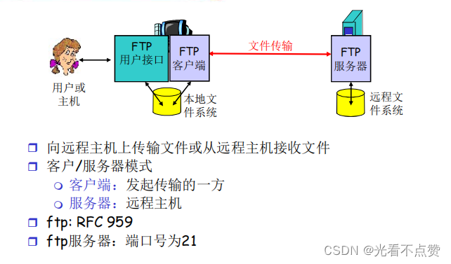

### 2.连接过程

- FTP客户端与FTP服务器通过端口21联系，**并使用TCP为传输协议**
- 客户端通过控制连接获得身份确认
- 客户湍通过控制连接发送命令浏览远程目录
- 收到一个文件传输命令时，服务器打开一个到客户端的数据连接
- 一个文件传输完成后，服务器关闭连接
- **服务器打开第二个TCP数据连接用来传输另一个文件，这个连接被我们称为 `带内`，传数据**
- **控制连接:`带外`（“ out of band"）传送，带外 传指令、控制信息**
- FTP服务器维护用户的状态信息:当前路径、用户帐户与控制连接对应
- 有状态协议

### 3.FTP命令、响应

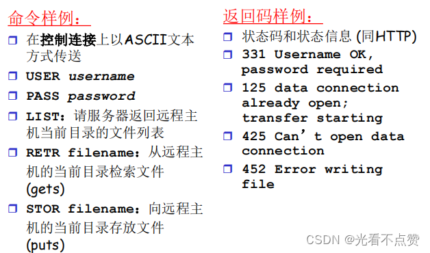

## 四、Email

- 简述一下发送邮件和收取邮件的过程

用户通过用户代理发送给响应邮件服务器，邮件服务器用过地址选取对应目标邮件服务器，这个过程是SMTP支持的，称为推
用户收取别人发送的邮件，用户代理通过HTTP查看对应邮件服务器是否有用户的邮件

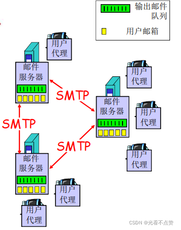

### 1.三大组成部分

- 用户代理
- 邮件服务器
- 简单邮件传输协议:SMTP

### 1.1 用户代理

> 可以类比成你在HTTP的代理是浏览器，你在FTP的代理是FTP客户端软件
> 
- 又名 “ 邮件阅读器 ”
- 撰写、编辑和阅读邮件
- 如Outlook、Foxmail
- 输出和输入邮件保存在服务器上

### 1.2 邮件服务器

- 邮箱中管理和维护发送给用户的邮件
- 输出报文队列保持待发送邮件报文
- 邮件服务器之间的SMTP协议：发送email报文
    
    > 客户：发送方邮件服务器
    服务器：接收端邮件服务器
    > 

### 1.3 SMTP

从图中可以看到就是原始SMTP协议只允许发送ASCII编码，那如果我们需要发送的媒体格式十分多样怎么办，这时我们就可以对这个协议进行扩展，即多媒体扩展（

**我们要发送中文就要使用Base64来对ASCII进行扩展，将若干个不在ASCII范围内的字节表达成更长一点在ASCII范围内的字符**

）

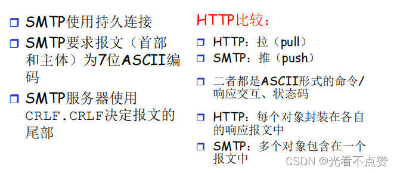

### 2.过程例子

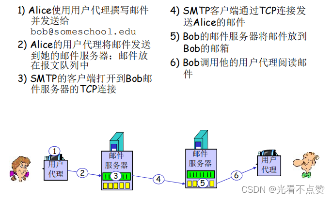

### 3.邮件访问协议

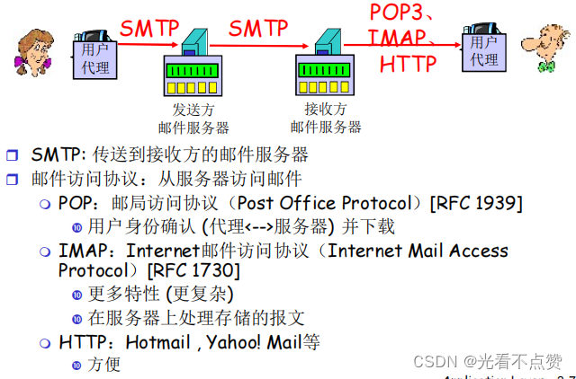

## 五、DNS（Domain Name System：域名解析系统）

==缓存是为了性能，删除是为了一致性，DNS的安全性可靠==

### 1.DNS的必要性

- IP地址标识主机、路由器，但IP地址不好记忆，不便人类使用(没有意义)
- 人类一般倾向于使用一些有意义的字符串来标识工nternet上的设备
    
    > 列如:qzheng@ustc.edu.cn所在的邮件服务器
    www.ustc.edu.cn所在的web服务器
    > 
- 存在着“字符串”—IP地址的转换的必要性
- 人类用户提供要访问机器的“字符串”名称
- 由DNS负责转换成为二进制的网络地址

**根据必要性我们提出了DNS必须解决的三个问题**

1. 如何命名设备

> 用有意义的字符串：好记，便于人类用使用；解决一个平面命名的重名问题：层次化命名
> 
1. 如何完成名字到IP地址的转换

> 分布式的数据库维护和响应名字查询
> 
1. 如何维护：增加或者删除一个域，需要在域名系统中做哪些工作

### 2.DNS的思路和目的

### 2.1 主要思路

- 分层的、基于域的命名机制
- 若干分布式的数据库完成名字到IP地址的转换
- 运行在UDP之上端口号为53的应用服务
- 核心的Internet功能，但以应用层协议实现
    
    > 在网络边缘处理复杂性
    > 

### 2.2 目的

- 实现主机名-IP地址的转换(name/IP translate)
- 其它目的
    
    > 主机别名到规范名字的转换:Host aliasing邮件服务器别名到邮件服务器的正规名字的转换: Mail server aliasing负载均衡:Load Distriblution
    > 

### 3.DNS的命名空间

！！**注意当我们再说域名的层次结构，是从前往后说，并且前面的是所属于后面的域名之下，可以理解为倒着生长的一棵树，一个根域下面有很多子域，子域下面有很多的域名，一级域名、二级域名等；例如：**

**中国教育网的域名为：[edu.cn](http://edu.cn/)；中国的域名为：cn**

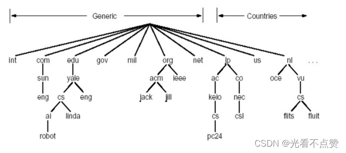

### 3.1 名字结构

- 一个层面命名设备会有很多重名
- DNS采用层次树状结构的命名方法
- Internet根被划为几百个顶级域(top lever domains)
- 通用的(generic)

> .com; .edu ; .gov ; .int ; .mil ; .net ;.org; .firm ; .hsop ; .web ; .arts ;.rec ;
> 
- 国家的(countries)

> .cn ; .us ;.nl ; .jp
> 
- 每个(子)域下面可划分为若干子域(subdomains)
- 树叶是主机

### 3.2 根的分布（中国一个都没有）

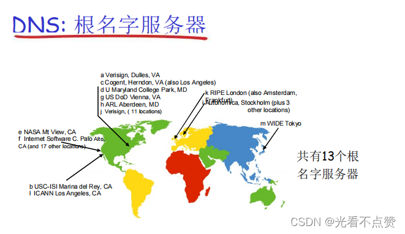

### 3.3 域名的管理

- 一个域管理其下的子域
    
    > .jp被划分为ac.jp co.jp
    .cn被划分为edu.cn com.cn
    > 
- 创建一个新的域，必须征得它所属域的同意

### 3.4 域与物理网络无关

- 域遵从组织界限，而不是物理网络
    
    > 一个域的主机可以不在一个网络
    一个网络的主机不一定在一个域
    > 
- 域的划分是逻辑的，而不是物理的

### 4.域名到实际IP的解析问题-名字服务器

### 用户上网所需的四大信息

1. **IP地址：你主机的ID**
2. **默认网关（Default Gateway）：当你想要访问别的子网的资源，需要向那个地方走**
3. **名字服务器（Local name server；DNS）：当你访问别人的域名实际上是访问这个域名所属的IP，这个映射关系谁处理**
4. **子网掩码：你所在子网的ID**

### 4.1 一个名字服务器的问题

> 即全部的域名解析工作都交给一个名字服务器来完成，这样就会造成下面的问题，而解决问题我们会采用划分区域的方式，每个区域都有一个负责的名字服务器来解析域名
> 
- 可靠性问题:单点故障
- 扩展性问题:通信容量
- 维护问题:远距离的集中式数据库

### 4.2 名字空间划分为若干区域：Zone

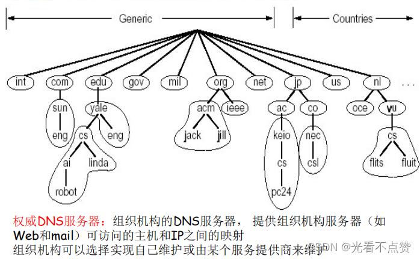

### 4.2.1 区域名字服务器维护资源记录

1. 资源记录

> 作用：维护域名-IP地址(其它)的映射关系
位置：Name Server的分布式数据库中
> 
1. RR格式

- Domain_name：域名
- ttl：time to live：生存时间(权威，缓冲记录)，**即这个映射关系是一个权威记录则是无限大的值，若为一个缓冲记录则是一个有限值，缓冲是为了加快查询效率，而到时间删除是为了一致性**
- Class类别：对于Internet，值为IN
- Value值：可以是数字，域名或ASCII串，**域名对应的IP地址**
- Type类别：资源记录的类型一见下节

### 4.2.2 RR中的Type字段

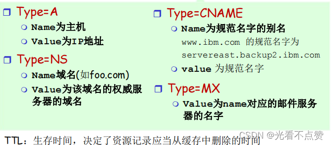

### 4.3 本地名字服务器（Local Name Server）

- 并不严格属于层次结构
- 每个工ISP(居民区的工SP、公司、大学）都有一个本地DNS服务器
    
    > 也称为“默认名字服务器”
    > 
- 当一个主机发起一个DNS查询时，查询被送到其本地DNS服务器
    
    > 起着代理的作用，将查询转发到层次结构中!!!!
    > 

### 4.4 DNS大致工作过程

- 应用调用解析器(resolver)
- 解析器作为客户向Name Server发出查询报文(封装在**UDP**段中）
- Name Server返回响应报文(name/ip)
    
    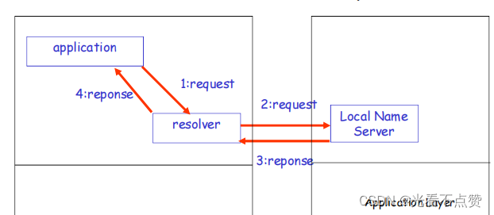
    

### 4.5 名字服务器(Name Server)

名字解析过程：

1. 目标名字在Local Name Server中

> 情况1:查询的名字在该区域内部情况2:缓存(cashing)
> 
1. 当与本地名字服务器不能解析名字时，联系根名字服务器顺着根-TLD一直找到权威名字服务器

### 4.6 解析的方法（查询工作流程）

- 三种类型DNS服务器

> 根服务器：由十三个世界各地的不同组织管理顶级域（TLD）服务器：该服务器提供权威DNS服务器的IP地址权威服务器：记录主机的名字映射为IP地址本地服务器：缓存代理
> 

解析即查询映射关系那么自然就有查询算法，这里简单提两种

### 4.6.1 递归查询

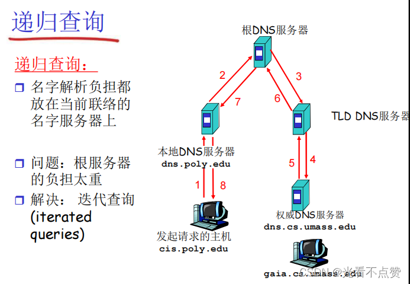

### 4.6.2 迭代查询

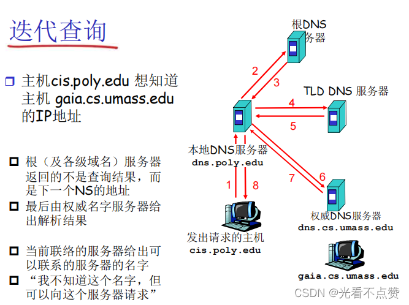

### 4.DNS协议、报文

**DNS协议：查询和响应报文的报文格式相同**

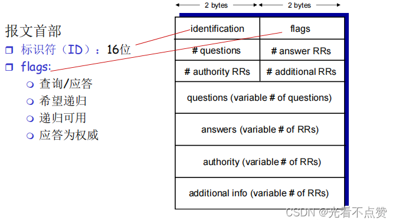

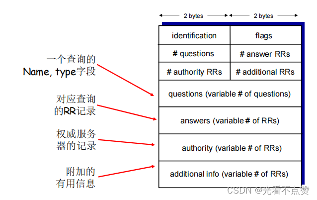

### 5.如何维护一个新增的域

- 在上级域的名字服务器中增加两条记录，指向这个新增的子域的域名和域名服务器的地址
- 在新增子域的名字服务器上运行名字服务器，负责本域的名字解析:名字->IP地址
例子:在com域中建立一个“Network Utopia”

> 到注册登记机构注册域名networkutopia.com
> 
> 1. 需要向该机构提供权威DNS服务器（基本的、和辅助的）的名字和IP地址
> 2. 登记机构在com TLD服务器中插入两条RR记录:
> `(networkutopia.com,dns1 子域的名字.networkutopia.com,NS 子域的名字服务器的名字)；(dns1.networkutopia.com 这个名字服务器对应的IP地址,212.212.212.1，A)`

> 在networkutopia.com的权威服务器中确保有
> 
> 1. 用于Web服务器的www.networkuptopia.com的类型为A的记录
> 2. 用于邮件服务器mailnetworkutopia.com的类型为MX的记录

## 六、P2P应用（下面讲的P2P都是非结构化的，结构化的可自行了解）

### 0.顺带一提：在P2P模式下文件上传需要的信息

- 文件本体
- 文件描述
    
    > 文件的描述就比如一首歌有很多不同的版本，但名字都是一样的，这时就需要描述起作用了，查询的关键字就是与描述相匹配的
    > 
- 文件的哈希值
    
    > 该文件唯一的ID标识
    > 
- 节点信息
    
    > 每个节点即使服务器也是用户，那么自然就维护着自己拥有的文件和为拥有的文件，那么怎么提高查询效率呢，可以在维护一个十分小的BitMap表，分段来用1或0表示某个文件有或没有
    > 

### 1.纯P2P架构

- 没有（或极少）一直运行的服务器
- 任意端系统都可以直接通信
- 利用peer的服务能力
- Peer节点间歇上网，每次IP地址都有可能变化

### 1.1 用处

- 文件分发(BitTorrent)
- 流媒体(KanKan)
- VoIP (Skype)

### 2.文件分发：C/S vs P2P

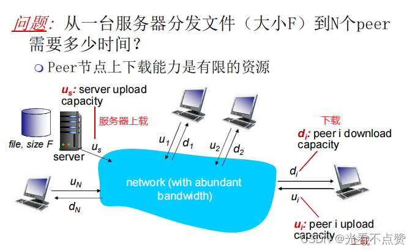

### 2.1 C/S模式

**在C/S模式中用户的上载能力是可以忽略不计的，因为每个用户都只跟同一台服务器打交道，只需要下载。当你用户达不到服务器上载的带宽时，这时瓶颈时用户的数量，但只要用户（N）一多即`US/N`这个公式中的N无限增大，那么服务器分给每个用户的服务上载带宽就十分捉襟见肘了，所以这个下载的速度将会出现断崖式的减慢**

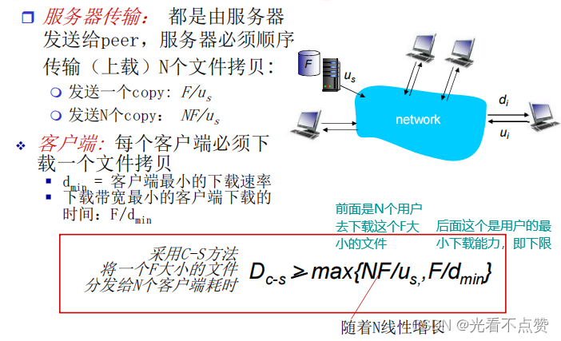

### 2.2 P2P模式

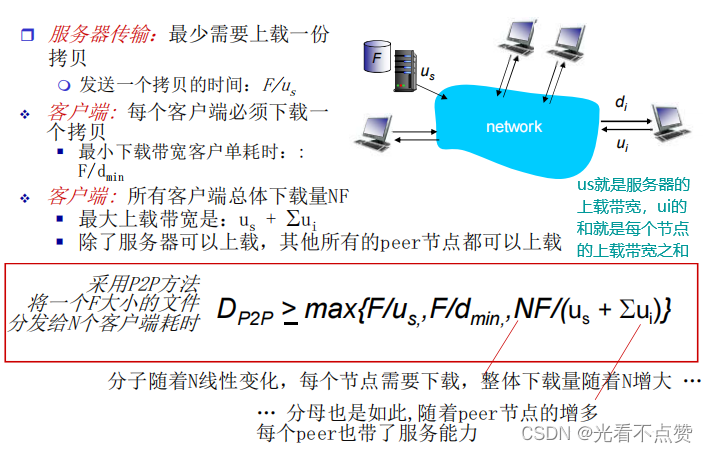

### 2.3 两者速率下限比较

**可以很明显的看到C/S模式当用户数量很多的时候，他的最小下载时间呈线性增长，而P2P则会很稳定的逐步上涨并逐渐无限接近于一个值**

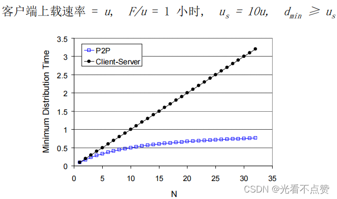

### 3.P2P文件共享的两大问题及解决方法

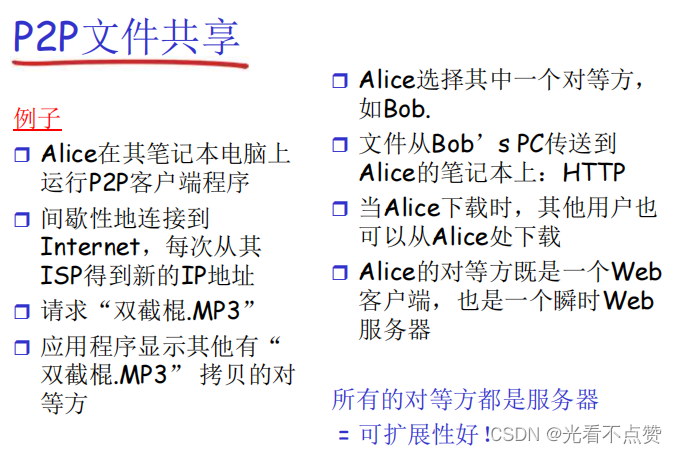

两大问题：

- 如何定位资源
- 如何处理对等待方的加入与离开

### 3.1 P2P：集中式目录

从图中可以看出对于定位资源的问题，在初代P2P模型中是用一个集中式的服务器来存储这个文件目录，当用户节点上线时都要向服务器提交一份自己的IP以及这个IP具有那些资源，所以这些信息在服务器中都是最新的

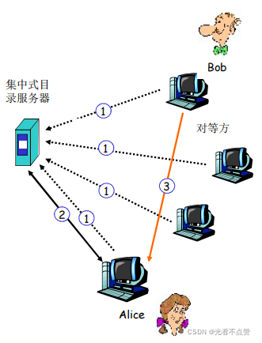

### 3.1.1 集中式目录的缺点

- 单点故障
- 性能瓶颈
- 侵犯版权
    
    > 文件传输是分散的，而定位内容则是高度集中的
    > 

### 3.2 完全分布式：Gnutella（查询泛洪）

- 全分布式：没有中心服务器
- 开放文件共享协议
- 许多Gnutella客户端实现了Gnutella协议：类似HTTP有许多的浏览器

### 3.2.1 如何构建

- 覆盖网络：图
- 如果×和Y之间有一个TCP连接，则二者之间存在一条边
- 所有活动的对等方和边就是覆盖网络
- **边并不是物理链路**
- 给定一个对等方，通常所连接的节点少于10个

### 3.2.2 查询过程

**根据泛洪的字面意思就是将想要查询的请求发送到可触及之内的所有节点（邻居），然后可触及到的节点又会向自身可触及到的节点继续发送查询请求，这样很快就能遍及全网，然后等待节点返回命中响应，这样就知道那些节点有所需的节点了，（当然肯定有结束查询请求的时候不能一直没完没了的请求啊！！）**

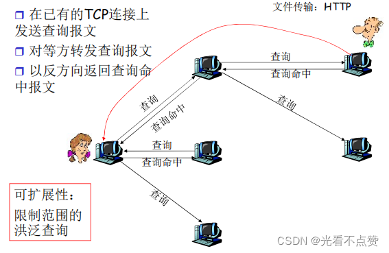

### 3.2.3 新节点的加入

1. 对等方X必须首先发现某些已经在覆盖网络中的其他对等方:使用可用对等方列表
    
    > 自己维持一张对等方列表（经常开机的对等方的IP）联系维持列表的Gnutella站点
    > 
2. X接着试图与该列表上的对等方建立TCP连接，直到与某个对等方Y建立莲接
3. X向Y发送一个Ping报文，Y转发该Ping报文
4. 所有收到Ping报文的对等方以Pong报文响应IP地址、共享文件的数量及总字节数
5. X收到许多Pong报文，然后它能建立其他TCP连接
- **注意：退出某个节点时，会将退出的位置使用网络中的某个节点进行填充，依次来保持整个图的度**

### 3.3 混合体：KaZaA（利用不匀称性）

- 每个对等方要么是一个组长，要么隶属于一个组长
    
    > 对等方与其组长之间有TCP连接；组长对之间有TCP连接
    > 
- 组长跟踪其所有的孩子的内容
- 组长与其他组长联系
    
    > 转发查询到其他组长；获得其他组长的数据拷贝
    > 

**所以后下图可知当请求的资源在组内有无时：对于组内的节点时集中式的，对于组外的节点时分布式的**

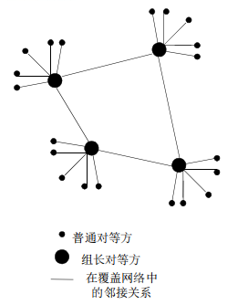

### 4.P2P下载分发过程：BitTorrent

> 对于十分稀缺的文件块会优先得到分发，同时对于优质的节点也会有资源传输时的优先级以及速率的提升，还就那个人人为我，我为人人！
> 

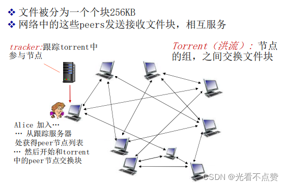

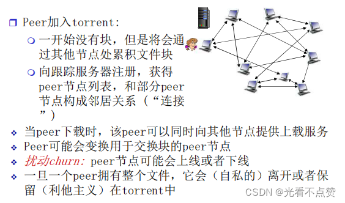

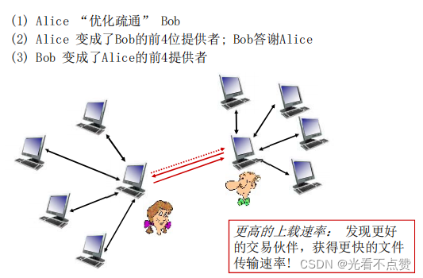

## 七、视频流化服务和CDN

### 1.为什么需要CDN（ 分布式的，应用层面的基础设施）

- 视频流量：占据着互联网大部分的带宽
- 规模性-如何服务者 ~1B 用户
    
    > 单个超级服务器无法提供服务
    > 
- 异构性
    
    > 不同的播放设备或是不同人对于清晰度的感知等等
    > 

### 2.多媒体: 视频

编码：使用图像内和图像间的冗余来降低编码的比特数

- 空间冗余(图像内)
    
    > 空间编码例子:不是发送N个相同的颜色（全部是紫色）值，仅仅发送2各值:颜色（紫色）和重复的个数(N)
    > 
- 时间冗余(相邻的图像间)
    
    > 时间编码例子:不是发送第i+1帧的全部编码，而仅仅发送和帧i差别的地方
    > 

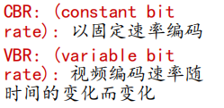

### 3.多媒体流化服务

> 可以简单粗暴的理解为边下边播
> 

### 3.1 DASH（Dynamic, Adaptive Streaming over HTTP）

### 3.1.1 对于服务器拿到一个视频文件的处理流程

- 将单个视频分成不同的清晰度版本
- 将视频文件（每个版本）分割成多个块
- 每个块独立存储，编码于不同码率（8-10种），**即对应着不同的版本**
- 告示文件`(man ifest file）`：提供存储不同块的URL（URL就是对应着不同块的位置信息）

### 3.1.2 对于客户端点开想看的视频的处理流程

- 先获取告示文件
- 周期性地测量服务器到客户端的带宽
- 查询告示文件,在一个时刻请求一个块，HTTP头部指定字节范围
    
    > 如果带宽足够，选择最大码率的视频块
    会话中的不同时刻，可以切换请求不同的编码块(取决于当时的可用带宽)
    > 

### 3.1.3 智能化的自适应客户端

- 什么时候去请求块(不至于缓存挨饿，或者溢出)
- 请求什么编码速率的视频块（当带宽够用时，请求高质量的视频块)
- 哪里去请求块(可以向离自己近的服务器发送URL，或者向高可用带宽的服务器请求)

### 3.2 遗留的问题

**服务器如何通过网络向上百万用户同时流化视频内容 (上百万视频内容)?**

> 单个的、大的超级服务中心“megaserver”，这个在日益分布式的思想出现后是绝对不会采用的通过CDN，全网部署缓存节点，存储服务内容，就近为用户提供服务，提高用户体验
> 

### 4.CDN（Content distribution networks：即内容加速服务）

CDN在互联网扮演的是一个提供代理缓冲的代理商即CDN运营商，通常ISP需要购买CDN的服务来实现用户的传输质量的提升，读者注意，**DASH服务和CDN服务是能够同时进行的，不是一个东西的两种实现方式！！！**

### 4.1 实现思路

- 全网部署`缓存节点`，存储服务内容，就近为用户提供服务，提高用户体验
- 在CDN节点中存储内容的多个拷贝
- 用户从CDN中请求内容
- 重定向（这个重定向算法当然是运营商所实现提供的）到最近的拷贝，请求内容
- 如果网络路径拥塞，可能选择不同的拷贝

### 4.2 CDN节点部署策略

1. `enter deep`：将CDN服务器深入到许多接入网
    
    > 更接近用户，数量多，离用户近，管理困难，例如采用此策略的运营商：Akamai
    > 
2. `bring home`：部署在少数(10个左右)关键位置，如将服务器簇安装于POP附近（离若干1st lSP POP较近)
    
    > 采用租用线路将服务器簇连接起来，采用此策略的运营商：Limelight
    >