# 计算机网络 | 数据链路层 & 局域网（上）

type: Post
status: Published
date: 2022/06/24
summary: 网络层解决了一个网络如何到达另外一个网络的路由问题
tags: 计算机网络
category: 技术分享

# 链路层和局域网

## 一、引论和服务

### 1.引论

### 1.1 导引

- 网络层解决了一个网络如何到达另外一个网络的路由问题
- 在一个网络内部如何由一个节点（主机或者路由器）到达另外一个相邻节点
    
    > 链路层的点到点传输层功能
    > 
- 一个子网中的若干节点是如何连接到一起的

> 点到点连接，容易实现在广域网中应用多点连接：共享型介质、通过网络交换机，比较困难实现在局域网中应用，如果在广域网（两个半球之类的城市相连）实现这个多点连接，我们需要巨大的带宽，并且伴随巨大的延迟，就会出现因为时间差发生的数据碰撞，那么前面发送的全部都功亏一篑，在广域网中使用点到点连接就不会出现这种情况，一个点的接收者永远不会变，我发的只有也只能是某个点接收，反之亦然
> 

### 1.2 数据链路层和局域网

- WAN:网络形式采用点到点链路

> 带宽大、距离远（延迟大） >带宽延迟积大如果采用多点连接方式 • 竞争方式：一旦冲突代价大； 令牌等协调方式：在其中协调节点的发送代价大
> 
- 点到点链路的链路层服务实现非常简单，封装和解封装
- LAN一般采用多点连接方式

> 连接节点非常方便接到共享型介质上（或网络交换机），就可以连接所有其他节点
> 
- 多点连接方式网络的链路层功能实现相当复杂

> 多点接入：协调各节点对共享性介质的访问和使用竞争方式：冲突之后的协调；令牌方式：令牌产生，占有和释放等
> 
- **数据链路层负责从一个节点通过链路将（帧中的）数据报发送到相邻的物理节点（一个子网内部的2节点）**

### 1.3 一些术语

- 主机和路由器是节点（网桥和交换机也是）：`nodes`
- 沿着通信路径,连接个相邻节点通信信道的是链路：`links`

> 有线链路无线链路局域网，共享性链路
> 
- 第二层协议**数据单元**帧`frame`，封装数据报

### 2.链路层: 上下文

- 数据报（分组）在不同的链路上以不同的链路协议传送：

> 第一跳链路：以太网中间链路：帧中继链路最后一跳802.11 :
> 
- 不同的链路协议提供不同的服务

> e.g.,比如在链路层上提供（或没有）可靠数据传送
> 

### 2.1 传输类比

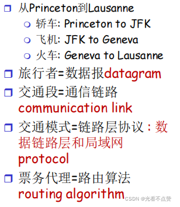

### 3.链路层服务（即需要解决的问题）

### 3.1 数据链路层的三个基本问题

> 帧定界、透明传输、差错检测
> 

### 3.2 具体

1. **成帧，链路接入**：

> 将数据报封装在帧中，加上帧头、帧尾部，其实就是封装解封装如果采用的是共享性介质，信道接入获得信道访问权在帧头部使用“MAC”（物理）地址来标示源和目的 ；不同于IP地址
> 
1. **在（一个网络内）相邻两个节点完成可靠数据传递**

> 已经学过了（第三章）在低出错率的链路上（光纤和双绞线电缆）很少使用在无线链路经常使用：出错率高
> 
1. **在相邻节点间（一个子网内）进行可靠的转发**
- 我们已经学习过（见第三章）！
- **在低差错链路（链路本身很可靠）上很少使用 （光纤,一些双绞线）：以太网**
    
    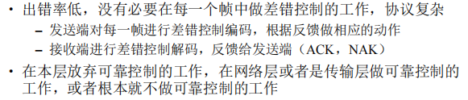
    
- **在高差错链路上需要进行可靠的数据传送：无线局域网**
    
    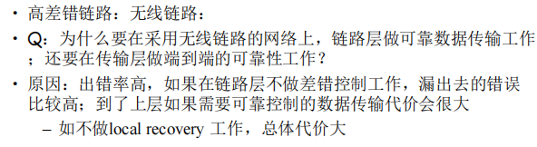
    
1. **流量控制：**

> 使得相邻的发送和接收方节点的速度匹配
> 
1. **错误检测：**

> 差错由信号衰减和噪声引起接收方检测出的错误: • 通知发送端进行重传或丢弃帧
> 
1. **差错纠正:**

> 接收端检查和纠正bit错误，不通过重传来纠正错误
> 
1. **半双工和全双工:**

> 半双工：链路可以双向传输，但一次只有一个方向
> 
- 为什么在链路层和传输层都实现了可靠性

> 一般化的链路层服务，不是所有的链路层都提供这些服务一个特定的链路层只是提供其中一部分的服务
> 

### 4.链路层在哪里实现？

- 在每一个主机上

> 也在每个路由器上交换机的每个端口上
> 
- 链路层功能在`“适配器”`上实现`(aka network interface card NIC)` 或者在一个芯片组上

> 以太网卡，802.11 网卡; 以太网芯片组实现链路层和相应的物理层功能适配器是半自治的实现了链路和物理层功能
> 
- 接到主机的系统总线上
- 硬件、软件和固件的综合体

### 4.1 适配器通信

- 发送方:

> 在帧中封装数据报加上差错控制编码，实现RDT和流量控制功能等
> 
- 接收方

> 检查有无出错，执行rdt和流量控制功能等解封装数据报，将至交给上层
> 

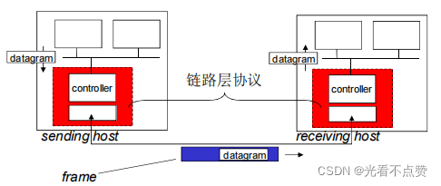

## 二、差错检测和纠正

### 1.错误检测

`EDC=差错检测和纠正位（冗余位）D =数据由差错检测保护，可以包含头部字段`

- 错误检测不是100%可靠的!
- 协议会漏检一些错误，但是很少
- 更长的EDC字段可以得到更好的检测和纠正效果
    
    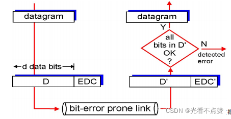
    

### 2.奇偶校验（校验位+数据位）

- ==单bit奇偶校验==：检测单个bit级错误，当出现多位跳变，是检测不出来的：**具体含义就是奇校验只能检测出奇数个位错误，而偶校验则只能检测出偶数位个错误**

> 例如100 -》 111，利用奇校验是检测不出来的，偶数个位的错误的
> 
- ==二维奇偶校验（两个校验位）==：检测和纠正单个bit错误，**就是后来的CRC校验和海明校验码**

### 3.Internet校验和

**有更简单的检查方法全部加起来看是不是全1**

- 目标:

> 检测在传输报文段时的错误（如位翻转），（注：仅仅用在传输层）
> 
- 发送方:

> 将报文段看成16-bit整 数报文段的校验和: 和 (1’的补码和)发送方将checksum的值放在‘UDP校验和’字段
> 
- 接收方:

> 计算接收到的报文段的校验和检查是否与携带校验和字段值一致： 不一致：检出错误  一致：没有检出错误，但可能还是有错误
> 

### 4.检验和：CRC（循环冗余校验）

### 4.1 概述即过程

多项式的最高次就是校验位的R位，如果多项式给的是二进制的形式则为二进制的位数-1

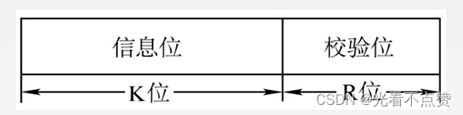

- 强大的差错检测码
- 将数据比特 D, 看成是二进制的数据
- **生成多项式G：双方协商r+1位模式（r次方）**

> 生成和检查所使用的位模式
> 
- 目标:选择r位 CRC附加位R，使得
- <D,R> 正好被 G整除 (modulo 2)
- **接收方知道 G, 将 <D,R>除以 G. 如果非0余数: 检查出错误**!
    
    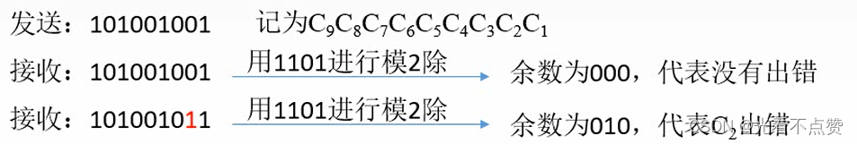
    
- 能检出所有少于r+1位的突发错误
- 实际中广泛使用（以太网、802.11 WiFi、ATM）
- 相关解释：
1. 模二运算
    
    > 每个位产生的进位忽略，产生的借位也同样忽略，即0+0=0,1+1=0，其实就是异或预算撒，相同是0不同是1
    > 
2. 位串的两种表示
    
    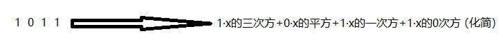
    

### 4.2 CRC 例子

1. 生成多项式（确定二进制码）
    
    > 就是用双方约定的一个串转化成另一种的表达形式这个就是多项式，次数最高的项的次数记为r
    > 
2. 移位：在D（数据位）后加上r位的冗余位，在接收方用约定的多项式整除这个D+r的串，能整除就对，否则为错，算出来的结果如果不足r位则在前面补零
    
    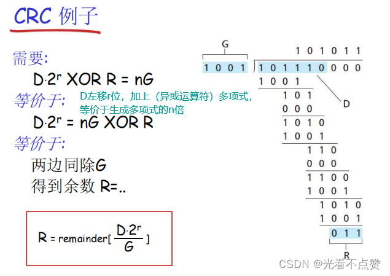
    
3. 相除

对移位后的信息码，用生成多项式进行模2除法，产生余数

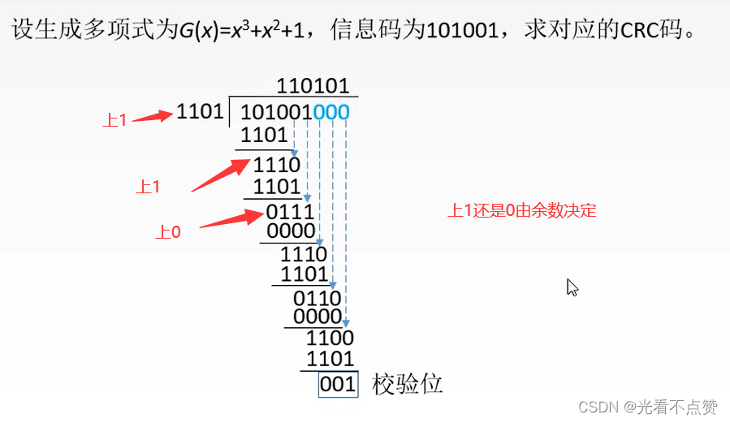

1. 得到对应的CRC码

> 信息位+校验位
> 

### 4.3 CRC性能分析

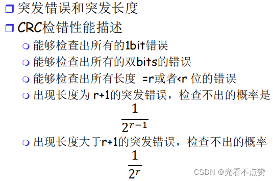

### 5.其他校验：海明校验码

- 概述

之前单个校验位，只能看到全局的情况，无法应对局部的错误，所以引入多个校验位切入局部，并且还具有纠错的能力

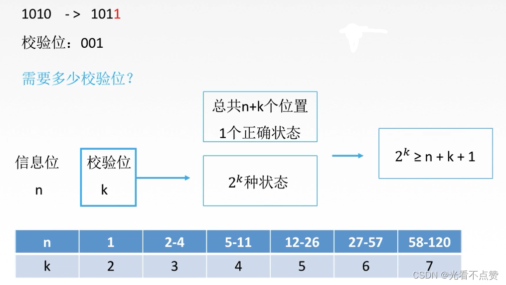

- 步骤
1. 确定海明码的位数
    
    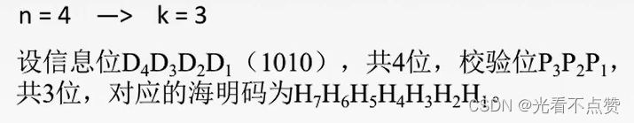
    
2. 确定海明码的分布
    
    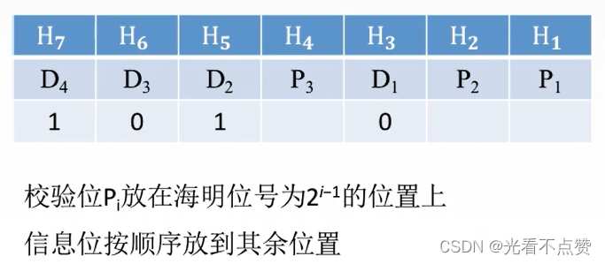
    

3.求校验位的值，并填入表格

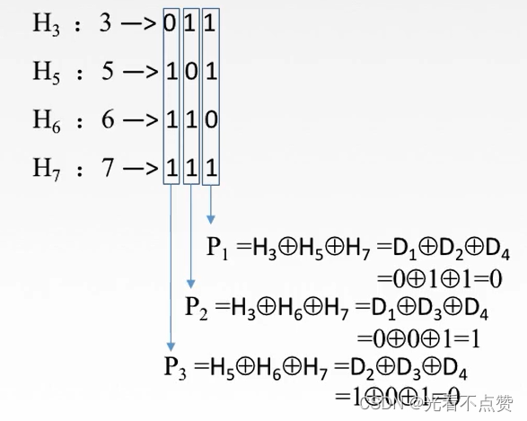

1. 纠错
    
    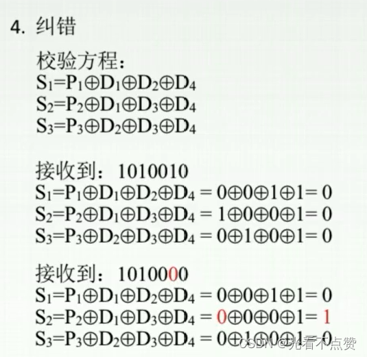
    

## 三、多点访问协议

### 1.两种类型的链路（一个子网内部链路连接形式）：

- 点对点

> 拨号访问的PPP协议以太网交换机和主机之间的点对点链路
> 
- 广播 (共享线路或媒体)即多点访问

> 传统以太网HFC上行链路802.11无线局域网
> 

### 2.多路访问协议（介质访问控制协议：MAC）

### 2.1 概述

- 单个共享的广播型链路
- 2个或更多站点同时传送: 冲突（collision）

> 多个节点在同一个时刻发送，则会收到2个或多个信号叠加
> 
- 分布式算法-决定节点如何使用共享信道，即：决定节点什么时候可以发送？
- 关于共享控制的通信必须用借助信道本身传输！

> 没有带外的信道，各节点使用其协调信道使用用于传输控制信息
> 

### 2.2 理想的多路访问协议

给定：Rbps的广播信道
必要条件：

1. 当一个节点要发送时，可以R速率发送.
2. **当M个节点要发送，每个可以以R/M的平均速率发送**
3. 完全分布的:

> 没有特殊节点协调发送没有时钟和时隙的同步
> 
1. 简单

### 3.MAC（媒体访问控制）协议

### 3.1 概述及分类

1. 信道划分

> 把信道划分成小片（时间、频率、编码）分配片给每个节点专用
> 
1. 随机访问

> 信道不划分，允许冲突冲突后恢复
> 
1. 依次轮流

> 节点依次轮流但是有很多数据传输的节点可以获得较长的信道使用权
> 

### 3.2 信道划分MAC协议

### 3.2.1 TDMA（time division multiple access）

- 轮流使用信道，信道的时间分为周期
- 每个站点使用每周期中固定的时隙(长度=帧传输时间)传输帧
- 如果站点无帧传输，时隙空闲`----->`浪费
- 如：6站LAN，1、3、4有数据报，时隙2、5、6空闲

### 3.2.2 FDMA（frequency division multiple access）

- 信道的有效频率范围被分成一个个小的频段
- 每个站点被分配一个固定的频段
- 分配给站点的频段如果没有被使用，则空闲
- 例如：6站LAN，1、3、4有数据报，频段2、5、 6空闲

### 3.2.3 码分多路访问（CDMA：code division multiple access）

- 所有站点在整个频段上同时进行传输, 采用编码原理加以区分
- 完全无冲突
- 假定:信号同步很好,线性叠加

### 3.2.4 对比

- TDM：不同的人在不同的时刻讲话
- FDM：不同的组在不同的小房间里通信
- CDMA：不同的人使用不同的语言讲话

### 3.3 随机存取协议（ALOHA协议和CSMA协议）

- 当节点有帧要发送时

> 以信道带宽的全部 R bps发送没有节点间的预先协调
> 
- 两个或更多节点同时传输，会发生➜冲突“collision”
- 随机存取协议规定:

> 如何检测冲突如何从冲突中恢复（如：通过稍后的重传）
> 
- 随机MAC协议:

> 时隙ALOHAALOHACSMA, CSMA/CD, CSMA/CA
> 

### 3.3.1 时隙（Slot又称槽）ALOHA

- 假设

> 所有帧是等长的时间被划分成相等的时隙，每个时隙可发送一帧节点只在时隙开始时发送帧节点在时钟上是同步的如果两个或多个节点在一个时隙传输，所有的站点都能检测到冲突
> 
- 运行

> 当节点获取新的帧，在下一个时隙传输传输时没有检测到冲突（如何检测冲突就看这个物理信道的频率是否为冲突时的频率），成功，节点能够在下一时隙发送新帧检测时如果检测到冲突，失败，节点在每一个随后的时隙以概率p（四种可能）重传帧直到成功
> 

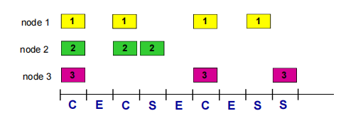

- 优点

> 节点可以以信道带宽全速连续传输高度分布：仅需要节点之间在时隙上的同步简单
> 
- 缺点

> 存在冲突，浪费时隙即使有帧要发送，仍然有可能存在空闲的时隙节点检测冲突的时间 < 帧传输的时间，必须传完需要时钟上同步
> 
- 效率

> 当有很多节点，每个节点有很多帧要发送时，x%的时隙是成功传输帧的时隙，最好情况：信道利用率37%
> 

### 3.3.2 纯ALOHA(非时隙)

- 无时隙ALOHA：简单、无须节点间在时间上同步
- 当有帧需要传输：马上传输
- 冲突的概率增加:
- 帧在t0发送，和其它在[t0-1, t0+1]区间内开始发送的帧冲突
- 和当前帧冲突的区间（其他帧在此区间开始传输）增大了一倍
    
    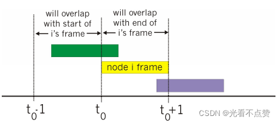
    
- 效率：效率比时隙ALOHA更差了!

### 3.3.3 CSMA(载波侦听多路访问)

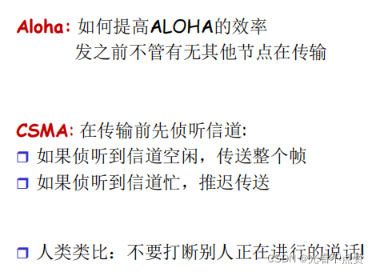

- 冲突仍然可能发生:

> 由传播延迟造成：两个节点可能侦听不到正在进行的传输
> 
- 冲突:

> 整个冲突帧的传输时间都被浪费了，是无效的传输(红黄区域)
> 
- 注意：

> 传播延迟（距离）决定了冲突的概率
> 

### 3.3.4 CSMA/CD(冲突检测)

**比ALOHA更好的性能，而且简单，廉价，分布式!**

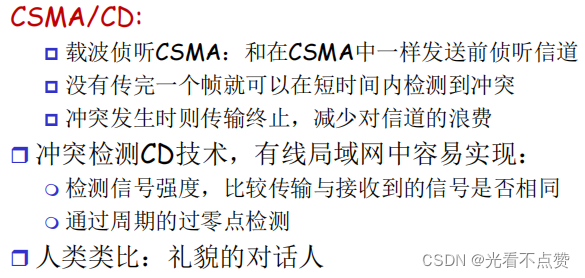

- 以太网CSMA/CD算法
    
    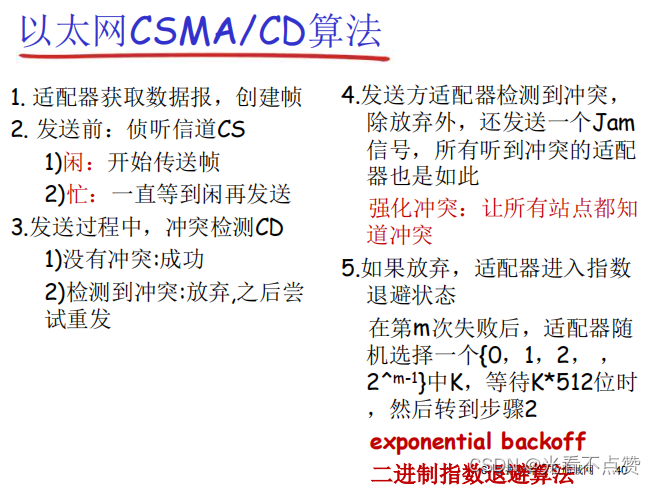
    
- 指数退避
    
    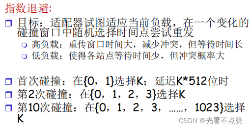
    

### 3.3.5 无线局域网 CSMA/CA

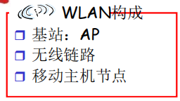

- 概述
    
    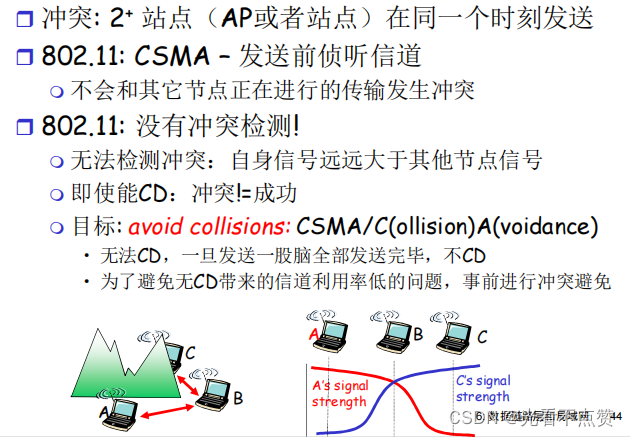
    
- 发送方和接收方
    
    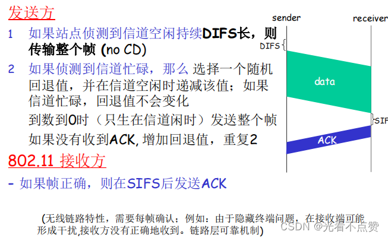
    
- IEEE 802.11 MAC 协议: CSMA/CA
    
    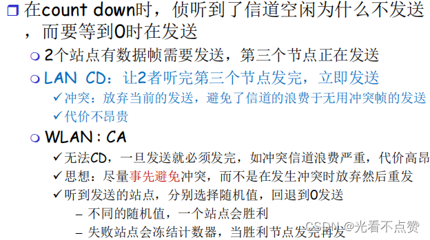
    
    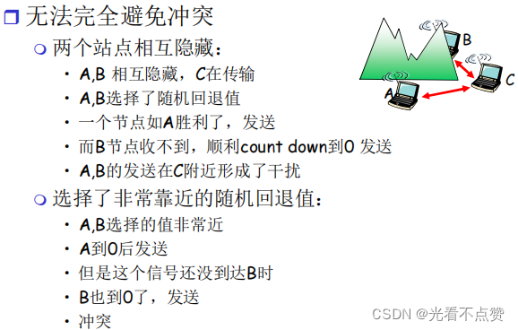
    
- 冲突避免（预约）
    
    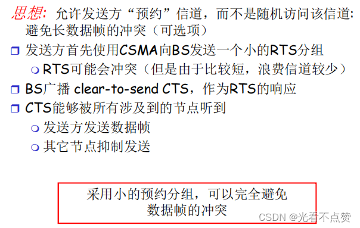
    
    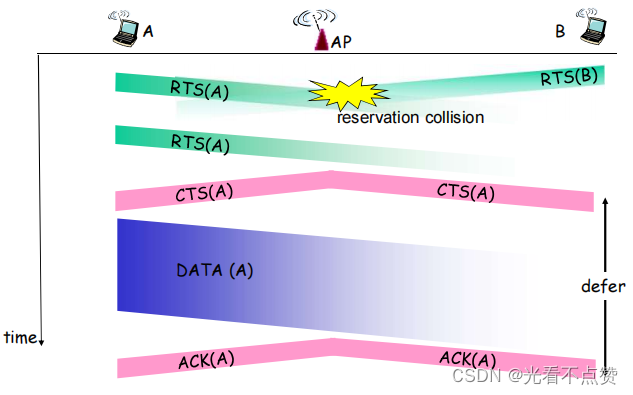
    

### 3.3.6 线缆接入网络

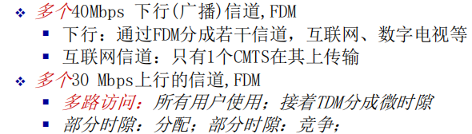

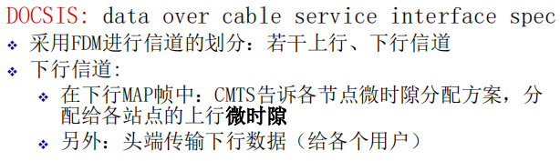

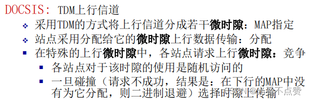

### 3.4 轮流(Taking Turns)MAC协议

### 3.4.1 与前两者的对比

有2者的优点!

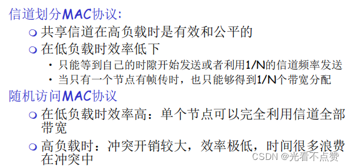

### 3.4.2 轮询

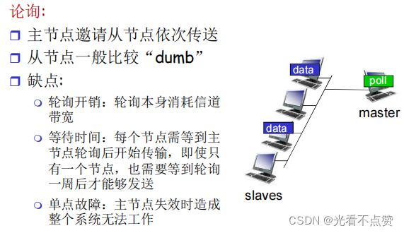

### 3.4.3 令牌传递

抓住令牌，表示自己有数据可发，将标志位置为0并且携带数据进行传输，最后回到发送者，变化标志位继续轮询等待需要者

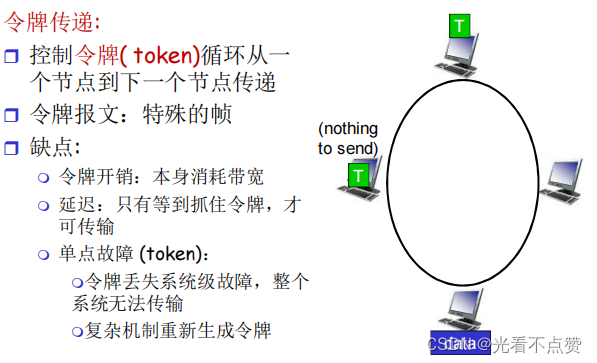

### 4.MAC 协议总结

```
有线LAN：不冲突 = 成功
```

，因为每次都会做冲突检测（CD），所以不需要数据收到后的确认

```
无线LAN：不冲突 != 成功
```

，而无线就不行了，因为没有CD，所以需要接收方发送ACK来确认

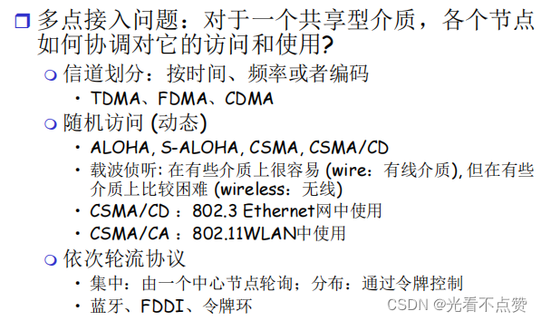