# 计算机网络 | 数据链路层 & 局域网（下）

type: Post
status: Published
date: 2022/06/25
summary: 网络层地址，如果到下一层链路层需要使用MAC地址来识别下一跳，也就是说每一层有每一层的规则，通过ARP协议来得到这个IP转化
tags: 计算机网络
category: 技术分享

## 四、 LANs

### 1.MAC 地址和ARP

### 1.1 概述

- 32bitIP地址（网络号 + 主机号）

> 网络层地址，如果到下一层链路层需要使用MAC地址来识别下一跳，也就是说每一层有每一层的规则，通过ARP协议来得到这个IP转化而来的MAC地址前n-1跳：用于使数据报到达目的IP子网最后一跳：到达子网中的目标节点
> 
- LAN（MAC/物理/以太网）地址
- **用于使帧从一个网卡传递到与其物理连接的另一个网卡(`在同一个物理网络内部`)**
- **48bit MAC地址固化在适配器的ROM，有时也可以通过软件设定**
- 理论上全球任何2个网卡的MAC地址都不相同
- 例如： 1A-2F-BB-76-09-AD
    
    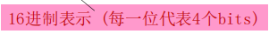
    

### 1.2 网络地址和mac地址分离（为什么不只使用一个号码代表两个地址）

### 1.2.1 IP地址和MAC地址的作用不同

- **IP地址是分层的**

> 一个子网所有站点网络号一致，路由聚集，减少路由表需要一个网络中的站点地址网络号一致，如果捆绑需要定制网卡非常麻烦希望网络层地址是配置的；IP地址完成网络到网络的交付
> 
- **mac地址是一个平面的**

> 网卡在生产时不知道被用于哪个网络，因此给网卡一个唯一的标示，用于区分一个网络内部不同的网卡即可可以完成一个物理网络内部的节点到节点的数据交付
> 

### 1.2.2 分离好处

- 网卡坏了，ip不变，可以捆绑到另外一个网卡的mac上
- 物理网络还可以除IP之外支持其他网络层协议，链路协议为任意 上层网络协议， 如IPX等

### 1.2.3 捆绑的问题

- **如果仅仅使用IP地址，不用mac地址，那么它仅支持IP协议**
- 每次上电都要重新写入网卡 IP地址；
- 另外一个选择就是不使用任何地址；不用MAC地址，则每到来一个帧都要上传到IP层次，由它判断是不是需要接受，干扰一次

### 1.3 LAN 地址和ARP

- 局域网上每个适配器都有一个唯一的LAN地址
    
    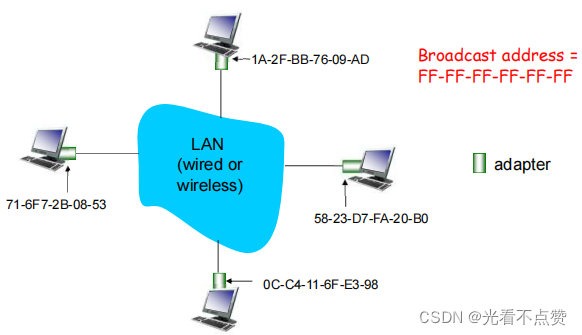
    

### 1.3.1 概述

- MAC地址由IEEE管理和分配
- 制造商购入MAC地址空间（保证唯一性）
- 类比:

> (a)MAC地址：社会安全号；(b)IP地址：通讯地址
> 
- MAC平面地址 ➜ 支持移动

> 可以将网卡到接到其它网络
> 
- IP地址有层次-不能移动

> 依赖于节点连接的IP子网，与子网的网络号相同（有与其相连的子网相同的网络前缀）
> 

### 1.4 ARP: Address Resolution Protocol

### 1.4.1 概述

- 在LAN上的每个IP节点都有一个ARP表
- ARP表：包括一些LAN节点IP/MAC地址的映射`< IP address; MAC address; TTL>`

> TTL时间是指地址映射失效的时间典型是20min，缓存20分钟，如果不需要了就删掉。即查即用
> 

### 1.4.2 例子：已知B的IP地址，如何确定B的MAC地址?前提是必须是在一个LANs（网络中）

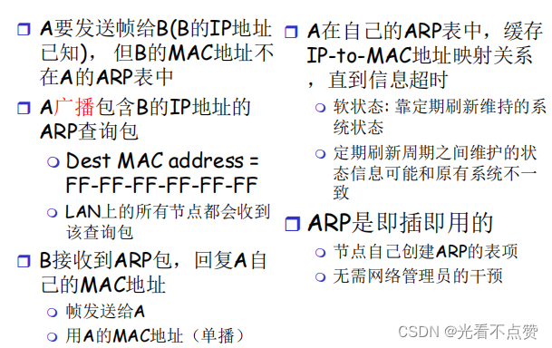

### 1.4.3 路由到其他LAN

**Walkthrough :发送数据报：由A通过R到B，假设A知道B的IP地址**

- 在R上有两个ARP表，分别对应两个LAN
- 在源主机的路由表中，发现到目标主机的下一跳时111.111.111.110
- 在源主机的ARP表中，发现其MAC地址是E6-E9-00-17-BB-4B, etc
    
    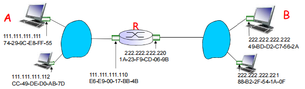
    
- A创建数据报，源IP地址：A；目标IP地址：B
- A创建一个链路层的帧，目标MAC地址是R，该帧包含A到B的IP数据报
    
    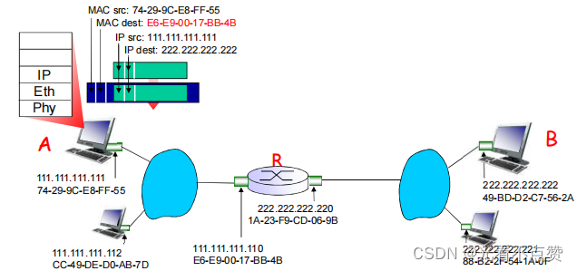
    
- 帧从A发送到R
- 帧被R接收到，从中提取出IP分组，交给上层IP协议实体
    
    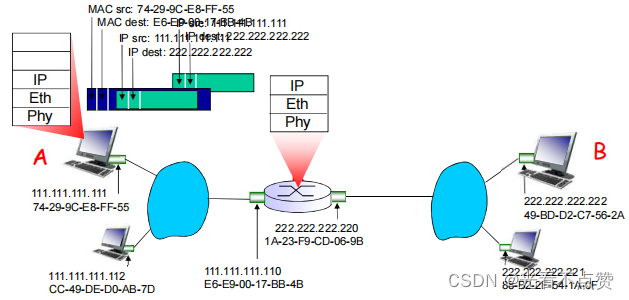
    
- R转发数据报，数据报源IP地址为A，目标IP地址为B
- R创建一个链路层的帧，目标MAC地址为B，帧中包含 A到B的IP 数据报
    
    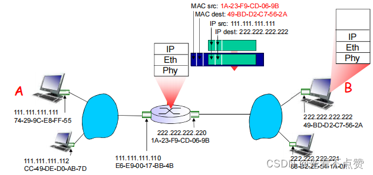
    
- R 转发数据报，源IP地址为A，目标IP地址为B
- R创建一个链路层的帧，目标MAC地址为B，帧中包含 A到B的IP 数据报
    
    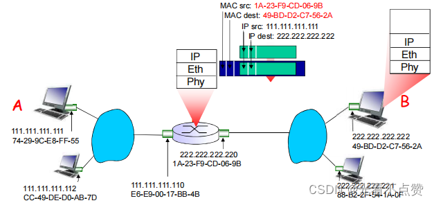
    
- R 转发数据报，源IP地址为A，目标IP地址为B
- R创建一个链路层的帧，目标MAC地址为B，帧中包含 A到B的IP 数据报
    
    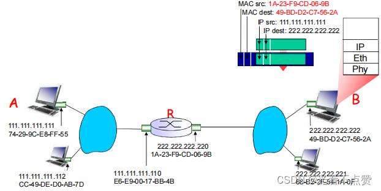
    

### 2.以太网（Ethernet）

### 2.1 概述

- 目前最主流的LAN技术：98%占有率
- 廉价：30元RMB 100Mbps！
- 最早广泛应用的LAN技术
- 比令牌网和ATM网络简单、廉价
- 带宽不断提升：10M， 100M， 1G， 10G
    
    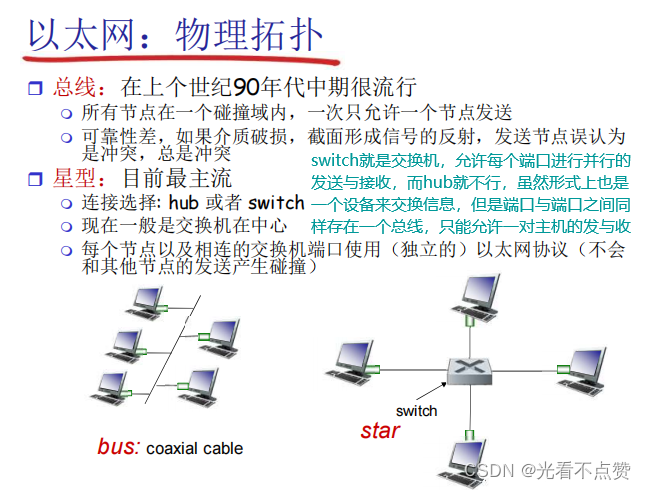
    

### 2.1.1 Hups

- 节点和HUB间的最大距离是100 m
    
    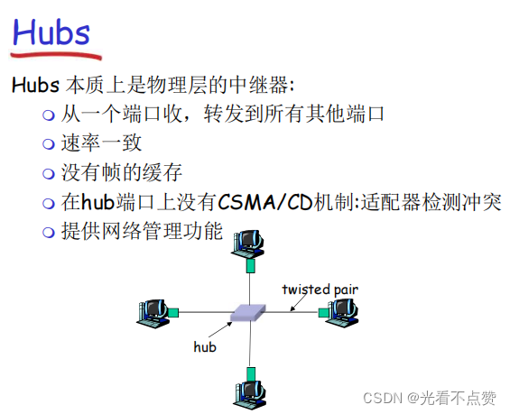
    

### 2.2 以太帧结构

- 前导码:

> 7B 10101010 + 1B 10101011用来同步接收方和发送方的时钟速率， 使得接收方将自己的时钟调到发送端的时钟， 从而可以按照发送端的时钟来接收所发送的帧
> 
- 地址：6字节源MAC地址，目标MAC地址

> 如：帧目标地址=本站MAC地址，或是广播地址，接收，递交帧中的数据到网络层否则，适配器忽略该帧
> 
- 类型：**指出高层协议（大多情况下是IP，但也支持其它网络层协议Novell IPX和AppleTalk）**
- CRC：在接收方校验

> 如果没有通过校验，丢弃错误帧
> 

- 最大长度

> 传统以太网的最大帧长是1518字节，这个数字不包括VLAN，MPLS等标签。 对应MTU就是1500，如果有多个VLAN，MPLS等标签的话，一个4字节，可以多个嵌套，具体看支持。
> 

### 2.3 以太网：无连接、不可靠的服务

> 因为以太网采用有型的物理介质传输本身就比较可靠，所以协议就不提供可靠的传输，失败丢失就重传以太网的MAC协议：采用二进制退避的CSMA/CD介质访问控制形式
> 

### 2.3.1 无连接

帧传输前，发送方和接收方之间没有握手

### 2.3.2 不可靠

接收方适配器不发送ACKs或NAKs给发送方

- 递交给网络层的数据报流可能有gap
- 如上层使用像传输层TCP协议这样的rdt，gap会被补上(源主机，TCP实体)
- 否则，应用层就会看到gap

### 2.4 802.3 以太网标准：链路和物理层

### 2.4.1 前言

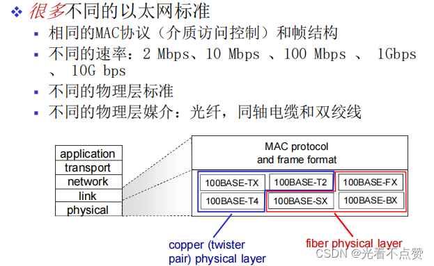

### 2.4.2 以太网使用CSMA/CD

- 没有时隙
- `NIC`如果侦听到其它NIC在发送就不发送：载波侦听`carrier sense`
- 发送时，适配器当侦听到其它适配器在发送就放弃对当前帧的发送，冲突检测`collision detection`
- 冲突后尝试重传，重传前适配器等待一个随机时间，随机访问`random access`
- **CSMA/CD算法前面再说MAC协议时已经讲到，请读者回顾**

### 2.4.3 Manchester 编码（曼彻斯特编码）

- 要传输两种信息，时钟序列和数字信号本身
- 在 10BaseT中使用
- 每一个bit的位时中间有一个信号跳变
- 允许在接收方和发送方节点之间进行时钟同步
    
    > 节点间不需要集中的和全局的时钟
    > 
- 10Mbps，使用20M带宽，效率50%，因为这个编码会把每一个数字信号都加上信号跳变
- 应用

> 在IE802.3和以太网规定必须使用改编码进行
> 

### 2.4.4 4b5b编码（改善Manchester 编码中经过编码后使用带宽翻倍的问题）

- 概述

> 字面意思就是由5个bit来代表4个bit，避免4个bit位传递相同数值，无跳变难识别，在4b5b编码讲这些冗余编码除去，使用跳变明显的形式
> 
- 图例
    
    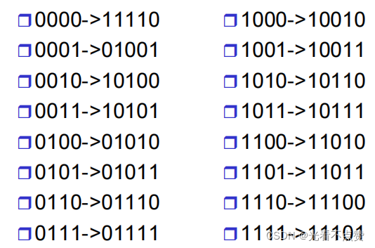
    

### 2.5 千兆以太网

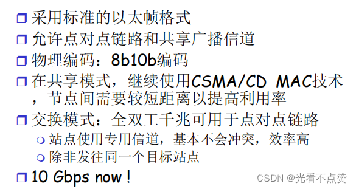

### 3.802.11WLAN和移动IP（无线网络和移动网络）

### 3.1 802.11

- 无线网络中的角色

> 无线主机：运行应用程序的端系统设备。无线链路：主机通过无线通信链路连接到一个基站或者另一台无线主机。基站：负责向与之关联的无线主机发送数据和从主机那里接收数据。
> 
- 采用的介质访问控制为随机存取中的`CSAM/CA`

> 上面讲到过，请回顾
> 
- 为什么不用`CSAM/CD`

> 在无线局域网中可能会出现隐蔽终端的可能性，导致冲突。由于衰减，无线节点信号范围有一定局限，当两个节点之间都检测不到信号，认为信道空闲时，同时向终端发送数据帧，就会导致冲突。
> 
- 802.11的帧

与以太网的十分相似，但它也包括了许多特定用于无线链路的字段

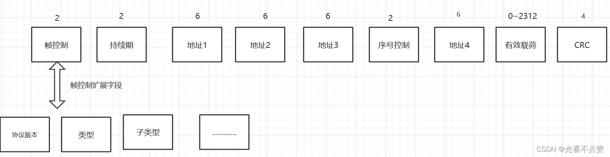

### 3.2 移动IP

- 组成角色

> ==代理发现==：移动IP定义了一个归属代理或外部代理用来向移动节点通告其服务的协议以及移动节点请求一个外部代理所使用的协议。==向归属代理注册==：移动 IP 定义了移动结点和/或外部代理向一个移动结点的归属代理注册或注销 COA 所使用的协议。==数据报的间接路由选择==：该标准也定义了数据报被一个归属代理转发给移动结点的方式，包括转发数据报使用的规则、处理差错情况的规则和几种不同的封装形式.
> 
- 流程

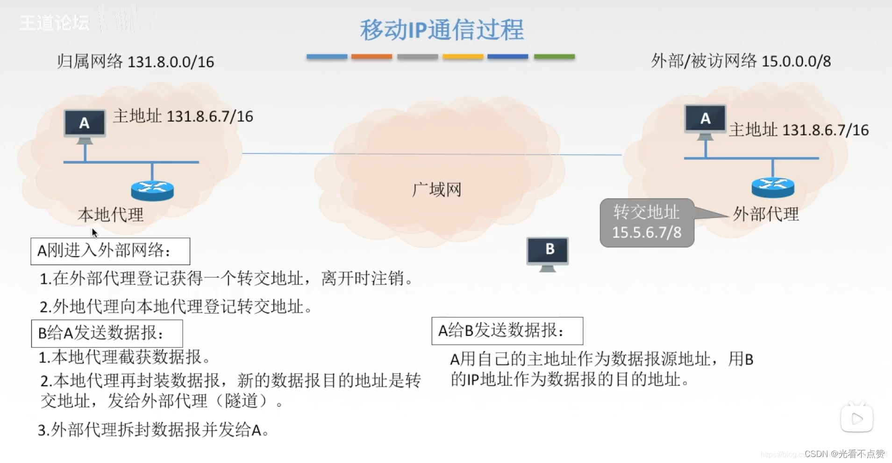

### 4.网络设备

### 4.1 Hub：集线器

- 网段(LAN segments) ：可以允许一个站点发送的网络范围 ，高级称呼：碰撞域

> 在一个碰撞域（即可以理解为在同一个盒子内的端口，如果某个端口是级联了另外一个hub，那么这个hub与上一个hub同样在一个碰撞域中），同时只允许一个站点在发送 （向所有端口发，然后匹配）如果有2个节点同时发送，则会碰撞 （所以发送前会监听信道）通常拥有相同的前缀，比IP子网更详细的前缀
> 
- 所有以hub连到一起的站点处在一个网段，处在一个碰撞域

> 骨干hub将所有网段连到了一起
> 
- 通过hub可扩展节点之间的最大距离
- 通过HUB，不能将10BaseT和100BaseT的网络连接到一起
- 理论上是一个总线型，但物理上又是一个星型
    
    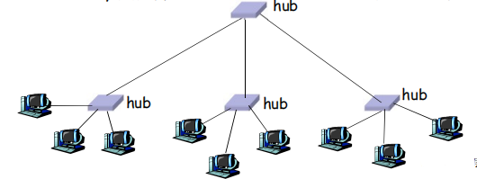
    

### 4.2 交换机

- 前言

> 为了解决hub设备在请求忙碌时期的资源浪费问题（因为同时只能有一个端口在发送，其他端口只能干瞪眼），交换机应运而生
> 

### 4.2.1 概述

- **链路层设备：扮演主动角色（端口执行以太网协议）**

> 对帧进行存储和转发对于到来的帧，检查帧头，根据目标MAC地址进行选择性转发当帧需要向某个（些）网段进行转发，需要使用CSMA/CD进行接入控制通常一个交换机端口一个独立网段
> 
- **透明：主机和路由器对交换机的存在可以不关心**

> 通过交换机相联的各节点好像这些站点是直接相联的一样有MAC地址；无IP地址
> 
- **即插即用，自学习：**

> 交换机无需配置
> 
- 也可以级联

### 4.2.2 多路同时传输

- 主机有一个专用和直接到交换机的连接
- 交换机缓存到来的帧
- 对每个帧进入的链路使用以太网协议，没有碰撞；全双工

> 每条链路都是一个独立的碰撞域MAC协议在其中的作用弱化了
> 
- 交换例子：`A-to-A’`和 `B-to-B’`可以同时传输，没有碰撞

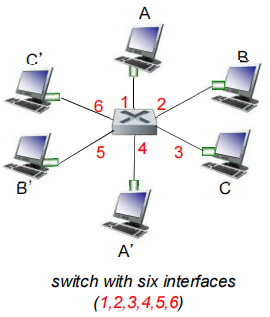

### 4.2.3 交换机转发表

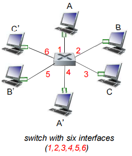

- 交换机如何知道通过接口1到达A，通过接口5到达 B’?

> 每个交换机都有一个交换表 switch table, 每个表项:  (主机的MAC地址,到达该MAC经过的接口，时戳)  比较像路由表!
> 
- 每个表项是如何创建的？如何维护的？

> 通过交换机的自学习逐渐创建而来的
> 

### 4.2.4 交换机：自学习

***交换机通过学习得到哪些主机（mac地址）可以通过哪些端口到达***

- 当接收到帧，交换机学习到发送站点所在的端口（网段）
- 记录发送方MAC地址/进入端口映射关系，在交换表中
    
    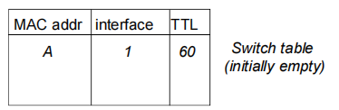
    

***自学习转发的例子***

如果泛洪（向所有端口进行转发）以后匹配到了对应端口，

**发送方和接收方是不需要二次转发并且回传帧是不需要或泛洪的，因为你已经就知道了目的地的路径并且自学习到了转发表中**

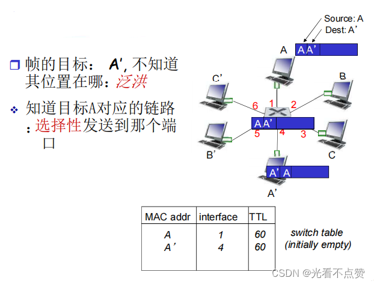

### 4.2.5 交换机：过滤／转发 / 泛洪

一个帧在发送的时候会有三种命运：

1. 过滤：就是当发出去的端口和接收的端口一样时就会选择过滤
2. 转发：最普遍的命运，知道目标MAC地址和端口的绑定关系直接进行转发就可以了
3. 泛洪：不知道目标MAC地址和端口的绑定关系则进行泛洪查找
    
    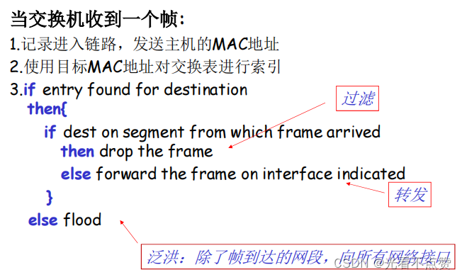
    

### 4.2.6 交换机级联及多交换自学习的例子

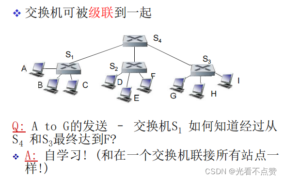

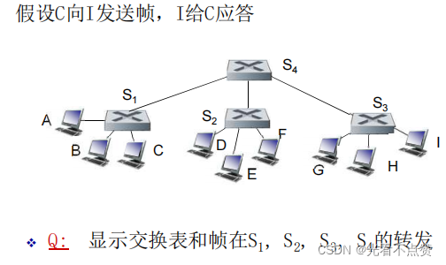

### 4.3 交换机与路由器

读者们可以了解一下交换机的生成树算法

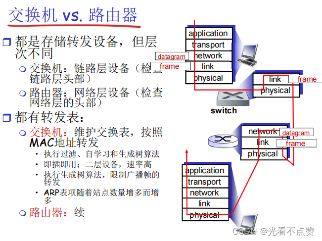

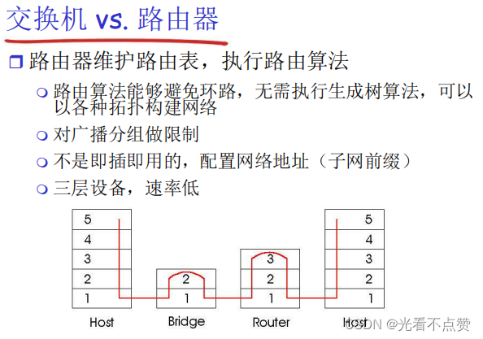

### 5.VLANS（虚拟局域网）

### 5.1 需求

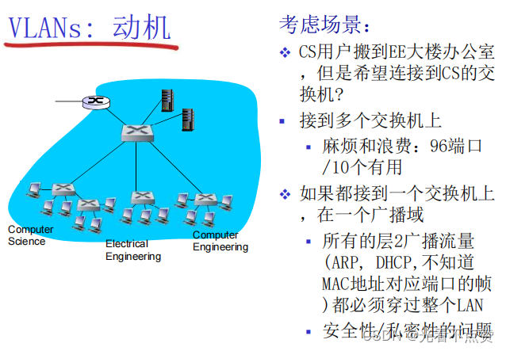

### 5.2 概述

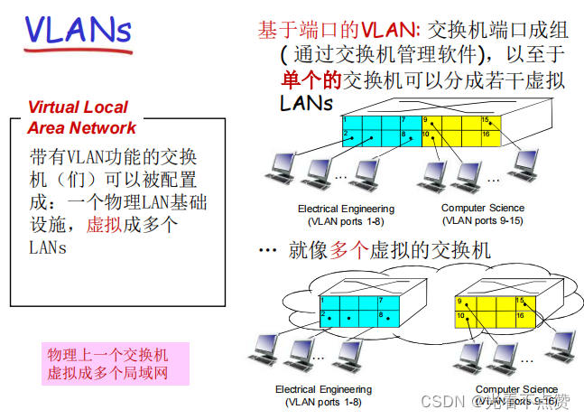