# 计算机网络 | 网络层（控制平面）

type: Post
status: Published
date: 2022/06/27
summary: 路由：按照某种指标(传输延迟,所经过的站点数目等)找到一条从源节点到目标节点的较好路径
tags: 计算机网络
category: 技术分享

# 网络层：控制平面

## 一、路由选择算法

### 1.路由

### 1.1 路由(route)的概念

- 路由：按照某种指标(传输延迟,所经过的站点数目等)找到一条从源节点到目标节点的较好路径

> 较好路径：按照某种指标较小的路径指标：站数，延迟，费用，队列长度等，或者是一些单纯指标的加权平均采用什么样的指标，表示网络使用者希望网络在什么方面表现突出，什么指标网络使用者比较重视
> 
- 以网络为单位进行路由（路由信息通告+路由计算）

> 网络为单位进行路由，路由信息传输、计算和匹配的代价低前提条件是:一个网络所有节点地址前缀相同，且物理上聚集路由就是:计算网络到其他网络如何走的问题
> 
- 网络到网络的路由=路由器-路由器之间路由

> 网络对应的路由器到其他网络对应的路由器的路由在一个网络中:路由器-主机之间的通信，链路层解决到了这个路由器就是到了这个网络
> 
- 路由选择算法(routing algorithm):网络层软件的一部分,完成路由功能

### 1.2 网络的图抽象

- 路由的输入：拓扑、边的代价、源节点
- 输出的输出：源节点的汇集树
    
    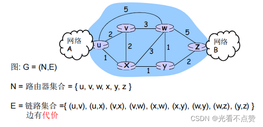
    

### 1.3 最优化原则(optimality principle)

- 汇集树(sink tree)
- 此节点到所有其它节点的最优路径形成的树
- 路由选择算法就是为所有路由器找到并使用汇集树
    
    
    
- 注意

> 这里不采用图而采用树是因为图是存在环的，当出现岔路时不好抉择，代价又一样的话就更加困难了
> 

### 1.4 路由选择算法的原则

- 正确性(correctness)：算法必须是正确的和完整的,使分组一站一站接力，正确发向目标站;完整:目标所有的站地址，在路由表中都能找到相应的表项；没有处理不了的目标站地址;
- 简单性(simplicity)：算法在计算机上应简单:最优但复杂的算法，时间上延迟很大，不实用，不应为了获取路由信息增加很多的通信量;
- 健壮性(robustness)：算法应能适应通信量和网络拓扑的变化；通信量变化，网络拓扑的变化算法能很快适应;不向很拥挤的链路发数据，不向断了的链路发送数据；`注意在某些教材上面还会翻译成鲁棒性`
- 稳定性(stability)：产生的路由不应该摇摆
- 公平性(fairness)：对每一个站点都公平
- 最优性(optimality)：某一个指标的最优，时间上，费用上，等指标，或综合指标;实际上，获取最优的结果代价较高，可以是次优的

### 1.5 路由算法分类

全局或者局部路由信息?

- 全局

> 所有的路由器拥有完整的拓扑和边的代价的信息“link state”算法
> 
- 分布式

> 路由器只知道与它有物理连接关系的邻居路由器，和到相应邻居路由器的代价值叠代地与邻居交换路由信息、计算路由信息“distance vector”算法
> 

静态或者动态的?

- 静态:

路由随时间变化缓慢

- 动态:

路由变化很快，周期性更新，根据链路代价的变化而变化。例如LS跟DV都是动态的

### 2.链路状态法：link state

### 2.0 迪杰斯特拉算法

- 概述

> 迪杰斯特拉（Dijkstra）算法是典型最短路径算法，用于计算一个节点到其他节点的最短路径。它的主要特点是以起始点为中心向外层层扩展（广度优先搜索思想），直到扩展到终点为止。
> 

### 2.1 LS路由的工作过程

- 各点通过各种渠道获得整个网络拓扑，网络中所有链路代价等信息（这部分和算法没关系，属于协议和实现）

> 就是说每个点都得到了除去自己点的所有点到邻居点的路径信息
> 
- 使用LS路由算法，计算本站点到其它站点的最优路径(汇集树)，得到路由表
- 按照此路由表转发分组(datagram方式)

> 严格意义上说不是路由的一个步骤分发到输入端口的网络层
> 

### 2.2 链路状态路由选择(link state routing)

### 2.2.1 LS路由的基本工作过程

1. 发现相邻节点,获知对方网络地址
2. 测量到相邻节点的代价(延迟,开销)
3. 组装一个LS分组,描述它到相邻节点的代价情况
4. 将分组通过扩散的方法发到所有其它路由器以上4步让每个路由器获得拓扑和边代价
5. 通过`Dijkstra`算法找出最短路径（这才是路由算法）

> 每个节点独立算出来到其他节点（路由器=网络）的最短路径迭代算法：第k步能够知道本节点到k个其他节点的最短路径
> 

### 2.2.2 发现相邻节点,获知对方网络地址

- 一个路由器上电之后，向所有线路发送HELLO分组
- 其它路由器收到HELLO分组，回送应答，在应答分组中，告知自己的名字(全局唯一)
- 在LAN中，通过广播HELLO分组，获得其它路由器的信息，可以认为引入一个人工节点

### 2.2.3 测量到相邻节点的代价(延迟,开销)

- 实测法，发送一个分组要求对方立即响应
- 回送一个ECHO分组
- 通过测量时间可以估算出延迟情况

### 2.2.4 组装一个分组,描述相邻节点的情况

- 发送者名称
- 序号，年龄
- 列表： 给出它相邻节点,和它到相邻节点的延迟

### 2.2.5 将分组通过扩散的方法发到所有其它路由器

- 顺序号:用于控制无穷的扩散,每个路由器都记录(源路由器,顺序号),发现重复的或老的就不扩散

> 具体问题1: 循环使用问题具体问题2: 路由器崩溃之后序号从0开始具体问题3:序号出现错误
> 
- 解决问题的办法：年龄字段(age)

> 生成一个分组时，年龄字段不为0每个一个时间段，AGE字段减1AGE字段为0的分组将被抛弃
> 
- 关于扩散分组的数据结构

> Source ：从哪个节点收到LS分组Seq，Age：序号,年龄Send flags：发送标记,必须向指定的哪些相邻站点转发LS分组ACK flags：本站点必须向哪些相邻站点发送应答DATA：来自source站点的LS分组  节点B的数据结构
> 

### 2.2.6 通过Dijkstra算法找出最短路径（路由算法）

- 路由器获得各站点LS分组和整个网络的拓扑
- 通过Dijkstra算法计算出到其它各路由器的最短路径(汇集树)
- 将计算结果安装到路由表中

### 2.2.7 符号标记

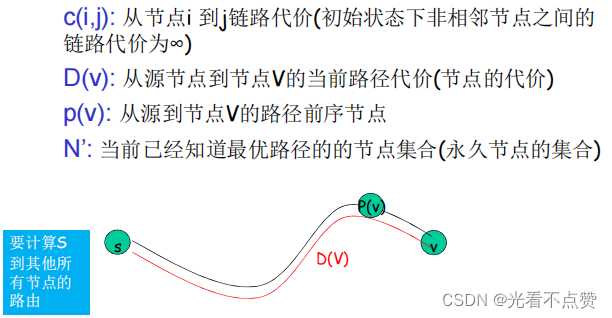

### 2.2.8 LS路由选择算法的工作原理

- 节点标记:每一个节点使用(D(v),p(v))如:(3,B)标记

> D(v)从源节点由已知最优路径到达本节点的距离P(v)前序节点来标注
> 
- 2类节点

> 临时节点(tentative node)：还没有找到从源节点到此节点的最优路径的节点永久节点(permanent node)N'：已经找到了从源节点到此节点的最优路径的节点
> 
- 初始化

> 除了源节点外,所有节点都为临时节点节点代价除了与源节点代价相邻的节点外,都为∞
> 
- 从所有临时节点中找到一个节点代价最小的临时节点,将之变成永久节点(当前节点)W
- 对此节点的所有在临时节点集合中的邻节点(V)

> 如 D(v)>D(w) + c(w,v), 则重新标注此点, (D(W)+C(W,V), W)否则，不重新标注
> 
- 开始一个新的循环

### 2.2.9 Dijkstra算法的例子

- 可能的震荡：链路代价=链路承载的流量，这时就会出现每次计算完的路径不一样
    
    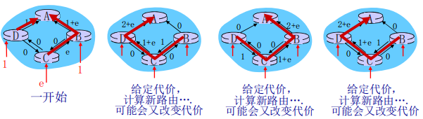
    

### 3.距离矢量路由选择：distance vector routing

### 3.0 动态规划算法

- 概述

> 由动态规划方程（策略），将每次的选择带入最终得到结果，详细可以自行查阅
> 

### 3.1 基本思路

- 各路由器维护一张路由表,结构如图(其它代价) ，维护全部的节点
    
    
    
- 各路由器与相邻路由器交换路由表(待续)
- 根据获得的路由信息,更新路由表(待续)

### 3.1.1 例子一

从图中可以看出其核心思想就是迭代的

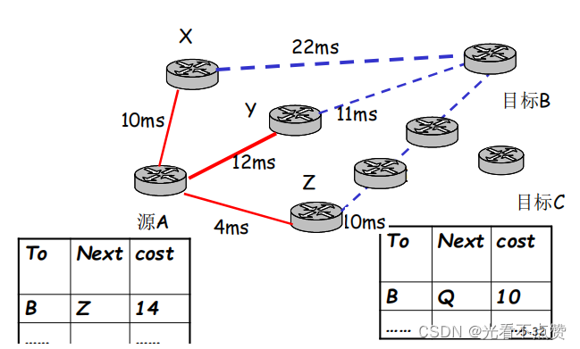

### 3.1.2 代价获得和路由信息的更新

- 代价及相邻节点间代价的获得

> 跳数(hops)， 延迟(delay)，队列长度相邻节点间代价的获得：通过实测
> 
- 路由信息的更新

> 根据实测 得到本节点A到相邻站点的代价（如:延迟）根据各相邻站点声称它们到目标站点B的代价计算出本站点A经过各相邻站点到目标站点B的代价找到一个最小的代价，和相应的下一个节点Z，到达节点B经过此节点Z，并且代价为A-Z-B的代价
> 

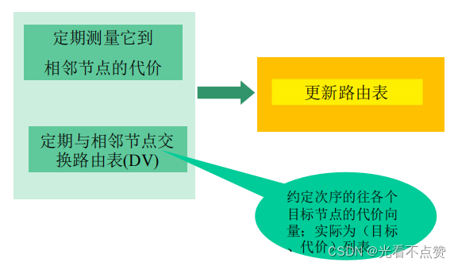

### 3.1.3 例子二

1. 以当前节点`J`为例,相邻节点`A,I,H,K`
2. `J`测得到`A,I,H,K`的延迟为`8ms,10ms,12ms,6ms`
3. 通过交换DV，从`A,I,H,K`获得到它们到G的延迟为`18ms,31ms,6ms,31ms`因此从`J`经过`A,I,H,K`到G的延迟
为`26ms,41ms,18ms, 37ms`
4. 将到`G`的路由表项更新为`18ms`,下一跳为:`H`
5. 其它目标一样，除了本节点`J`

### 3.2 距离矢量算法

- 核心思想
- 每个节点都将自己的距离矢量估计值传送给邻居，定时或者DV有变化时，让对方去算
- 当x从邻居收到DV时，自己运算，更新它自己的距离矢量 , 采用B-F equation:
`Dx(y) ← minv{c(x,v) + Dv(y)} 对于每个节点y ∊ NX往y的代价 x到邻居v代价 v声称到y的代价`
- Dx(y)估计值最终收敛于实际的最小代价值dx(y)，分布式、迭代算法
    
    
    
    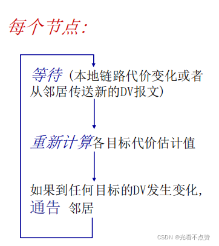
    

### 3.2.1 例子

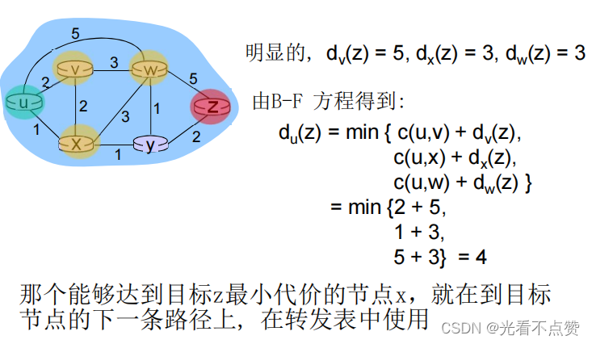

### 3.3 距离矢量路由选择(distance vector routing)

### 3.3.1 DV的无穷计算问题

- DV的特点

> 好消息传的快 坏消息传的慢
> 
- 好消息传的快

> 类似于当链路可同通过每一次的迭代更新至全网是非常容易的，已经时正向的在更新
> 
- 坏消息传的慢

> 当某一时刻起始点到某个点的链路断掉，又是因为迭代问题我们需要从头开始往后更新信息说链路断了，但是此时后面的节点到起始点的代价都是有值状态，当迭代更新到起始点的第二个节点时发现断了准备更新数值，这时第三个点告诉他兄弟我这条到起始点的路没断你就更新成我的代价把，其实这个时候由于迭代的问题后面的点压根不知道前面是断的，导致了信息错误。
> 

### 3.3.2 水平分裂(split horizon)算法解决DV的无穷计算问题

- 概述

> 类似于采用悲观锁来解决，当前面是不可达的信息，后面不知信息的节点也同样认为前面不可达，后面是可达的，然后循环到每个节点
> 

### [4.LS](http://4.ls/) 和 DV 算法的比较

## 三、因特网中自治系统内部的路由选择

### 1.RIP ( Routing Information Protocol：路由信息协议)

### 1.1 概述

- 在 1982年发布的BSD-UNIX 中实现
- Distance vector 算法

> 距离矢量:每条链路cost=1，# of hops (max = 15 hops) 跳数DV每隔30秒和邻居交换DV，通告每个通告包括：最多25个目标子网报文以UDP协议发送
> 

### 1.2 RIP通告（advertisements）

- DV：在邻居之间每30秒交换通告报文

> 定期，而且在改变路由的时候发送通告报文在对方的请求下可以发送通告报文
> 
- 每一个通告：至多AS内部的25个目标网络的DV

> 目标网络+跳数，一次公告最多25个子网，最大跳数为16
> 

### 1.3 例子

A把自己的矢量表发送给D，D得知经过A需要花费1，而从A到达Z只需要花费4，总需要5这时D就把自己的矢量表更新

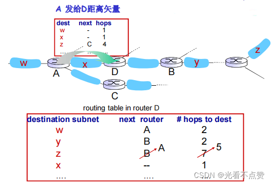

### 1.4 RIP: 链路失效和恢复

如果180秒没有收到通告信息----->邻居或者链路失效

- 发现经过这个邻居的路由已失效
- 新的通告报文会传递给邻居
- 邻居因此发出新的通告 (如果路由变化的话)
- 链路失效快速(?)地在整网中传输
- 使用毒性逆转（poison reverse）阻止ping-pong回路 (不可达的距离：跳数无限 = 16 段)

### 1.5 RIP 进程处理

- RIP以应用进程的方式实现: route-d (daemon)
- **通告报文通过UDP报文传送**，周期性重复
- 网络层的协议使用了传输层的服务，以应用层实体的方式实现
    
    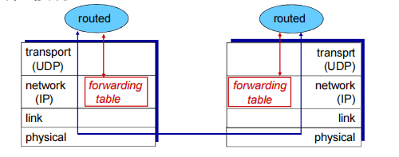
    

### 2.OSPF (Open Shortest Path First：先开最短路径)

### 2.1 概述

- `“open”`：标准可公开获得
- 使用LS算法

> LS分组在网络中（一个AS内部）分发全局网络拓扑、代价在每一个节点中都保持路由计算采用Dijkstra算法
> 
- OSPF通告信息中携带:每一个邻居路由器一个表项
- 通告信息会传遍AS全部（通过泛洪）

> 在IP数据报上直接传送OSPF报文(而不是通过UDP和TCP，这跟RIP有不同)
> 
- IS-IS路由协议:几乎和OSPF一样

### 2.2 OSPF “高级” 特性

- 安全:所有的OSPF报文都是经过认证的(防止恶意的攻击)
- 允许有多个代价相同的路径存在(在RIP协议中只有一个)
- 对于每一个链路，对于不同的TOS有多重代价矩阵

> 例如:卫星链路代价对于尽力而为的服务代价设置比较低，对实时服务代价设置的比较高支持按照不同的代价计算最优路径，如:按照时间和延迟分别计算最优路径
> 
- 对单播和多播的集成支持:

> Multicast OSPF(MOSPF)使用相同的拓扑数据库，就像在OSPF中一样
> 
- 在大型网络中支持层次性OSPF

### 2.3 层次化的OSPF路由

- 2个级别的层次性：本地，骨干

> 链路状态通告仅仅在本地区域Area范围内进行每一个节点拥有本地区域的拓扑信息;关于其他区域，知道去它的方向，通过区域边界路由器（最短路径）
> 
- 区域边界路由器：“汇总（聚集）”到自己区域内网络的距离，向其它区域边界路由器通告.
- 骨干路由器：仅仅在骨干区域内，运行OSPF路由
- 边界路由器：连接其它的AS's.
    
    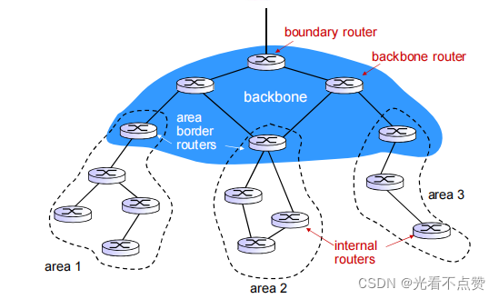
    

## 四、ISP之间的路由选择: BGP（边际网关协议）

### 1.层次路由

### 1.1 平面路由概述

- 一个网络中的所有路由器的地位一样
- 通过LS,DV，或者其他路由算法，所有路由器都要知道其他所有路由器（子网）如何走
- 所有路由器在一个平面

### 1.2 平面路由的问题

- 规模巨大的网络中，路由信息的存储、传输和计算代价巨大

> DV：距离矢量很大，且不能够收敛LS：几百万个节点的LS分组的泛洪传输，存储以及最短路径算法的计算
> 
- 管理问题:

> 不同的网络所有者希望按照自己的方式管理网络希望对外隐藏自己网络的细节当然，还希望和其它网络互联
> 

### 1.3 层次路由

### 1.3.1 层次路由：将互联网分成一个个AS(路由器区域)

- 某个区域内的路由器集合，自治系统`“autonomous systems” (AS)`
- 一个AS用AS Number（ASN) 唯一标示
- 一个ISP可能包括1个或者多个AS

### 1.3.2 路由变成了: 2个层次路由

- AS内部路由：在同一个AS内路由器运行相同的路由协议

> “intra-AS” routing protocol：内部网关协议不同的AS可能运行着不同的内部网关协议能够解决规模和管理问题如：RIP,OSPF,IGRP网关路由器：AS边缘路由器，可以连接到其他AS
> 
- AS间运行AS间路由协议

> “inter-AS” routing protocol：外部网关协议解决AS之间的路由问题，完成AS之间的互联互通
> 

### 1.4 层次路由的优点

### 1.4.1 解决了规模问题

- 内部网关协议解决：AS内部数量有限的路由器相互到达的问题, AS内部规模可控

> 如AS节点太多，可分割AS，使得AS内部的节点数量有限
> 
- AS之间的路由的规模问题

> 增加一个AS，对于AS之间的路由从总体上来说，只是增加了一个节点=子网（每个AS可以用一个点来表示）对于其他AS来说只是增加了一个表项，就是这个新增的AS如何走的问题扩展性强：规模增大，性能不会减得太多
> 

### 1.4.2 解决了管理问题

- 各个AS可以运行不同的内部网关协议
- 可以使自己网络的细节不向外透露

### 2.互联网AS间路由：BGP

- 说明

> 前面我们采用层次路由的办法来解决节点数量过多导致的效率下降问题，那么在层次路由划分为无数个AS后，这些大的AS应该采用什么协议来通信呢，这时BGP就应运而生
> 
> - **使用TCP协议报文传输**

### 2.0 BGP报文

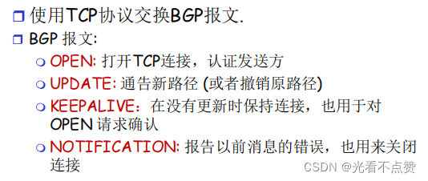

### 2.1 概述

- `BGP (Border Gateway Protocol)`：自治区域间路由协议“事实上的”标准

> “将互联网各个AS粘在一起的胶水”
> 
- BGP 提供给每个AS以以下方法：
- e（外部）BGP： 从相邻的ASes那里获得子网可达信息
- i（内部）BGP： 将获得的子网可达信息传遍到AS内部的所有路由器
    
    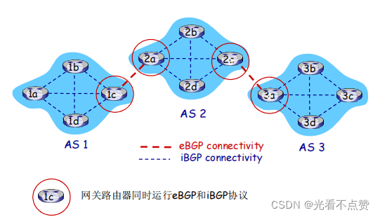
    
- 根据子网可达信息和策略来决定到达子网的“好”路径
- 允许子网向互联网其他网络通告“我在这里”
- 基于距离矢量算法（路径矢量）

> 不仅仅是距离矢量，还包括到达各个目标网络的详细路径（AS 序号的列表）能够避免简单DV算法的路由环路问题
> 

### 2.2 BGP基础

- BGP 会话： 2个BGP路由器(“peers”)在一个半永久的`TCP`连接上交换BGP报文:

> 通告向不同目标子网前缀的“路径”（BGP是一个“路径矢量”协议）
> 
- 例子
    
    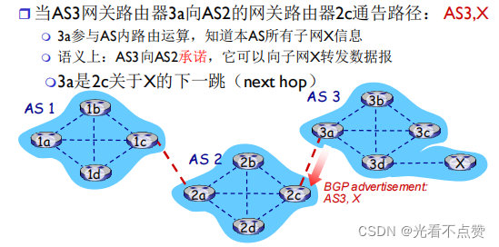
    

### 2.3 路径的属性& BGP 路由

### 2.3.1 当通告一个子网前缀时，通告包括 BGP 属性

- `prefix + attributes = “route”`

### 2.3.2 两个重要的属性

- `AS-PATH`: 前缀的通告所经过的AS列表: AS 67 AS 17

> 检测环路；多路径选择在向其它AS转发时，需要将自己的AS号加在路径上
> 
- `NEXT-HOP`: 从当前AS到下一跳AS有多个链路，在NETX-HOP属性中，告诉对方通过那个 I 转发.
- 其它属性：路由偏好指标，如何被插入的属性

### 2.3.3 基于策略的路由：

- **当一个网关路由器接收到了一个路由通告, 使用输入策略来接受或过滤（accept/decline.）**

> 过滤原因例1：不想经过某个AS，转发某些前缀的分组过滤原因例2：已经有了一条往某前缀的偏好路径
> 
- 策略也决定了是否向它别的邻居通告收到的这个路由信息

### 2.3.4 例子

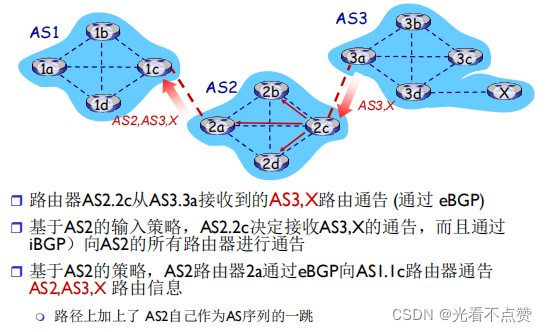

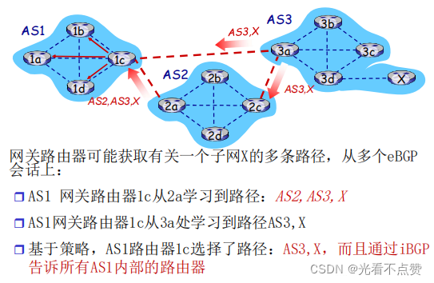

### 2.4 BGP 路径选择

- 路由器可能获得一个网络前缀的多个路径，路由器必须进行路径的选择，路由选择可以基于：

> 本地偏好值属性: 偏好策略决定最短AS-PATH ：AS的跳数最近的NEXT-HOP路由器：热土豆路由附加的判据：使用BGP标示
> 
- 一个前缀对应着多种路径，采用消除规则直到留下一条路径

### 2.4.1 热土豆策略

- 2d通过iBGP获知，它可以通过2a或者2c到达X

选择具备最小内部区域代价的网关作为往X的出口（如：2d选择2a，即使往X可能有比较多的AS跳数）：不要操心域间的代价！

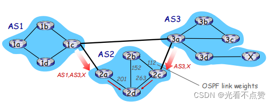

### 3.为什么内部网关协议和外部网关协议如此不同?

### 3.1 策略

- `Inter-AS（内部）`： 管理员需要控制通信路径，谁在使用它的网络进行数据传输；
- `Intra-AS（外部）`： 一个管理者，所以无需策略;

> AS内部的各子网的主机尽可能地利用资源进行快速路由
> 

### 3.2 规模

- AS间路由必须考虑规模问题，以便支持全网的数据转发
- AS内部路由规模不是一个大的问题

> 如果AS 太大，可将此AS分成小的AS；规模可控AS之间只不过多了一个点而已或者AS内部路由支持层次性，层次性路由节约了表空间, 降低了更新的数据流量
> 

### 3.3 性能

- Intra-AS： 关注性能
- Inter-AS： 策略可能比性能更重要

## 五、SDN控制平面

- 前言

> 前面我们由在第四章网络层的数据平面上来探讨过SDN，这一个是对前面内容的补充
> 

### 1.传统方式的实现

- 互联网络网络层：历史上都是通过分布式、每个路由器的实现

> 单个路由器包含了：交换设备硬件、私有路由器OS（如：思科IOS）和其上运行的互联网标准协议(IP, RIP, IS-IS, OSPF, BGP)的私有实现需要不同的中间盒来实现不同网络层功能：防火墙，负载均衡设备和NAT…
> 
- 05年以后，互联网开始重新思考这中结构的不足，寻找替代方案

### 1.1 传统方式：每-路由器(Per-router)控制平面

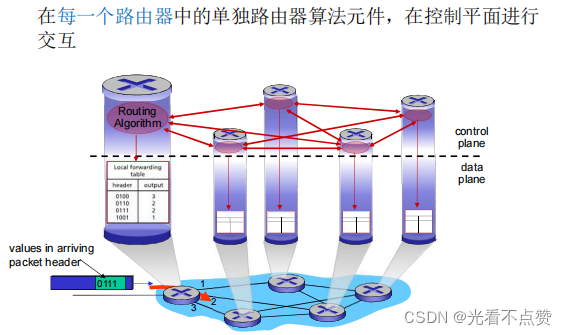

### 2.SDN方式：逻辑上集中的控制平面

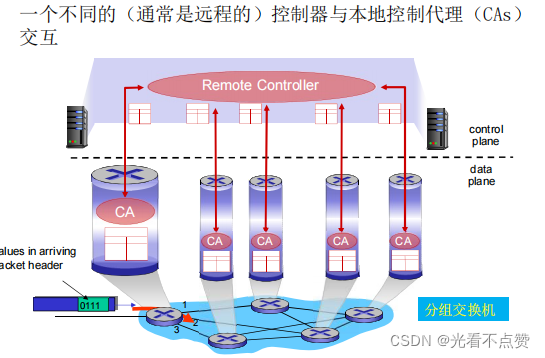

### 2.1 OpenDaylight (ODL) 控制器

- `ODL Lithium`控制器
- 网络应用可以在SDN控制内或者外面
- 服务抽象层SAL：和内部以及外部的应用以及服务进行交互

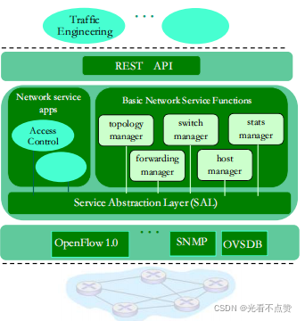

- 控制应用和控制器分离(应用app在控制器外部)
- 意图框架：服务的
- 高级规范：描述什么而不是如何
- 相当多的重点聚焦在分布式核心上，以提高服务的可靠性，性能的可扩展性
    
    
    

### 2.2 SDN: 面临的挑战

- 强化控制平面：可信、可靠、性能可扩展性、安全的分布式系统

> 对于失效的鲁棒性： 利用为控制平面可靠分布式系统的强大理论可信任，安全：从开始就进行铸造
> 
- 网络、协议满足特殊任务的需求

> e.g., 实时性，超高可靠性、超高安全性
> 
- 互联网络范围内的扩展性

> 而不是仅仅在一个AS的内部部署，全网部署
> 

## 六、ICMP: 因特网控制报文协议（Ping）和Traceroute

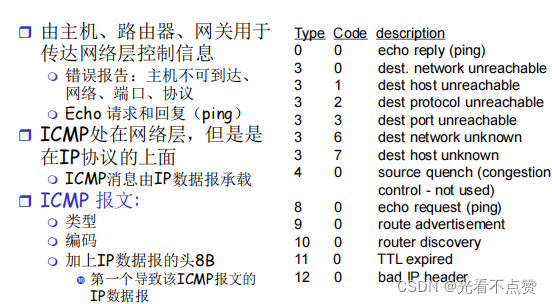

- **Traceroute程序可以让我们看到 IP 数据报从一台主机传到另一台主机所经过的路由。Traceroute程序还可以让我们使用 IP 源路由选项。Traceroute程序利用 ICMP 差错报文类型，Windows中对等的命令叫做 tracert 。**
    
    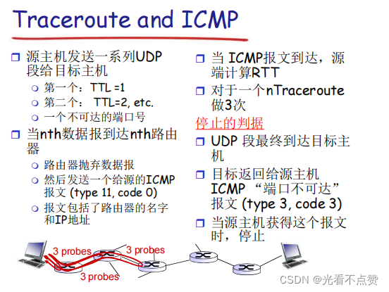
    

==为什么运行ping 127.0.0.1时，不能捕获到ICMP报文?如果运行ping 本机IP地址能收到报文吗?==：

> 因为127.0.0.1表示本机回环地址，通常利用在本机上ping此地址来检查TCP/IP协议是否安装正确。无论是ping127.0.0.1或本地IP(在Windows和Linux下)，都不能抓获到ping数据帧，亦即ping两者都是不经过网卡的，都是通过环路来处理的。并且ping 127.0.0.1和ping本机的过程是不一样的。ip输出函数先检查地址是不是环回地址:
> 
> 1. 如果是环回地址，直接交给环回驱动程序处理，返回ip输入函数。
> 2. 如果不是环回地址，检查是不是广播地址或者多播地址。
> 3. 如果不是广播或者多播地址，才检查是不是本机地址，如果是本机地址，则交给环回驱动程序处理，环回驱动程序返回给ip输入函数。
> 从上面可以看出ping 127.0.0.1数据包是不经过网卡的ping本机则是需要经过网卡的。所以运行ping 127.0.0.1时，不能捕获到ICMP报文;运行ping本机IP地址能收到报文。