# 计算机网络 | 网络层（数据平面）

type: Post
status: Published
date: 2022/06/26
summary: 在发送主机和接收主机对之间传送段（segment）
tags: 计算机网络
category: 技术分享

# 网络层：数据平面

## 一、导论

### 1.网络层服务

- 在发送主机和接收主机对之间传送段（segment）
- 在发送端将段封装到数据报中
- 在接收端，将段上交给传输层实体
- 网络层协议存在于每一个主机和路由器
- 路由器检查每一个经过它的IP数据报的头部

> 这里也就是说每一次都需要解封装（对于到目标主机的解封装来说这个规模较小）然后封装发送
> 

### 2.网络层的关键功能（两者相互配合完成数据传输）

- 转发（局部概念）

> 将分组从路由器的输入接口转发到合适的输出接口，你可以理解为通过单个路口的过程
> 
- 路由（全局概念）

> 使用路由算法来决定分组从发送主机到目标接收主机的路径路由分别实现为选择算法和路由选择协议。你可以理解为从源到目的的路由路径规划过程
> 

### 3.数据平面、控制平面

SDN（software-defined networking ）：来了分组后，分组所在的帧和分组本身的所有字段提取出来与交换机的维护的流表（由专门的网络操作系统算出来）中的字段相匹配，对匹配得到的结果进行操作，**可以进行转发或者阻止或者泛洪或者字段修改**

### 3.1 数据平面（该怎么转发，某个数据这个口进来那个口出去）

- 本地，每个路由器功能
- 决定从路由器输入端口到达的分组如何转发到输出端口
- 转发功能：

> 传统方式：基于目标地址+转发表
SDN（software-defined networking ）方式：基于多个字段+流表
> 

### 3.2 控制平面（该怎么走）

- 网络范围内的逻辑
- 决定数据报如何在路由器之间路由，决定数据报从源到目标主机之间的端到端路径
- 2个控制平面方法:

> 传统的路由算法: 在路由器中被实现
SDN（software-defined networking ）: 在远程的服务器中实现
> 

### 3.3 传统方式

- 控制平面

> 对于控制平面来说需要在每个路由器上都有一个独立的算法元件，进行交互
> 
- 路由和转发的相互作用
    
    
    
- 缺点

> 由于传统方式下路由器的各种协议和算法都是固定的，所做的动作也只能是转发，而且路由的物理位置又是分布的，当我们需要新的功能或者协议算法等时进行升级换代是非常困难的工作量巨大
> 

### 3.4 SDN方式

- 逻辑集中的控制平面
    
    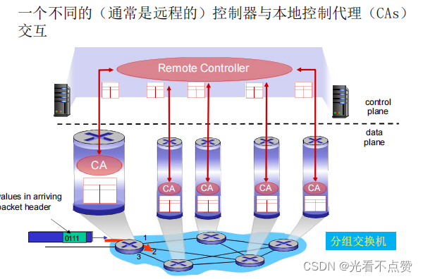
    
- 优点

> 可以看到完美解决了传统方式所造成的的困难，虽然控制器的物理位置还是分布式的，但是对于管理时集中的，当需要改协议或者算法，对控制中心的流表进行相对应的修改然后下放到每个控制器中，这样就得到了更新
> 

### 4.网络服务模型

- 对于单个数据报的服务：
    
    > 可靠传送，延迟保证，如：少于40ms的延迟
    > 
- 对于数据报流的服务：
    
    > 保序数据报传送，保证流的最小带宽，分组之间的延迟差
    > 

### 4.1 连接建立

- 在某些网络架构中是第三个重要的功能

> ATM,frame relay,X.25
> 
- 在分组传输之前，在两个主机之间，在通过一些路由器所构成的路径上建立一个网络层连接

> 涉及到路由器
> 
- 网络层和传输层连接服务区别：

> 网络层:在2个主机之间，涉及到路径上的一些路由器------------》有连接传输层:在2个进程之间，很可能只体现在端系统上(TCP连接)-------------》面向连接
> 

### 4.2网络服务模型与网络各种架构的组合提供的服务

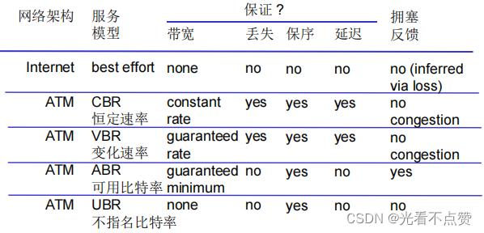

## 二、路由器组成

### 1.路由器结构概述

### 1.1 高层面（十分简化的）通用路由体系结构

- 路由：运行**路由**选择算法／协议 (RIP, OSPF, BGP)-生成路由表
- 转发：从输入到输出链路交换数据报-根据路由表进行分组的**转发**
    
    
    

### 2.输入输出端口

- 前言

> 在介绍输入输出端口时看似物理上是有各自的元件，实际上这个两个端口在物理上能集成一个端口来进行操作，一试两角
> 

### 2.1 交换结构

- 将分组从输入缓冲区传输到合适的输出端口
- 交换速率：分组可以按照该速率从输入传输到输出

> 运行速度经常是输入/输出链路速率的若干倍N个输入端口:交换机构的交换速度是输入线路速度的N倍比较理想，才不会成为瓶颈
> 
- **3种典型的交换机构（通过内存交换、通过总线交换、通过互联网（crossbar）交换）**
    
    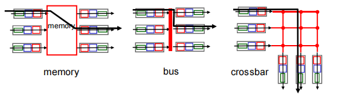
    

### 2.2 输入端口（将物理信号转化成数字信号）

### 2.2.1 功能及缓存

- 当交换机构的速率小于输入端口的汇聚速率时→在输入端口可能要排队，这时就需要在输入端口处有一个队列（同理是队列就会操作数据的丢失），来控制不同输入端口发送到同一个输出端口时的竞争问题
    
    
    
    > 排队延迟以及由于输入缓存溢出造成丢失!
    > 
- Head-of-the-Line (HOL) blocking：排在队头的数据报阻止了队列中其他数据报向前移动

### 2.2.2 通过内存交换

- 在CPU直接控制下的交换，采用传统的计算机
- 分组被拷贝到系统内存，CPU从分组的头部提取出目标地址，查找转发表，找到对应的输出端口，拷贝到输出端口
- 转发速率被内存的带宽限制(数据报通过BUS两遍)
- 一次只能转发一个分组

### 2.2.3 通过总线交换

- 数据报通过共享总线，从输入端口转发到输出端口
- 总线竞争：交换速度受限于总线带宽
- 1次处理一个分组
- 16bps bus, Cisco 1900;32bps bus,Cisco 5600;对于接入或企业级路由器，速度足够（但不适合区域或骨干网络）

### 2.2.4 通过互联网络(crossbar等)的交换

- 同时并发转发多个分组，克服总线带宽限制
- Banyan（榕树）网络，crossbar(纵横)和其它的互联网络被开发，将多个处理器连接成多处理器
- 当分组从端口A到达，转给端口y;控制器短接相应的两个总线
- 高级设计：将数据报分片为固定长度的信元，通过交换网络交换
- Cisco12000：以60Gbps的交换速率通过互联网络

### 2.3 输出端口（将数字信号转化成物理信息什么光信号电信号等等）

### 2.3.1 功能概述

可以看到也是存在端口缓存来应对速度不一致的问题，同时先来队列的也不一定先转发，存在优先级调度的问题

- 输出端口排队
- 假设交换速率Rswitch是Rine的N倍（N:输入端口的数量）
- 当多个输入端口同时向输出端口发送时，缓冲该分组（当通过交换网络到达的速率超过输出速率则缓存）
- **排队带来延迟，由于输出端口缓存溢出则丢弃数据报！**
    
    
    

### 2.3.2 调度机制

- FIFO（先进先出调度）：按照分组带来的次序发送

> 如果此时新的分组带来的时候队列是满的，队列会有三个策略来抛弃：
1.tail drop: 丢弃刚到达的分组
2.priority: 根据优先权丢失/移除分组
3.random: 随机地丢弃/移除
> 
- 优先权调度：发送最高优先权的分组

> 不同种类的分组有不同的优先级
> 
- Round Robin (RR：循环调度)：循环扫描不同类型的队列, 发送完一类的一个分组，再发送下一个类的一个分组，循环所有类
- Weighted Fair Queuing (WFQ：加权公平调度)：在一段时间内，每个队列得到的服务时间是：`Wi/(XIGMA(Wi)) *t`，和权重成正比

## 三、IP: Internet Protocol

### 1.概述

- 回顾网络层的层次结构

ICMP（信令）协议

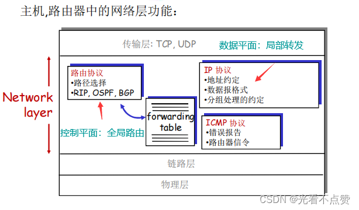

- IP数据报格式（IPV4）
    
    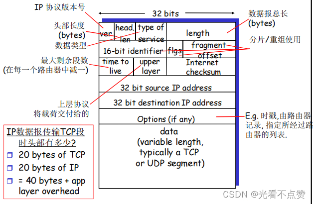
    
    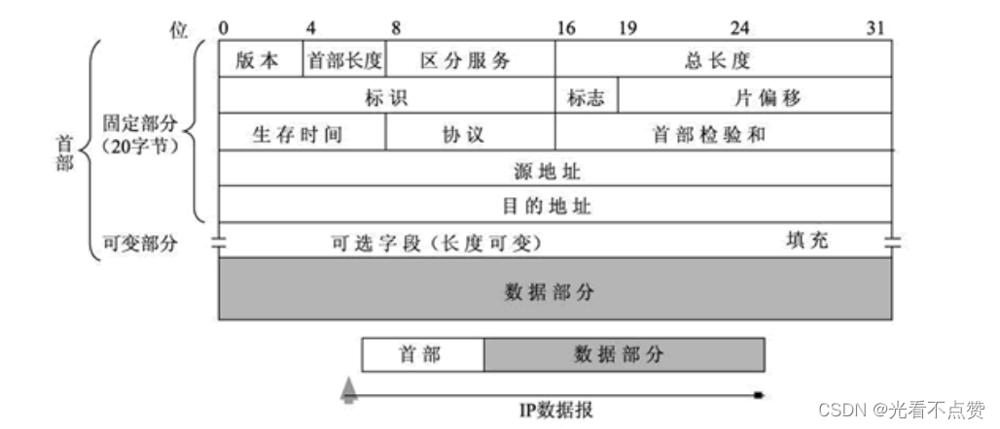
    

### 2.IP 分片和重组(Fragmentation & Reassembly)

- 网络链路有MTU(最大传输单元)-链路层帧所携带的最大数据长度

> 不同的链路类型不同的MTU
> 
- 大的IP数据报在网络上被分片(“fragmented”)，一个数据报被分割成若干个小的数据报

> 相同的ID（每一个小的数据报通过复制前面的IP头来给自己加上数据头）不同的偏移量最后一个分片标记为0“重组”只在最终的目标主机进行头部的信息被用于标识，排序相关分片
> 

### 2.1 例子

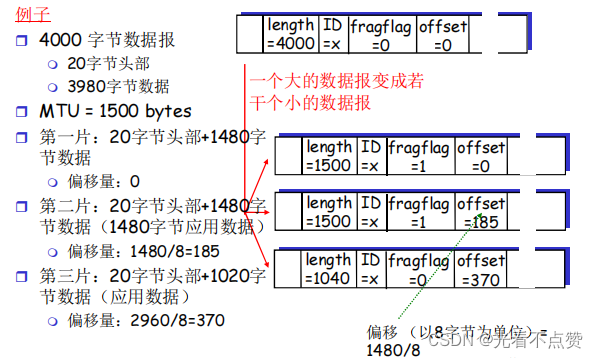

### 2.2 路径MTU

- 概述

> 就是指发送和结构不需要分片的时最大MTU的大小，进行路径MTU发现，就可以避免在中途的路由器上进行分片处理，也可以在TCP中发送更大的包。
> 

### 3.IPv4地址

### 3.1 概述

- IP地址：`32位标示，每8位为一组，每组以.`隔开对主机或者路由器的接口编址
- 接口：主机/路由器和物理链路的连接处

> 路由器通常拥有多个接口主机也有可能有多个接口IP地址和每一个接口关联
> 
- **一个IP地址和一个接口相关联**

具体如何连接与相关联会在链路层介绍

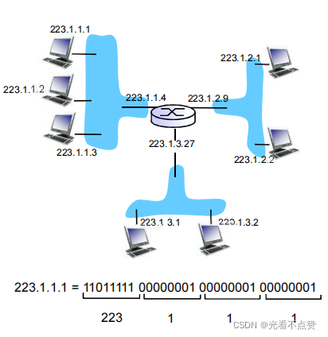

### 3.2 子网（Subnets）

- IP地址:

> 网络号其中的几位：子网部分（高位bits）主机部分（地位bits）
> 
- 什么是子网（subnet）

> 一个子网内的节点（主机或者路由器）它们的IP地址的高位部分相同，这些节点构成的网络的一部分叫做子网无需路由器介入，子网内各主机可以在物理上相互直接到达，在IP的层面就需要一下（有时需要交换机的介入）
> 
- 为什么出现子网

> 节约IP资源：随着互联的发展IPV4地址资源可能会耗尽，如果不划分子网直接将一个C类地址分给一个企业，C类地址可容纳256台主机，但是可能该企业只有20台计算机，这就造成极大浪费减少网络流量，优化网络性能：隔离数据在整个网络内广播，提高信息传输速率。
> 

### 3.2.1 如何判断是否为一个子网

- 要判断一个子网，将每一个接口从主机或者路由器上分开，构成了一个个网络的`孤岛`
- 每一个`孤岛`（网络）都是一个都可以被称之为subnet.

**注意：虽然图中有三个子网，但是从更高维度去看又同属于一个网络（IP前缀一致），这样路由器路由出去信息还是接收信息都会进行地址聚集也就是通过网络来散播信息（可以理解成大致方位我知道，具体到内部再去详细拆分路由交换，对于物理位置十分远的两个网络，正因为有这种模糊大致的位置信息可以减轻路由表的维护信息提高效率）**

### 3.2.2 小试牛刀

图中有6个子网

### 3.3 IP 地址分类

> 每个网络号和主机号都要减去2的结果，因为全0和全1的号码不用
A、B、C称为单播地址；D、E称为广播地址（即发给属于自己的组或区域的所有成员）
> 
- Class A： `126 networks`（网络号） , `16 million hosts`（主机号）
- Class B： `16382 networks`（网络号） ，`64 K hosts`（主机号）
- Class C： `2 million networks`（网络号） ，`254 host`（主机号）
- Class D： multicast
- Class E： reserved for future
    
    
    

### 3.3.1 特殊的IP地址

> 前面说到全0或全1的地址需要从常用的IP分发下面去除，因为有以下约定
> 
- 子网部分:全为0--->本网络
- 主机部分:全为0--->本主机
- 主机部分:全为1--->广播地址，这个网络的所有主机
- 回路地址（测试地址	）：127打头的所有地址（当自上到下到达IP层解析此IP时，会掉头回到上层）
    
    > 访问127.0.0.1 就是代表本主机啊
    > 

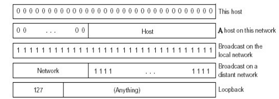

### 3.3.2 内网(专用)IP地址

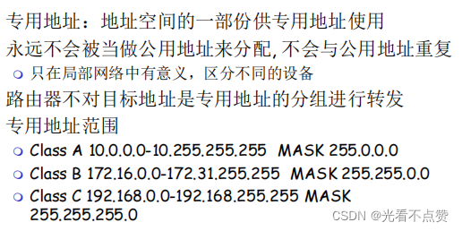

### 3.3.3 IP 编址: CIDR

CIDR: Classless InterDomain Routing（无类域间路由）

- 子网部分可以在任意的位置
- 地址格式: `a.b.c.d/x`,其中×是地址中子网号的长度
- **按需分配，灵活性更高，但是对于网络号和主机号的划分又需要专门的告知（因为每一个划分规则可能都不一样啊）；所以引入了子网掩码，可以看到下图前面全是1的位就是网络号，后面为0的就是主机号**
    
    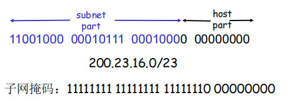
    

### 3.4 广播和多播

- 广播

> 广播地址用于在同一个链路中相互连接的主机之间发送数据包。将IP地址中的主机地址部分全部设置为1，就成为了广播地址。广播分为本地广播和直接广播两种。
> 

==本地广播==：

> 在本网络内的广播叫做本地广播。例如网络地址为192.168.0.0/24的情况下，广播地址是192.168.0.255。因为这个广播地址的IP包会被路由器屏蔽，所以不会到达192.168.0.0/24以外的其他链路上。主机号各位全为1的IP地址，它用于将一个分组发送给特定网络上的所有主机，即对全网广播。
> 

==直接广播==：

> 网络号和主机号都为1的IP地址(即255.255.255.255)，它也是对当前网络进行广播，当一台主机在运行引导程序但又不知道其IP地址需要向服务器获取IP，这时多数用该地址作为目的地址发送分组。在不同网络之间的广播叫做直接广播。例如网络地址为192.168.0.0/24的主机向192.168.1.255/24的目标地址发送IP包。收到这个包的路由器，将数据转发给192.168.1.0/24，从而使得所有192.168.1.1～192.168.1.254的主机都能收到这个包（由于直接广播有一定的安全问题，多数情况下会在路由器上设置为不转发）
> 
- 多播

> 多播用于将包发送给特定组内的所有主机。由于⼴播⽆法穿透路由，若想给其他⽹段发送同样的包，就可以使⽤可以穿透路由的多播。多播使用D类地址。因此，如果从首位开始到第4位是“1110”，就可以认为是多播地址。而剩下的28位可以成为多播的组编号。从224.0.0.0到239.255.255.255都是多播地址的可用范围。其中从224.0.0.0到224.0.0.255的范围不需要路由控制，在同一个链路内也能实现多播。
> 

### 3.5 特殊IP地址作为源地址与目标地址的注意

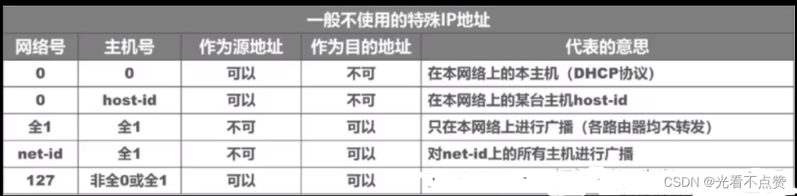

### 3.6 子网掩码

- 概述

> 由于A类和B类为主机号分配了太多的空间，在实际应用中一条链路上也不可能有万级别的计算机连接，这样就造成了资源浪费，那么所有主机的IP都从原来的网络号+主机号改为如下的结构，这个结构后，我们就可以先找到对方主机所在的网络，在进行精准定位
> 

此时主机拿到这个IP就需要知道多少位用于子网号，多少用于主机号，由此而生子网掩码，

**`子网掩码`为32位值，其中1为网络号和子网号、0为主机号；将子网掩码和IP进行与操作就可以得到网络号**

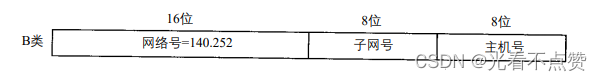

- 32bits ,0 or 1 in each bit

> 1：bit位置表示子网部分0：bit位置表示主机部分
> 
- 原始的A、B、C类网络的子网掩码分别是

> A：255.0.0.0 : 11111111 00000000 00000000 00000000B：255.255.0.0: 11111111 11111111 00000000 00000000C：255.255.255.0: 11111111 11111111 11111111 00000000
> 
- CIDR下的子网掩码例子:
11111111 11111111 11111100 00000000
- 另外的一种表示子网掩码的表达方式

> /#例：/22：表示前面22个bit为子网部分
> 

### 3.6.1 转发表和转发算法

- 获得IP数据报的目标地址
- 对于转发表中的每一个表项

> 如(IP Des addr)&(mask)== destination,则按照表项对应的接口转发该数据报如果都没有找到,则使用默认表项转发数据报
> 
- **下一跳（HOP）：就是下一个的目标网络（路由器的地址）。直到最后一跳也就是到目标主机上的这个hopIP地址的主机部分才会有用，之前的所有步骤都是忽略的，前面的步骤只会跟网络号进行匹配**
    
    
    

### 3.7 如何获得一个IP地址

### 3.7.1 如何获得一个网络的子网部分

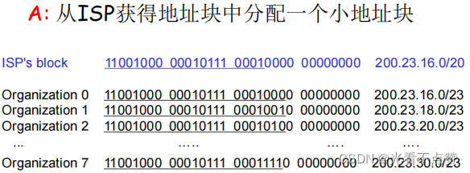

### 3.8 DHCP: Dynamic Host Configuration Protocol

### 3.8.1 概述

作用：允许主机在加入网络的时候，动态地从服务器那里获得P地址

> 可以更新对主机在用IP地址的租用期-租期快到了重新启动时，允许重新使用以前用过的IP地址支持移动用户加入到该网络（短期在网）
> 

### 3.8.2 工作过程

- 主机广播`“DHCPdiscover”`报文 [可选]，**由于不知道目标地址所以使用UDP进行广播，其使用的广播目的地址是255.255.255.255（端口 67）并且使用 0.0.0.0（端口 68） 作为源 IP 地址。**
- DHCP服务器用`“DHCP offer”`提供报文响应 [可选]
- 主机请求IP地址：发送`“DHCP request”`报文
- DHCP服务器发送地址：`“DHCP ack”`报文
    
    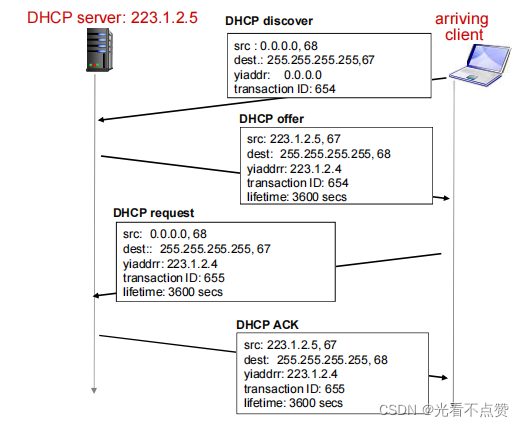
    

### 3.8.3 一台想要上网的主机通过DHCP获得四大必要信息（前面有提到过）

1. IP地址
2. 默认网关
3. 名字服务器
4. 子网掩码

### 3.9 层次编址: 路由聚集（route aggregation）

假设有几个区域需要上网，他们首先去ISP申请IP的划分，每个区域被分配了一个地址块（前23位区分是哪个地址块，后9位区别具体是哪个主机或那个子网中的子网），然后每个地址块都会向负责这些区域的一个更大的子网的路由器提供自己的子网掩码和下一跳的方向，比如前23位是某某某就跳向IPN（N=0~999）；然后这个更大的区域又会将这些区域的信息聚集成一条信息（因为这些地址块的前20位是一模一样的，这样就体现了聚集）和IPN发送给ISP。这时ISP就知道消息发送给那个聚集子网，然后由子网在进行更精细的拆分最终到达用户主机。

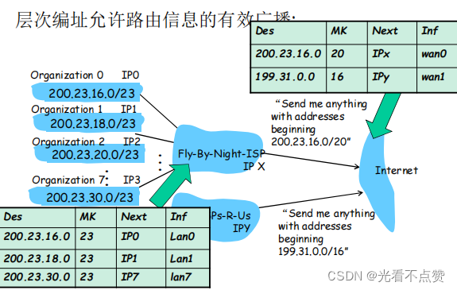

- 如果出现地址所属的子网转移，会单独维护一条记录
    
    
    

### 3.10 NAT（Network Address Translation）

### 3.10.1 概述

- 概述

> 提供外网地址到内网地址的转换，这个工作是由看门的路由器来实现的
> 
- 作用：本地网络只有一个有效IP地址（16-bit端口字段：6万多个同时连接，一个局域网）

> 不需要从ISP分配一块地址，可用一个IP地址用于所有的（局域网）设备---->省钱可以在局域网改变设备的地址情况下而无须通知外界可以改变ISP（地址变化）而不需要改变内部的设备地址局域网内部的设备没有明确的地址，对外是不可见的------->安全
> 
- 图示
    
    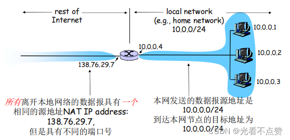
    

### 3.10.2 实现需要

- 一个支持NAT的路由器
- `外出数据包`：替换**源地址和端口号**为NATIP地址和新的端口号，目标IP和端口不变。远端的C/S将会用NAP IP地址，新端口号作为目标地址
- 记住每个转换替换对（在NAT转换表中）。源IP，端口 vs NAP IP，新端口
- `进入数据包`：替换**目标IP地址和端口号**，采用存储在NAT表中的mapping表项，用（源IP，端口）

### 3.10.3 缺点与争议

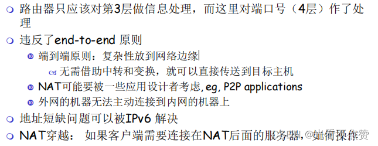

### 3.10.4 NAT 穿越问题

问题：

客户端需要连接地址为10.0.0.1的服务器， 服务器地址10.0.0.1 LAN本地地址 (客户端不能够使用其作为目标地址) 。整网只有一个外部可见地址: 138.76.29.7

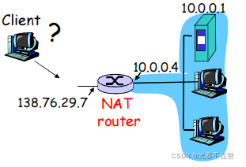

1. 静态配置NAT：转发进来的对服务器特定端口连接请求
    
    > e.g.约定, (123.76.29.7, port 2500) 总是转发到10.0.0.1 port 25000
    > 
2. 方案2: Universal Plug and Play (UPnP) Internet Gateway Device (IGD) 协议.
    
    > 允许NATted主机可以：获知网络的公共 IP地址(138.76.29.7)、列举存在的端口映射、增/删端口映射 (在租用时间内)
    > 
3. 中继 (used in Skype)
    
    > NAT后面的服务器建立和中继的连接，外部的客户端链接到中继，中继在2个连接之间桥接。说白了就是再加一个设备来维护这个映射
    > 

### 4.IPV6

### 4.1 为什么需要IPV6

- IPV4的`32-bit`地址空间将会被很快用完
- 头部格式改变帮助加速处理和转发
- 头部格式改变帮助QoS

### 4.2 IPv6 数据报格式

- 固定的40 字节头部
    
    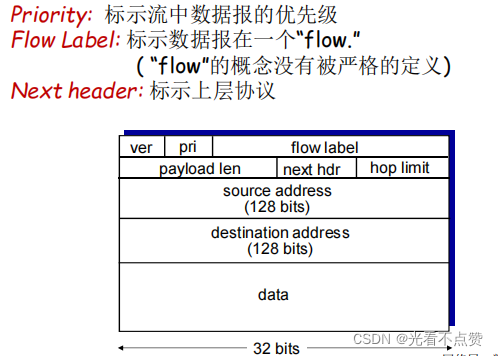
    
- 数据报传输过程中，不允许分片

### 4.3 与IPV4比较

- Checksum：被移除掉，降低在每一段中的处理速度
- Options：允许，但是在头部之外，被“Next Header”字段标示
- ICMPv6：ICMP的新版本
    
    > 附加了报文类型,e.g. “Packet Too Big”，多播组管理功能
    > 

### 4.4 从IPv4到IPv6的平移（平滑升级：路漫漫其修远兮）

- 为什么不一下子升级到IPV6呢？

> 不是所有的路由器都能够同时升级的，没有一个标记日 “flag days”（即规定期限全部设备不能使用网络以供升级）
> 
- 在IPv4和IPv6路由器混合时，网络如何运转?

隧道：在IPv4路由器之间传输的IPv4数据报中携带IPv6数据报

### 4.4.1 隧道(Tunneling)

在一个孤岛内使用先进的IPV6进行通信，当与别的孤岛进行通信时，最外侧负责向外的设备具有“双栈”的能力，即又能支持IPV4又能支持IPV6，然后将IPV6的全部信息封装在IPV4的报文中发送到另一个孤岛中，孤岛接收并解析成IPV6格式进行使用

## 四、通用转发和SDN

### 1.传统方式下数量众多、功能各异的中间盒

### 1.1 路由器的网络层功能

- IP转发：对于到来的分组按照路由表决定如何转发，数据平面，是局部的概念
- 路由：决定路径，计算路由表；处在控制平面，是全局的概念
- 每台设备上既实现控制功能、又实现数据平面，控制功能分布式实现，路由表-粘连

### 1.2 还有其他种类繁多网络设备（中间盒）

### 1.3 网络设备控制平面的实现方式特点

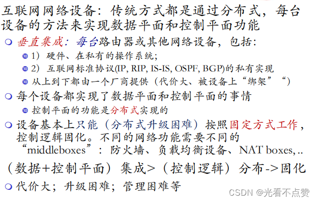

### 1.4 传统方式实现网络功能的问题

### 2.SDN（替代传统方式的垂直继承方式）：逻辑上集中的控制平面

### 2.1 概述

一个不同的（通常是远程）控制器和CA交互，控制器决定分组转发的逻辑（可编程），CA所在设备执行逻辑。

### 2.1.1 建立思路

- 网络设备数据平面和控制平面分离
- 数据平面-分组交换机

> 将路由器、交换机和目前大多数网络设备的功能进一步抽象成:按照流表（由控制平面设置的控制逻辑)进行PDU(帧、分组）的动作（包括转发、丢弃、拷贝、泛洪、阻塞)统一化设备功能：SDN交换机（分组交换机)，执行控制逻辑
> 
- 控制平面-控制器＋网络应用

> 分离、集中计算和下发控制逻辑：流表
> 

### 2.2 SDN控制平面和数据平面分离的优势

- 水平集成控制平面的开放实现（而非私有实现），创造出好的产业生态，促进发展

> 分组交换机、控制器和各种控制逻辑网络应用app可由不同厂商生产，专业化，引入竞争形成良好生态
> 
- 集中式实现控制逻辑，网络管理容易:

> 集中式控制器了解网络状况，编程简单，传统方式困难避免路由器的误配置
> 
- 基于流表的匹配 + 行动的工作方式允许`“可编程的”`分组交换机

> 实现流量工程等高级特性在此框架下实现各种新型（未来)的网络设备
> 

### 2.2.1 垂直集成到水平集成

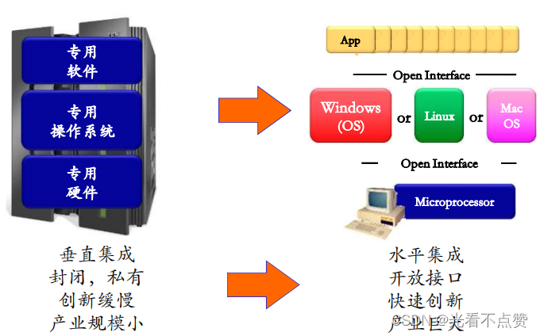

### 2.2.2 实用场景的改变

- 网管如果需要u到z的流量走uvwz,x到z的流量走xwyz，怎么办？

需要定义链路的代价，流量路由算法以此运算（ IP路由面向目标，无法操作） (或者需要新的路由算法)!

- 如果网管需要将u到z的流量分成2路：uvwz 和uxyz (负载均衡)，怎么办?（ IP路由面向目标）

无法完成(在原有体系下只有使用新的路由选择算法，而在全网部署新的路由算法是个大的事情)

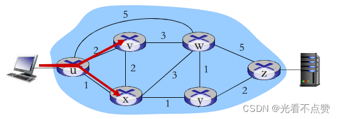

- 如果需要w对蓝色的和红色的流量采用不同的路由，怎么办？

无法操作 (基于目标的转发，采用LS, DV 路由)

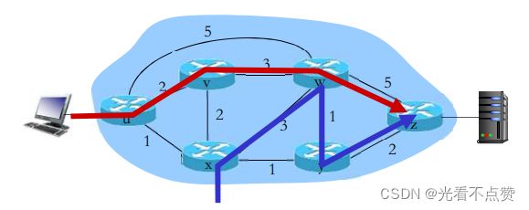

### 2.3 SDN 架构

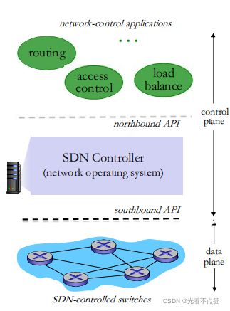

### 2.3.1 数据平面交换机

- 快速，简单，商业化交换设备采用硬件实现通用转发功能
- 流表被控制器计算和安装
- 基于南向API（例如OpenFlow) ，SDN控制器访问基于流的交换机
    
    > 定义了哪些可以被控制哪些不能
    > 
- 也定义了和控制器的协议(e.g.,OpenFlow)

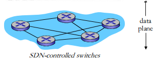

### 2.3.2 SDN控制器

- 维护网络状态信息
- 通过上面的北向API和网络控制应用交互
- 通过下面的南向API和网络交换机交互
- 逻辑上集中，但是在实现上通常由于性能、可扩展性、容错性以及鲁棒性采用分布式方法

### 2.3.3 控制应用

- 控制的大脑︰采用下层提供的服务(SDN控制器提供的API)，实现网络功能

> 路由器交换机接入控制防火墙负载均衡其他功能
> 
- 非绑定:可以被第三方提供与控制器厂商以通常上不同，与分组交换机厂商也可以不同

### 3.通用转发和SDN

每个路由器包含一个流表（被逻辑上集中的控制器计算和分发）

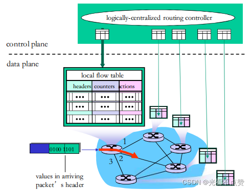

### 3.1 OpenFlow 数据平面抽象及通用转发

- 流：由分组（帧）头部字段所定义
- 通用转：:简单的分组处理规则

> 模式：将分组头部字段和流表进行匹配行动：对于匹配上的分组，可以是丢弃、转发、修改、将匹配的分组发送给控制器优先权Priority：几个模式匹配了，优先采用哪个，消除歧义计数器Counters：bytes以及#packets
> 
- 路由器中的流表定义了路由器的匹配＋行动规则（流表由控制器计算并下发)

### 3.2 OpenFlow 流表的表项结构

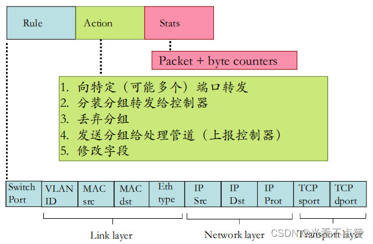

- 基于流表的结构可以用来表示各种行为
    
    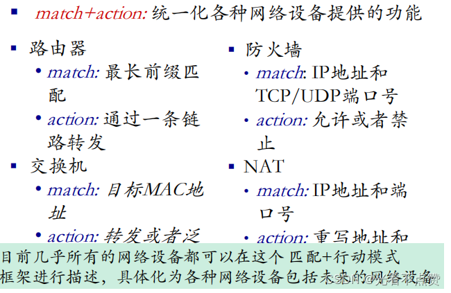
    

### 3.2.1 例子

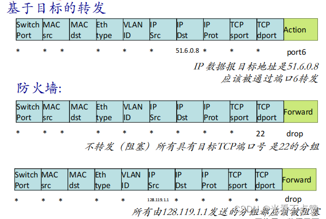

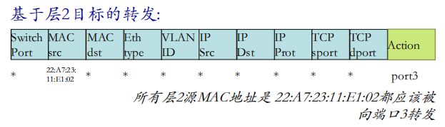