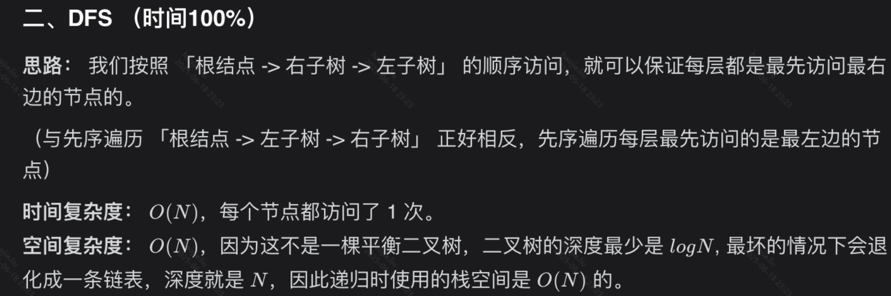
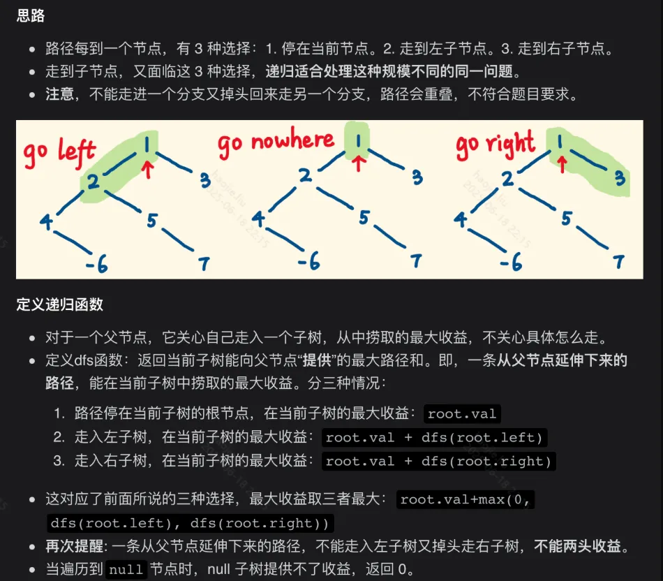

# 二叉树操作（递归 / 层序遍历）

### 二叉树的层序遍历

**BFS**

```java
class Solution {
    public List<List<Integer>> levelOrder(TreeNode root) {
        List<List<Integer>> returnList = new ArrayList<>();
        if(root==null)
            return returnList;
        TreeNode temp;
        Deque<TreeNode> queue = new LinkedList<>();
        queue.add(root);    //根结点入队
        while(queue.size()!=0){
            List<Integer> list = new ArrayList<>();
            int size = queue.size();
            for(int i = 0; i < size; i++){
                temp = queue.poll();
                list.add(temp.val);
                if(temp.left != null)
                    queue.add(temp.left);
                if(temp.right != null)
                    queue.add(temp.right);   
            }
            returnList.add(list);

        }
        return returnList;
    }
}
```

### 二叉树的层次遍历 II

**没啥好说的层次遍历就完事了**

```java
public class Solution {
    public List<List<Integer>> levelOrderBottom(TreeNode root) {
        List<List<Integer>> ans = new LinkedList<>();
        if (root == null)
            return ans;
        //设置队列
        Queue<TreeNode> queue = new LinkedList<>();
        //根结点入队
        queue.offer(root);
        while (!queue.isEmpty()) {
            int len = queue.size();
            List<Integer> tempList = new LinkedList<>();
            //广度优先遍历，以队列的长度为次数将本层的所有结点全部入队
            for (int i = 0; i < len; i++) {
                TreeNode node = queue.poll();
                tempList.add(node.val);
                if (node.left != null)
                    queue.offer(node.left);
                if (node.right != null)
                    queue.offer(node.right);
            }
            //ans.add(tempList);
            ans.add(0, tempList); //这里写成这样就不要最后反转了，改为头插
        }
        //Collections.reverse(ans);
        return ans;
    }
}
```

### 二叉树的锯齿形层次遍历

**这道题的思路就是顺序遍历每层的结点，设置一个标志位，每循环遍历一层就将标志位取反，判断是否进行反转，也就是说每隔一层进行一次反转**

```java
public class Solution {
    public List<List<Integer>> zigzagLevelOrder(TreeNode root) {
        List<List<Integer>> ans = new LinkedList<>();
        if (root == null)
            return ans;
        //设置队列
        Queue<TreeNode> queue = new LinkedList<>();
        //设置标志位
        boolean reverse = false;
        //根结点入队
        queue.offer(root);
        while (!queue.isEmpty()) {
            int len = queue.size();
            List<Integer> tempList = new LinkedList<>();
            //广度优先遍历，以队列的长度为次数将本层的所有结点全部入队
            for (int i = 0; i < len; i++) {
                TreeNode node = queue.poll();
                tempList.add(node.val);
                if (node.left != null)
                    queue.offer(node.left);
                if (node.right != null)
                    queue.offer(node.right);
            }
            //标志位判断，每隔一层进行反转
            if (reverse) {
                Collections.reverse(tempList);
            }
            reverse = !reverse;
            ans.add(tempList);
        }
        return ans;
    }
}
```

### 从上到下打印二叉树 II

```java
class Solution {
    List<List<Integer>> list = new ArrayList<>();
    Queue<TreeNode> queue = new LinkedList<>();
    public List<List<Integer>> levelOrder(TreeNode root) {
        //levelTraversal(0, root);
        levelTraversal(root);
        return list;
    }

    //递归
    public void levelTraversal(int depth, TreeNode node){
        //list.add(new ArrayList<Integer>().add(node.val));
        if(node == null)
            return;
        if(depth == list.size()){
            list.add(new ArrayList<>());
        }
        //这句代码就是分层的关键，将层数和大list大索引相关联
        list.get(depth).add(node.val);
        levelTraversal(depth + 1, node.left);
        levelTraversal(depth + 1, node.right);

    }

    //非递归方法
    public void levelTraversal(TreeNode root){
        if(root != null)
            queue.add(root);
        while(!queue.isEmpty()){
            List<Integer> temp = new ArrayList<>();
            //这句就是分层的关键，以队列中的节点数为分层的区别，例如第一次进入这个方法时队列初始化完成以后的长度是1，那么就为根结点的层数，当进入第二次循环的时候根结点出列的他的左孩子和右孩子进入队列，长度变为2即为第二层，如果第二层的两个结点都有左右孩子那么队列会进入四个结点，长度变为4即为第三层
            for(int i = queue.size();i>0;i--){
                TreeNode node = queue.poll();
                temp.add(node.val);
                if(node.left != null)
                    queue.add(node.left);
                if(node.right != null)
                    queue.add(node.right);

            }
            list.add(temp);
        }
    }
}
```

### 从上到下打印二叉树 III

**跟【**二叉树的锯齿形层次遍历**】一个样子，设置标志位**

```java
class Solution {
    public List<List<Integer>> levelOrder(TreeNode root) {
        List<List<Integer>> res = new ArrayList<>();
        if(root == null)
            return res;
        List<Integer> list = new ArrayList<>();
        Queue<TreeNode> queue = new LinkedList<>();
        queue.add(root);
        //由于我们需要Z形遍历，其实就是跟103题一样，设置一个反转标志位即可
        boolean reverse = false;    //默认第一层不反转
        while(!queue.isEmpty()){
            int len = queue.size();
            //我们每次需要在一个while循环中处理完一层，那么需要嵌套for循环来
            for(int i = 0; i < len; i++){
                TreeNode temp = queue.poll();
                list.add(temp.val);
                if(temp.left != null)
                    queue.add(temp.left);
                if(temp.right != null)
                    queue.add(temp.right);
            }
            if(reverse)
                Collections.reverse(list);
            reverse = !reverse;
            res.add(new ArrayList<>(list));
            list.clear();
        }
        return res;
    }
}
```

### 二叉树的右视图

两种方式：DFS和BFS

**DFS:**



```java
class Solution {
    //站在右侧向左看，如果是[1,3]那么返回的也是[1,3]，因为站在有吃的看3的时候右子树是没有任何结点的，即使3是左子树的结点
    List<Integer> list = new ArrayList<>();
    public List<Integer> rightSideView(TreeNode root) {
        dfs(root, 0);
        return list;
    }

    public void dfs(TreeNode root, int depth){
        if(root == null)
            return;
        // 先访问 当前节点，再递归地访问 右子树 和 左子树。

        // 如果当前节点所在深度还没有出现在res里，说明在该深度下当前节点是第一个被访问的节点，因此将当前节点加入res中。
        if(depth == list.size())
            list.add(root.val);

        depth++;
        dfs(root.right, depth);
        dfs(root.left, depth);
    }
}
```

**BFS:**


```java
class Solution {
    public List<Integer> rightSideView(TreeNode root) {
        List<Integer> res = new ArrayList<>();
        if (root == null) {
            return res;
        }
        Queue<TreeNode> queue = new LinkedList<>();
        queue.offer(root);
        while (!queue.isEmpty()) {
            int size = queue.size();
            for (int i = 0; i < size; i++) {
                TreeNode node = queue.poll();
                if (node.left != null) {
                    queue.offer(node.left);
                }
                if (node.right != null) {
                    queue.offer(node.right);
                }
                if (i == size - 1) {  //将当前层的最后一个节点放入结果列表
                    res.add(node.val);
                }
            }
        }
        return res;
    }
}
```

### 二叉树的前序遍历

```java
class Solution {

    List<Integer> list = new ArrayList<>();
    public List<Integer> preorderTraversal(TreeNode root) {
        inOrder(root);
        return list;
    }

    //先根，在左，在右
    public void inOrder(TreeNode root){
        if(root == null)
            return;
        list.add(root.val);
        if(root.left!=null)
            inOrder(root.left);

        if(root.right!=null)
            inOrder(root.right);

    }
}
```

### 二叉树的中序遍历

```java

class Solution {
//先左，在根，在右
    List<Integer> list = new ArrayList<>();
    public List<Integer> inorderTraversal(TreeNode root) {
        inOrder(root);
        return list;
    }

    public void inOrder(TreeNode root){
        if(root == null)
            return;
        if(root.left!=null)
            inOrder(root.left);
        list.add(root.val);
        if(root.right!=null)
            inOrder(root.right);
    }
}
```

### 二叉树的后序遍历

```java
class Solution {
    List<Integer> list = new ArrayList<>();
    public List<Integer> postorderTraversal(TreeNode root) {
        inOrder(root);
        return list;
    }

    //先左，后右，在根
    public void inOrder(TreeNode root){
        if(root == null)
            return;
        if(root.left != null)
            inOrder(root.left);
        if(root.right != null)
            inOrder(root.right);
        list.add(root.val);
    }
}
```

### 二叉树的最大深度

**BFS**

```java
class Solution {
    public int maxDepth(TreeNode root) {
        List<List<Integer>> list = getDepth(root);
        return list.size();
    }

    public List<List<Integer>> getDepth(TreeNode root){
        List<List<Integer>> returnList = new ArrayList<>();
        if(root==null)
            return returnList;
        TreeNode p;
        Deque<TreeNode> queue = new LinkedList<>();
        queue.add(root);    //根结点入队
        while(queue.size()!=0){
            List<Integer> list = new ArrayList<>();
            int size = queue.size();
            for(int i=0;i<size;i++){
                p = queue.poll();
                list.add(p.val);
                if(p.left!=null)
                    queue.add(p.left);
                if(p.right!=null)
                    queue.add(p.right);   
            }
            returnList.add(list);

        }
        return returnList;
    }
```

**DFS**

```java
public int maxDepth(TreeNode root) {
        if (root == null) {
            return 0;
        } else {
            int leftHeight = maxDepth(root.left);
            int rightHeight = maxDepth(root.right);
            return Math.max(leftHeight, rightHeight) + 1;
        }
    }  
```

### 二叉树的最小深度

**DFS**

```java
class Solution {
    //1.递归条件（就是会出现的各种情况）
    //2.只在意本层的逻辑
    //3.需要返回什么，（根据条件你需要返回什么）
    /*叶子节点的定义是左孩子和右孩子都为 null 时叫做叶子节点
    当 root 节点左右孩子都为空时，返回 1
    当 root 节点左右孩子有一个为空时，返回不为空的孩子节点的深度
    当 root 节点左右孩子都不为空时，返回左右孩子较小深度的节点值
    */
    public int minDepth(TreeNode root) {
        //根节点位0，树为空
        if(root == null)
            return 0;
        //左右子树都为空，返回自身的长度
        if(root.left == null && root.right == null)
            return 1;
        //当左子树为空，返回右子树+自身的长度
        if(root.left == null)
            return minDepth(root.right) + 1;
        //与上面同理
        if(root.right == null)
            return minDepth(root.left) + 1;
        //左右子树都不为空，那就看谁小
        return Math.min(minDepth(root.left), minDepth(root.right)) + 1;
    }
}
```

**BFS**

```java
class Solution {
    public int minDepth(TreeNode root) {
        if(root == null)
            return 0;
        Queue<TreeNode> queue = new LinkedList<>();
        queue.add(root);
        int res = 1;    //如果根节点不为空那么初始树高就是1
        while(!queue.isEmpty()){
            int len = queue.size();
            //这里加个for循环的原因就是遍历本层节点，如果本层的任意节点出现了
            //没有左右子树的情况则立即返回
            //你不遍历本层节点，直接在while中操作res，会出现你先写的左边还是右边
            //加入队列，那就按谁的来
            for(int i = 0; i < len; i++){
                TreeNode temp = queue.poll();
                if(temp.left == null && temp.right == null)
                    return res;    
                if(temp.left != null)
                    queue.add(temp.left);
                if(temp.right != null)
                    queue.add(temp.right);
            }
            res++;//都没有上面所说的那个情况出现，树深加1
        }
        return res;
    }
}
```

### 二叉树最大宽度

```java
/**
  * 二叉树的最大宽度
  * 优先队列，进行层序遍历，记录每个节点在满二叉树中的序号
  * 在满二叉树中，当前节点的序号为k，
  * 那么其左孩子和右孩子的序号分别为2k、2k+1
  */
class Solution {
    public int widthOfBinaryTree(TreeNode root) {
        Deque<Node> pq = new LinkedList<>();
        //将根节点放入
        pq.offer(new Node(root, 1));
        long ans = 0;
        //while循环过每一层
        while (!pq.isEmpty()) {
            int size = pq.size();
            // 注意：right可能会越界，这里使用long
            long left = pq.peek().index, right = pq.peek().index; 
            //每轮for循环就是对当前层的每个节点的标记  
            for (int k = 0; k < size; k++) {
                Node node = pq.poll();
                //左边界
                left = Math.min(left, node.index);
                //右边界
                right = Math.max(right, node.index);
                ans = Math.max(ans, right - left + 1);
                if (node.treeNode.left != null) pq.offer(new Node(node.treeNode.left, 2 * node.index));
                if (node.treeNode.right != null) pq.offer(new Node(node.treeNode.right, 2 * node.index + 1));
            }
        }
        return (int) ans;
    }
}
```

### 二叉树的直径

**递归**

```java
class Solution {
    int ans;
    public int diameterOfBinaryTree(TreeNode root) {
        ans = 1;
        depth(root);
        return ans - 1;
    }
    public int depth(TreeNode node) {
        if (node == null) {
            return 0; // 访问到空节点了，返回0
        }
        int L = depth(node.left); // 左儿子为根的子树的深度
        int R = depth(node.right); // 右儿子为根的子树的深度
        ans = Math.max(ans, L+R+1); // 计算d_node即L+R+1 并更新ans
        return Math.max(L, R) + 1; // 返回该节点为根的子树的深度
    }
}

```

### 对称二叉树


**使用dfs的方式**

```java
public boolean isSymmetric(TreeNode root) {
        if(root == null)
            return true;
        //递归入口
        return dfs(root.left, root.right);
    }

    public boolean dfs(TreeNode left, TreeNode right){
        //递归出口
        if(left == null && right == null)
            return true;
        //递归出口
        if(left == null || right == null)
            return false;
        //递归出口
        if(left.val != right.val)
            return false;

        //左树的左孩子跟右树的右孩子比较，左树的右孩子跟右树的左孩子比较
        return dfs(left.left, right.right) && dfs(left.right, right.left);
    }
```


**使用队列的方式**

```java
class Solution {
    public boolean isSymmetric(TreeNode root) {
        if(root==null || (root.left==null && root.right==null)) {
            return true;
        }
        //用队列保存节点
        LinkedList<TreeNode> queue = new LinkedList<TreeNode>();
        //将根节点的左右孩子放到队列中
        queue.add(root.left);
        queue.add(root.right);
        while(queue.size()>0) {
            //从队列中取出两个节点，再比较这两个节点
            TreeNode left = queue.removeFirst();
            TreeNode right = queue.removeFirst();
            //如果两个节点都为空就继续循环，两者有一个为空就返回false
            if(left==null && right==null) {
                continue;
            }
            if(left==null || right==null) {
                return false;
            }
            if(left.val!=right.val) {
                return false;
            }
            //将左节点的左孩子， 右节点的右孩子放入队列
            queue.add(left.left);
            queue.add(right.right);
            //将左节点的右孩子，右节点的左孩子放入队列
            queue.add(left.right);
            queue.add(right.left);
        }

        return true;
    }
}
```

### 相同的树

```java
class Solution {

    boolean isSameTree(TreeNode root1, TreeNode root2) {
    // 都为空的话，显然相同
    if (root1 == null && root2 == null) return true;
    // 一个为空，一个非空，显然不同
    if (root1 == null || root2 == null) return false;
    // 两个都非空，但 val 不一样也不行
    if (root1.val != root2.val) return false;

    // root1 和 root2 该比的都比完了
    return isSameTree(root1.left, root2.left)
        && isSameTree(root1.right, root2.right);
	}
}
```

### 平衡二叉树


```java
class Solution {
    public boolean isBalanced(TreeNode root) {
        //如果最后返回的个非负则是一颗平衡二叉树
        return depth(TreeNode root) != -1;

    }

    //自底向上，可以避免很多重复的递归，本质上是一个先序遍历
    public int depth(TreeNode root){
        //根结点为空则返回0
        if(root == null)
            return 0;
        //将左边子树的深度记录
        int i = depth(root.left);
        //不满足是平衡二叉树，则返回-1
        if(i == -1)
            return -1;
        //与上面同理
        int j = depth(root.right);
        if(j == -1)
            return -1;

        return Math.abs(i - j) < 2 ? Math.max(i, j) : -1; 
    }
}
```


```java
//自顶向下，也就是暴力解法，分为两个递归：判断该树是否为平衡二叉树
//另一个记录二叉树的树深
class Solution {
    public boolean isBalanced(TreeNode root) {
        if(root == null)
            return true;
        return Math.abs(depth(root.left) - depth(root.right)) <= 1 && isBalanced(root.left) && isBalanced(root.right);
    }

    public int depth(TreeNode root){
        if(root == null)
            return 0;
        return Math.max(depth(root.left), depth(root.right)) + 1;
    }
}
```

### 二叉树的最近公共祖先


```java
class Solution {
    public TreeNode lowestCommonAncestor(TreeNode root, TreeNode p, TreeNode q) {
        //开始先序遍历 先根，在左，在右
        //根据题意，当p，q某一个是root时，该点就是最近公共祖先
        if(root == null || root == p || root == q)
            return root;

        TreeNode left = lowestCommonAncestor(root.left, p, q);
        TreeNode right = lowestCommonAncestor(root.right, p, q);
        //第一种情况：当一直遍历到最后一层，未遍历到p和q，则公共祖先为root
        if(left == null && right == null)
            return null;
        //第二种情况：遍历到右子树有q，左子树的p可能在右子树，
        if(left == null)
            return right;
        //第三种情况：与第二种相反
        if(right == null)
            return left;

        //此时其实p和q分别在左右子树都已经找到了，有一个隐含条件
        //if(left != null and right != null)
        return root;
    }
}
```

### 二叉搜索树的最近公共祖先

```java
class Solution {
    public TreeNode lowestCommonAncestor(TreeNode root, TreeNode p, TreeNode q) {
        if(root == null)
            return null;
        //这里些许有点问题，直接一个while循环跳出来返回root就行了，没必要判断这两个结点是否分别为根结点左子树和右子树上的结点
        if((p.val > root.val && q.val < root.val) || (q.val > root.val && p.val < root.val)){
            return root;
        }else if(p.val > root.val && q.val > root.val){

        }else if(p.val < root.val && q.val < root.val){

        }
    }
}

class Solution {
    public TreeNode lowestCommonAncestor(TreeNode root, TreeNode p, TreeNode q) {
        while(root != null) {
            if(root.val < p.val && root.val < q.val) // p,q 都在 root 的右子树中
                root = root.right; // 遍历至右子节点
            //一直判断，直到不满足这个条件这个公共最近的祖先结点
            else if(root.val > p.val && root.val > q.val) // p,q 都在 root 的左子树中
                root = root.left; // 遍历至左子节点
            else break;
        }
        //如果上面的两个判断都不满足那自然而然这两个结点就是分别居于左子树和右子树上面
        return root;
    }
    

    //采用递归的方法
    public TreeNode lowestCommonAncestor(TreeNode root, TreeNode p, TreeNode q) {
        if(root == null)
            return null;
        //如果全在左子树
        if(root.val < p.val && root.val < q.val)
            return lowestCommonAncestor(root.right, p, q);
        if(root.val > p.val && root.val > q.val)
            return lowestCommonAncestor(root.left, p, q); 

        return root;
    }
}
```

### 二叉搜索树的第k大节点


```java

class Solution {
    List<Integer> list = new ArrayList<>();
    public int kthLargest(TreeNode root, int k) {
        inOrder(root);
        return list.get(list.size() - k);
    }

    public void inOrder(TreeNode root){
        if(root.left != null)
            inOrder(root.left);
        list.add(root.val);
        if(root.right != null)
            inOrder(root.right);
    }
}
```

### 二叉搜索树中第K小的元素

**利用大根堆（优先队列），但是时间复杂度并不算优秀**


```java
	public int kthSmallest(TreeNode root, int k) {
        //这里就是使用权重的队列来模拟大根堆的创建过程
        //重写里面的compareTo方法使之降序排列，与树的层次遍历结合，一层一层的检查大根堆
        PriorityQueue<Integer> q = new PriorityQueue<>((a,b)->b-a);
        Deque<TreeNode> d = new ArrayDeque<>();
        d.addLast(root);
        while (!d.isEmpty()) {
            TreeNode node = d.pollFirst();
            //如果此时大根堆的长度还不足k，那么就证明还未建立完成，继续增加新的节点
            //即建立一个容量为k的堆
            if (q.size() < k) {
                q.add(node.val);
                //如果大根堆满了则要比较当前节点值，跟队列中的值
                //如果队首的值大于当前节点值
            } else if (q.peek() > node.val) {
                //当进行出队操作后，剩余的元素来进行大根堆的重构，时刻保证了大根堆
                //对容量为k的大根堆，我们时刻保证个规则，大的出，当全部遍历完
                //剩余的刚好就是我们需要的
                q.poll();   //将根节点出队
                q.add(node.val);
            }

            //也就是说上面的全部操作，就是在优化k个范围内的大根堆，我们找第k个最小的元素
            //那在大根堆中就是k个容量的根节点就是所求的值

            if (node.left != null) d.addLast(node.left);
            if (node.right != null) d.addLast(node.right);
        }
        return q.peek();
    }
```

**使用API的排序，这个仅作为观赏，面试写出来直接say goodbye**

**利用二叉搜索树的特性直接中序遍历，省去了排序的过程，时间复杂度最优**

```java
    List<Integer> list = new ArrayList<>();
    //利用二叉搜索树的特效，二叉搜索树的中序遍历就是排好序的
    public int kthSmallest(TreeNode root, int k) {
        inOrder(root);
        return list.get(k - 1);
    }

    public void inOrder(TreeNode root){
        if(root == null)
            return;
        inOrder(root.left);
        list.add(root.val);
        inOrder(root.right);
    }
```

### 将二叉搜索树转化为排序的双向链表

```java
//约定左子树就是前序，右子树就是后序节点
class Solution {
    //pre节点代表当前节点的父节点，全部递归结束指向最后一个节点
    Node pre, head;
    public Node treeToDoublyList(Node root) {
        if(root == null)
            return null;
        dfs(root);
        pre.right = head;
        head.left = pre;
        return head;
    }

    public void dfs(Node root){
        if(root == null)
            return;
        dfs(root.left);
        if(pre != null)
            pre.right = root;
        else    //如果为空说明是头节点，最小的节点，遍历到了最底层
            head = root;
        root.left = pre;
        //保存当前节点，就是下一个节点的父节点
        pre = root;
        dfs(root.right);
    }
}
```

### 二叉搜索树与双向链表

**我们用两个队列，一个正序一个反序，先正序出队连接left，后反序出队连接right**

```java
class Solution {

    Deque<Node> queue01 = new ArrayDeque<>();
    Deque<Node> queue02 = new ArrayDeque<>();
    public Node treeToDoublyList(Node root) {
        inOrder(root);
        while(!queue01.isEmpty()){
            Node temp = queue01.poll();
            //当为空的时候，就要将最后一个结点指向第一个结点
            if(queue01.isEmpty())
                temp.left = queue02.peekLast();
            else
                temp.left = queue01.peek();
            queue02.addFirst(temp);
        }
        Node tail = queue02.peek();
        Node head = queue02.peekLast();
        while(!queue02.isEmpty()){
            Node temp = queue02.poll();
            if(queue02.isEmpty())
                temp.right = tail;
            else
                temp.right = queue02.peek();
        }

        return head;
    }

    public void inOrder(Node root){
        if(root == null)
            return;
        treeToDoublyList(root.left);
        queue01.add(root);
        treeToDoublyList(root.right);
    }
}
```

**利用中序遍历一边遍历一边连接**

```java
class Solution {    
    Node pre, head;
    public Node treeToDoublyList(Node root) {
        if(root == null) return null;
        inOrder(root);
        //然后将head的前继节点设置成尾
        head.left = pre;
        //将尾的后继节点指向头
        pre.right = head;
        return head;
    }

    //利用中序遍历，一边遍历一边连接
    public void inOrder(Node cur) {
        if(cur == null) return;
        dfs(cur.left);
        //如果pre节点不为空，证明当前节点不是头节点，则把pre节点的后继
        //节点指向当前节点
        if(pre != null) 
            pre.right = cur;
        //为空就说明是头结点，那么就把cur赋值给head
        else 
            head = cur;
        //然后当前前继结点设置为pre，当cur是头结点时，pre是null
        //也就是说整个中序遍历后我们应该将头跟尾连接
        cur.left = pre;
        //然后把pre设置成cur，即向前递归，处理下一个结点
        pre = cur;
        dfs(cur.right);
    }
}
```

### 二叉搜索树的后序遍历序列

**递归，就是利用后序遍历的序列性质**

```java
class Solution {
    //后序遍历的规律是先左 后右 在根，那么对于后序的序列来说，最后一个值就是根节点
    //然后我们遍历数组直到遇到比根节点的值大的，标记为m，哪就是根节点的右子树
    //即i到m-1为左、m到j-1为右子树，直接递归进去继续判断
    public boolean verifyPostorder(int[] postorder) {
        return check(postorder, 0, postorder.length - 1);

    }
    public boolean check(int[] post, int i, int j){
        if(i >= j)  //如果右子树都超过左子树了，那么肯定遍历完了
            return true;
        int cur = i;
        while(post[cur] < post[j])  //cur代表比根节点大的节点
            cur++;
        int mid = cur;  //标记为mid，以这个为中点，左为左子树，右为右子树
        //mid后面的值应该都大于根节点，如果遇到小的了那么此时就是跳出，去判断
        //树是否为搜索树了
        while(post[cur] > post[j])
            cur++;
        //需满足三个条件，需要遍历完，然后左子树满足，右子树也满足
        return cur == j && check(post, i, mid - 1) && check(post, mid, j - 1);
    }
}
```

**模拟构造一个二叉搜索树**

```java
class Solution {
    int end;//判断是否完全遍历
    public boolean verifyPostorder(int[] postorder) {
        if (postorder == null || postorder.length == 1) 
            return true;
        //设置根节点
        end = postorder.length - 1;
        //然后开始构建二叉树
        build(postorder, Integer.MIN_VALUE, Integer.MAX_VALUE);
        return end < 0;//如果完全遍历，则end < 0;
    }
    private void build(int[] postorder, int min, int max) {
        if (end < 0) return ;//空了，返回
        int rootV = postorder[end];
        if (rootV >= max || rootV <= min) return ;
        //符合节点要求，节点数量减一
        end--;
        //对于右子树来说，最最小值就是根节点的值，因为右子树的值都比根节点
        //要大
        build(postorder, rootV, max);//右子树
        //对于左子树号右子树相反
        build(postorder, min, rootV);//左子树
    }
}
```

### 删除二叉搜索树中的节点

**这个代码会让树高变高，从而破坏二叉搜索树的效率，面试中会要求优化成AVL（二叉查找树，即两个子树的高度差不能超过1）这样效率就不会收到影响**

> 如果删除这个节点可以清楚的看到树的高度变了
> 


```java
class Solution {
    public TreeNode deleteNode(TreeNode root, int key) {
                if (root == null)return null;

        if (key > root.val)
            root.right = deleteNode(root.right, key); // 去右子树删除

        else if(key < root.val)    
            root.left = deleteNode(root.left, key);  // 去左子树删除

        else  {  // 当前节点就是要删除的节点

            if (root.left == null)   return root.right;      // 情况1，欲删除节点无左子
            else if (root.right == null)  return root.left;  // 情况2，欲删除节点无右子
            else if (root.left!=null && root.right !=null){  // 情况3，欲删除节点左右子都有 
                TreeNode node = root.right;   
                while (node.left != null)      // 寻找欲删除节点右子树的最左节点
                    node = node.left;

                //这样待删除节点的左子树，可以全部移植到我们找到的待删除节点的右子树的
                //最左节点的左孩子
                //node保存的就是待删除节点右子树的最左节点
                node.left = root.left;     // 将欲删除节点的左子树成为其右子树的最左节点的左子树
                root = root.right;         // 欲删除节点的右子顶替其位置，节点被删除
            }
        }
        return root;    
    }
}
```

### 将有序数组转换为二叉搜索树

**就是利用折半的特效两边分别建立二叉树**

```java
class Solution {
    public TreeNode sortedArrayToBST(int[] nums) {
        return buildTree(nums, 0, nums.length - 1);
    }

    public TreeNode buildTree(int[] nums, int left, int right){
        if(left > right);
            return null;
        int mid = left + (right - left) / 2;
        //由于数组是升序的其谁做根节点都无所谓
        TreeNode root = new TreeNode(nums[mid]);
        //构建其左子树和右子树
        root.left = buildTree(nums, left, mid - 1);
        root.right = buildTree(nums, mid + 1, right);
        return root
    }
}
```

### 验证二叉搜索树

**递归+中序遍历**

```java
class Solution {
    public boolean isValidBST(TreeNode root) {

        return inOrder(root);
    }

    long preTemp = Long.MIN_VALUE;
    //使用中序遍历来比较当前遍历结点与前一个遍历结点的值，中序遍历的当前结点肯定是比前一个结点大的
    public boolean inOrder(TreeNode root){
        if(root == null)
            return true;
        if(!inOrder(root.left))
            return false;
        //关键就是用一个变量保存前一个结点的值
        if(preTemp >= root.val)
            return false;
        preTemp = root.val;

        //如果在添加if语句来判断的话，就缺少总体的返回语句来，所以这样处理
        return inOrder(root.right);

    }

}
```

### 翻转二叉树

深度优先遍历

```java
class Solution {

    //自己的空间复杂度跟下面优化的虽然是一个量级但是更省一些
    public TreeNode invertTree(TreeNode root) {
        reverse(root);
        return root;
    }

    public void reverse(TreeNode root){
        if(root == null)
            return;
        if(root.right != null && root.left != null){
            TreeNode temp = root.left;
            root.left = root.right;
            root.right = temp;
        }else if(root.left == null && root.right != null){
            root.left = root.right;
            root.right = null;
        }else if(root.right == null && root.left != null){
            root.right = root.left;
            root.left = null;
        }else
            return;
        reverse(root.left);
        reverse(root.right);
    }

    //过程更简洁，缺少判断每次都创建temp空间复杂度较高
    public TreeNode invertTree(TreeNode root) {
        if(root == null)
            return root;

        TreeNode temp = root.left;
        root.left = root.right;
        root.right = temp;

        invertTree(root.left);
        invertTree(root.right);

        return root;
    }

}
```

**广度优先遍历**

```java
class Solution {
    //广度优先遍历
    public TreeNode invertTree(TreeNode root) {
        if(root==null) {
            return null;
        }
        //将二叉树中的节点逐层放入队列中，再迭代处理队列中的元素
        LinkedList<TreeNode> queue = new LinkedList<TreeNode>();
        queue.add(root);
        while(!queue.isEmpty()) {
            //每次都从队列中拿一个节点，并交换这个节点的左右子树
            TreeNode tmp = queue.poll();
            TreeNode left = tmp.left;
            tmp.left = tmp.right;
            tmp.right = left;
            //如果当前节点的左子树不为空，则放入队列等待后续处理
            if(tmp.left!=null) {
                queue.add(tmp.left);
            }
            //如果当前节点的右子树不为空，则放入队列等待后续处理
            if(tmp.right!=null) {
                queue.add(tmp.right);
            }

        }
        //返回处理完的根节点
        return root;
    }
}
```

### 二叉树的镜像

```java
class Solution {
    public TreeNode mirrorTree(TreeNode root) {
        //这里记住一定要将置换结点设置为TreeNode，这样就可以把父结点以下的所有孩子结点统一进行置换
        TreeNode temp = null;
        if(root == null)
            return null;
        if(root.left != null && root.right != null){
            temp = root.left;
            root.left = root.right;
            root.right = temp;
            mirrorTree(root.left);
            mirrorTree(root.right);
        }else if(root.left != null && root.right == null){
            root.right = root.left;
            root.left = null;
            //这里记住左孩子已经被我们置空了，所以要传进去更改玩的右孩子
            mirrorTree(root.right);
        }else{
            root.left = root.right;
            root.right = null;
            //与上面的同理
            mirrorTree(root.left);
        }

        return root;
    }
}
```

### 路径总和


```java
class Solution {
    public boolean hasPathSum(TreeNode root, int sum) {
        if (root == null) {
            return false;
        }
        if (root.left == null && root.right == null) {
            return sum == root.val;
        }
        //这个递归的过程就是先找到所有的叶子结点，然后以叶子结点为起始点逐层回溯到根结点判断，
        //如果每一层的sum值（传入的sum是每一层开始递归减去当时所在的结点值后的结果，
        //那么如果这个值是与下一层相等的就是满足当前层的条件）和当前结点的val是相等的那么返回父结点继续做判断
        return hasPathSum(root.left, sum - root.val) || hasPathSum(root.right, sum - root.val);
    }
}
```

### 路径总和 II


```java
//这道题有三个注意的点
class Solution {
    //dfs
    List<List<Integer>> res = new ArrayList<>();
    public List<List<Integer>> pathSum(TreeNode root, int targetSum) {
        List<Integer> path = new ArrayList<>();
        dfs(root, targetSum, path);
        return res;
    }

    public void dfs(TreeNode root, int sum, List<Integer> path) {
        if(root == null) return;
        sum = sum - root.val;
        path.add(root.val);
        if(root.left == null && root.right == null && sum == 0) {
            //1.不能在这里直接res.add（path），应该重新new一个将当前满足路径的元素集合传入res，如果一直用path直接穿入，会有数据冗余
            res.add(new ArrayList<>(path));
            //2.不能满足条件后即这个if满足后直接返回，因为会缺少一次回溯，会不能将path的重复元素删除，所以我们需要在进行一次回溯会删除
        }
        dfs(root.left, sum, path);
        dfs(root.right, sum, path);
        //3.需要进行回溯，对每次path满足条件或不满足条件的进行筛选
        path.remove(path.size() - 1);
    }
}
```

### 路径总和 III

**与第二种的区别就是不从当前根节点触发，每个节点作为根节点都可以**

**双递归，时间复杂度很大**

```java
class Solution {
    int pathSumRes;
    public int pathSum(TreeNode root, long targetSum) {
        if(root == null)
            return 0;
        //这道题说了不要求从根节点出发，每个节点作为根节点都可以往下进行，符合条件就能增加路径数
        dfs(root, targetSum);
        //所以我们还要在主函数的递归中，去递归当前根节点的左右孩子作为根节点时能否符合条件
        pathSum(root.left, targetSum);
        pathSum(root.right, targetSum);
        return pathSumRes;
    }

    public void dfs(TreeNode root, long sum){
        if(root == null)
            return;
        sum -= root.val;
        if(sum == 0)
            pathSumRes++;
        dfs(root.left, sum);
        dfs(root.right, sum);
    }
}
```

**前缀和+回溯，其实这种一眼就可以使用前缀和**


```java
class Solution {
    public int pathSum(TreeNode root, int sum) {
        // key是前缀和, value是大小为key的前缀和出现的次数
        Map<Integer, Integer> prefixSumCount = new HashMap<>();
        // 前缀和为0的一条路径
        prefixSumCount.put(0, 1);
        // 前缀和的递归回溯思路
        return recursionPathSum(root, prefixSumCount, sum, 0);
    }

    /**
     * 前缀和的递归回溯思路
     * 从当前节点反推到根节点(反推比较好理解，正向其实也只有一条)，有且仅有一条路径，因为这是一棵树
     * 如果此前有和为currSum-target,而当前的和又为currSum,两者的差就肯定为target了
     * 所以前缀和对于当前路径来说是唯一的，当前记录的前缀和，在回溯结束，回到本层时去除，保证其不影响其他分支的结果
     * @param node 树节点
     * @param prefixSumCount 前缀和Map
     * @param target 目标值
     * @param currSum 当前路径和
     * @return 满足题意的解
     */
    private int recursionPathSum(TreeNode node, Map<Integer, Integer> prefixSumCount, int target, int currSum) {
        // 1.递归终止条件
        if (node == null) {
            return 0;
        }
        // 2.本层要做的事情
        int res = 0;
        // 当前路径上的和，这一步就是在构建前缀和
        currSum += node.val;

        //---核心代码
        // 看看root到当前节点这条路上是否存在节点前缀和加target为currSum的路径
        // 当前节点->root节点反推，有且仅有一条路径，如果此前有和为currSum-target,而当前的和又为currSum,两者的差就肯定为target了
        // currSum-target相当于找路径的起点，起点的sum+target=currSum，当前点到起点的距离就是target
        res += prefixSumCount.getOrDefault(currSum - target, 0);
        // 更新路径上当前节点前缀和的个数
        prefixSumCount.put(currSum, prefixSumCount.getOrDefault(currSum, 0) + 1);
        //---核心代码

        // 3.进入下一层
        res += recursionPathSum(node.left, prefixSumCount, target, currSum);
        res += recursionPathSum(node.right, prefixSumCount, target, currSum);

        // 4.回到本层，恢复状态，去除当前节点的前缀和数量
        prefixSumCount.put(currSum, prefixSumCount.get(currSum) - 1);
        return res;
    }
}
```

### 求根到叶子节点数字之和


- 递归的入口
    
    > 就是根结点以及0，这个0就很好的解决了我们递归的方向以及递归返回的方向，我们即需要递归入口的高位，还需要递归一层一层回来以后的总和
    > 
- 递归终止条件，递归出口
    
    > 当根结点为空，或者左右孩子同时为空
    > 
- 递归返回值
    
    > 我们需要返回本层到根结点的值，那么我们需要对于到达本层的值乘10，因为每到达一层证明整个上一层的值要乘10即扩大，然后需要加上本层结点的val
    > 

```java
class Solution {
    //这种分路径的寻找值的不用想 深度优先遍历
    public int sumNumbers(TreeNode root) {
        return dfs(root,0);
    }

    public int dfs(TreeNode root, int i){
        if(root == null)
            return 0;
        int temp = i * 10 + root.val;
        if(root.left == null && root.right == null)
            return temp;
        return dfs(root.left, temp) + dfs(root.right, temp);
    }
}
```

### 二叉树中的最大路径和




**递归+dfs**

```java
class Solution {
    int result = Integer.MIN_VALUE;
    public int maxPathSum(TreeNode root) {
        dfs(root);
        return result;
    }

    // 函数功能：返回当前节点能为父亲提供的贡献，需要结合上面的图来看！
    private int dfs(TreeNode root) {
        // 如果当前节点为叶子节点，那么对父亲贡献为 0
        if(root == null) return 0;
        // 如果不是叶子节点，计算当前节点的左右孩子对自身的贡献left和right
        int left = dfs(root.left);
        int right = dfs(root.right);
        // 更新最大值，就是当前节点的val 加上左右节点的贡献。
        result = Math.max(result, root.val + left + right);
        // 计算当前节点能为父亲提供的最大贡献，必须是把 val 加上！
        int max = Math.max(root.val + left, root.val + right);
        // 如果贡献小于0的话，直接返回0即可！
        return max < 0 ? 0 : max;
    }
}
```

### 二叉树的所有路径

**递归就完事了**

```java
class Solution {
    List<String> res;
    public List<String> binaryTreePaths(TreeNode root) {
        res = new ArrayList<>();
        if(root == null)
            return null;
        dfs(root, "");
        return res;

    }

    public void dfs(TreeNode root, String curRoad){
        if(root == null)
            return;
        //自己这里自动的拆包装包最好现式的自己转换，提高效率
        curRoad += Integer.valueOf(root.val);
        if(root.left == null && root.right == null){
            res.add(curRoad);
            return;
        }
        curRoad += "->";
        dfs(root.left, curRoad);
        dfs(root.right, curRoad);
    }
}
```

### 二叉树中和为某一值的路径

**DFS+回溯+递归**

```java
class Solution {
    List<List<Integer>> res = new ArrayList<>();
    public List<List<Integer>> pathSum(TreeNode root, int target) {
        dfs(root, target);
        return res;
    }

    List<Integer> list = new ArrayList<>();
    public void dfs(TreeNode cur, int target){
        //不满足则返回回溯，注意存在负数的情况 cur.val > target的条件需要丢弃
        if(cur == null)
            return;
        target -= cur.val;
        list.add(cur.val);
        //叶子节点并且满足target=0才能加入哦，中途半道满足target但不满足叶子的
        //情况需要考虑到
        if(target == 0 && cur.left == null && cur.right == null){
            res.add(new ArrayList<>(list));
        }
        dfs(cur.left, target);
        dfs(cur.right, target);
        //这里就是回溯到基础，丢弃节点
        list.remove(list.size() - 1);
    }
}
```

### 二叉树的完全性检验

**创建节点辅助类**

**完全二叉树就是最下面两层的节点度数可以小于2，并且最下面一层的叶子结点都依次排序在该层的最左侧的位置上**

```java
//这个方法就是用了二叉树的性质，当根节点的序号为i，那么左孩子为2i
//右孩子为2i+1，那么当全部节点进去list，如果为完全二叉树，此时的size应该
//等于最后一个节点的序号
class Solution {
    public boolean isCompleteTree(TreeNode root) {
        List<ANode> nodes = new ArrayList();
        nodes.add(new ANode(root, 1));
        int i = 0;
        while (i < nodes.size()) {
            ANode anode = nodes.get(i++);
            if (anode.node != null) {
                nodes.add(new ANode(anode.node.left, anode.code * 2));
                nodes.add(new ANode(anode.node.right, anode.code * 2 + 1));
            }
        }
        //这里减一是因为i++，所以i-1才是最后一个
        return nodes.get(i-1).code == nodes.size();
    }
}

class ANode {  // Annotated Node
    TreeNode node;
    int code;
    ANode(TreeNode node, int code) {
        this.node = node;
        this.code = code;
    }
}
```

### 完全二叉树的节点个数

**这里就是利用二叉树的性质和完全二叉树的性质，下面求节点数量也可以用位运算；求完全二叉树的高度也可以直接利用性质，左子树一条道求到底**


```java
class Solution {
    public int countNodes(TreeNode root) {
        int height = getHeight(root);
        if(height < 1)
            return 0;
        int left = getHeight(root.left);    //得到左子树的高度
        int right = getHeight(root.right);  //得到右子树的高度
        //根据完全二叉树的性质，如果两个子树的高度相等那么左子树的最下面的节点肯定是满的，右边
        //就要一层一层去求了，没减1，也是加上了root
        if(left == right){
            return countNodes(root.right) + (int)Math.pow(2, left);
        }else{  //如果不满足说明最下面一层的节点数不是满的
            //那么对于倒数第二层的右子树是满的，知道高度值求右子树的节点树，没有减一加上了root节点
            //对于左子树就是一层一层去求
            return countNodes(root.left) + (int)Math.pow(2, right);
        }
    }

    public int getHeight(TreeNode root){
        if(root == null)
            return 0;
        int left = getHeight(root.left);
        int right = getHeight(root.right);
        return Math.max(left , right) + 1;

    }
}

```

**朴实无华的递归**

```java
class Solution {
    public int countNodes(TreeNode root) {
        if(root == null)
            return 0;
        return countNodes(root.left) + countNodes(root.right) + 1;
    }
}
```

### 从前序与中序遍历序列构造二叉树

**分治算法：只能应对节点值不重复的二叉树**


```java
class Solution {
    private Map<Integer,Integer> map;
    //这里可以将前序序列储存起来，因为递归中只是用了前序序列
    private int[] tempPre;
    public TreeNode buildTree(int[] preorder, int[] inorder) {       
        int n = preorder.length;//记录边界
        map = new HashMap<>();
        for(int i = 0; i < n; i++){
            //这里就是用map来定位中序遍历的根结点位置，以此来确定左子树和右子树的结点数量
            map.put(inorder[i], i); 
        }
        tempPre  = preorder;
        return myBuild(0, n - 1, 0, n - 1);

    }

    //四个索引分别为
    //当前根的左边界
    //当前根的右边界
    //递归树的左边界，即数组左边界
    //递归树的右边界，即数组右边界
    private TreeNode myBuild(int preLeft, 
                            int preRight, 
                            int inLeft, 
                            int inRight){
        if(preLeft > preRight)
            return null;    //如果满足此条件就是说明此树为空

        int preRoot = preLeft;  //先得到根结点的值，因为前序遍历的左边界就是根节点
        //创建根结点
        TreeNode root = new TreeNode(tempPre[preRoot]);
        //呼应我们主方法的map定位根结点的位置，map的key是每个节点值，value是在中序遍历的数组中的索引下标，
        //即我们就找到了中序遍历中的根结点索引位置
        int inRoot = map.get(tempPre[preRoot]);  

        //左子树结点个数=中序遍历根节点位置-中序遍历根节点左子树的节点位置，上图就是1-0即为1
        int size_left_subtree = inRoot - inLeft;

        //左右子树遍历完成以后跟根结点连接起来就可以了
        //开始左递归遍历左子树
        //先序遍历中「从 左边界+1 开始到 左子树节点数量」个元素就对应了
        //中序遍历中「从 左边界 开始到 根节点定位-1」的元素        
        root.left = myBuild(preLeft + 1, preLeft + size_left_subtree, inLeft, inRoot - 1);

        //开始右递归遍历右子树

        // 先序遍历中「从 左边界+1+左子树节点数目 开始到 右边界」的元素就对应了
        //中序遍历中「从 根节点定位+1 到 右边界」的元素
        root.right = myBuild(preLeft + size_left_subtree + 1, preRight, inRoot + 1,inRight);

        return root;

    }
}
```

**注意在传下一个层次的数组时已经构建了根节点的数值就不需要传入了**

- 前序：[3,9,20,15,7]
- 中序：[9,3,15,20,7]
    
    > 比如这个两个在第一层的根节点确定为3，后一层这个3是不参与传送的
    > 

```java
class Solution {
    public TreeNode buildTree(int[] preorder, int[] inorder) {
        //记录结点数量
        int p_len = preorder.length;
        int i_len = inorder.length;
        if(p_len <= 0 || i_len <= 0)
            return null;
        //根结点的值
        int rootVal = preorder[0];
        TreeNode root = new TreeNode(rootVal);
        //记录分界点
        int k = 0;
        for(int i = 0; i < i_len; i++){
            if(inorder[i] == rootVal){
                k = i;
                break;
            }
        }
        //开始递归的去构建左子树和右子树
        //都是左闭右开
        root.left = buildTree(Arrays.copyOfRange(preorder, 1, k + 1), 
                            Arrays.copyOfRange(inorder, 0, k));

        root.right = buildTree(Arrays.copyOfRange(preorder, k + 1, p_len), 
                            Arrays.copyOfRange(inorder, k + 1, i_len));

        return root;
    }
}
```

### 从中序与后序遍历序列构造二叉树

**可以优化成hash寻找根节点位置**

```java
class Solution {
    //递归每一层代表这一层的根节点以及构建其左右子树的过程
    public TreeNode buildTree(int[] inorder, int[] postorder) {
        //记录结点数量
        int i_len = inorder.length, p_len = postorder.length;
        if(i_len <= 0 || p_len <= 0)  //结点值小于0返回null
            return null;
        //定义返回结点根节点root
        TreeNode root;
        //根节点值
        int rootVal = postorder[p_len - 1];
        //创建二叉树的根节点
        root = new TreeNode(rootVal);
        int k = 0;  //遍历中序序列，确定根节点在中序序列的位置，从而确定左右子树
        //可以优化这里，将顺序遍历，优化成hash
        for(int i = 0; i < i_len; i++){
            if(inorder[i] == rootVal){
                k = i;
                break;
            }
        }
        //分割左右子树，分别创建左右子树的中序、后序序列
        root.left = buildTree(Arrays.copyOfRange(inorder, 0, k), 
                        Arrays.copyOfRange(postorder, 0, k));
        root.right = buildTree(Arrays.copyOfRange(inorder, k + 1, i_len),
                        Arrays.copyOfRange(postorder, k, p_len - 1));

        return root;   
    }
}
```

**hash优化，空间复杂度和时间都上升了一个层级**

```java
class Solution {

    HashMap<Integer,Integer> memo = new HashMap<>();
    int[] post;

    public TreeNode buildTree(int[] inorder, int[] postorder) {
        for(int i = 0;i < inorder.length; i++) 
	        memo.put(inorder[i], i);
        post = postorder;
        TreeNode root = buildTree(0, inorder.length - 1, 0, post.length - 1);
        return root;
    }

    public TreeNode buildTree(int is, int ie, int ps, int pe) {
        if(ie < is || pe < ps) 
	        return null;

        int root = post[pe];
        int ri = memo.get(root);

        TreeNode node = new TreeNode(root);
        node.left = buildTree(is, ri - 1, ps, ps + ri - is - 1);
        node.right = buildTree(ri + 1, ie, ps + ri - is, pe - 1);
        return node;
    }
}
```

### 重建二叉树

注意：本文方法只适用于 “无重复节点值” 的二叉树。**PythonJavaC++**

```java
class Solution {
    int[] preorder;
    HashMap<Integer, Integer> hmap = new HashMap<>();
    public TreeNode deduceTree(int[] preorder, int[] inorder) {
        this.preorder = preorder;
        for(int i = 0; i < inorder.length; i++)
            hmap.put(inorder[i], i);
        return recur(0, 0, inorder.length - 1);
    }
    TreeNode recur(int root, int left, int right) {
        if(left > right) return null;                          // 递归终止
        TreeNode node = new TreeNode(preorder[root]);          // 建立根节点
        int i = hmap.get(preorder[root]);                      // 划分根节点、左子树、右子树
        node.left = recur(root + 1, left, i - 1);              // 开启左子树递归
        node.right = recur(root + i - left + 1, i + 1, right); // 开启右子树递归
        return node;                                           // 回溯返回根节点
    }
}
```

### 合并二叉树

**递归**

```java
class Solution {
    public TreeNode mergeTrees(TreeNode root1, TreeNode root2) {
        if(root1 == null && root2 == null)
            return null;
        //两者都不为空进行前序遍历，开始相加
        if(root1 != null && root2 != null){
            root1.val += root2.val;
            root1.left = mergeTrees(root1.left, root2.left);
            root1.right = mergeTrees(root1.right, root2.right);
            return root1;
        }else{
            //两者有一方不为空，返回不为空的
            return root1 == null ? root2 : root1;
        } 
    }
}
```

### 树的子结构

**DFS**

```java
class Solution {
    public boolean isSubStructure(TreeNode A, TreeNode B) {
        if(A == null || B == null)
            return false;
        //从父的根节点就开始比较，如果不是就开始比左子树或右子树只要有一个满足就返回
        return dfs(A, B) || isSubStructure(A.left, B) || isSubStructure(A.right, B);
    }

    public boolean dfs(TreeNode parent, TreeNode child){
        if(child == null)   //如果孩子提前比没了就证明是子树
            return true;
        if(parent == null)  //如果父树提前比完了就证明不是子树，因为父树的节点数量大于子树
            return false;
        return parent.val == child.val && dfs(parent.left, child.left)
                    && dfs(parent.right, child.right);
    }
}
```

### 另一个树的子树

```java

class Solution {
    public boolean isSubtree(TreeNode root, TreeNode subRoot) {
        //对于子树题目明确不为空，那么就对root判空就好
        if(root == null)
            return false;
        //先看最基本未递归的是否相等，然后开始递归看左子树和右子树
        return isSameTree(root, subRoot) || isSubtree(root.left, subRoot)
                || isSubtree(root.right, subRoot);
    }

    //传进两个节点依次比较以这两个节点为根节点的子树
    public boolean isSameTree(TreeNode root1, TreeNode root2) {
        // 都为空的话，显然相同
        if (root1 == null && root2 == null) return true;
        // 一个为空，一个非空，显然不同
        if (root1 == null || root2 == null) return false;
        // 两个都非空，但 val 不一样也不行
        if (root1.val != root2.val) return false;

        // root1 和 root2 该比的都比完了
        return isSameTree(root1.left, root2.left)
            && isSameTree(root1.right, root2.right);
    }
}
```

### 二叉树展开为链表

```java

class Solution {

    //这个方法我采用前序遍历的逆序，注意是先右 左 根的，并不是
    //后序遍历哦，见题目展开后的链表顺序就是原树的前序遍历，但如果
    //我们直接用前序会让右子树的节点丢失，所以采用前序的逆序，
    //自底向上的方法 6 5 4 3 2 1  6《- 5 4 3 2 1
    TreeNode pre;
    public void flatten(TreeNode root) {

        if(root == null)
            return;
        flatten(root.right);
        flatten(root.left);
        root.right = pre;
        root.left = null;
        pre = root;
    }

    //第二种方法，我们采用，将左子树直接转移到右子树，然后让右子树
    //用一个临时节点保存，再加入到左子树移动后的树，然后继续移动到
    //有左子树的根节点
    /*
    1
   / \
  2   5
 / \   \
3   4   6

//将 1 的左子树插入到右子树的地方
    1
     \
      2         5
     / \         \
    3   4         6        
//将原来的右子树接到左子树的最右边节点
    1
     \
      2          
     / \          
    3   4  
         \
          5
           \
            6

 //将 2 的左子树插入到右子树的地方
    1
     \
      2          
       \          
        3       4  
                 \
                  5
                   \
                    6   

 //将原来的右子树接到左子树的最右边节点
    1
     \
      2          
       \          
        3      
         \
          4  
           \
            5
             \
              6         

  ......*/
    public void flatten(TreeNode root) {
        while(root != null){
            if(root.left == null)
                root = root.right;
            else{
                //找到左子树的最右节点
                TreeNode pre = root.left;
                while(pre.right != null){
                    pre = pre.right;
                }
                //将最右节点的右节点，设置为根节点的右子树
                pre.right = root.right;
                //将整个左子树移动到右子树那边
                root.right = root.left;
                //左子树置为空
                root.left = null;
                //遍历下一个有左子树的
                root = root.right;
            }
        }
    }
}
```

### 二叉树中所有距离为 K 的结点

**树转图（领接表）+BFS**

```java
class Solution {
    Map<Integer, List<Integer>> map;
    List<Integer> res;
    Set<Integer> visit;
    public List<Integer> distanceK(TreeNode root, TreeNode target, int k) {
        if(root == null)
            return new ArrayList();
        res = new ArrayList<>();
        //使用map存放领接表，key是节点，value是相邻的点
        //之所以使用领接表不用矩阵，对于本体的树转化为图其实属于稀疏图，为了节约内存
        map = new HashMap<>();
        //我们使用BFS的方式去遍历图，以target向外扩散k次就是目标的所有节点了
        dfs(root);
        //我们用一个集合标记去过的节点
        visit = new HashSet<>();
        Deque<Integer> queue = new LinkedList<>();
        queue.add(target.val);
        visit.add(target.val);
        int size = 0;
        while(!queue.isEmpty() && k >= 0){
            size = queue.size();
            for(int i = 0; i < size; i++){
                int temp = queue.poll();
                if(k == 0){ //到达目标距离的所有节点，循环队列里面节点次数最后返回即可
                    res.add(temp);
                    continue;
                }
                //得到当前节点的相邻节点
                List<Integer> nodes = map.get(temp);
                if(nodes == null)   continue;
                for(int node : nodes){
                    //防止重复遍历，如果没有访问过加入队列和访问集合
                    if(!visit.contains(node)){
                        queue.add(node);
                        visit.add(node);
                    }
                }

            }
            k--;
        }
        return res;

    }
    //构建图的边关系：通过dfs遍历每个节点，每个节点将左右孩子分别添加进去，注意是无向图，双向的
    public void dfs(TreeNode root){
        if(root == null)
            return;
        if(root.left != null){
            add(root.val, root.left.val);
            add(root.left.val, root.val);
            dfs(root.left);
        }
        if(root.right != null){
            add(root.val, root.right.val);
            add(root.right.val, root.val);
            dfs(root.right);
        }
    }
    //添加具体的边关系
    public void add(int a, int b){
        if(map.get(a) == null){
            List<Integer> list = new ArrayList<>();
            list.add(b);
            map.put(a, list);
        }else{
            List<Integer> list = map.get(a);
            list.add(b);
            map.put(a, list);
        }
    }
}
```

### 二叉树的序列化与反序列化

**层次遍历**

```java
/**
 * Definition for a binary tree node.
 * public class TreeNode {
 *     int val;
 *     TreeNode left;
 *     TreeNode right;
 *     TreeNode(int x) { val = x; }
 * }
 */
public class Codec {

    StringBuilder s = new StringBuilder();
    // Encodes a tree to a single string.
    public String serialize(TreeNode root) {
        if(root == null)
            return "";
        //我们使用层次遍历
        Deque<TreeNode> queue = new LinkedList<>();
        //根结点入队
        queue.offerLast(root);
        TreeNode temp;
        while(queue.size() != 0){
            temp = queue.removeFirst();
            //我们需要用null来占位，不然使用层次遍历恢复不了
            if(temp == null)
                s.append("null,");
            else{
                s.append(temp.val + ",");
                queue.offerLast(temp.left);
                queue.offerLast(temp.right);
            }
        }
        return s.toString();
    }

    // 这里反序列化使用了两个队列
    public TreeNode deserialize(String data) {
        if(data == null || data == "")
            return null;
        //存放数字和null队列
        Queue<String> nodes = new ArrayDeque(Arrays.asList(data.split(",")));
        //设置根节点
        TreeNode root = new TreeNode(Integer.parseInt(nodes.poll()));
        //存放各个结点的辅助队列
        Queue<TreeNode> queue = new ArrayDeque<>();
        //将根节点入队
        queue.offer(root);
        while(!queue.isEmpty()){
            //开始循环遍历建立二叉树（一定要把空值在序列化的时候标记上）
            TreeNode node = queue.poll();

            String left = nodes.poll();
            String right = nodes.poll();
            if(!left.equals("null")){
                node.left = new TreeNode(Integer.parseInt(left));
                queue.add(node.left);
            }

            if(!right.equals("null")){
                node.right = new TreeNode(Integer.parseInt(right));
                queue.add(node.right);
            }

        }
        return root;
    }
}
```

### 不同的二叉搜索树


**动态规划**

```java
class Solution {
    //根据构造搜索二叉树的性质，可知根据不同的输入序列会输出不同的二叉树
    //二叉搜索树的性质是中序遍历递增
    //比如序列【3 1 2】就是例子中最后一个二叉树
     public int numTrees(int n) {
         //dp状态时，n个节点时的不同二叉搜索树的个数
        int[] dp = new int[n+1];
        //初始化状态：没有值和第一个值的序列都为1个树
        dp[0] = 1;
        dp[1] = 1;
        //从两个节点的地方开始
        /*
        G(n)=f(1)+f(2)+f(3)+f(4)+...+f(n)

        当 i 为根节点时，其左子树节点个数为 i-1 个，右子树节点为 n-i，则

        f(i)=G(i−1)∗G(n−i)
        综合两个公式可以得到 卡特兰数 公式

        G(n)=G(0)∗G(n−1)+G(1)∗G(n−2)+...+G(n−1)∗G(0)
        dp[2] = dp[0] * dp[1] + dp[1] * dp[0]
         */
        for(int i = 2; i < n + 1; i++)
            for(int j = 1; j < i + 1; j++) 
                dp[i] += dp[j-1] * dp[i-j];

        return dp[n];
    }
}
```

### 打家劫舍 III

**终极方法**

> 每个节点可选择偷或者不偷两种状态，根据题目意思，相连节点不能一起偷
> 
- 当前节点选择偷时，那么两个孩子节点就不能选择偷了
- 当前节点选择不偷时，两个孩子节点只需要拿最多的钱出来就行(两个孩子节点偷不偷没关系)

> 我们使用一个大小为 2 的数组来表示 int[] res = new int[2] 0 代表不偷，1 代表偷 任何一个节点能偷到的最大钱的状态可以定义为
> 
- 当前节点选择不偷：当前节点能偷到的最大钱数 = 左孩子能偷到的钱 + 右孩子能偷到的钱
- 当前节点选择偷：当前节点能偷到的最大钱数 = 左孩子选择自己不偷时能得到的钱 + 右孩子选择不偷时能得到的钱 + 当前节点的钱数

```java
public int rob(TreeNode root) {
    int[] result = robErgodic(root);
    return Math.max(result[0], result[1]);
}

public int[] robErgodic(TreeNode root) {
    if (root == null) 
        return new int[2];
    int[] result = new int[2];

    int[] left = robErgodic(root.left);
    int[] right = robErgodic(root.right);

    result[0] = Math.max(left[0], left[1]) + Math.max(right[0], right[1]);
    result[1] = left[0] + right[0] + root.val;

    return result;
}
```

### 相同的树

```java
class Solution {

    boolean isSameTree(TreeNode root1, TreeNode root2) {
    // 都为空的话，显然相同
    if (root1 == null && root2 == null) return true;
    // 一个为空，一个非空，显然不同
    if (root1 == null || root2 == null) return false;
    // 两个都非空，但 val 不一样也不行
    if (root1.val != root2.val) return false;

    // root1 和 root2 该比的都比完了
    return isSameTree(root1.left, root2.left)
        && isSameTree(root1.right, root2.right);
	}
}
```

### 二叉树的最小深度

**DFS**

```java
class Solution {
    //1.递归条件（就是会出现的各种情况）
    //2.只在意本层的逻辑
    //3.需要返回什么，（根据条件你需要返回什么）
    /*叶子节点的定义是左孩子和右孩子都为 null 时叫做叶子节点
    当 root 节点左右孩子都为空时，返回 1
    当 root 节点左右孩子有一个为空时，返回不为空的孩子节点的深度
    当 root 节点左右孩子都不为空时，返回左右孩子较小深度的节点值
    */
    public int minDepth(TreeNode root) {
        //根节点位0，树为空
        if(root == null)
            return 0;
        //左右子树都为空，返回自身的长度
        if(root.left == null && root.right == null)
            return 1;
        //当左子树为空，返回右子树+自身的长度
        if(root.left == null)
            return minDepth(root.right) + 1;
        //与上面同理
        if(root.right == null)
            return minDepth(root.left) + 1;
        //左右子树都不为空，那就看谁小
        return Math.min(minDepth(root.left), minDepth(root.right)) + 1;
    }
}
```

**BFS**

```java
class Solution {
    public int minDepth(TreeNode root) {
        if(root == null)
            return 0;
        Queue<TreeNode> queue = new LinkedList<>();
        queue.add(root);
        int res = 1;    //如果根节点不为空那么初始树高就是1
        while(!queue.isEmpty()){
            int len = queue.size();
            //这里加个for循环的原因就是遍历本层节点，如果本层的任意节点出现了
            //没有左右子树的情况则立即返回
            //你不遍历本层节点，直接在while中操作res，会出现你先写的左边还是右边
            //加入队列，那就按谁的来
            for(int i = 0; i < len; i++){
                TreeNode temp = queue.poll();
                if(temp.left == null && temp.right == null)
                    return res;    
                if(temp.left != null)
                    queue.add(temp.left);
                if(temp.right != null)
                    queue.add(temp.right);
            }
            res++;//都没有上面所说的那个情况出现，树深加1
        }
        return res;
    }
}
```