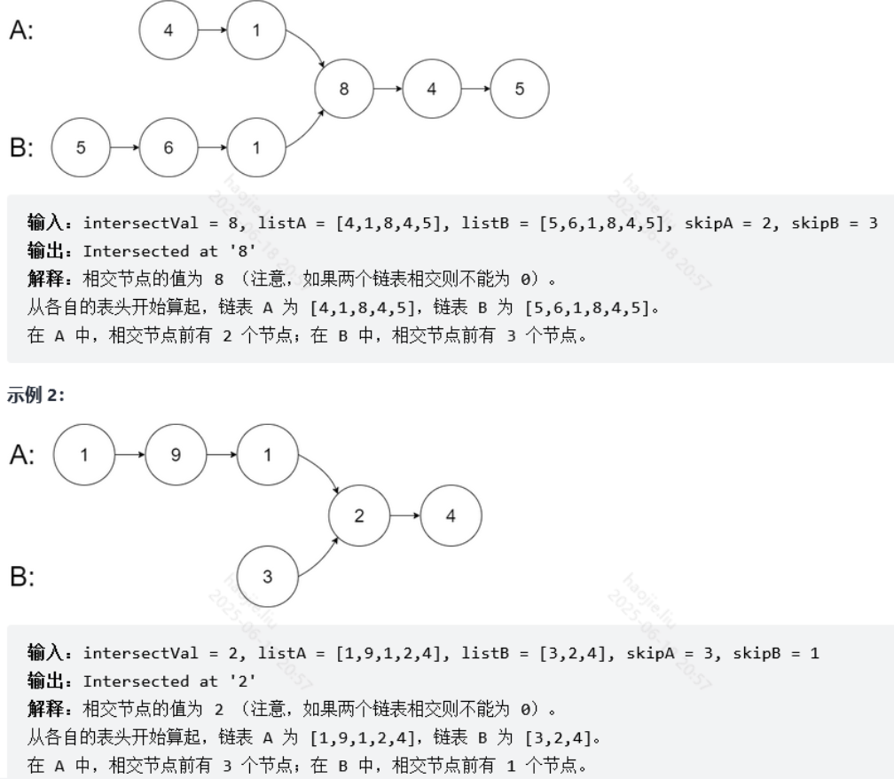

# 其他（数学/特殊）

### 移动零【简单】

思路：设置一个index，表示非0数的个数，循环遍历数组，
如果不是0，将非0值移动到第index位置,然后index + 1
遍历结束之后，index值表示为非0的个数，再次遍历，从index位置后的位置此时都应该为0

```java
    public void moveZeroes(int[] nums) {
        if (nums == null || nums.length <= 1) {
            return;
        }
        int index = 0;
        for (int i = 0; i < nums.length; i++) {
            if (nums[i] != 0) {
                nums[index] = nums[i];
                index++;
            }
        }

        for (int i = index; i < nums.length; i++) {
            nums[i] = 0;
        }
    }
```

### 相交链表(两个链表的第一个公共节点)




```java
public class Solution {
    public ListNode getIntersectionNode(ListNode headA, ListNode headB) {
        ListNode A = headA, B = headB;
        while(A != B){
            A = A != null ? A.next : headB;
            B = B != null ? B.next : headA;
        }
        return A;
    }
}
```

### 用 Rand7() 实现 Rand10()

```java
class Solution extends SolBase {
    public int rand10() {
        //这个算法就是将数值拉长到 7 * 9 = 63段可能性，且每段都尽量概率统一，7个数，每个数都有0~9的可能性，+1就是1~10了
        while(true){
            int res = (super.rand7() - 1) * 7 + super.rand7();
            if(res <= 40)
                return 1 + res % 10;
            //大于40的最大情况就是49，余9 那么对于这9个数最大对应就是7*9
            //63
            res = (res - 40 - 1) * 7 + super.rand7();
            if(res <= 60)
                return 1 + res % 10;
            //对于余下的3个数，最大即为 3*7 = 21
            res = (res - 60 - 1) * 7 + super.rand7();
            if(res <= 20)
                return 1 + res % 10;
        }
    }
}
```

### Pow(x, n)


**快速幂**

```java
    //快速幂
    //幂在每一次都折半变小，直到变成0
    public double myPow(double x, int n) {
        double res = 1.0;
        for(int i = n; i != 0; i /= 2){
            if(i % 2 != 0){
                res *= x;
            }
            x *= x;
        }
        return  n < 0 ? 1 / res : res;
    }

    public double myPow(double x, int n) {
        if (n == 0) {
            return 1.0;
        //看左一位是1是0，看它是偶数还是奇数
        } else if ((n & 1) == 0) {
            return myPow(x * x, n / 2);
        } else {
            return (n > 0 ? x : 1.0 / x) * myPow(x * x, n / 2); 
        }
    }
```

### 字典序的第K小数字


```java
class Solution {
    //该题的思路就是构造一颗十叉树
    //n的规律如下：
    /*
    从1开始，1，2，3，4，5，6，7，8，9
    从10开始，1，10…19，2，3，4，5，6，7，8，9
    从20开始，1，10…19，2，20…29，3，4，5，6，7，8，9
    以此类推，所有的两位数，都插入了到与他们10位数相等的个位数后面。

    再让我们来看看百位数如何插入
    从100开始，1，10,100-109,11,110-119,12,120-129…2，21-29…
    从200开始，1，10,100-109…2,20,200-209，21,210-219…3，31-39…
    以此类推，所有的三位数，都插入了到与他们百位至十位数相等的十位数后面。
    */
    //例如本题的例子：n=13，构造的十叉树如下
    //  1
    //
    public int findKthNumber(int n, int k) {
        //默认前缀为1
        int prefix = 1;
        //指向当前位置，当cur == k时也就是结果
        int cur = 1;
        while(cur < k){
            int count = getCount(prefix, n);
            //如果当前节点+当前前缀的节点数量是大于k的就说明这个k的位置还在该前缀的下一层
            if(cur + count > k){
                //给前缀*10就变为下一层即 1 - 》10
                prefix *= 10;
                //移动当前节点的位置
                cur++;
            }else{ //说白了，当前的前缀小了嘛，我们扩大前缀。
                prefix++;
                cur += count;
            }
        }
        return prefix;
    }

    //每一个节点都拥有 10 个孩子节点，因为作为一个前缀 ，它后面可以接 0~9 这十个数字。
    //而且你可以非常容易地发现，整个字典序排列也就是对十叉树进行先序遍历。
    //1, 10, 100, 101, ... 11, 110 ...
    //这个方法是得到该前缀下的所有节点数量，n为上界
    public int getCount(int prefix, int n){
        //当前前缀
        int cur = prefix;
        //下一个前缀
        int next = prefix + 1;
        //返回的结果
        int resCount = 0;
        //当前的前缀不能大于上界，前缀都大于上界了，完整的肯定大于上界了
        while(cur <= n){
            //这里之所以要用n+1和next取最小，是因为n可能是不完美的，即可能是13,14等
            //如果直接是next-cur ，上面的上界12前缀为1算出来是11个节点数量，
            //实际上其实是4个，1 10 11 12
            resCount += Math.min(n + 1, next) - cur;
            //这两个每扩大10倍都增加一层的树高
            cur *= 10;
            next *= 10;
        }
        //将所有结点数目返回
        return resCount;
    }
}
```

### 打乱数组

```java
class Solution {
    int[] nums;
    int n;
    Random random = new Random();
    public Solution(int[] _nums) {
        nums = _nums;
        n = nums.length;
    }
    public int[] reset() {
        return nums;
    }
    public int[] shuffle() {
        int[] ans = nums.clone();
        for (int i = 0; i < n; i++) {
            swap(ans, i, i + random.nextInt(n - i));
        }
        return ans;
    }
    void swap(int[] arr, int i, int j) {
        int c = arr[i];
        arr[i] = arr[j];
        arr[j] = c;
    }
}
```

### 第N个数字


```java
class Solution {
    public int findNthDigit(int n) {
        long k = n;
        for (int i = 1; ; i++) {
            //这个地方就是看n的范围： i * Math.pow(10, i)
            //如果 i = 1 为10，k如果是小于10的则直接返回
            //大于10，i继续扩张 i = 2 为 200 及 10～200 这个范围直接返回
            //大于200 i = 3 则为 200～3000
            //大于 3000 i = 4 则为 3000～40000
            if (i * Math.pow(10, i) > k) {
                //以n=11为例的第二伦
                //200 》111 111 / 2. charAt(111 % 2)
                return Long.toString((int) (k / i)).charAt((int) (k % i)) - '0';
            }
            //如果k不在上面那个范围，同时k也会扩大，就是给n补零的操作
            //最后满足范围，对k进行取余i，那个位上的数就是我们补零的地方
            k += Math.pow(10, i);
        }
    }
}
```

### 分数到小数

**模拟除法移位补零并用map记录循环部分**

```java
class Solution {
    /**
     * @param numerator     分子
     * @param denominator   分母
     * @return
     */
    public String fractionToDecimal(int numerator, int denominator) {
        StringBuilder sb = new StringBuilder();
        //将两者转换为long，防止溢出的情况
        long a = numerator, b = denominator;
        //负数情况
        if(a < 0 && b > 0 || a > 0 && b < 0)
            sb.append('-');
        //取绝对值进行计算不然最后会无法进行转int
        a = Math.abs(a);
        b = Math.abs(b);
        sb.append(a / b);
        //能整除直接返回
        if(a % b == 0)
            return sb.toString();
        //到这里也就是说产生了小数了
        sb.append('.');
        //利用map的特性去看是否有无限循环小数的循环部分
        Map<Long, Integer> memory = new HashMap<>();
        //模拟除法运算的添0过程
        //退出条件要么是整除了，要么是循环了
        while((a = (a % b) * 10) > 0 && !memory.containsKey(a)){
            //第一轮:
            //  比如a=1,b=5
            //  整数部分1/5=0
            //  a%b=1, *10=10, a=10
            //第二轮：
            //  10%5=0，退出循环
            memory.put(a, sb.length());
            //第一轮：map:10，2
            sb.append(a / b);
            //第一轮：10/5=2, sb=0.2
        }
        //除尽了
        if (a == 0) 
            return sb.toString();
        //没除尽
        //String参数的字符按顺序插入到指定偏移量的此序列中，向上移动最初位于该位置上方的任何字符，并将该序列的长度增加参数的长度。
        return sb.insert(memory.get(a).intValue(), '(').append(')').toString();
    }
}
```

### 数字转换为十六进制数

**取余**

```java
class Solution {
    public String toHex(int num) {
        if(num == 0)
            return "0";
        //防止溢出
        long res = num;
        StringBuilder sb = new StringBuilder();
        //对于负数的 num，我们需要先在 num 基础上加上 2的32次方 的偏移量，再进行进制转换。
        if(res < 0)
            res = (long)(Math.pow(2, 32) + res);
        while(res != 0){
            //得出余数，余数的部分是没有进位产生的
            long temp = res % 16;
            //如果余数小于等于10，直接能够用0~9表示，所以转换成字符就行了
            char c = (char) (temp + '0');
            //如果余数大于10就要使用a~f的字母表示，减10是因为得到对应字母，例如10 - 10 + 'a' = a
            if(temp >= 10){
                c = (char)(temp - 10 + 'a');
            }
            sb.append(c);
            res /= 16;
        }
        //记得翻转，因为我们从低位开始加入的
        return sb.reverse().toString();
    }
}
```

**位运算**


```java
class Solution {
    public String toHex(int num) {
        if(num == 0)
            return "0";
        StringBuilder sb = new StringBuilder();
        //对于负数的 num，我们需要先在 num 基础上加上 2的32次方 的偏移量，再进行进制转换。
        while(num != 0){
            //得出余数，余数的部分是没有进位产生的，与取余16效果差不多，但是像-1时，我们就需要进行补码那么就需要进行位运算
            //原数跟1111的二进制进行与操作就是区域，但是是以补码形式，所以不怕负数
            int temp = num & 15;
            //如果余数小于等于10，直接能够用0~9表示，所以转换成字符就行了
            char c = (char) (temp + '0');
            //如果余数大于10就要使用a~f的字母表示，减10是因为得到对应字母，例如10 - 10 + 'a' = a
            if(temp >= 10){
                c = (char)(temp - 10 + 'a');
            }
            sb.append(c);
            num >>>= 4;
        }
        //记得翻转，因为我们从低位开始加入的
        return sb.reverse().toString();
    }
}
```

### 不用加减乘除做加法

a+b
举例实现：13+9=22
13+9不考虑进位结果为12
只考虑进位结果为10
和刚好是22。
13二进制为1101，9二进制为1001。
不考虑进位结果为0100。算式为a^b
只考虑进位结果为10010。算式为（a&b）<< 1
然后它俩继续进行运算，直到进位为0。

```java
class Solution {
    public int add(int a, int b) {
        int res;
        while(b!=0){
            res = (a & b) << 1;
            a = a ^ b;
            b = res;
        }
        return a;
    }
}
```

### 二进制中1的个数

```java
public class Solution {
    // you need to treat n as an unsigned value
    public int hammingWeight(int n) {
        //设置判断变量
        //int temp = 1;
        int res = 0;
        while(n!=0){
            //这里通过与运算（只有两个1才是1，其他情况都是0）来逐位判断是否为1，与变量比较如果结果是1则进行结果加一并进行移位，如果结果不是1则直接进行移位
            res += n & 1;
            n >>>= 1;
        }
        return res;
    }
}

/*
public class Solution {
    public int hammingWeight(int n) {
        int res = 0;
        while(n != 0) {
            res++;
            //这个式子就是表示，先讲n的值减一，如果碰到1且在最后一位直接减去，除去最后一位的情况其他位的1被减去1的时候，该位1点右边的0将会全部变成1，00110010--减1--》00110001，然后在与n本身做与运算，-----》00110000，这样又将下一个1之后的位全部置成了0，然后继续下一个循环，每个循环res加一，最后返回即可
            n &= n - 1;
        }
        return res;
    }
}
*/

```