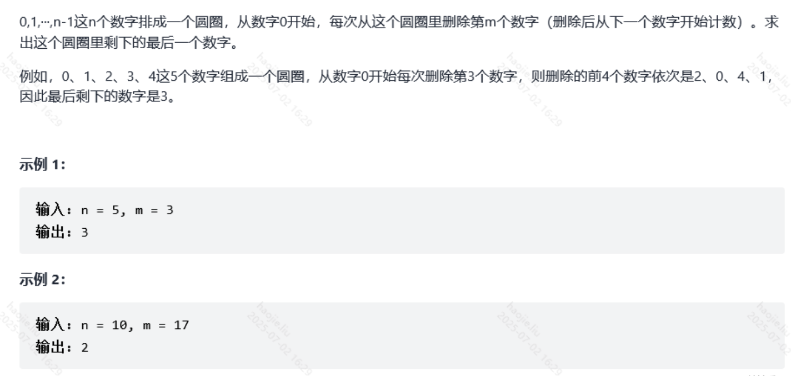
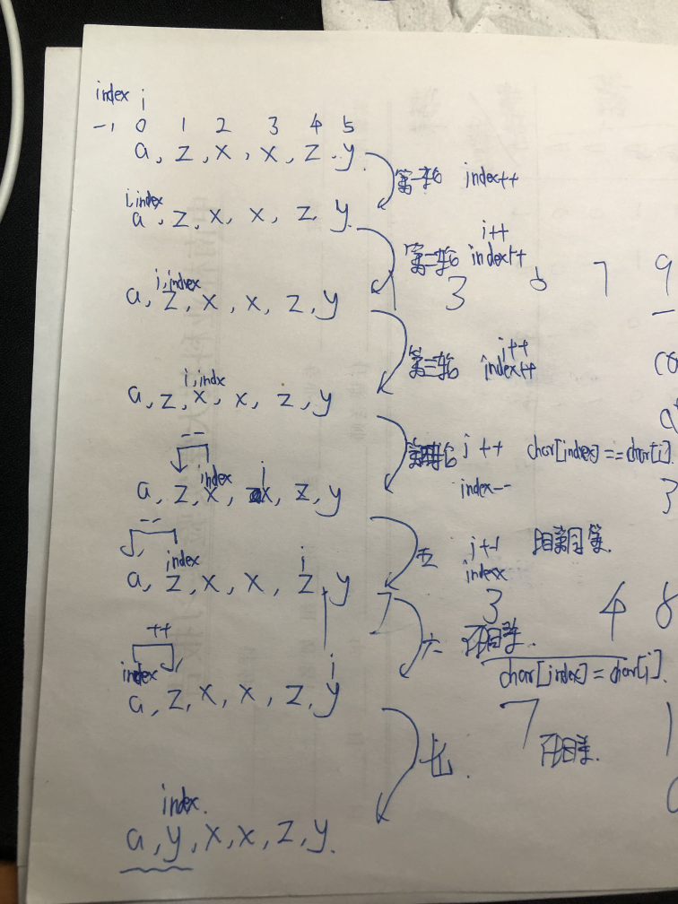

# Simple

### 用队列实现栈

```java
class MyStack {
    Deque<Integer> stack1;
    //Deque<Integer> stack2;

    public MyStack() {
        stack1 = new LinkedList<>();
        //stack2 = new LinkedList<>();
    }

    public void push(int x) {
        stack1.push(x);
    }

    public int pop() {
        return stack1.pop();
    }

    public int top() {
        return stack1.peek();
    }

    public boolean empty() {
        if(stack1.size()==0){
            return true;
        }
        return false;
    }
}
```

### 圆圈中最后剩下的数字



```java
class Solution {
    public int lastRemaining(int n, int m) {
        return f(n, m);
    }

    public int f(int n, int m) {
        if (n == 1) {
            return 0;
        }
        int x = f(n - 1, m);
        return (m + x) % n;
    }
}
```

### 调整数组顺序使奇数位于偶数前面

```java
class Solution {
    public int[] exchange(int[] nums) {
        /*int temp[] = new int[nums.length];
        int j = 0;
        for(int i = 0;i < nums.length;i++){
            if(nums[i] % 2 != 0){
                temp[j] = nums[i];
                j++;
            }
        }
        for(int i = 0;i < nums.length;i++){
            if(nums[i] % 2 == 0){
                temp[j] = nums[i];
                j++;
            }
        }
        return temp;*/
        //官方的做法：定义双指针，一个从数组开始向后遍历一个从数组结束的位置向前遍历，遇到前面是偶数后面是奇数就交换，直到左右指针相等
        int temp = 0;
        int left = 0;
        int right = nums.length - 1;
        while(left < right){
            //左边如果指向的为奇数就继续右移。如果指向的偶数就不进行右移等待被交换
            if(nums[left] % 2 != 0){
                left++;
                continue;
            }

            //同理如果指向的奇数就不进行左移，如果是偶数就进行左移
            if(nums[right] % 2 == 0){
                right--;
                continue;
            }

            temp = nums[left];
            nums[left] = nums[right];
            nums[right] = temp;
        }
        return nums;
    }
}
```

### 扑克牌中的顺子

```java
class Solution {
    //根据下面两个来理解以下题意，0能充当任意数，我们说的顺子就是1 2 3 中间的差值只能为1
    //那么我们就需要根据0来填充了
    //[0,0,1,2,5]--->1 2 3 4 5, 3和4都是0变得
    //[0,0,2,2,5]--->2 2 3 4 5 可以看到多了个2并不是顺子
    public boolean isStraight(int[] nums) {
        int n = nums.length;
        int i = 0, j = 1, zeroNum = 0;
        Arrays.sort(nums);

        while(zeroNum < n){
            //先去搜索0
            if(nums[zeroNum] == 0)
                zeroNum++;
            else
                break;
        }
        //从0之后的位置开始遍历
        i = zeroNum; j = zeroNum + 1;
        while(j < n){
            //看两数的差异
            int difference = nums[j] - nums[i];
            //差异等于1就说明是递增的，更新i，j继续遍历
            if(difference == 1){
                i++; j++;
            }else if(difference - zeroNum >= 2) //这里就是0不够用了
                return false;  
            else if(difference == 0)    //这里就是出现两个一样的牌，那是对子不是顺子
                return false;
            else if(difference == zeroNum + 1){ //这里就是0刚好够用，然后补上，把0的数量
            //归位，然后更新i，j
                i++; j++;
                zeroNum = 0;
            }else   //其他的都是对
                return true;
        }
        return true;
    }
}
```

### 重复的子字符串

**很妙的解法，存在循环子串的，每次进行反转（后面的移动到前面）最终会转回去**


```java
class Solution {
   public boolean repeatedSubstringPattern(String s) {
        String str = s + s;
        return str.substring(1, str.length() - 1).contains(s);
    }
}
```

**KMP算法：就是消除对于主串指针的回退**

```java
class Solution {
    public boolean repeatedSubstringPattern(String s) {
        if (s.equals("")) return false;

        int len = s.length();
        int[] next = new int[len];

        // 构造 next 数组过程，j从0开始(空格)，i从2开始
        for (int i = 1, j = 0; i < len; i++) {
            // 匹配不成功，j回到前一位置 next 数组所对应的值
            while (j > 0 && s.charAt(i) != s.charAt(j)) j = next[j - 1];
            // 匹配成功，j往后移
            if (s.charAt(i) == s.charAt(j)) j++;
            // 更新 next 数组的值
            next[i] = j;
        }

        // 最后判断是否是重复的子字符串，这里 next[len] 即代表next数组末尾的值
        if (next[len - 1] > 0 && len % (len - next[len - 1]) == 0) {
            return true;
        }
        return false;
    }
}
```

### Excel表列名称


```java
class Solution {
    public String convertToTitle(int cn) {
        StringBuilder sb = new StringBuilder();
        while (cn > 0) {
            cn--;
            sb.append((char)(cn % 26 + 'A'));
            cn /= 26;
        }
        sb.reverse();
        return sb.toString();
    }
}
```

### 删除字符串中的所有相邻重复项

**题目是消除成对的**

```java
class Solution {
    public String removeDuplicates(String s) {
        StringBuilder sb = new StringBuilder();
        Stack<Character> stack = new Stack();
        int i = 0;
        //这个循环使用for结构会更清晰一点
        while(i < s.length()){
            char ch = s.charAt(i);
            // 栈为空||当前元素ch与栈顶不同->直接入栈
            if(stack.isEmpty() || ch != stack.peek()){
                stack.push(s.charAt(i));
                i++;
                // 栈不为空并且ch与栈顶相同->弹出栈顶
            }else{
                stack.pop();
                i++;
            }
        }
        while(!stack.isEmpty())
            sb.append(stack.pop());
        //记得反转
        return sb.reverse().toString();
    }
}
```



> 如果是形如 aaaaa这种，index会一直在 0 和 -1徘徊
> 

> 如果最后字符串是偶数个，index则为-1，奇数个则为0
> 

```java
class Solution {
    //这次直接使用数据当做栈来代替stack，这样就不会有申请内存空间扩容了
    public String removeDuplicates(String s) {
        int index = -1;
        char[] chs = s.toCharArray();
        for(int i = 0; i < chs.length; i++){
            if(index >= 0 && chs[index] == chs[i])
                index--;
            else{
                index++;
                chs[index] = chs[i];
            }
        }
        //从索引为0的开始，需要index+1个
        return String.copyValueOf(chs, 0, index + 1);
    }
}
```

### 数组中重复的数字

**原地hash就完事了**

```java
class Solution {
    public int findRepeatNumber(int[] nums) {
        int len = nums.length;
        int[] hash = new int[len];

        Arrays.fill(hash, -1);
        for(int i = 0; i < len; i++){
            if(hash[nums[i]] != -1)
                return nums[i];
            else 
                hash[nums[i]] = nums[i];
        }
        return -1;
    }
}
```

**真·原地hash**

```java
class Solution {
    public int findRepeatNumber(int[] nums) {
        int temp = -1;
        for(int i = 0; i < nums.length;){
            //这里就是防止一开始元素值本就放在了应该在的位置，我们会误判的情况
            if(nums[i] == i){
                i++;    //这里很精髓的就是只有在元素归位到自己的位置才进行前进
                //要不然就会出现将被交换的元素放到前面直接不确认的情况
                continue;
            }
            if(nums[nums[i]] != nums[i]){
                temp = nums[nums[i]];
                nums[nums[i]] = nums[i];
                nums[i] = temp;
            }else
                return nums[i];
        }
        return -1;
    }
}
```

### 旋转数组的最小数字


```java
class Solution {
    public int minArray(int[] numbers) {
        for(int i = 0; i < numbers.length - 1;i++){
            //根据题意如果出现了后面一个比前面一个小的元素那必然是最小的
            if(numbers[i] > numbers[i + 1])
                return numbers[i + 1];
        }
        //如果for循环以后都没找到那必然是第一个元素了
        return numbers[0];
    }
}
```

### 位1的个数

```java
public class Solution {
    //1.计算出来的值i的二进制可以按每2个二进制位为一组进行分组，各组的十进制表示的就是该组的汉明重量。
    //2.计算出来的值i的二进制可以按每4个二进制位为一组进行分组，各组的十进制表示就是该组的汉明重量
    //同理上一步就是按每8个二进制位为一组进行分组
    //i * (0x01010101)计算出汉明重量并记录在二进制的高八位，>>24语句则通过右移运算，将汉明重量移到最低八位，最后二进制对应的十进制数就是汉明重量。
    public int hammingWeight(int i) {
        //例如i = 11 后面8位是 00001011  可以看到总共有三个1
        //第一步计算完 i = 00000110  十进制为6
        //第二步计算完 i = 
        i = (i & 0x55555555) + ((i >> 1) & 0x55555555);
        i = (i & 0x33333333) + ((i >> 2) & 0x33333333);
        i = (i & 0x0F0F0F0F) + ((i >> 4) & 0x0F0F0F0F);
        i = (i * (0x01010101) >> 24);
        return i;
    }

    //移动32次，每次统计最后一位的值，是否为1
    //这里要使用无符号移动，在 Java中使用有符号移动那么高位会使用1补齐，导致
    //永远不会到头，所以无符号直接补0就好
    public int hammingWeight(int i) {
        int count = 0;
        while(i != 0){
            count += i & 1;
            i >>> 1;
        }
        return count;
    }

    //这里就是i & (i - 1) 就能将最后一位的1给置为0
    public int hammingWeight(int i) {
        int res = 0;
        while(i != 0){
            i &= i - 1;
            res += 1;
        }
        return res;
    }
}
```

### 在排序数组中查找数字 I


```java
class Solution {
    public int search(int[] nums, int target) {
        if(nums.length==0||target<nums[0]||target>nums[nums.length-1])
            return 0;
        int temp = 0;
        for(int i=0;i<=nums.length-1;i++){
            if(target==nums[i])
                temp++;
        }
        if(temp==0)
            return 0;
        return temp;
    }
}
```

### 两数之和 II - 输入有序数组

**双指针，这个真的建议你去看看题解很经典，结合二维数组很清晰**

https://leetcode.cn/problems/two-sum-ii-input-array-is-sorted/solutions/87919/yi-zhang-tu-gao-su-ni-on-de-shuang-zhi-zhen-jie-fa/

```java
class Solution {
    public int[] twoSum(int[] numbers, int target) {
        int len = numbers.length;
        int i = 0, j = len - 1;
        while(i < j){
            int sum = numbers[i] + numbers[j];
            if(sum > target)
                j--;
            else if(sum < target)
                i++;
            else
                return new int[]{i + 1, j + 1};
        }
        return new int[]{-1, -1};
    }
}
```

### 缺失数字

**一眼顶正，鉴定为原地hash，但其实是伪原地hash，我们这准确的叫数组hash，因为引用了一个辅助数组**

```java
class Solution {
    //一眼原地hash
    public int missingNumber(int[] nums) {
        int len = nums.length;
        int[] hash = new int[len+1];
        Arrays.fill(hash, -1);
        for(int i = 0; i < len; i++){
            hash[nums[i]] = nums[i];
        }
        int res = 1;
        for(int i = 0; i < len+1; i++){
            if(res + hash[i] < res)
                return i;
        }
        return -1;
    }
}
```

**真·原地hash，如果存在数组长度的那个元素，那么我们先将除了这个元素的其他元素落位，那么最后该元素肯定落在了缺失的那个数字的位，然后遍历检查就好**

```java
    public int missingNumber(int[] nums) {
        int n = nums.length;
        for(int i = 0; i < n; i++){
            if(nums[i] != i && nums[i] < n){
            //这里就是将当前不符合位置的元素交换到应该去的位置，并初始化i的起始值
            //例如 [9,6,4,2,3,5,7,0,1]，先是将i=1时的6归位到i=6时到7的位置
            //实际上就是1根6这两个位置的元素值进行交换，把元素7交换到1的位置
            //并且交换完需要将i初始化位i-1，然后再进循环变为i，因为7被换过来
            //还需要处理啊
                swap(nums, nums[i], i--);    //交换方法
            }
        }
        for(int i = 0; i < n; i++){
            if(nums[i] != i)
                return i;
        }
        return n;    //都在那么就返回n即【0，1】返回2
    }
```

**我们还可以使用等差数列的和与数组元素的和直接的差就是结果**

```java
class Solution {
    public int missingNumber(int[] nums) {
        int n = nums.length;
        int cur = 0, sum = n * (n + 1) / 2;
        for (int i : nums) cur += i;
        return sum - cur;
    }
}
```

**还可以使用异或运算，对一个数异或两次肯定最后是0，那么只出现一次的数最后结果就剩他自己了**

```java
class Solution {
    public int missingNumber(int[] nums) {
        int n = nums.length;
        int ans = 0;
        //先对正确的序列进行异或
        for (int i = 0; i <= n; i++) ans ^= i;
        for (int i : nums) ans ^= i;
        return ans;
    }
}
```

### 有序数组的平方


**双指针**

```java
class Solution {
    public int[] sortedSquares(int[] nums) {
        int len = nums.length;
        //双指针，根据数组特性，结果数组的最大值都出现在平方数组后的最左或最右
        int left = 0, right = len - 1;

        int[] arrPow = new int[len];
        //我们要从降序的方向设置结果数组
        int write = len - 1;

        while(left <= right){
            if(nums[left] * nums[left] > nums[right] * nums[right]){
                arrPow[write] = nums[left] * nums[left];
                left++;
            }else{
                arrPow[write] = nums[right] * nums[right];
                right--;
            }
            write--;
        }
        return arrPow;
    }
}
```

### 阶乘后的零


```java
class Solution{
    public int trailingZeroes(int n) {
        int count = 0;
        while (n > 0) {
            count += n / 5;
            n = n / 5;
        }
        return count;
    }
}
```

### Excel表列序号

**简单的迭代，进行字符的AscII码操作**

```java
class Solution {
    public int titleToNumber(String s) {
        int len = s.length();
        int res = 0;
        for(int i = 0; i < len; i++){
            //如果存在第二位，那么第一位就需要乘26
            //括号里面计算出来当前位的对应值，+1是因为A对应1，A-A=0了
            res = res * 26 + (s.charAt(i) - 'A' + 1);
        }
        return res;
    }
}
```

### 搜索插入位置

**利用二分，记录大于等于target的最小下标，即找到大于等于target的最小下标，查找最小那么存储结果的初始值就是设置成最大的结果，因为可能找了一圈在数组的最后一个位置例如：[1,2,4,8] target=9，此时存储结果的初始值就是nums.length即5**

```java
class Solution {

    public int searchInsert(int[] nums, int target) {
        int left = 0, right = nums.length - 1;
        int res = nums.length;
        while(left <= right){
            int mid = (left + right) / 2; 
            if(nums[mid] >= target){
                res = mid;
                right = mid - 1;
            }else 
                left = mid + 1;
        }
        return res;
    }
}
```

**循环寻找**

```java
    public int searchInsert(int[] nums, int target) {
        for(int i = 0; i < nums.length; i++){
            if(target < nums[i])
                return 0;
            if(nums[i] == target)
                return i;
            if(nums[i] < target){
                if(i <= nums.length - 2 && nums[i + 1] > target)
                    return i + 1;
            }
            if(nums[nums.length - 1] < target)
                return nums.length;
        }
        return 1;
    }
```

### 翻转单词顺序

```java
class Solution {
    public String reverseWords(String s) {
        String[] strArr = s.split(" ");
        String str = "";
        for(int i = strArr.length - 1;i >= 0;i--){
            if(strArr[i].equals(""))
                continue;
            //这里记得先判断，末尾的因为如果只有一个数字的时候我们是不需要加空格的
            if(i == strArr.length - 1){
                str = str + strArr[i];
                continue;
            }else if(i == 0){
                str = str + " " +strArr[i];
                break;

            }
            str = str + " " + strArr[i];
        }
        return str;
        /*
        StringBuilder sb = new StringBuilder();
        for(int i = s.length() - 1;i > 0;i--){
            sb.append(s.charAt(i));
        }
        return sb.toString();
        */
    }
}
```

### 0～n-1中缺失的数字


```java
class Solution {
    public int missingNumber(int[] nums) {
        if(nums[0] != 0)
            return 0;
        if(nums.length == 1 && nums[0] == 0)
            return nums[0] + 1;
        for(int i = 0;i < nums.length - 1;i++){
            if(nums[i+1] - nums[i] != 1){
                return nums[i] + 1;
            }
        }
        return nums[nums.length-1] + 1;
    }
}
```

### 替换空格

```java
class Solution {
    //String temp = "";
    public String replaceSpace(String s) {
        /*String[] array = s.split("");
        for(int i = 0;i < array.length;i++){
            if(" ".equals(array[i]))
                array[i] = "%20";
            temp = temp + array[i];
        }

        return temp;*/

        return s.replace(" ", "%20");
    }
}
```

### 下一个更大元素 I

**没啥说的，三个for走起**

```java
class Solution {
    public int[] nextGreaterElement(int[] nums1, int[] nums2) {

        for(int i = 0; i < nums1.length; i++)
            for(int j = 0; j < nums2.length; j++){
                int temp = nums1[i];
                if(temp != nums2[j])
                    continue;
                else{
                    int change = findBigger(nums2, j);
                    nums1[i] = change; 
                    break;
                }

            }
        return nums1;
    }

    public int findBigger(int[] nums2, int index){
        for(int i = index + 1; i < nums2.length; i++){
            if(nums2[index] < nums2[i])
                return nums2[i];
            else
                continue;
        }
        return -1;
    }
}
```

### 左旋转字符串

```java
/*class Solution {
    public String reverseLeftWords(String s, int n) {
        //String s1 = s.substring(0, n);
        //String s2 = s.substring(n, s.length());
        return s.substring(n, s.length()) + s.substring(0, n);
    }
}*/

class Solution {
    /*
    public String reverseLeftWords(String s, int n) {
        StringBuilder sb = new StringBuilder();
        //先将分割之后的字符串一个一个加入到sb中
        for(int i = n; i < s.length();i++){
            sb.append(s.charAt(i));
        }
        //然后再将需要分割的部分依次加入到sb到尾
        for(int i = 0; i < n;i++){
            sb.append(s.charAt(i));
        }
        return sb.toString();
    }*/

    //这个是上面的优化
    //用取余的方式来区别两个部分append优先顺序
    public String reverseLeftWords(String s, int n){
        StringBuilder sb = new StringBuilder();
        //先以n开始，到达比n本身大之后就开始取余需要加到尾部的那一部分
        for(int i = n;i < n + s.length();i++){
            sb.append(s.charAt(i % s.length()));
        }
        return sb.toString();
    }
}

```

### 排列硬币

**还是用二分查找来找小于等于的最大元素**

```java
class Solution {
    //题目符合等差数列，我们看是否符合前n项和
    //Sn = na1 + (n * (n - 1)) / 2 
    //本道题就可以用二分查找，寻找小于等于target的最大前n项目和的项数
    public int arrangeCoins(int n) {
        long left = 0, right = 10000000;
        long res = 0;
        while(left <= right){
            long mid = (left + right) / 2;
            if(mid+(mid * (mid - 1)) / 2 <= n){
                res = mid;
                left = mid + 1;
            }else 
                right = mid - 1;
        }
        return (int)res;
    }
}
```

### 有效的完全平方数

**用二分查找就可**

```java
class Solution {
    public boolean isPerfectSquare(int num) {
        long left = 0, right = 10000000;
        long res = 0;
        while(left <= right){
            long mid = (left + right) / 2;
            if(mid * mid <= num){
                res = mid;
                left = mid + 1;
            }else 
                right = mid - 1;
        }
        return res * res == num;
    }
}
```