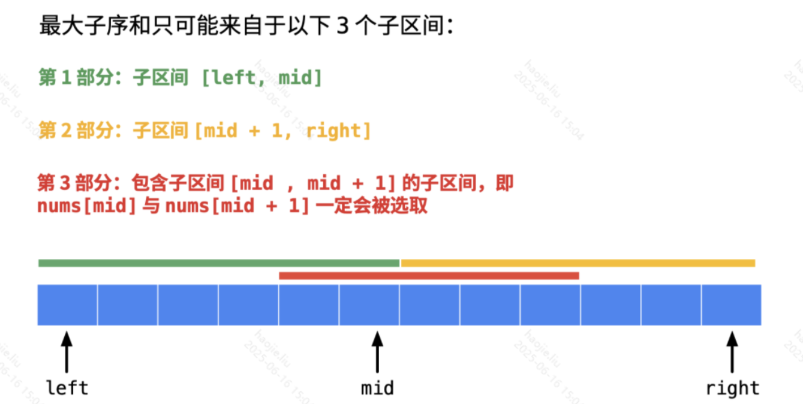

# 动态规划

### **最大子数组和**

题干：给定一个整数数组 `nums`，请找出一个具有最大和的**连续子数组**（子数组最少包含一个元素），返回其最大和。

最大子数组和要求选出来的是一个 **连续区间**。

**动态规划解法**

```java
class Solution {
    public int maxSubArray(int[] nums) {
        int len = nums.length;
        // dp[i] 表示：以 nums[i] 结尾的连续子数组的最大和
        int[] dp = new int[len];
        dp[0] = nums[0];
        int res = dp[0];    //这里注意降结果初始化为dp【0】
        //以上面这个数组为例，i的范围是1到8，
        //是因为数组的索引是从0开始的，到最后一个数的时候其实不用
        //考虑他了，因为自己本身就在状态方程中得到了体现
        for(int i = 1; i < len; i++){
            //取res本身的情况就是temp[i-1]是小于等于0的
            if(dp[i - 1] > 0)
                dp[i] = dp[i - 1] + nums[i];
            else
                dp[i] = nums[i];
            res = Math.max(dp[i], res);
        }
        return res;
    }
}
```

**分治思想解法：分类讨论**



```java
public class Solution {

    public int maxSubArray(int[] nums) {
        int len = nums.length;
        if (len == 0) {
            return 0;
        }
        return maxSubArraySum(nums, 0, len - 1);
    }

    private int maxCrossingSum(int[] nums, int left, int mid, int right) {
        // 一定会包含 nums[mid] 这个元素
        int sum = 0;
        int leftSum = Integer.MIN_VALUE;
        // 左半边包含 nums[mid] 元素，最多可以到什么地方
        // 走到最边界，看看最值是什么
        // 计算以 mid 结尾的最大的子数组的和
        for (int i = mid; i >= left; i--) {
            sum += nums[i];
            if (sum > leftSum) {
                leftSum = sum;
            }
        }
        sum = 0;
        int rightSum = Integer.MIN_VALUE;
        // 右半边不包含 nums[mid] 元素，最多可以到什么地方
        // 计算以 mid+1 开始的最大的子数组的和
        for (int i = mid + 1; i <= right; i++) {
            sum += nums[i];
            if (sum > rightSum) {
                rightSum = sum;
            }
        }
        return leftSum + rightSum;
    }

    private int maxSubArraySum(int[] nums, int left, int right) {
        if (left == right) {
            return nums[left];
        }
        int mid = left + (right - left) / 2;
        return max3(maxSubArraySum(nums, left, mid),
                maxSubArraySum(nums, mid + 1, right),
                maxCrossingSum(nums, left, mid, right));
    }

    private int max3(int num1, int num2, int num3) {
        return Math.max(num1, Math.max(num2, num3));
    }
}
```

**贪心解法**

```java
class Solution {
    public int maxSubArray(int[] nums) {
        int res = Integer.MIN_VALUE;
        int sum = 0;
        for(int num : nums){
            if(sum > 0)
                sum += num;
            //如果sum < 0，重新开始找子序串
            //这里不用担心数组全是负数的情况，因为有result去提前
            //维护这个还未初始化的sum值，求最大的负数最后也就只有一个
            else
                sum = num;
            res = Math.max(res, sum);
        }
        return res;
    }
}
```

**复杂度分析**

**DP (Kadane)**：
- 时间 O(n)：遍历数组一次，每个位置O(1)操作（1次if + 1次max）→ n×O(1)=O(n)
- 空间 O(1)：只需dp和res两个变量，不随n增长

**分治**：
- 时间 O(n log n)：T(n)=2T(n/2)+O(n)，递归深度log n，每层合并O(n)
- 空间 O(log n)：递归栈深度

### **返回**最大**子数组的起始位置和结束位置**
### **返回**最大**子数组的起始位置和结束位置**

题干：给定整数数组 `nums`，返回最大和的连续子数组的（最大和，起始下标，结束下标）。

```java
public class Solution {

    public static int[] maxSubArrayRange(int[] nums) {
        if (nums == null || nums.length == 0) {
            return new int[]{-1, -1};
        }

        // dp 表示：当前“必须以 nums[i] 结尾”的最大子数组和
        int dp = nums[0];

        // maxSum 表示：目前遇到过的最大子数组和
        int maxSum = nums[0];

        // tempStart 表示：当前正在计算的子数组的起始位置
        int tempStart = 0;

        // 最终答案的起始位置和结束位置
        int start = 0;
        int end = 0;

        for (int i = 1; i < nums.length; i++) {

            /*
             * 关键点 1：
             * 判断当前 nums[i] 是接在前面的子数组后面，
             * 还是从 nums[i] 自己重新开始。
             *
             * 如果 dp + nums[i] < nums[i]，
             * 说明前面的和是负贡献，不如从当前位置重新开始。
             */
            if (dp + nums[i] < nums[i]) {
                dp = nums[i];
                tempStart = i;
            } else {
                dp = dp + nums[i];
            }

            /*
             * 关键点 2：
             * 如果当前以 i 结尾的最大子数组和超过历史最大值，
             * 就更新最终答案的起点和终点。
             */
            if (dp > maxSum) {
                maxSum = dp;
                start = tempStart;
                end = i;
            }
        }

        // 返回：最大和、起始下标、结束下标
        return new int[]{maxSum, start, end};
    }
}
```

### 买卖股票的最佳时机

题干：给定数组 `prices`，其中 `prices[i]` 表示第 `i` 天的股票价格。你最多只能完成 **1 笔交易**（买入一次并卖出一次），返回你能获得的最大利润；如果不能获利，返回 0。


**动态规划**

```java
class Solution {    
    //动态规划，这种多阶段的题目很适合使用动态规划解决，根据题目可知，
    //符合动态的关键点就是当前是否持有股票（注意买入股票这个操作只能交易一次），
    //那么我们可以设置一个二维数组，来表示这个状态

    public int maxProfit(int[] prices) {
        int len = prices.length;
        // 特殊判断
        if (len < 2) {
            return 0;
        }
        int[][] dp = new int[len][2];

        // dp[i][0]的值所代表是 下标为 i 这天结束的时候，
        //不持股，手上拥有的现金数，而索引的含义所代表的意思有两种情况，
        //一是昨天没有买入股票，二是昨天持股，今天卖出股票

        // dp[i][1]的值所代表的是 下标为 i 这天结束的时候，持股，
        //手上拥有的现金数；同理这个索引也有两种意思，
        //一是昨天将股票买入，今天什么都不做现金与昨天一样，二是将股票今天买入，昨天不持股

        // 初始化：不持股即现金数显然为 0（并不代表我们没有钱，
        //这里这样表示就为了应对不发生交易的情况），持股就需要减去第 1 天（下标为 0）的股价
        dp[0][0] = 0;
        //当第一天结束后持股数量，就是持股数量的相反数就是现金数
        dp[0][1] = -prices[0];

        // 从第 2 天开始遍历
        for (int i = 1; i < len; i++) {
            dp[i][0] = Math.max(dp[i - 1][0], dp[i - 1][1] + prices[i]);
            //这样同理，第i天的持股数量就是当天股票价格的相反数，因为上面说过dp[i][1]的含义
            //即要么前些天持股不能买入，或者前些天未持股今天进行买入
            dp[i][1] = Math.max(dp[i - 1][1], -prices[i]);
        }
        return dp[len - 1][0];
    }
}
```

**优化空间复杂度 二维变一维**

- 记录【今天之前买入的最小值】
- 计算【今天之前最小值买入，今天卖出的获利】，也即【今天卖出的最大获利】
- 比较【每天的最大获利】，取最大值即可

```java
class Solution {
    public int maxProfit(int[] prices) {
        if(prices.length <= 1)
            return 0;
        int min = prices[0], max = 0;
        for(int i = 1; i < prices.length; i++) {
            max = Math.max(max, prices[i] - min);
            min = Math.min(min, prices[i]);
        }
        return max;
    }
}
```

**复杂度分析**

**DP（二维状态机）**：
- 时间 O(n)：遍历prices数组n天，每天更新持股/不持股两个状态，每次O(1) → n×2×O(1)=O(n)
- 空间 O(1)：dp[i]只依赖dp[i-1]，滚动优化后只需hold和notHold两个变量

**贪心（一次遍历）**：记录历史最低价min，每天计算prices[i]-min并更新最大利润
- 时间 O(n) / 空间 O(1)

### 买卖股票的最佳时机 II

题干：给定数组 `prices`，你可以完成 **任意多笔交易**（同一时间只能持有一股；卖出后才能再次买入），返回最大利润。

**同理也可以用一维数组优化，与1的优化一样**

```java
class Solution {
    //这里跟1的区别就是你买入卖出后还可以在买入卖出。以谋求最大利益
    //即不限制交易次数
    public int maxProfit(int[] prices) {
        int len = prices.length;

        if(len < 2)
            return 0;

        //状态 dp[i][j] 定义如下：
        //dp[i][j] 表示到下标为 i 的这一天，
        //持股状态为 j 时，我们手上拥有的最大现金数。

        //第一维 i 表示下标为 i 的那一天
        //（ 具有前缀性质，即考虑了之前天数的交易 ）；

        //第二维 j 表示下标为 i 的那一天是持有股票，
        //还是持有现金。这里 0 表示持有现金（cash），
        //1 表示持有股票（stock）。

        int[][] dp = new int[len][2];

        dp[0][0] = 0;
        //当第一天结束后持股数量，就是持股数量的相反数就是现金数
        dp[0][1] = -prices[0];

        // 从第 2 天开始遍历
        //这里 0 表示持有现金（cash），1 表示持有股票（stock）。
        for (int i = 1; i < len; i++) {
            dp[i][0] = Math.max(dp[i - 1][0], dp[i - 1][1] + prices[i]);
            //这样同理，第i天的持股数量就是当天股票价格的相反数，因为上面说过dp[i][1]的含义
            //这里其实就是跟1 的代码层面的区别就是在在某一天的持有股票，
            //需要将前一天的现金减去当天股票的价格，即dp[i - 1][0] - prices[i]
            dp[i][1] = Math.max(dp[i - 1][1], dp[i - 1][0] - prices[i]);
        }
        return dp[len - 1][0];
    }
}
```

**优化一维数组**

```java
//这里跟1的区别就是你买入卖出后还可以在买入卖出。以谋求最大利益
    //即不限制交易次数
    public int maxProfit(int[] prices) {
        int len = prices.length;

        if(len < 2)
            return 0;

        //状态 dp[i][j] 定义如下：
        //dp[i][j] 表示到下标为 i 的这一天，
        //持股状态为 j 时，我们手上拥有的最大现金数。

        //第一维 i 表示下标为 i 的那一天
        //（ 具有前缀性质，即考虑了之前天数的交易 ）；

        //第二维 j 表示下标为 i 的那一天是持有股票，
        //还是持有现金。这里 0 表示持有现金（cash），
        //1 表示持有股票（stock）。

        int[] dp = new int[2];

        dp[0] = 0;
        //当第一天结束后持股数量，就是持股数量的相反数就是现金数
        dp[1] = -prices[0];

        // 从第 2 天开始遍历
        for (int i = 1; i < len; i++) {
            dp[0] = Math.max(dp[0], dp[1] + prices[i]);
            //这样同理，第i天的持股数量就是当天股票价格的相反数，因为上面说过dp[i][1]的含义
            //与1的区别也是这一句
            dp[1] = Math.max(dp[1], dp[0] - prices[i]);
        }
        return dp[0];
    }
```

**暴力解法，其实代码不难 主要是要想到这道题是否符合暴力解法**

```java
public int maxProfit(int[] prices) {
        int len = prices.length;
        if(len < 2)
            return 0;

        int res = 0;
        for(int i = 1; i < len; i++){
            if(prices[i] - prices[i - 1] > 0)
                res += prices[i] - prices[i - 1];

        }
        return res;
    }
```

**复杂度分析**

**DP（状态机）**：
- 时间 O(n)：遍历一次，与I的唯一区别是买入时用dp[i-1][0]-prices[i]（而非-prices[i]），允许用之前的利润再买入 → O(n)
- 空间 O(1)：滚动优化后只需hold和notHold两个变量

**贪心**：只要prices[i]>prices[i-1]就累加差价，等价于无限次交易
- 时间 O(n) / 空间 O(1)

### 买卖股票的最佳时机 III

题干：给定数组 `prices`，你最多可以完成 **2 笔交易**（同一时间只能持有一股），返回最大利润。

**这个就是限制了购买股票的次数，不能大于等于2次，所以我们需要在增加一个维度来表示购买次数**

**注意这道跟四的区别是不一样的，这里是卖出才算做一次交易完成j+1，体现在代码就是卖出时看j-1**

**而第四是买入时就算做一次加1，体现在代码时就是卖出是j，买入才是j-1**

```java
class Solution {

    public int maxProfit(int[] prices) {
        int len = prices.length;
        //这里除2是因为min，MIN值+1就是最大值，因为最小值就溢出了，
        //符号位从1变成0了，就成了最大值
        int min = Integer.MIN_VALUE / 2;
        if(len < 2)
            return 0;
        //结束时的最高利润=[天数][是否持有股票][卖出次数]
        int[][][] dp = new int[len][2][3];
        //第一天休息
        dp[0][0][0] = 0;
        //第一天买入
        dp[0][1][0] = -prices[0];

        //第一天不可能已经有卖出
        dp[0][0][1] = min;
        dp[0][0][2] = min;

        //第一天不可能已经卖出
        dp[0][1][1] = min;
        dp[0][1][2] = min;

        //总共有六种情况
        for(int i = 1; i < len; i++){
            //未持股，没有交易即没有买入卖出
            dp[i][0][0] = 0;
            //未持股，卖出过一次，可能今天卖的也可能之前卖的
            dp[i][0][1] = Math.max(dp[i-1][1][0] + prices[i], dp[i-1][0][1]);
            //未持股，卖出过两次，可能今天卖的也可能之前卖的
            dp[i][0][2] = Math.max(dp[i-1][1][1] + prices[i], dp[i-1][0][2]);
            //持股，未卖出过，今天买的或之前买的
            dp[i][1][0] = Math.max(dp[i-1][0][0] - prices[i], dp[i-1][1][0]);
            //持股，卖出过一次，今天买的或之前买的
            dp[i][1][1] = Math.max(dp[i-1][0][1] - prices[i], dp[i-1][1][1]);
            //持股，卖出过两次，即后续没有任何买入行为了
            dp[i][1][2] = min;
        }
        //由于存在卖出了一次获利最大或者卖出了两次获利最大的，
        //又或者是没有进行任何的买入卖出
        return Math.max(Math.max(dp[len-1][0][1], dp[len-1][0][2]), 0);
    }
}
```

**复杂度分析**

- 时间 O(n)：每天有6种状态（持股/不持股 × 已卖出0/1/2次），状态数固定为6不随n增长，每步O(1) → O(n)
- 空间 O(1)：dp[i]只依赖dp[i-1]的6个状态值，用6个变量滚动即可

### 买卖股票的最佳时机 IV

题干：给定整数 `k` 和数组 `prices`，你最多可以完成 `k` 笔交易（同一时间只能持有一股），返回最大利润。

```java
class Solution {
    public int maxProfit(int k, int[] prices) {
        int len = prices.length;
        //这里除2是因为min，MIN值+1就是最大值，因为最小值就溢出了，
        //符号位从1变成0了，就成了最大值
        int min = Integer.MIN_VALUE / 2;

        if(len < 2)
            return 0;
        //结束时的最高利润=[天数][是否持有股票][卖出次数]
        //k+1是因为存在未买入的情况即没有发生交易
        int[][][] dp = new int[len][2][k+1];
        //还需要注意的点：因为一次交易涉及一天买入一天卖出，一共两天，
        //所以如果k值大于数组长度的一半，k就直接取数组长度的一半，
        //因为多余的交易次数无法达到
        k = Math.min(k, len / 2);

        //第一天不可能已经有卖出
        //第一天不可能已经卖出
        for(int i = 1; i <= k; i++){
            dp[0][0][i] = 0;
            dp[0][1][i] = -prices[0];
        }

        for(int i = 1; i < len; i++){
            for(int j = 1; j <= k; j++){
                //第i天进行了j次交易并且未持股，那么就是说明是今天卖出或前些天卖出的
                dp[i][0][j] = Math.max(dp[i-1][1][j] + prices[i], dp[i-1][0][j]);
                //第i天进行了j次交易并且持股，那么说明是今天买入或前些天买入的
                //这里的j-1可以这么理解，我们买入时对交易次数进行加1，卖出时是算作在这一次中的
                //所以才会出现跟前三道不一致的问题，只有买入的时候j才减1表示前j-1次加上本次
                dp[i][1][j] = Math.max(dp[i-1][0][j-1] - prices[i], dp[i-1][1][j]);
            }
        }
        //由于存在卖出了一次获利最大或者卖出了两次获利最大的，
        //又或者是没有进行任何的买入卖出
        return dp[len-1][0][k];
    }
}
```

**复杂度分析**

- 时间 O(n×k)：外层遍历n天，内层遍历k次交易 → n×k次状态转移。当k≥n/2时等效于无限交易，实际退化为O(n)
- 空间 O(k)：buy和sell两个长度为k+1的数组滚动更新。优化技巧：k=min(k, n/2)预处理

### 最长上升子序列

题干：给定一个整数数组 `nums`，返回其中 **最长严格递增子序列** 的长度。

最长上升子序列要求选出来的数 **相对顺序不变**，但可以不连续


**动态规划**

```java
class Solution {
    public int lengthOfLIS(int[] nums) {
        if(nums == null || nums.length == 0)
            return 0;
        int res = 0;
        //设置动态规划
        //dp[i]的意思就是以nums[i]为结尾的最长子序列
        int[] dp = new int[nums.length];
        //全部填充为1
        //因为单独一个元素也是一个子序列，所以最小的子序列长度应该为1
        Arrays.fill(dp, 1);
        for(int i = 0; i < nums.length; i++){
            for(int j = 0; j < i; j++){
                //如果后一个比前一个大那么就构成了递增
                if(nums[j] < nums[i]){
                    //然后当前的元素最长子序列，那么就等于本身，
                    //那么就等于前面的+1
                    //即虽然满足判断的条件，但也可能是中间有别的元素
                    //注意是子序列而不是子串
                    dp[i] = Math.max(dp[i],dp[j]+1);
                }
            }
            res = Math.max(dp[i], res);
        }
        return res;
     }
}
```

**优化空间复杂度**

> 将计算dp[i]的时间优化使用一个数组来保存最长子序列的状态，那个数组[i]就表示长度为i+1的子序列的尾部元素值.这个数组一定是严格递增的,直接看文字确实不太好懂，加个例子就比较容易明白，比如序列是[7,8,9,1,2,3,4,5]，前三个遍历完以后tail是[7,8,9]，这时候遍历到1，就得把1放到合适的位置，于是在tail二分查找1的位置，变成了[1,8,9]（如果序列在此时结束，因为res不变，所以依旧输出3），再遍历到2成为[1,2,9]，然后是[1,2,3]直到[1,2,3,4,5] 这题难理解的核心不在于算法难，而在于在于官方给的例子太拉了，遇不到这个算法真正要解决的问题，即没有我例子中1要代替7的过程，官例中每次替代都是替代tail的最后一个数
> 

```java
public int lengthOfLIS(int[] nums) {
        if(nums.length == 0)
            return 0;
        int[] tails = new int[nums.length];
        int res = 0;
        for(int num : nums){
            int start = 0, end = res;
            while(start < end){
                int mid = (start + end) / 2;
                if(tails[mid] < num)
                    start = mid + 1;
                else
                    //严格递增的，那么大于了num就往左找
                    end = mid;
            }
            tails[start] = num;
            if(res == end)
                res++;

        }
        return res;
     }
}
```

**复杂度分析**

**DP (O(n²))**：
- 时间 O(n²)：外层i从0到n-1，内层j从0到i-1 → Σi = n(n-1)/2 = O(n²)
- 空间 O(n)：dp[i]数组长度n，每个元素初始化为1

**贪心+二分 (O(n log n))**：
- 时间 O(n log n)：遍历n个元素，每个在tails数组二分查找插入位置（tails长度≤n，二分O(log n)）→ n×O(log n)
- 空间 O(n)：tails数组最坏情况存储n个元素

### 接雨水

题干：给定 `n` 个非负整数 `height[i]` 表示柱状图中每个柱子的高度，计算下雨之后能接到的雨水总量。

**第一种方式**


```java
public int trap(int[] height) {
    int sum = 0;
    //最两端的列不用考虑，因为一定不会有水。所以下标从 1 到 length - 2
    for (int i = 1; i < height.length - 1; i++) {
        int max_left = 0;
        //找出左边最高
        for (int j = i - 1; j >= 0; j--) {
            if (height[j] > max_left) {
                max_left = height[j];
            }
        }
        int max_right = 0;
        //找出右边最高
        for (int j = i + 1; j < height.length; j++) {
            if (height[j] > max_right) {
                max_right = height[j];
            }
        }
        //找出两端较小的
        int min = Math.min(max_left, max_right);
        //只有较小的一段大于当前列的高度才会有水，其他情况不会有水
        if (min > height[i]) {
            sum = sum + (min - height[i]);
        }
    }
    return sum;
}
```

**第二种方式：动态规划**

就是对第一种方式的优化，将每次都要重复寻找左边右边的最高边 优化成动态规划的方式就用一个循环找出来

```java
class Solution {
    public int trap(int[] height) {
        int sum = 0;
        int len = height.length;
        //表示当前的柱子左边最高的
        int[] dp_left = new int[len];
        //表示当前的柱子右边最高的
        int[] dp_right = new int[len];
        //同理第一个的左边也是墙
        for(int i = 1; i < len - 1; i++){
            dp_left[i] = Math.max(dp_left[i-1], height[i-1]);
        }
        //跳过最后一个的原因就是最后一个右边没有东西了
        for(int i = len - 2; i >= 0; i--){
            dp_right[i] = Math.max(dp_right[i+1], height[i+1])
        }

        for(int i = 1; i < len - 1; i++){
            //找出当前柱子两边最矮的柱子
            int min = Math.min(dp_left[i], dp_right[i]);
            //如果当前柱子小于min，即证明是包围的
            if(min > height[i]){
                //得到当前列柱子的最大容量
                sum = sum + (min - height[i]);
            }
        }
    }
}
```

**第三种方式：双指针法**

**第四种方式：平行一层一层解法**

**复杂度分析**

**DP（预处理左右最大值）**：
- 时间 O(n)：三次遍历 → 左→右求left_max(O(n)) + 右→左求right_max(O(n)) + 累加雨水(O(n)) = 3n = O(n)
- 空间 O(n)：left_max和right_max各为长度n的数组

**双指针（最优）**：
- 时间 O(n)：左右指针各移动n次，每次O(1)取min计算差值 → O(n)
- 空间 O(1)：仅需left、right、left_max、right_max四个变量

### 编辑距离

题干：给定单词 `word1` 和 `word2`，返回将 `word1` 转换成 `word2` 所使用的最少操作数。你可以对一个单词进行三种操作：插入一个字符、删除一个字符、替换一个字符。

给你两个单词 `word1` 和 `word2`， *请返回将 `word1` 转换成 `word2` 所使用的最少操作数*  。

你可以对一个单词进行如下三种操作：

- 插入一个字符
- 删除一个字符
- 替换一个字符

**示例 1：**

```
输入：word1 = "horse", word2 = "ros"
输出：3
解释：
horse -> rorse (将 'h' 替换为 'r')
rorse -> rose (删除 'r')
rose -> ros (删除 'e')
```

> 表示原字符串到删完左边的累计字符，加上上边的累计字符后得到的字符，之间的转变所要的操作的次数
> 


```java
class Solution {
    public int minDistance(String word1, String word2) {
        //dp[i][j]表示word1前 i 个字母 转化到 word2 前 j 个需要的最少操作数

        int n1 = word1.length()+1;
        int n2 = word2.length()+1;

        int[][] dp = new int[n1][n2];
```


```java
//dp[i][0] 给第一列赋值,删除操作，从word1的字符删除到0个字符
for(int i=0; i<n1; i++){
    dp[i][0] = i;
}
```


```java
        //dp[0][j] 给第一行赋值，增加操作，从0个字符增加到word2的字符
        for(int j=0; j<n2; j++){
            dp[0][j] = j;
        }

        for(int i=1; i<n1; i++){
            for(int j=1; j<n2; j++){
                // 删除操作：dp[i - 1][j]
                // 增加操作：dp[i][j - 1]
                // 替换操作：dp[i - 1][j - 1]
                dp[i][j] = Math.min( Math.min(dp[i-1][j] + 1, dp[i][j-1] + 1), dp[i-1][j-1] + 1);

                //两个字母一样这个很关键，一定要加上去啊！！！
                if( word1.charAt(i-1) == word2.charAt(j-1)){
                    dp[i][j] = Math.min( dp[i][j], dp[i-1][j-1]);
                }
            }
        }

        return dp[n1-1][n2-1];

    }
}
```

**复杂度分析**

- 时间 O(m×n)：二维dp表共(m+1)×(n+1)个格子，每格做常数次比较（min of 3 operations） → O(mn)
- 空间 O(m×n) → 优化到O(min(m,n))：当前行只依赖上一行和左边，两行滚动即可

### 最长公共子序列

题干：给定两个字符串 `text1` 和 `text2`，返回它们的最长公共子序列长度。

**解题思路：动态规划**

求两个数组或者字符串的最长公共子序列问题，肯定是要用动态规划的。下面的题解并不难，你肯定能看懂。

- 首先，区分两个概念：子序列可以是不连续的；子数组（子字符串）需要是连续的；
- 另外，动态规划也是有套路的：单个数组或者字符串要用动态规划时，可以把动态规划 `dp[i]` 定义为 `nums[0:i]` 中想要求的结果；当两个数组或者字符串要用动态规划时，可以把动态规划定义成两维的 `dp[i][j]` ，其含义是在 `A[0:i]` 与 `B[0:j]` 之间匹配得到的想要的结果。
1. 状态定义

> 比如对于本题而言，可以定义 dp[i][j] 表示 text1[0:i-1] 和 text2[0:j-1] 的最长公共子序列。 （注：text1[0:i-1] 表示的是 text1 的 第 0 个元素到第 i - 1 个元素，两端都包含）之所以 dp[i][j] 的定义不是 text1[0:i] 和 text2[0:j] ，是为了方便当 i = 0 或者 j = 0 的时候，dp[i][j]表示的为空字符串和另外一个字符串的匹配，这样 dp[i][j] 可以初始化为 0.
> 
1. 状态转移方程
    
    > 知道状态定义之后，我们开始写状态转移方程。
    > 
- 当 `text1[i - 1] == text2[j - 1]` 时，说明两个子字符串的最后一位相等，所以最长公共子序列又增加了 1，所以 `dp[i][j] = dp[i - 1][j - 1] + 1`；举个例子，比如对于 `ac 和 bc` 而言，他们的最长公共子序列的长度等于 `a 和 b` 的最长公共子序列长度 `0 + 1 = 1。`
- 当 `text1[i - 1] != text2[j - 1]` 时，说明两个子字符串的最后一位不相等，那么此时的状态 `dp[i][j]` 应该是 `dp[i - 1][j]` 和 `dp[i][j - 1]` 的最大值。举个例子，比如对于 `ace 和 bc` 而言，他们的最长公共子序列的长度等于 `① ace 和 b` 的最长公共子序列长度0 与`② ac 和 bc` 的最长公共子序列长度1 的最大值，即 1。

综上状态转移方程为：

- `dp[i][j]=dp[i−1][j−1]+1, 当 text1[i−1]==text2[j−1]`
- `dp[i][j]=max(dp[i−1][j],dp[i][j−1]), 当 text1[i−1]!=text2[j−1]`
1. 状态的初始化

初始化就是要看当 i = 0 与 j = 0 时， dp[i][j] 应该取值为多少。

- 当 `i = 0` 时，`dp[0][j]` 表示的是 `text1` 中取空字符串 跟 `text2` 的最长公共子序列，结果肯定为 0.
- 当 `j = 0` 时，`dp[i][0]` 表示的是 `text2` 中取空字符串 跟 `text1` 的最长公共子序列，结果肯定为 0.

综上，`当 i = 0 或者 j = 0 时，dp[i][j] 初始化为 0.`

1. 遍历方向与范围
    
    由于 `dp[i][j]` 依赖与 `dp[i - 1][j - 1] , dp[i - 1][j], dp[i][j - 1]`，所以 `i 和 j` 的遍历顺序肯定是从小到大的。另外，由于当`i 和 j` 取值为 0 的时候，`dp[i][j] = 0`，而 dp 数组本身初始化就是为 0，所以，直接让 `i 和 j` 从 1 开始遍历。遍历的结束应该是字符串的长度为 `len(text1) 和 len(text2)`。
    
2. 最终返回结果
    
    由于 `dp[i][j]` 的含义是 `text1[0:i-1]` 和 `text2[0:j-1]` 的最长公共子序列。我们最终希望求的是 text1 和 text2 的最长公共子序列。所以需要返回的结果是 `i = len(text1)` 并且 `j = len(text2)` 时的 `dp[len(text1)][len(text2)]。`
    

```java
class Solution {
    public int longestCommonSubsequence(String text1, String text2) {
        int M = text1.length();
        int N = text2.length();
        int[][] dp = new int[M + 1][N + 1];
        for (int i = 1; i <= M; ++i) {
            for (int j = 1; j <= N; ++j) {
                if (text1.charAt(i - 1) == text2.charAt(j - 1)) {
                    dp[i][j] = dp[i - 1][j - 1] + 1;
                } else {
                    dp[i][j] = Math.max(dp[i - 1][j], dp[i][j - 1]);
                }
            }
        }
        return dp[M][N];
    }
}
```

**复杂度分析**

- 时间 O(M×N)：二维dp表共(M+1)×(N+1)格，每格O(1)比较两个字符 → O(MN)
- 空间 O(M×N) → 优化到O(min(M,N))：每行只依赖上一行和当前行左侧，保留两行

### 爬楼梯

题干：假设你正在爬楼梯，需要 `n` 阶才能到达楼顶。每次你可以爬 1 或 2 个台阶，问共有多少种不同的方法可以爬到楼顶。


```java
class Solution {
    public int climbStairs(int n) {
        if (n == 0 || n == 1)
            return n;

        //f(x)=f(x−1)+f(x−2)特征方程

        int p = 0, q = 0, r = 1;
        for (int i = 1; i <= n; ++i) {
            p = q; 
            q = r; 
            r = p + q;
        }
        return r;

        /*
        int a = 1, b = 0;
        for (int i = 1; i < n; i++) {
            a = a + b;
            b = a - b;
            a %= 1000000007;
        }
        return a + 1;
        */
    }
}
```

> 我个人是不建议为f[0]设置值的，循环里面应该从3开始。 题目说到了n是一个正整数，那么n就不会是0，那么如果循环里面，以2为开始，就会面临f[2] = f[1] + f[0] 所以也就违背了函数的入参为正整数的原则。 如果为f[0]指定值的话，通过下面的方程，可能会改变f[2]的值，因为不知道应该为f[0]设置0还是1， 但是我们可以明确的知道f[2]就是有2种方法，所以我们可以直接赋值f[2]=2，尽量避免其他可变因素。 而f[n]也正好为第n阶所求的。
> 

```java
class Solution {
    public int climbStairs(int n) {
        if (n <= 2) {
            return n;
        }

        int[] f = new int[n + 1];
        f[1] = 1;
        f[2] = 2;
        for (int i = 3; i <= n; i++) {
            f[i] = f[i - 1] + f[i - 2];
        }
        return f[n];
    }
}
```

**复杂度分析**

**迭代DP**：dp[i]=dp[i-1]+dp[i-2]，从1到n迭代n次加法 → 时间O(n)，空间O(1)（prev2/prev1/curr三个变量）
**矩阵快速幂**：时间O(log n)，空间O(1)
**递归（无记忆化）**：时间O(2^n)，空间O(n) — 不推荐

### 使用最小花费爬楼梯

题干：给定整数数组 `cost`，其中 `cost[i]` 是踏上第 `i` 阶台阶的花费。你可以从第 0 或第 1 阶开始，每次可以爬 1 或 2 阶，返回到达楼顶的最小花费。


```java
class Solution {
    public int minCostClimbingStairs(int[] cost) {
        int size = cost.length;
        //动态规划状态定义：就是到当前的阶，使用的最小代价
        int[] minCost = new int[size];
        //初始化到达第一个台阶的最小代价为0，也就是说我们的初始位置就在
        //第一个台阶
        minCost[0] = 0;
        //第二个可以直接到达忽略第一个
        minCost[1] = Math.min(cost[0], cost[1]);
        for (int i = 2; i < size; i++) {
            //动态方程的意思就是例如[10,15,20]
            //前进一阶的时候就是前面的最小代价+本阶的代价
            //前进两阶到达本阶的时候，就是花费第二个台阶代价一次上两个
            minCost[i] = Math.min(minCost[i - 1] + cost[i], minCost[i - 2] + cost[i - 1]);
        }
        return minCost[size - 1];
    }
}
```

**复杂度分析**

- 时间 O(n)：遍历n阶，每阶dp[i]=cost[i]+min(dp[i-1],dp[i-2])一次加法和一次min → n×O(1)=O(n)
- 空间 O(1)：只依赖前两个状态，prev1和prev2两个变量滚动

### 圆环回原点问题

题干：在一个长度为 `m` 的圆环上（位置编号 `0..m-1`），从 0 出发走 `n` 步，每一步可以顺时针或逆时针移动 1 格，问最终回到 0 的方案数。


**与爬楼梯问题异曲同工之妙**

```java
class Solution {
    //传进来的是行走的步数
    public int climbStairs(int n) {
        int length = 10;
        //可以逆时针或顺时针走一步 每次
        int[][] dp = new int[n + 1][length];
        //初始化基本状态
        dp[0][0] = 1;
        for(int i = 1; i < dp.length; i++)
            for(int j = 0; j < dp[0].length; j++){
                //之所以取余，是因为总共比如说是10，那你走13步和走3步效果是一样的
                //dp[i][j]表示从0出发，走i步到j的方案数
                dp[i][j] = dp[i - 1][(j - 1 + length) % length] + 
                            dp[i - 1][(j + 1) % length];
            }
        return dp[n][0];
    }
}
```

**复杂度分析**

- 时间 O(n×len)：dp[i][j]表示走i步位于位置j的方案数，i从1到n，j从0到len-1 → n×len个状态，每状态O(1)转移 → O(n×len)
- 空间 O(len)：第i步只依赖第i-1步，用两个长度为len的数组交替 → O(len)

### 零钱兑换

题干：给你一个整数数组 `coins` 表示不同面额的硬币，和一个整数 `amount` 表示总金额。计算并返回可以凑成总金额所需的 **最少硬币个数**；如果无法凑成总金额，返回 -1。

题目描述

给你一个整数数组 coins 表示不同面额的硬币，整数 amount 表示总金额。
计算并返回可以凑成总金额所需的 最少硬币个数。
如果无法凑成总金额，返回 -1。
每种硬币可以无限使用。

示例
输入：coins = [1,2,5], amount = 11
输出：3
解释：11 = 5 + 5 + 1

核心思路

求最少硬币数

动态规划-完全背包

- dp[i]：凑金额 i 的最少硬币数
- 初始化：dp[0]=0，其余设为无穷大
- 转移：dp[i] = min(dp[i], dp[i - coin] + 1)

**优化成一维**

```java
class Solution {
    public int coinChange(int[] coins, int amount) {
        int len = coins.length;
        int[] dp = new int[amount + 1];
        Arrays.fill(dp, amount + 1);
        dp[0] = 0;

        for(int i = 0; i < len; i++){
            for (int j = coins[i]; j <= amount; j++) {
                dp[j] = Math.min(dp[j], dp[j - coins[i]] + 1);
            }
        }

        if (dp[amount] == amount + 1) {
            dp[amount] = -1;
        }
        return dp[amount];
    }
}
```

**复杂度分析**

- 时间 O(n×amount)：完全背包问题。外层遍历n种硬币，内层遍历金额1~amount（正序） → n×amount次状态转移
- 空间 O(amount)：一维dp数组长度amount+1，dp[j]=min(dp[j], dp[j-coin]+1)

### 零钱兑换 II

题干：给你整数数组 `coins` 和总金额 `amount`，返回可以凑成总金额的 **组合数**（硬币无限使用，顺序不同算同一种组合）。

题目描述

给你整数数组 coins 和总金额 amount，
求可以凑成总金额的组合数。
硬币无限使用，顺序不同算同一种组合。

示例
输入：coins = [1,2,5], amount = 5
输出：4
解释：四种组合
1+1+1+1+1
1+1+1+2
1+2+2
5

动态规划-完全背包 求组合数

- dp[i]：凑金额 i 的方案数
- 初始化：dp[0] = 1
- 转移：dp[i] += dp[i - coin]

**这个就很简单了，仔细思考**

```java
//优化一维
class Solution {
    public int change(int amount, int[] coins) {
        int len = coins.length;
        if(len == 0){
            if(amount == 0)
                return 1;
            return 0;
        }
        //dp[i][j]表示前i个硬币所能得到的金额为j的方案数
        //我们使用for循环本身去迭代i的变化
        int[] dp = new int[amount+1];
        //因为dp[i-1][j-k*coin[i]]后者等于0时你可以得到一种方案数
        dp[0] = 1;
        //即我们把第一行能被未知个coins[0]求出来的进行初始化
        for(int i = coins[0]; i <= amount; i += coins[0])
            dp[i] = 1;

        for(int i = 1; i < len; i++){
            for(int j = 0; j <= amount; j++){
                //如果当前还有剩余金额，那么继续取硬币
                if(j - coins[i] >= 0)
                    //这里之所以后面不是i-1是因为我们需要一个可能第i个元素已经入选的结果
                    dp[j] = dp[j] + dp[j-coins[i]];
            }
        }
        return dp[amount];
    }
}
```

**复杂度分析**

- 时间 O(n×amount)：完全背包求方案数。外层n种硬币，内层amount个金额（正序） → O(n×amount)
- 空间 O(amount)：一维dp数组长度amount+1，dp[j]+=dp[j-coin]

### 最大正方形

题干：给定一个由 `'0'` 和 `'1'` 组成的二维矩阵 `matrix`，返回只包含 `'1'` 的最大正方形的面积。


```java
public int maximalSquare(char[][] matrix) {
        if(matrix == null || matrix.length == 0 || matrix[0].length == 0)
            return 0;
        //定义最大的面积，时刻更新
        int maxSpace = 0;
        //上边界
        int high = matrix.length;
        //下边界
        int wide = matrix[0].length;

        //为了满足我们的挑选 当前格子的上面格子、左边格子、左上格子
        //这三者挑一个那么当在matrix[0][0]的时候是无法进行比较的
        //那么我们就在加上一个边界都初始化为0，matrix[0][0]无论是0还是1都可以进行，我们让dp[i+1][j+1]来代表matrix[i][j]的状态因为我们增加了边界啊
        int[][] dp = new int[high + 1][wide + 1];

        for(int i = 0; i < high; i++){
            for(int j = 0; j < wide; j++){
                //当matrix[i][j]为1时才值得纳入讨论范围
                //然后看左、上、左上 这三个那个对于我们来说是最小的
                //为什么要选最小的？
                //请看上图
                if(matrix[i][j] == '1'){
                    dp[i+1][j+1] = Math.min(
                        Math.min(dp[i+1][j], dp[i][j+1]),
                                           dp[i][j]) + 1;
                    maxSpace = Math.max(maxSpace, dp[i+1][j+1]);
                }
            }
        }
        return maxSpace * maxSpace;
    }
```

**优化空间（熟悉的二维降一维）**


```java
// 含优化过程的代码（隔壁有终版代码）
public int maximalSquare(char[][] matrix) {
    // base condition
    if (matrix == null || matrix.length < 1 || matrix[0].length < 1) return 0;

    int height = matrix.length;
    int width = matrix[0].length;
    int maxSide = 0;

    // 相当于已经预处理新增第一行、第一列均为0
    //降维一般都是长度都是采用左右的长度即matrix[0].length的长度
    int[] dp = new int[width + 1];
    int northwest = 0; // 西北角、左上角

    for (char[] chars : matrix) {
        northwest = 0; // 遍历每行时，还原回辅助的原值0
        for (int col = 0; col < width; col++) {
            int nextNorthwest = dp[col + 1];
            if (chars[col] == '1') {
                dp[col + 1] = Math.min(Math.min(dp[col], dp[col + 1]), northwest) + 1;

                maxSide = Math.max(maxSide, dp[col + 1]);
            } else {
                dp[col + 1] = 0;
            }
            northwest = nextNorthwest;
        }
    }
    return maxSide * maxSide;
}
```

**复杂度分析**

- 时间 O(M×N)：双重循环遍历矩阵所有格子，每格取min(左,上,左上)+1 → O(MN)
- 空间 O(N)：dp[i][j]只依赖左边、上边、左上角三个位置 → 保留一行dp数组+一个prev对角变量 → O(N)

### 不同路径

题干：一个机器人位于 `m x n` 网格的左上角。机器人每次只能向下或者向右移动一步，问到达右下角共有多少条不同路径。

**数学原理：杨辉三角形**

这个题目符合杨辉三角形的规律，

即每个位置的路径数 = 左边位置的路径数 + 上边位置的路径数。

大致有两种解法：

1. 利用排列组合来计算，比如 m=3，n=2 时，路径数就等于组合数。因为到达右下角，向下几步、向右几步都是固定的，总步数为 m+n-2。比如 m=3, n=2，我们只要向下 1 步，向右 2 步就一定能到达终点。要走到右下角一定是向右走 m-1 步，向下走 n-1 步。也就是说总共走 m-1+n-1 = (m+n-2) 步，其中有 m-1 步是向右的。这就是一个组合问题，从 m+n-2 步中选择 m-1 步向右，总共有 C(m+n-2, m-1) 种排列方式。组合公式：C(n, m) = n! / (m! * (n-m)!)

```java
class Solution {
    //这个题目符合杨辉三角形，
    //即每个位置的路径数=左边位置的路径数+上边位置的路径数

    //大致有两种解法
    //1.利用排列组合来算出，比如m=3，n=2 路径数就等 
    //因为机器到底右下角，向下几步，向右几步都是固定的，C m+n−2  （m−1）在上面
    //比如，m=3, n=2，我们只要向下 1 步，向右 2 步就一定能到达终点。
    //要走到右下角一定是向右走m-1步，向下走n-1步。也就是说总共走m-1+n-1-->(m+n-2)步，其中有m-1步是向右的。那么这就是一个组合的问题，从mtn-2步中选择m-1步向右，总共有C(m+n-2,m-1)种排列方式。C(n,m）= n!/(m!* (n-m)!)

    public int uniquePaths(int m, int n) {
        //只跟第几行第几列有关，从m+n-2步中抽出m-1步
        long ans = 1;
        for(int i = 0; i < Math.min(m-1, n-1); i++){
            //先说明一下组合怎么算，
            //比如说c82，就是(8 * 7) / (1 * 2)
            //那么我对于上面那个公式带入到下面
            ans *= m + n - 2 - i;   //就是算分母的
            ans /= i + 1;           //算结果的同时就把分子也算了
        }
        return (int)ans;
    }
```

**动态规划**

```java
//定义dp[i][j]就是到达该位置的最多路径嘛，
    //那么方程就很好定义了 dp[i][j] = dp[i][j-1] = dp[i-1][j]
    //由于起点的位置无论向左还是向右都是走到了边界那么我们将边界值初始化为1

    public int uniquePaths(int m, int n) {
        int[][] dp = new int[m][n];
        for(int i = 0; i < m; i++)
            dp[i][0] = 1;
        for(int i = 0; i < n; i++)
            dp[0][i] = 1;
        for(int i = 1; i < m; i++){
            for(int j = 1; j < n; j++){
                dp[i][j] = dp[i][j-1] + dp[i-1][j];
            }
        }
        return dp[m-1][n-1];
    }

    //优化一 我们看到对于上面代码我们只需要用到左边还有上边的，那么可以将二维数组解构成两个一维数组，但还不够彻底，等会优化二会彻底降维
    public int uniquePaths(int m, int n) {
        //这个就代表当前行左边的那个
        int[] cur = new int[n];
        //这个就代表上面的
        //这两个的长度都初始化为n，也就是说我们更在意左右两边的变化
        int[] pre = new int[n];
        //全部用1填充
        Arrays.fill(pre, 1);
        Arrays.fill(cur, 1);
        for(int i = 1; i < m; i++){
            for(int j = 1; j < n; j++){
                cur[j] = cur[j - 1] + pre[j];
            }
            //数组的拷贝属于深拷贝，不拷贝引用而是直接复制新建
            pre = cur.clone();
        }
        return pre[n - 1];
    }

    //这里彻底将二维数组降维成一维数组
    public int uniquePaths(int m, int n) {
        int[] cur = new int[n];
        Arrays.fill(cur, 1);
        for(int i = 1; i < m; i++)
            for(int j = 1; j < n; j++)
                cur[j] += cur[j - 1];

        return cur[n - 1];
    }

}
```

**复杂度分析**

**DP**：dp[i][j]=dp[i-1][j]+dp[i][j-1]，双重循环遍历网格 → 时间O(m×n)，空间可优化到O(n)（一行正序更新）
**组合数学**：C(m+n-2, m-1) → 时间O(min(m,n))，空间O(1)

### 乘积最大子数组

题干：给定整数数组 `nums`，请找出乘积最大的 **连续子数组**（至少包含一个元素），返回该子数组的乘积。

```java
class Solution {
    //自己的方法，不太行
    public int maxProduct(int[] nums) {
        int len = nums.length;
        if(nums == null || len == 0)
            return 0;
        if(len == 1)
            return nums[0];
        int maxRes = 1;
        for(int i = 0; i < len; i++){
            maxRes *= nums[i];
        }

        for(int i = len - 1; i >= 0; i--){
            maxRes = Math.max(maxRes / nums[i],maxRes)
        }
        return maxRes;
    }

```


```java
public int maxProduct(int[] nums) {
    int max = Integer.MIN_VALUE, imax = 1, imin = 1;
    for(int i=0; i<nums.length; i++){
        //这时这道题最关键的点，就是在当前元素值小于0时，要对记录的
        //最大值和最小值进行交换，这里其实就保存这个最大值的作用，
        //不这样做的话你就会发现，最大值被替换成负数的最大值了
        if(nums[i] < 0){ 
          int tmp = imax;
          imax = imin;
          imin = tmp;
        }
        imax = Math.max(imax*nums[i], nums[i]);
        imin = Math.min(imin*nums[i], nums[i]);

        max = Math.max(max, imax);
    }
    return max;
}
```

**复杂度分析**

- 时间 O(n)：遍历一次，同时维护以i结尾的最大乘积imax和最小乘积imin（因为负数×负数可能反转变为最大），3次比较/乘法 → O(n)
- 空间 O(1)：imax、imin、max三个变量。关键技巧：遇到nums[i]<0时交换imax和imin

### 打家劫舍

题干：给定一个整数数组 `nums`，表示每间房屋存放的金额。相邻的房屋不能在同一晚上被偷，返回你能偷到的最大金额。

解题思路：
如果你对于动态规划还不是很了解，或者没怎么做过动态规划的题目的话，那么 House Robber （小偷问题）这道题是一个非常好的入门题目。本文会以 House Robber 题目为例子，讲解动态规划题目的四个基本步骤。

**步骤一：定义子问题**
稍微接触过一点动态规划的朋友都知道动态规划有一个 “子问题” 的定义。什么是子问题？子问题是和原问题相似，但规模较小的问题。例如这道小偷问题，原问题是 “从全部房子中能偷到的最大金额”，将问题的规模缩小，子问题就是 “从 k 个房子中能偷到的最大金额 ”，用 f(k) 表示。


可以看到，子问题是参数化的，我们定义的子问题中有参数 k。假设一共有 n 个房子的话，就一共有 n 个子问题。动态规划实际上就是通过求这一堆子问题的解，来求出原问题的解。这要求子问题需要具备两个性质：

- 原问题要能由子问题表示。例如这道小偷问题中，k=n 时实际上就是原问题。否则，解了半天子问题还是解不出原问题，那子问题岂不是白解了。
- 一个子问题的解要能通过其他子问题的解求出。例如这道小偷问题中，f(k) 可以由 f(k−1) 和 f(k−2) 求出，具体原理后面会解释。这个性质就是教科书中所说的“最优子结构”。如果定义不出这样的子问题，那么这道题实际上没法用动态规划解。

小偷问题由于比较简单，定义子问题实际上是很直观的。一些比较难的动态规划题目可能需要一些定义子问题的技巧。

**步骤二：写出子问题的递推关系**
这一步是求解动态规划问题最关键的一步。然而，这一步也是最无法在代码中体现出来的一步。在做题的时候，最好把这一步的思路用注释的形式写下来。做动态规划题目不要求快，而要确保无误。否则，写代码五分钟，找 bug 半小时，岂不美哉？

我们来分析一下这道小偷问题的递推关系：

假设一共有 n 个房子，每个房子的金额分别是 H0,H1,…,Hn−1，子问题 f(k) 表示从前 k 个房子（即 H0,H1,…,Hk−1）中能偷到的最大金额。那么，偷 k 个房子有两种偷法：


k 个房子中最后一个房子是 Hk−1。如果不偷这个房子，那么问题就变成在前 k−1 个房子中偷到最大的金额，也就是子问题 f(k−1)。如果偷这个房子，那么前一个房子 Hk−2显然不能偷，其他房子不受影响。那么问题就变成在前 k−2 个房子中偷到的最大的金额。两种情况中，选择金额较大的一种结果。

f(k)=max{f(k−1),Hk−1+f(k−2)}
在写递推关系的时候，要注意写上 k=0 和 k=1 的基本情况：

- 当 k=0 时，没有房子，所以 f(0)=0。
- 当 k=1 时，只有一个房子，偷这个房子即可，所以 f(1)=H0

这样才能构成完整的递推关系，后面写代码也不容易在边界条件上出错。

**步骤三：确定 DP 数组的计算顺序**
在确定了子问题的递推关系之后，下一步就是依次计算出这些子问题了。在很多教程中都会写，动态规划有两种计算顺序，一种是自顶向下的、使用备忘录的递归方法，一种是自底向上的、使用 dp 数组的循环方法。不过在普通的动态规划题目中，99% 的情况我们都不需要用到备忘录方法，所以我们最好坚持用自底向上的 dp 数组。

DP 数组也可以叫”子问题数组”，因为 DP 数组中的每一个元素都对应一个子问题。如下图所示，dp[k] 对应子问题 f(k)，即偷前 k 间房子的最大金额。


那么，只要搞清楚了子问题的计算顺序，就可以确定 DP 数组的计算顺序。对于小偷问题，我们分析子问题的依赖关系，发现每个 f(k) 依赖 f(k−1) 和 f(k−2)。也就是说，dp[k] 依赖 dp[k-1] 和 dp[k-2]，如下图所示。


那么，既然 DP 数组中的依赖关系都是向右指的，DP 数组的计算顺序就是从左向右。这样我们可以保证，计算一个子问题的时候，它所依赖的那些子问题已经计算出来了。

```java
//使用动态规划，
//状态定义为dp[i]，即包括i之前的房子能偷到的最大数
//写出状态方程即递推关系，dp[i]值取决于dp[i-1]和dp[i-2]
//由图理解可知，就是留不留最后一个房子的问题，分解成小问题，
//代表的就是如果是偷当前的房子就是取决于dp[i-2]，如果不偷当前房子
//就要取决于dp[i-1]
public int rob(int[] nums) {
    if(nums == null || nums.length == 0)
        return 0;

    //之所以扩充了一位，是因为我们将dp[0]初始化成0，从dp[1]开始映射
    //每间房子的钱数
    int[] dp = new int[nums.length + 1];
    dp[0] = 0;
    dp[1] = nums[0];
    for(int i = 2; i <= nums.length; i++){
        dp[i] = Math.max(dp[i-1], nums[i - 1] + dp[i - 2]);
    }
    return dp[nums.length];

}
```

**步骤四：优化空间复杂度**

```java
//空间优化
 public int rob(int[] nums) {
     int prev = 0;
     int curr = 0;

     // 每次循环，计算“偷到当前房子为止的最大金额”
     for (int i : nums) {
         // 循环开始时，curr 表示 dp[k-1]，prev 表示 dp[k-2]
         // dp[k] = max{ dp[k-1], dp[k-2] + i }
         int temp = Math.max(curr, prev + i);
         prev = curr;
         curr = temp;
         // 循环结束时，curr 表示 dp[k]，prev 表示 dp[k-1]
     }

     return curr;
 }
```

**复杂度分析**

- 时间 O(n)：遍历n间房子，每间计算dp[i]=max(dp[i-1], dp[i-2]+nums[i])，一次比较+一次加法 → O(n)
- 空间 O(1)：状态方程只依赖前两个，prev2（dp[i-2]）和prev1（dp[i-1]）两个滚动变量

### 打家劫舍 II

题干：房屋首尾相连成环，给定数组 `nums`，相邻房屋不能同晚被偷，返回能偷到的最大金额。

**这里跟第一题的思路一样，不过我们要对首末两个位置的房子做特殊处理，**

- 如果要将第一个房子算上，那么不能将最后一个房子算上
- 反之同理

> 那我们就分两次来求，看那次大就行了
> 

```java
class Solution {
    public int rob(int[] nums) {
        if(nums == null || nums.length == 0)
            return 0;
        if(nums.length == 1)
            return nums[0];
        //copyOfRange(nums, from, to)拷贝元素长度为from - to ，元素不包括to
        return Math.max(dp(Arrays.copyOfRange(nums, 0, nums.length - 1)), 
                        dp(Arrays.copyOfRange(nums, 1, nums.length)));

    }
    //这里将动态规划的代码封装成一个方法，里面也可以替换成优化空间复杂度的那个，使用两个变量
    //来保存
    public int dp(int[] nums){
        //之所以扩充了一位，是因为我们将dp[0]初始化成0，从dp[1]开始映射
        //每间房子的钱数
        int[] dp = new int[nums.length + 1];
        dp[0] = 0;
        dp[1] = nums[0];
        for(int i = 2; i <= nums.length; i++){
            dp[i] = Math.max(dp[i-1], nums[i - 1] + dp[i - 2]);
        }
        return dp[nums.length];
    }
}
```

**复杂度分析**

- 时间 O(n)：分两段分别DP：[0,n-2]和[1,n-1]各一次 → 2n = O(n)
- 空间 O(1)：每段只用两个滚动变量
核心思路：环形问题不能同时偷首尾 → 去掉头或尾 → 两次线性DP取max

### 最长重复子数组

题干：给定两个整数数组 `nums1` 和 `nums2`，返回它们的最长公共 **连续子数组** 的长度。

**动态规划**

定义状态：dp[i][j] 表示以数组一的下标 i 为结尾、数组二的下标 j 为结尾的最长公共子串长度。

最长公共子串长度的推导如下：

- 如果当前遍历到的 nums1[i] 和 nums2[j] 相同，那么基础上 dp[i][j] = 1。
- 这时要考虑它们之前的部分是否也相同：
- 如果之前不相同（即 dp[i-1][j-1] = 0），那么 dp[i][j] = 1。
- 如果之前也相同（即 dp[i-1][j-1] > 0），那么 dp[i][j] = dp[i-1][j-1] + 1。
- 注意：以上分析的是“同进退”的情况，错位的情况还需要单独考虑。

转移方程（长度为 i、j）：

- 当 nums1[i-1] != nums2[j-1] 时，dp[i][j] = 0；
- 当 nums1[i-1] == nums2[j-1] 时，dp[i][j] = dp[i-1][j-1] + 1。

初始化部分：全部初始化为 0，当 i == 0 或 j == 0 时，没有公共部分。

```java
class Solution {
    public int findLength(int[] nums1, int[] nums2) {
        int[][] dp = new int[nums1.length + 1][nums2.length + 1];
        int maxLen = 0;
        for(int i = 1; i < dp.length; i++){
            for(int j = 1; j < dp[0].length; j++){
                //这里其实可以省略等于0的情况因为初始化的已经包括了
                //if(nums1[i-1] != nums2[j-1])
                    //dp[i][j] = 0;
                if(nums1[i-1] == nums2[j-1])
                    dp[i][j] = dp[i-1][j-1] + 1;
                maxLen = Math.max(dp[i][j], maxLen);
            }
        }

        return maxLen;
    }
```

**降维动态规划**


```java
public int findLength(int[] nums1, int[] nums2) {
    int[] dp = new int[nums2.length + 1];
    int maxLen = 0;
    //两个for的边界条件一定要注意
    for(int i = 1; i <= nums1.length; i++){
        for(int j = nums2.length; j >= 1; j--){
            if(nums1[i-1] == nums2[j-1])
                dp[j] = dp[j - 1] + 1;
            else
            //由于是一维数组当不满足是需要初始化的来覆盖前面的结果
                dp[j] = 0;
            maxLen = Math.max(dp[j], maxLen);
        }
    }

    return maxLen;
}
```

**复杂度分析**

- 时间 O(m×n)：双重循环，dp[i][j]表示以nums1[i-1]和nums2[j-1]结尾的最长公共子数组 → m×n个状态O(1)比较 → O(mn)
- 空间 O(min(m,n))：dp[i][j]只依赖dp[i-1][j-1]（左上角），可倒序更新一维数组 → O(min(m,n))

### 单词拆分

题干：给定字符串 `s` 和字符串列表 `wordDict`，判断 `s` 是否可以拆分成一个或多个在字典中出现的单词（可重复使用）。


动态规划

```java
public boolean wordBreak(String s, List<String> wordDict) {

    int len = s.length();
    boolean[] dp = new boolean[len + 1];
    dp[0] = true;
    for(int i = 1; i <= len; i++){
        for(int j = i - 1; j >= 0; j--){
            String temp = s.substring(j, i);
            if(wordDict.contains(temp) && dp[j]){
                dp[i] = true;
                break;
            }

        }
    }
    return dp[len];
}
```


广度优先

```java
public boolean wordBreak(String s, List<String> wordDict) {
    Queue<Integer> queue = new ArrayDeque<>();
    boolean[] visit = new boolean[s.length()];
    int start = 0;
    queue.offer(start);
    while (queue.isEmpty() == false) {
        int cur = queue.poll();
        if (cur == s.length())
            return true;
        if (visit[cur] == true)
            continue;
        visit[cur] = true;
        for (int i = cur; i <= s.length(); i++) {
            String curStr = s.substring(cur, i);
            if (wordDict.contains(curStr)) {
                queue.offer(i);
            }
        }
    }
    return false;
}
```


深度优先

```java
public boolean wordBreak(String s, List<String> wordDict) {
    // 1: 访问且为 true  -1: 访问且为 false
    int[] visited = new int[s.length() + 1];
    return dfs(s, 0, wordDict, visited);
}

public boolean dfs(String s, int start, List<String> wordDict, int[] visited) {
    // start 来到字符串末尾的「下一位」 说明匹配成功
    if (start == s.length())
        return true;

    // 剪枝 防止重复计算
    if (visited[start] == 1)
        return true;
    if (visited[start] == -1)
        return false;

    for (int end = start + 1; end <= s.length(); end++) {
        String pre = s.substring(start, end);
        if (wordDict.contains(pre) && 
            dfs(s, end, wordDict, visited)) {
            // 标记匹配成功
            visited[start] = 1;
            return true;
        }
    }
    // 标记匹配失败
    visited[start] = -1;
    return false;
}
```

**复杂度分析**

- 时间 O(n²)：外层i从1到n，内层j从0到i-1 → Σi = n(n+1)/2 = O(n²)次子串检查
- 空间 O(n)：dp数组长度n+1 + wordDict的HashSet空间
注：substring和set.contains假设为O(1)，因为单词长度通常有上限

### 解码方法

题干：数字字符串 `s` 按映射 `A->1 ... Z->26` 解码。给定 `s`，返回解码方法总数（注意 `0` 不能单独解码，且如 `06` 这类前导 0 的两位数不合法）。

**动态规划，跟【把数字翻译成字符串】的区别就是0有意义了，代表a，而这道题的0是没有意义的，想06就是无意义的数需要抛弃**


上楼梯的复杂版？
如果连续的两位数符合条件，就相当于一个上楼梯的题目，可以有两种选法：

1. 一位数决定一个字母
2. 两位数决定一个字母

就相当于dp[i] = dp[i-1] + dp[i-2];
如果不符合条件，又有两种情况

1. 当前数字是0：不好意思，这阶楼梯不能单独走，dp[i] = dp[i-2]
2. 当前数字不是0：不好意思，这阶楼梯太宽，走两步容易扯着步子，只能一个一个走，dp[i] = dp[i-1];

```java
class Solution {
    public int numDecodings(String s) {
        int length = s.length();
        if(length == 0 || s.charAt(0) == '0') 
            return 0;
        //dp[i]的意思就是前i个字符的方案数，dp[0]表示s[-1]的状态， dp[1] 表示 s[0]的状态
        //dp[2]表示s[1]的状态，需要考察s[0]+s[1]这两位数
        int[] dp = new int[length + 1];
        dp[0] = 1;
        dp[1] = 1;

        for(int i = 1; i < length; i++){
            if (s.charAt(i) == '0')//1.s.charAt(i)为0的情况
                if (s.charAt(i-1) == '1' || s.charAt(i-1) == '2') //s[i - 1]等于1或2的情况
                    dp[i] = dp[i-2];//由于s[1]指第二个下标，对应为dp[2],所以dp的下标要比s大1
                else 
                    return 0;
            else //2.s.charAt(i)不为0的情况
                //当前位的前一位是1成立或者当前位的前一位是2，并且当前位要小于等于6
                //01 != 1 02!= 2。。。。。
                if (s.charAt(i-1) == '1' || (s.charAt(i-1) == '2' && s.charAt(i) <= '6'))//s[i-1]s[i]两位数要小于26的情况
                    dp[i] = dp[i-1] + dp[i-2];
                else//其他情况
                    dp[i] = dp[i-1];
        }
        return dp[length];
    }
}
```

**复杂度分析**

- 时间 O(n)：遍历字符串一次，每步检查1位编码（charAt(i)≠0）和2位编码（10~26） → 两次判断 → O(n)
- 空间 O(1)：dp[i]只依赖dp[i-1]和dp[i-2]，两个滚动变量。递推本质同爬楼梯：满足条件时dp[i]=dp[i-1]+dp[i-2]

### 三角形最小路径和

题干：给定三角形数组 `triangle`，从顶部到底部每一步只能走到下一行相邻位置，返回最小路径和。

**递归+记忆化数组，题目中的数组如果用基本数据类型int定义会超时，应该是默认初始值的问题**

```java
class Solution {
    //使用记忆化数组，来避免重复的递归
    Integer[][] remember;
    public int minimumTotal(List<List<Integer>> triangle) {
        remember = new Integer[triangle.size()][triangle.size()];
        return dfs(triangle, 0, 0);
    }

    public int dfs(List<List<Integer>> triangle, int i, int j){
        if(i == triangle.size())
            return 0;
        if(remember[i][j] != null)
            return remember[i][j];

        return remember[i][j] = Math.min(dfs(triangle, i + 1, j), dfs(triangle, i + 1, j + 1)) + triangle.get(i).get(j);
    }
}
```

**动态规划+一维优化**

```java
class Solution {
    public int minimumTotal(List<List<Integer>> triangle) {
        int n = triangle.size();        
        int[] dp = new int[n + 1];
        for (int i = n - 1; i >= 0; i--) {
            for (int j = 0; j <= i; j++) {
                dp[j] = Math.min(dp[j], dp[j + 1]) + triangle.get(i).get(j);
            }
        }
        return dp[0];
    }
}
```

**复杂度分析**

- 时间 O(n²)：三角形n行，第i行i个元素，总计n(n+1)/2个状态，每个做min+加法 → O(n²)
- 空间 O(n)：自底向上DP，每行只依赖下一行 → 保留一个长度n+1的dp数组

### 丑数 II

题干：丑数是只包含质因子 2、3、5 的正整数。给定整数 `n`，返回第 `n` 个丑数。

**动态规划，大致就是先排序再存入**

```java
class Solution {
    public int nthUglyNumber(int n) {
        /*

        */
        // 定义dp数组:dp[i]表示为第i个丑数(默认dp[i]为0)
        int[] dp = new int[n + 1];
        // 初始化dp[1]=1
        dp[1] = 1;
        // 定义三个指针,初始化都指向1
        int ptr2 = 1, ptr3 = 1, ptr5 = 1;
        // 要推导的dp[i]索引为i∈[2,n]
        for(int i = 2; i <= n; i++) {
            // 分别计算出2*dp[ptr2],3*dp[ptr3],5*dp[ptr5]
            int num2 = 2 * dp[ptr2], num3 = 3 * dp[ptr3], num5 = 5 * dp[ptr5];
            // num2,num3,num5中选择最小的作为第i个丑数,即dp[i]
            dp[i] = Math.min(Math.min(num2, num3), num5);
            // 三个指针移动
            // 这里注意:只要ptr(i)负责生成的丑数与dp[i]相等,即取到了dp[ptr(i)]*i就要移动对应指针
            // 例如:2*5=5*2所以相同的丑数可能会被生成多次读取多次,因此要跳过
            // 本质上说就是我们不管哪个参与生成的作为dp[i],有可能num2=num5=10的情况出现
            // 这时我们直接取一次10加入dp[i],然后两个涉及的指针统统移动,那么下一次只会出现3*5/6*2>10
            // 细细琢磨一下!
            if(dp[i] == num2) {
                ptr2++;
            }
            if(dp[i] == num3) {
                ptr3++;
            }
            if(dp[i] == num5) {
                ptr5++;
            }
        }
        return dp[n];
    }
}
```

**复杂度分析**

- 时间 O(n)：生成n个丑数，每次取min(dp[p2]×2, dp[p3]×3, dp[p5]×5)，移动被选中的指针 → n×O(1)=O(n)
- 空间 O(n)：dp数组存储n个丑数。dp天然有序，下一个丑数一定是之前某个丑数×质因子的最小值

### 交错字符串

题干：给定字符串 `s1`、`s2`、`s3`，判断 `s3` 是否由 `s1` 与 `s2` 交错组成（保持各自字符相对顺序不变）。

**这种题要不就是DFS+记忆化或者就是动态规划**

**这题的关键就是当一个串的某个字符匹配上了，更新下标后下次匹配继续要从这个匹配上的字符串开始**

> 我们利用while循环一个一个匹配不太行，对于空串的情况不好处理
> 

**动态规划**

[https://www.notion.so](https://www.notion.so)

```java
class Solution {
    public boolean isInterleave(String s1, String s2, String s3) {
        if(s1.length() + s2.length() != s3.length())
            return false;
        int n = s1.length(), m = s2.length();
        //定义状态dp[i][j]表示前i个s1的字符和前j个s2字符组成s3前i+j个字符
        boolean[][] dp = new boolean[n+1][m+1];
        dp[0][0] = true;
        //处理初始化起始位置，我们还需要对于第一列和第一行进行初始化，看看
        //两个单独的字符串对于目标串的匹配情况
        //第一行
        for(int i = 1; i <= n && s1.charAt(i-1) == s3.charAt(i-1); i++)
            dp[0][i] = true;
        //第一列
        for(int j = 1; j <= m && s2.charAt(j-1) == s3.charAt(j-1); j++)
            dp[j][0] = true;
        for(int i = 1; i <= n; i++){
            for(int j = 1; j <= m; j++){
                //当前的s3字符要不跟s1匹配上，要不就跟s2匹配上
                //即取决于由上面来的或者由左边来的
                    dp[i][j] = (dp[i-1][j] && 
                   s1.charAt(i - 1) == s3.charAt(i + j - 1)) ||
                    (dp[i][j-1] && 
                   s1.charAt(j - 1) == s3.charAt(i + j - 1));
            }
        }
        return dp[n][m];
    }
}
```

**单纯的递归dfs，超时，下面我们进行记忆化**

```java
class Solution {
    public boolean isInterleave(String s1, String s2, String s3) {
        if(s1.length() + s2.length() != s3.length())
            return false;
        return dfs(0, 0, 0, s1, s2, s3);
    }
    //i->s1; j->s2; k->s3
    public boolean dfs(int i, int j, int k, 
                       String s1, String s2, String s3){
        if(k == s3.length())    //k越界，s3扫描完了，返回true
            return true;
        boolean isValid = false;
        //其实整个递归就是优先谁被匹配到了下次继续优先匹配这个串
        if(i < s1.length() && s1.charAt(i) == s3.charAt(k))
            isValid = dfs(i+1, j, k+1, s1, s2, s3);
        if(j < s2.length() && s2.charAt(j) == s3.charAt(k))
            //这里注意就是处理当一个串被匹配以后，下一次递归我们应该优先继续匹配这个
            //串，一定要把inValid放在前面，如果为true后面就不执行了，说明
            //i+1, j, k+1 是匹配成功的
            isValid =  isValid || dfs(i, j+1, k+1, s1, s2, s3);
        return isValid;

    }
}

class Solution {
    boolean[][] remember;
    public boolean isInterleave(String s1, String s2, String s3) {
        if(s1.length() + s2.length() != s3.length())
            return false;
        remember = new boolean[s1.length()+1][s2.length()+1];
        return dfs(0, 0, 0, s1, s2, s3);
    }
    //i->s1; j->s2; k->s3
    public boolean dfs(int i, int j, int k, 
                       String s1, String s2, String s3){

        if(k == s3.length())    //k越界，s3扫描完了，返回true
            return true;
        //以及被改为true，说明来过。剪枝返回false
        if(remember[i][j])
            return false;
        //如果没来过，标记为来过
        remember[i][j] = true;
        boolean isValid = false;
        //其实整个递归就是优先谁被匹配到了下次继续优先匹配这个串
        if(i < s1.length() && s1.charAt(i) == s3.charAt(k))
            isValid = dfs(i+1, j, k+1, s1, s2, s3);
        if(j < s2.length() && s2.charAt(j) == s3.charAt(k))
            //这里注意就是处理当一个串被匹配以后，下一次递归我们应该优先继续匹配这个
            //串，一定要把inValid放在前面，如果为true后面就不执行了，说明
            //i+1, j, k+1 是匹配成功的
            isValid =  isValid || dfs(i, j+1, k+1, s1, s2, s3);
        return isValid;

    }
}
```

**复杂度分析**

- 时间 O(n×m)：dp[i][j]表示s1前i个+s2前j个能否组成s3前i+j个，共(n+1)×(m+1)状态，每格O(1) → O(nm)
- 空间 O(m)：dp[i][j]只依赖上方dp[i-1][j]和左边dp[i][j-1]，一维数组正序更新 → O(m)

### 最长递增子序列的个数

题干：给定整数数组 `nums`，返回最长严格递增子序列的 **个数**。


**通过动态规划+二分查找的方式来解题**

> 直接看文字确实不太好懂，加个例子就比较容易明白，比如序列是 78912345，前三个遍历完以后tail是789，这时候遍历到1，就得把1放到合适的位置，于是在tail二分查找1的位置，变成了 189(如果序列在此时结束，因为res 不变，所以依旧输出3），再遍历到2成为129，然后是123直到12345
> 

此时动态规划的每个状态所要表达意思就是可以动态替换的数组，如果符号if的判断即比tails数组最后一个数字要小，每次替换tails的最后一个数字，这样在下次判断的时候才能更加容易的符合条件，因为数字越小比下一个要遍历的数组小的可能性也就越大，那么才能更加容易的符合最长递增子序列

```java
class Solution {
    public int lengthOfLIS(int[] nums) {
        int[] tails = new int[nums.length];
        int res = 0;
        for(int num : nums) {
            int start = 0, end = res;
            while(start < end) {
                int mid = (start + end) / 2;
                if(tails[mid] < num) 
                    start = mid + 1;
                else end = mid;
            }
            tails[start] = num;
            if(res == end) 
                res++;
        }
        return res;
    }
}
```

**复杂度分析**

- 时间 O(n²)：在LIS DP基础上维护count[i]（以i结尾的LIS个数），外层i内层j → n(n-1)/2 = O(n²)
- 空间 O(n)：length[i]和count[i]各一个长度为n的数组

### 分割等和子集

题干：给你一个只包含正整数的非空数组 `nums`，判断是否可以分割成两个子集，使得两个子集的元素和相等。

**求求你不懂的时候画一画递推过程很清晰，画一画反例！！**

**使用一维优化二维**

- 为什么倒序遍历就能求到解了
    
    > 这里可能会有人困惑为什么压缩到一维时，要采用逆序。因为在一维情况下，是根据 dp[j] || dp[j - nums[i]]来推d[j]的值，如不逆序，就无法保证在外循环 i 值保持不变 j 值递增的情况下，dp[j - num[i]]的值不会被当前所放入的nums[i]所修改，当j值未到达临界条件前，会一直被nums[i]影响，也即是可能重复的放入了多次nums[i]，为了避免前面对后面产生影响，故用逆序。 举个例子，数组为[2,2,3,5]，要找和为6的组合，i = 0时，dp[2]为真，当i自增到1，j = 4时，nums[i] = 2,dp[4] = dp[4] || dp[4 - 2]为true，当i不变，j = 6时,dp[6] = dp [6] || dp [6 - 2],而dp[4]为true，所以dp[6] = true,显然是错误的。 故必须得纠正在正序情况下，i值不变时多次放入nums[i]的情况。
    > 
- 状态定义：
    
    > 状态定义：dp[i][j]表示从数组的 [0, i] 这个子区间内挑选一些正整数，每个数只能用一次，使得这些数的和恰好等于 j。
    > 

```java
class Solution {
    public boolean canPartition(int[] nums) {
        int len = nums.length;
        int sum = 0;
        for(int num : nums){
            sum += num;
        }
        //可以看到题目如果有两个数相同不能选选过的，那么总的数组和一定是一个偶数
        if(sum % 2 != 0)
            return false;
        int target = sum / 2;
        //我们从二维优化成一维
        boolean[] dp = new boolean[target+1];
         dp[0] = true;

        if (nums[0] <= target) {
            dp[nums[0]] = true;
        }
        for(int i = 1; i < len; i++){
            for(int j = target; j >= nums[i]; j--){
                //如果最终对于目标值达到了一半，那么剩下一半也想等了，此时就说明能构成
                if(dp[target])
                    return true;
                dp[j] = dp[j] | dp[j - nums[i]];
            }
        }
        return dp[target];
    }
}
```

**二维**

```java
class Solution {
    public boolean canPartition(int[] nums) {
        int len = nums.length;
        // 题目已经说非空数组，可以不做非空判断
        int sum = 0;
        for (int num : nums) {
            sum += num;
        }
        // 特判：如果是奇数，就不符合要求
        if ((sum & 1) == 1) {
            return false;
        }

        int target = sum / 2;
        // 创建二维状态数组，行：物品索引，列：容量（包括 0）
        boolean[][] dp = new boolean[len][target + 1];

        // 先填表格第 0 行，第 1 个数只能让容积为它自己的背包恰好装满
        if (nums[0] <= target) {
            dp[0][nums[0]] = true;
        }
        // 再填表格后面几行
        for (int i = 1; i < len; i++) {
            for (int j = 0; j <= target; j++) {
                // 直接从上一行先把结果抄下来，然后再修正
                dp[i][j] = dp[i - 1][j];

                if (nums[i] == j) {
                    dp[i][j] = true;
                    continue;
                }
                if (nums[i] < j) {
                    dp[i][j] = dp[i - 1][j] || dp[i - 1][j - nums[i]];
                }
            }
        }
        return dp[len - 1][target];
    }
}
```

**复杂度分析**

- 时间 O(n×target)：0/1背包问题，target=sum/2。n个物品，每个物品遍历target个容量（倒序） → O(n×target)
- 空间 O(target)：一维dp倒序遍历（防止同一物品重复使用），数组长度target+1。为什么倒序：防止同一物品被多次选用

### 完全平方数

题干：给定整数 `n`，返回和为 `n` 的完全平方数的最少数量（完全平方数指 `1,4,9,...`）。

**这里用的时动态规划**

**这道题另一种解法用到了一个数学定理：四平方定理： 任何一个正整数都可以表示成不超过四个整数的平方之和。 推论：满足四数平方和定理的数n（四个整数的情况），必定满足 `n=4^a(8b+7)`**

```java
class Solution {
    //dp[i]：表示完全平方数和为i的 最小个数
    //初始状态dp[i]均取最大值i，即 1+1+...+1，i个1; dp[0] = 0
    //dp[i] = min(dp[i], dp[i-j*j]+1)，其中, j是平方数, j=1~k,其中k*k要保证 <= i
    //意思就是：完全平方数和为i的 最小个数 等于 当前完全平方数和为i的 最大个数
    //与 （完全平方数和为 i - j * j 的 最小个数 + 完全平方数和为 j * j的 最小个数）
    //可以看到 dp[j*j] 是等于1的
    public int numSquares(int n) {
        //dp[i]的意思就是i这个数的最小组成的完全平方数是多少个
        int[] dp = new int[n + 1]; // 默认初始化值都为0
        for (int i = 1; i <= n; i++) {
            dp[i] = i; // 最坏的情况就是每次+1
            for (int j = 1; i - j * j >= 0; j++) { 
                dp[i] = Math.min(dp[i], dp[i - j * j] + 1); // 动态转移方程
            }
        }
        return dp[n];
    }
}
```

**复杂度分析**

- 时间 O(n√n)：外层遍历1~n（O(n)），内层遍历完全平方数j²≤i，j∈[1,√n] → n×√n = O(n√n)
- 空间 O(n)：dp数组长度n+1。等价于完全背包：硬币种类为{1,4,9,16,...}，求最少硬币数

### **整数拆分**

题干：给定正整数 `n`，将其拆分为至少两个正整数之和，使这些整数的乘积最大，返回最大乘积。

**动态规划**

```java
class Solution {
    public int integerBreak(int n) {
        //dp[i]为正整数i拆分结果的最大乘积
        int[] dp = new int[n+1]; 
        dp[2] = 1;
        for (int i = 3; i <= n; ++i) {
            for (int j = 1; j < i - 1; ++j) {
                //j*(i-j)代表把i拆分为j和i-j两个数相乘
                //j*dp[i-j]代表把i拆分成j和继续把(i-j)这个数拆分，
                //取(i-j)拆分结果中的最大乘积与j相乘
                dp[i] = Math.max(dp[i], Math.max(j * (i - j), j * dp[i - j]));
            }
        }
        return dp[n]
    }
}
```

**用数学的原理推导出来，每次*3会让数最大**

```java
class Solution {
    public int integerBreak(int n) {
        if(n <= 3) 
            return n - 1;
        //a为下一次的被除数，得到当前的余数
        int a = n / 3, b = n % 3;
        //除尽的情况
        if(b == 0) 
            return (int)Math.pow(3, a);
        //余1的情况
        if(b == 1) 
            return (int)Math.pow(3, a - 1) * 4;
        //余2的情况
        return (int)Math.pow(3, a) * 2;
    }
}
```

**复杂度分析**

**DP**：dp[i]=max(j×max(i-j, dp[i-j]))，外层i 2~n，内层j 1~i-1 → O(n²)；空间O(n)
**数学（贪心）**：尽量拆成3。余0→全3，余1→一个4其余3，余2→一个2其余3 → 时间O(1)，空间O(1)

### 把数字翻译成字符串

题干：给定一个数字 `num`，按规则 `0->a, 1->b, ..., 25->z` 翻译成字符串，返回不同翻译方法的数量。

**动态规划，与【解码方法】题的区别就是0有意义了，那么我们就不需要考虑0无意义的情况了，直接两位数两位数开比**

```java
class Solution {
    public int translateNum(int num) {
        String s = String.valueOf(num);
        //dp[i] ：翻译前 i 个数的方法数。
        int[] dp = new int[s.length()+1];
        dp[0] = 1;
        dp[1] = 1;
        for(int i = 2; i <= s.length(); i ++){
            int temp = Integer.parseInt(s.substring(i-2, i));
            //如果符合条件就证明：一位数决定一个字母和两位数决定一个字母都可以成立需要将方案数相加
            if(temp >= 10 && temp <= 25)
                dp[i] = dp[i-1] + dp[i-2];
            else    //如果你在这里范围内肯定是一个字符的方案数即只能单个翻译
                dp[i] = dp[i-1];
        }
        return dp[s.length()];
    }
}
```

**复杂度分析**

- 时间 O(n)：同解码方法(LC 91)，遍历数字字符串一次，每步O(1)检查1位(0~9)和2位(10~25)合法性 → O(n)
- 空间 O(1)：状态只依赖前两个，滚动变量优化

### 掷骰子的N种方法

题干：有 `n` 个 `m` 面骰子（点数为 `1..m`），给定整数 `target`，返回掷出点数和为 `target` 的方案数（通常对 `1e9+7` 取模）。

**第一种DFS超时、第二种第三种背包问题**

```java
class Solution {
    private static final int MOD = (int) 1e9 + 7;
    public int numRollsToTarget(int n, int m, int target) {
        if(n * m < target)
            return 0;
        //第i个骰子可以掷出j的方案树
        int[][] dp = new int[n+1][target+1];
        //初始化
        dp[0][0] = 1;
        //枚举骰子
        for(int i = 1; i <= n; i++){
            //背包容量
            for(int j = 0; j <= target; j++){
                //枚举决策，当前骰子掷出的点数
                //掷出点数不可能大于面数，不能掷出比背包大的点数
                for(int k = 1; j - k >= 0 && k <= m; k++)
                    dp[i][j] = (dp[i][j] + dp[i-1][j-k]) % MOD;
            }
        }
        return dp[n][target];
    }

    private static final int MOD = (int) 1e9 + 7;
    public int numRollsToTarget(int n, int m, int target) {
        if(n * m < target)
            return 0;
        int[] dp = new int[target+1];
        dp[0] = 1;
        for(int i = 1; i <= n; i++){
            for(int j = target; j >= 0; j--){
                //需要注意的是，由于我们直接是在 f[i][j] 格子的基础上进行
                //方案数累加，因此在计算 f[i][j] 记得手动置零。
                dp[j] = 0;
                for(int k = 1; k <= m; k++){
                    if(j - k >= 0){
                        //这里需要反向退，因为我们需要以前的结果在该轮得到更新，即需要旧值
                        dp[j] = (dp[j] + dp[j-k]) % MOD;
                    }
                }
            }
        }
        return dp[target];
    }
}
```

**复杂度分析**

- 时间 O(n×k×target)：三重循环 → n个骰子 × target个和值 × k个面（1~k枚举） → O(n×k×target)
- 空间 O(target)：dp[i][j]只依赖dp[i-1]行 → 保留两行长度target+1交替 → O(target)

### 连续子数组的最大和

题干：给定整数数组 `nums`，请找出一个具有最大和的**连续子数组**（子数组最少包含一个元素），返回其最大和。

采用动态规划的思想完成
有两种处理方法，创建一个临时变量指向数组的第一个，
然后和数组本身形象化成两个数组，可以这样处理的原因是因为，
我们需要判读当前遍历数组的值的前一个值是否为正数还是负数，
如果是前一个值为负数我们就对当前值不变，如果是正数我们就相加

```java
class Solution {
    public int maxSubArray(int[] nums) {
        int res = nums[0];
        for(int i = 1; i < nums.length; i++) {
            nums[i] += Math.max(nums[i - 1], 0);
            res = Math.max(res, nums[i]);
        }
        return res;
    }
}
```

**复杂度分析**

同「最大子数组和」(LC 53)：Kadane算法 → 时间O(n)，空间O(1)

### 青蛙跳台阶问题

题干：一只青蛙一次可以跳上 1 级台阶，也可以跳上 2 级台阶。求该青蛙跳上一个 `n` 级的台阶总共有多少种跳法。

**这道题还可以用快速幂的方式求解**

https://www.cnblogs.com/CXCXCXC/p/4641812.html

```java
class Solution {
    //一只青蛙一次可以跳上1级台阶，也可以跳上2级台阶。求该青蛙跳上一个 n 级的台阶总共有多少种跳法。
    public int numWays(int n) {
        int[] dp = new int[Math.max(n + 1, 3)];
        dp[0] = 1;
        dp[1] = 1;
        dp[2] = 2;
        for(int i = 3; i <= n; i++){
            dp[i] = dp[i - 1] + dp[i - 2];
            dp[i] %= 1000000007;
        }
        return dp[n];
    }

    //可以看到只使用到了dp[0]和dp[1]，所以可以用变量来优化空间复杂度
    public int numWays(int n) {
        int i = 1, j = 1;
        int sum;
        for(int k = 0; k < n; k++){
            sum = (i + j) % 1000000007;
            i = j;
            j = sum;
        }
        return i;
    }
}
```

**复杂度分析**

同「爬楼梯」(LC 70)：dp[i]=dp[i-1]+dp[i-2] → 时间O(n)，空间O(1)

### 青蛙跳台阶问题 II

题干：一只青蛙一次可以跳上 1..n 级台阶。求跳上 `n` 级台阶总共有多少种跳法。

这个是台阶问题的变种，不限制青蛙最大能跳多少阶，输入n，青蛙一次能跳0、1、、、、n，问到n阶最大的跳法
这里的青蛙比前面两道题的青蛙更厉害一些，他一次可以跳1阶，2阶，3阶……。所以要想跳到第n个台阶，我们可以从第1个台阶跳上来，也可以从第2个台阶跳上来……，所以递推公式是：f(n)=f(n-1)+f(n-2)+……+f(2)+f(1);
同样如果我们想跳到第n-1个台阶，也可以列出下面这个公式：f(n-1)=f(n-2)+……+f(2)+f(1);
通过这两个公式我们可以得出
f(n)=2*f(n-1)
实际上他是个等比数列，base case当n等于1的时候结果为1，来看下代码

```java
public int numWays(int n) {
    int[] dp = new int[Math.max(n+1, 3)];
    dp[0] = 1;
    dp[1] = 1;
    dp[2] = 2;
    for(int i = 3; i <= n; i++){
        dp[i] = 2 * dp[i - 1];;
    }    
    return dp[n];
}
```

**复杂度分析**

变态跳台阶：每次可跳1~n级 → dp[i]=2^(i-1)
- 时间 O(n)：前缀和一次遍历 → O(n)；或用公式2^(n-1)+快速幂 → O(log n)
- 空间 O(1)：一个preSum变量

### 斐波那契数列

题干：给定整数 `n`，返回第 `n` 项斐波那契数（按题目定义的初始值与取模规则）。

**这是正儿八经的动态优化，空间复杂度为O(n)**

```java
public int fib(int n) {
        if(n == 0) return 0;
        int[] dp = new int[n + 1];
        dp[0] = 0;
        dp[1] = 1;
        for(int i = 2; i <= n; i++){
            dp[i] = dp[i-1] + dp[i-2];
            dp[i] %= 1000000007;
        }
        return dp[n];
    }
}
```

**复杂度分析**

同「斐波那契数」(LC 509)：F(n)=F(n-1)+F(n-2)
迭代DP：时间O(n)，空间O(1)。矩阵快速幂：时间O(log n)，空间O(1)

### 斐波那契数

题干：给定整数 `n`，返回第 `n` 个斐波那契数（按题目定义）。


```java
class Solution {
    public int fib(int n) {
        if(n==0)
            return 0;
        if(n==1||n==2)
            return 1;
        return fib(n-1)+fib(n-2); 
    }
}
```

**复杂度分析**

- 时间 O(n)：自底向上迭代n次加法 → O(n)
- 空间 O(1)：prev1、prev2两个滚动变量
矩阵快速幂优化：O(log n)/O(1)。递归（无记忆化）：O(2^n)/O(n) — 不推荐