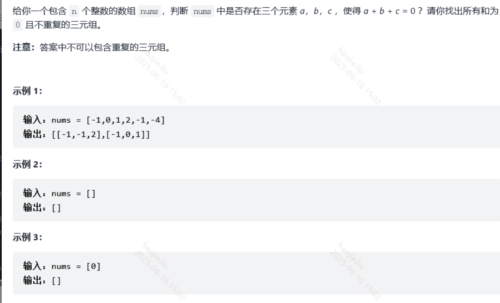

# 双指针【左右、快慢指针】

### 三数之和【中等】



**注意去重的操作**

```java
//这是官方的双指针解法
class Solution {
    public List<List<Integer>> threeSum(int[] nums) {
        //先进行升序的排序，后面处理起来就不用担心重复性问题
        Arrays.sort(nums);
        List<List<Integer>> res = new ArrayList<>();
        //这里之所以要-2就是因为防止重复判断，因为i跟j指针已经开始就占了两个所以要这样设置
        for(int k = 0; k < nums.length - 2; k++){
            //进行健壮性判断，如果没有负数就不可能有0的结果
            if(nums[k] > 0) break;
            //如果索引不为0的值如过本身及前一个相等就跳过此次循环避免重复判断
            if(k > 0 && nums[k] == nums[k - 1]) continue;
            int i = k + 1, j = nums.length - 1;
            while(i < j){
                int sum = nums[k] + nums[i] + nums[j];
                if(sum < 0){
                    //这三个if是全代码的精髓，既能判断ij的合法性还能移动指针来循环判断，
                    //这几个while真的大开眼界
                    i++;
                } else if (sum > 0) {
                    j--;
                } else {
                    res.add(new ArrayList<Integer>(Arrays.asList(nums[k], nums[i], nums[j])));
                    while(i < j && nums[i] == nums[++i]);
                    while(i < j && nums[j] == nums[--j]);
                }
            }
        }
        return res;
    }
}
```

### 最接近的三数之和【中等】

**本题目是三数之和的变形，就是利用双指针，但是单纯利用双指针会导致效率很慢需要优化**


```java
class Solution {
    public int threeSumClosest(int[] nums, int target) {
        Arrays.sort(nums);
        int ans = nums[0] + nums[1] + nums[2];
        for(int i = 0; i < nums.length - 2; i++){
            int start = i + 1, end = nums.length - 1;
            while(start != end){
                // 优化二：判断最小值
                int min = nums[i] + nums[start] + nums[start + 1];
                if(target < min){
                    if(Math.abs(ans - target) > Math.abs(min - target))
                        ans = min;
                    break;
                }
                //优化二：判断最大值
                int max = nums[i] + nums[end] + nums[end - 1];
                if(target > max){
                    if(Math.abs(ans - target) > Math.abs(max - target))
                        ans = max;
                    break;  
                }

                int sum = nums[start] + nums[end] + nums[i];
                if(sum == target) //优化三：判断三数之和是否等于target
                    return sum;
                if(Math.abs(ans - target) > Math.abs(sum - target)){
                    ans = sum;
                }
                if(sum > target){
                    end--;
                    //优化一：解决nums[end]重复
                    while(start != end && nums[end] == nums[end+1])
                        end--;
                }else{
                    start++;
                    //优化一：解决nums[start]重复
                    while(start != end && nums[start] == nums[start-1])
                        start++;
                } 
            }
            // 优化一：解决nums[i]重复
            while(i < nums.length-2 && nums[i] == nums[i+1])
                i++;
        }
        return ans;
    }
}
```

### 四数之和【中等】

**两层循环+双指针枚举**

```java
class Solution {
    //三数之和是一层枚举+双指针，那么四数之和就可以用两层枚举+双指针
    public List<List<Integer>> fourSum(int[] nums, int target) {
        List<List<Integer>> res = new ArrayList<>();
        int len = nums.length;
        Arrays.sort(nums);
        for(int i = 0; i < len; i++){
            //去重，每个数只能被选一次
            if(i > 0 && nums[i] == nums[i-1]) continue;
            for(int j = i + 1; j < len; j++){
                if(j > i + 1 && nums[j] == nums[j-1])   continue;
                //开始双指针枚举后两个数
                int left = j + 1, right = len - 1; 
                while(left < right){
                    int sum = nums[left] + nums[right] + nums[i] + nums[j];
                    if(sum > target)
                        right--;
                    else if(sum < target)
                        left++;
                    else{
                        res.add(new ArrayList<>(Arrays.asList(nums[i], nums[j], nums[left], nums[right])));
                        while(left < right && nums[right] == nums[--right]);
                        while(left < right && nums[left] == nums[++left]);
                    }     
                }
            }
        }
        return res;
    }
}
```

### 盛最多水的容器


**双指针**

```java
class Solution {
    public int maxArea(int[] height) {
        if(height == null)
            return 0;
        int i = 0, j = height.length - 1, maxRes = 0;
        while(i < j){
            //这里一定要写成(j - i) * height[i++]而不是倒过来写，不然i已经变换成+1的了
            maxRes = height[i] < height[j] ? 
                Math.max(maxRes, (j - i) * height[i++]) : 
                Math.max(maxRes, (j - i) * height[j--]);
        }
        return maxRes;
    }
}
```

### 有效三角形的个数

**暴力解法，运用满足nums[j] + nums[k] > nums[i]，我们先利用升序，然后从先枚举较大数；在下标不超过较大数下标范围内，找次大数；在下标不超过次大数下标范围内，找较小数**

```java
 public int triangleNumber(int[] nums) {
        int n = nums.length;
        Arrays.sort(nums);
        int ans = 0;
        for (int i = 0; i < n; i++) {
            //配个上面的策略这里就是-1，对不符合跳过，直到能容下j和k
            for (int j = i - 1; j >= 0; j--) {
                for (int k = j - 1; k >= 0; k--) {
                    if (nums[j] + nums[k] > nums[i]) ans++;
                }
            }
        }
        return ans;
    }
```

**第二种就是优化第三个数的寻找方式，通过二分去搜索第三个符合条件的数，找到符合的数，那么这个数**


**第三种就是双指针 提供两种方法**

```java
class Solution {
    public int triangleNumber(int[] nums) {
        int n = nums.length;
        Arrays.sort(nums);
        int ans = 0;
        for (int i = 0; i < n; i++) {
            for (int j = i - 1, k = 0; k < j; j--) {
                while (k < j && nums[k] + nums[j] <= nums[i]) k++;
                ans += j - k;
            }
        }
        return ans;
    }
}

class Solution {
    public int triangleNumber(int[] nums) {
        Arrays.sort(nums);
        int n = nums.length;
        int res = 0;
        for (int i = n - 1; i >= 2; --i) {
            int l = 0, r = i - 1;
            while (l < r) {
                if (nums[l] + nums[r] > nums[i]) {
                    res += r - l;
                    --r;
                } else {
                    ++l;
                }
            }
        }
        return res;
    }
}
```

### 和为s的两个数字


```java
class Solution {
    public int[] twoSum(int[] nums, int target) {
        int low = 0;
        int high = nums.length-1;
        int[] res = new int[2];
        while(true){
            if(nums[low]+nums[high]==target){
                res[0] = nums[low];
                res[1] = nums[high];
                return res;
            }else if(nums[low]+nums[high]>target)
                high--;
            else if(nums[low]+nums[high]<target)
                low++;
        }

    }
}
```

### 反转字符串

```java
class Solution {
    public void reverseString(char[] s) {
        int i = 0, j = s.length - 1;
        char temp;
        while(i < j){
            temp = s[i];
            s[i] = s[j];
            s[j] = temp;
            i++;
            j--;
        } 
    }
}
```

### 反转字符串中的单词 III

**这个方法时间空间复杂度都很优秀**

```java
class Solution {
    public String reverseWords(String str) {
        if(str == null)
            return "";
        char[] s = str.toCharArray();
        int start = 0, end = 0;    //定义前进指针和范围指针
        while(end < s.length){
            //前进指针负责分割字符串
            while(end < s.length && s[end] != ' ')
                end++;
            //将分割好的字符串进行反转
            reverse(s, start, end - 1);
            //前进指针继续分割字符串
            end++;
            start = end;    //更新起点
        }
        return new String(s);
    }

    public void reverse(char[] s, int i, int j){
        char temp;
        while(i < j){
            temp = s[i];
            s[i] = s[j];
            s[j] = temp;
            i++;
            j--;
        }
    }
}
```

### 链表的中间结点


```java
/**
 * Definition for singly-linked list.
 * public class ListNode {
 *     int val;
 *     ListNode next;
 *     ListNode() {}
 *     ListNode(int val) { this.val = val; }
 *     ListNode(int val, ListNode next) { this.val = val; this.next = next; }
 * }
 */
class Solution {
    public ListNode middleNode(ListNode head) {
        ListNode cur = new ListNode();
        List<Integer> list = new ArrayList<>();
        cur = head;
        while(cur!=null){
            list.add(cur.val);
            cur = cur.next;
        }
        int mid = list.get(list.size()/2);
        int init = 0;
        cur = head;
        while(init<list.size()/2){
            cur = cur.next;
            init++;
        }
        return cur;
    }
}
```

### 环形链表

**快慢指针**

```java
public class Solution {
    public boolean hasCycle(ListNode head) {
        if(head == null || head.next == null)
            return false;
        ListNode fast = head, slow = head;
        while(fast != null){
            fast = fast.next;
            if(fast != null)
                fast = fast.next;
            if(fast == slow)
                return true;
            slow = slow.next;
        }
        return false;
    }
}

public boolean hasCycle(ListNode head) {
    ListNode fast = head, slow = head;
    while(fast != null && fast.next != null) {
        fast = fast.next.next;
        slow = slow.next;
        if(fast == slow) { // 在指针移动后再比较，排除初始都指向头结点的情况
            return true;
        }
    }
    return false;
}
```

### 环形链表 II

**快慢指针**

```java
public class Solution {
    //自己的方法
    public ListNode detectCycle(ListNode head) {
        if(head == null || head.next == null)
            return null;
        List<ListNode> list = new ArrayList<>();
        ListNode temp = head;
        int i = 0;
        for(;;){
            if(list.contains(temp))
                return temp;
            if(temp.next == null)
                return null;
            list.add(temp);
            temp = temp.next;
            i++;
        }
    }

    //判断一个链表是否有环，使用快慢指针解题
    //定义两个指针，快指针步长为2，慢指针步长为1.同时从链表表头开始出发，如果链表中有环那么必然相遇
    public ListNode detectCycle(ListNode head) {
        if(head == null || head.next == null)
            return null;
        ListNode fast = head;
        ListNode slow = head;
        do{
            fast = fast.next.next;
            slow = slow.next;
            if(slow == fast){    //进入这个if以后就说明有环这个链表
                //我们在定义两个结点，分别是头结点和相遇结点，让两个结点每次循环走一步，那么这两个
                //结点的相遇结点就是环的开始结点
                ListNode index1 = fast;
                ListNode index2 = head;
                while(index1 != index2){
                    index1 = index1.next;
                    index2 = index2.next;
                }
                return index1;
            }
        }while(fast != null && fast.next != null);
        return null;
    }
}

```

### 链表中倒数第k个节点


```java
class Solution {
    public ListNode getKthFromEnd(ListNode head, int k) {
        ListNode cur = new ListNode(0);
        //List<Integer> list = new ArrayList<>();
        Deque<Integer> stack = new LinkedList<>();
        cur = head;
        while(cur!=null){
            stack.push(cur.val);
            cur = cur.next;
        }
        cur = head;
        for(int i =0;i<stack.size()-k;i++){
            cur = cur.next;
        }
        return cur;
    }
}
```


```java
//1->2->3->4->5 ----k=2

class Solution {
    public ListNode getKthFromEnd(ListNode head, int k) {
        ListNode former = head, latter = head;
        for(int i = 0; i < k; i++)
            former = former.next;
        while(former != null) {
            former = former.next;
            latter = latter.next;
        }
        return latter;
    }
}
```

### 删除链表的倒数第N个节点

**快慢指针的原理，让一个指针循环n次到达，n-1的位置，然后让其跟头节点同时移动直到后一个节点的next为null，这时头节点就指向删除节点的前一个**

这道题可与【链表中倒数第k个节】相互理解，最重要的就是要找到 要删除的结点以及边界处理的细节

```java
class Solution {
    public ListNode removeNthFromEnd(ListNode head, int n) {
        //先找到需要删除的点
        //使用双指针，想让一个临时结点走n步到达，再让另外一个临时结点
        //与这个结点一起走，知道先走的到达null
        ListNode preNode = head, resNode = head;
        //此循环过后preNode就到达第n个位置了
        for(int i = 0; i < n; i++)
            preNode = preNode.next;
        //如果循环完已经等于null，说明head就一个结点,即删除头结点
        if(preNode == null)
            return head.next;

        //这里提前一个结点结束，也就是说resNode还差一个位置才到达
        //目标删除结点,这样可以避免空指针异常
        while(preNode.next != null){
            preNode = preNode.next;
            resNode = resNode.next;
        }
        resNode.next = resNode.next.next;
        return head;
    }   
}
```

### 寻找重复数

**快慢指针【弗洛伊德判环】**

快慢指针思想, fast 和 slow 是指针, nums[slow] 表示取指针对应的元素
注意 nums 数组中的数字都是在 1 到 n 之间的(在数组中进行游走不会越界),
因为有重复数字的出现, 所以这个游走必然是成环的, 环的入口就是重复的元素,
即按照寻找链表环入口的思路来做

```java
	public int findDuplicate(int[] nums) {
        int fast = 0, slow = 0;
        while(true) {
            fast = nums[nums[fast]];
            slow = nums[slow];
            //这里让两个指针重合处于同一节点，说明有环，然后开始出发
            //然后将某个指针置为头节点，另外一个指针会一直在环中循环
            //两个指针每次走一步，直到相遇，就是环的起点
            if(slow == fast) {
                fast = 0;
                while(nums[slow] != nums[fast]) {
                    fast = nums[fast];
                    slow = nums[slow];
                }
                return nums[slow];
            }
        }
    }
```

### 无重复字符的最长子串（最长不含重复字符的子字符串）


第一个方法就是最基础的串的匹配

```java
class Solution {
    public int lengthOfLongestSubstring(String s) {
        if(s.length() <= 1)
            return s.length();
        String[] split = s.split("");
        String res = split[0];
        int max = 1;
        for(int i = 1; i <= split.length - 1; i++){
            if(matching(res, split[i])){
                if(max < res.length())
                    max = res.length();
                i
                res = split[i - 1];
                continue;
            }else{
                res += split[i];
                if(max < res.length())
                    max = res.length();
            } 
                
        } 
        return max;
    }

    //串的匹配
    //target：目标串；pattern：需要在目标串找到相同的串
    public boolean matching(String target, String pattern){
        String[] res = target.split("");
        int i = 0;
        while(i < res.length){
            if(res[i].equals(pattern))
                return true;
            else
                i++;
        }
        return false;
    }
    
```

下面两个就是双指针的滑动窗口思想

```java
    public int lengthOfLongestSubstring(String s) {
        HashMap<Character, Integer> map = new HashMap<>();
        int max = 0, start = 0;
        for (int end = 0; end < s.length(); end++) {
            char ch = s.charAt(end);
            if (map.containsKey(ch)){
                //如果重复的字符出现了，那么start会得到更新
                start = Math.max(map.get(ch)+1,start);
            }
            //如果不是重复的字符则会一直+1，start的更新体现在max会一直处于当前无重复的最大值
            max = Math.max(max,end - start + 1);
            map.put(ch,end);
        }
        return max;
    }

    public int lengthOfLongestSubstring(String s) {
        // 记录字符上一次出现的位置
        //跟HashMap差不多原理，不过每个字符的标志用数组来代替了
        int[] last = new int[128];
        for(int i = 0; i < 128; i++) {
            last[i] = -1;
        }

        int n = s.length();

        int res = 0;
        int start = 0; // 窗口开始位置
        for(int i = 0; i < n; i++) {
            int index = s.charAt(i);
            start = Math.max(start, last[index] + 1);
            res   = Math.max(res, i - start + 1);
            last[index] = i;
        }

        return res;
    }
    
}
```

### 合并两个有序数组

```java
class Solution {
    public void merge(int[] nums1, int m, int[] nums2, int n) {
        //这个索引从指向结果集的末端，从大到小方
        //每次从两个数组中挑选大的放入
        int i = nums1.length - 1;
        m--; n--;   //索引与位置的对应
        //总共确认第二个数组的n个元素，所以进行n次
        while(n >= 0){
            //有序我们都从后往前
            //第一个数组的元素最大移动m次，所以大于0
            if(m >= 0 && nums1[m] > nums2[n])
                //大的对应指针和位置确定的指针都向前移动
                nums1[i--] = nums1[m--];
            else
                nums1[i--] = nums2[n--];
        }
    }
}
```