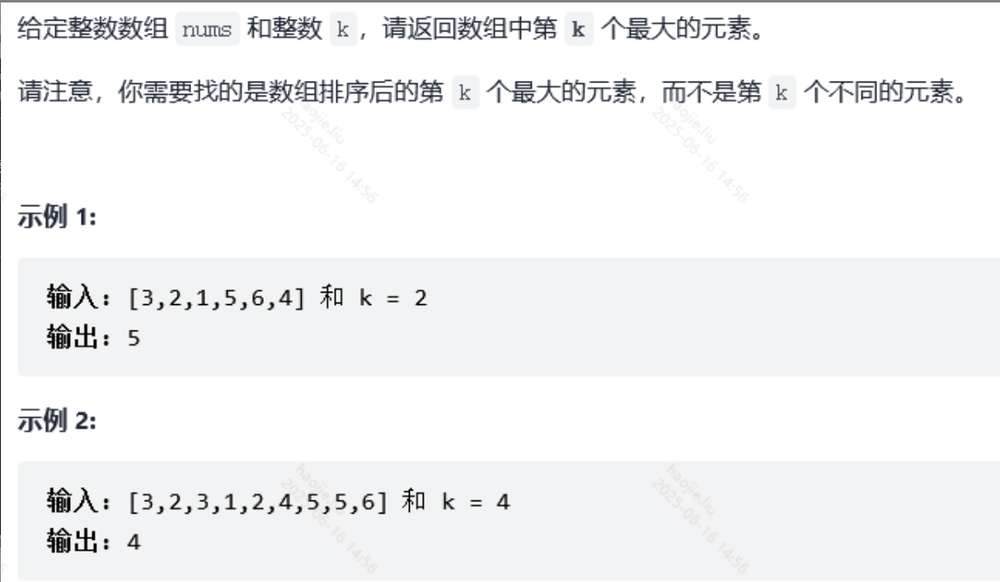

# 各种排序

### 数组中的第K个最大元素



**优先队列，实际在面试中会要求你自己实现大根堆或小根堆**

> 优先队列可以用一个 for 循环解决哈。就是在 for 循环里面判断小顶堆里面的 size() 是否大于 k 个数，是的话就 poll() 出去；整个 for 循环结束之后剩下来的就是 k 个数的小顶堆。堆顶即第 k 大的数。
> 

```java
class Solution {
    public int findKthLargest(int[] nums, int k) {
        PriorityQueue<Integer> heap = new PriorityQueue<>();
        for (int num : nums) {
            heap.add(num);
            if (heap.size() > k) {
                heap.poll();
            }
        }
        return heap.peek();
    }
}
```

**自己实现小根堆**

```java
class Solution {
    public int findKthLargest(int[] nums, int k) {
        int len = nums.length;
				//构建小根堆
        for(int i = len / 2 - 1; i >= 0; i--){
            shif(nums, i, len - 1);
        }

        for(int j = len - 1; j >= 1; j--){
            swap(nums, 0, j);
            shif(nums, 0, j - 1);
        }
        return nums[len - k];
    }

    public void shif(int[] nums, int low, int high){
        int i = low, j = i * 2 + 1;
        while(j <= high){
            if(j < high && nums[j] < nums[j + 1]){
                j++;
            }
            if(nums[i] < nums[j]){
                swap(nums, i, j);
                i = j;
                j = i * 2 + 1;
            }else
                break;
        }
    }

    public void swap(int[] nums, int i, int j){
        int temp = nums[i];
        nums[i] = nums[j];
        nums[j] = temp;
    }
}
```

自己实现大根堆（注意排序次数，可以看到只有K次，每一次确认一个值，而大根堆天然的就与题目相符，当确认到第k个数直接返回即可）

```java
class Solution {
    public int findKthLargest(int[] nums, int k) {
        int len = nums.length;
        
        // 构建大根堆
        // 从最后一个非叶子节点开始，向上调整
        for (int i = len / 2 - 1; i >= 0; i--) {
            heapify(nums, i, len);
        }
        
        // 进行k-1次堆排序操作
        for (int i = 0; i < k - 1; i++) {
            // 将最大值移到末尾
            swap(nums, 0, len - 1 - i);
            // 重新调整堆（堆大小减1）
            heapify(nums, 0, len - 1 - i);
        }
        
        // 此时堆顶就是第k大的元素
        return nums[0];
    }
    
    /**
     * 向下调整维护大根堆性质
     * @param nums 数组
     * @param root 根节点索引
     * @param heapSize 堆大小
     */
    private void heapify(int[] nums, int root, int heapSize) {
        int largest = root;
        int left = 2 * root + 1;   // 左子节点
        int right = 2 * root + 2;  // 右子节点
        
        // 找到最大值的索引
        if (left < heapSize && nums[left] > nums[largest]) {
            largest = left;
        }
        
        if (right < heapSize && nums[right] > nums[largest]) {
            largest = right;
        }
        
        // 如果最大值不是根节点，则交换并继续调整
        if (largest != root) {
            swap(nums, root, largest);
            heapify(nums, largest, heapSize);
        }
    }
    
    private void swap(int[] nums, int i, int j) {
        int temp = nums[i];
        nums[i] = nums[j];
        nums[j] = temp;
    }
}
```

### 最小的k个数

**使用快速排序的改编版，将左右两个区间所要表达的意思改变**

```java
    public int[] getLeastNumbers(int[] arr, int k) {
        if(k >= arr.length)
            return arr;
        return quickSort(arr, 0, arr.length - 1, k);
    }

    //现在改造快排，将之前确定基准，左边都是比基准小的，右边都是比基准大的
    //现在改为最小的 k 个数 和 其他数字 两部分即可，而快速排序的哨兵划分可完成此目标。
    public int[] quickSort(int[] arr, int left, int right, int target){
        int i = left, j = right;
        //以每次数组的第一个为基准
        while(i < j){
            //注意一定要先从右往左扫描
            while(i < j && arr[left] <= arr[j])
                j--;
            while(i < j && arr[left] >= arr[i])
                i++;
            swap(arr, i, j);
        }
        //这里填left，j或left，i都可以，因为最后i，j指向同一个位置，
        //这个位置就是left的最终位置
        swap(arr, left, i);
        //如果基准索引位置大于k，那么前面的数量大于k，就要在对基准的位置向前移动
        if(i > target)
            return quickSort(arr, left, i - 1, target);
        //此时基准的位置如果小于k那么就证明，基准前面的元素数量还不满足
        if(i < target)
            return quickSort(arr, i + 1, right, target);
        return Arrays.copyOf(arr, target);
    }

    public void swap(int[] arr, int i, int j){
        int temp = arr[i];
        arr[i] = arr[j];
        arr[j] = temp;
    }
}
```

### 排序数组


```java
//使用快排
class Solution {
    public int[] sortArray(int[] nums) {
        quickSort(nums, 0, nums.length - 1);
        return nums;
    }

    //数据结构书上的：是以每段的最左边索引为基准
    //partition：划分，即返回基准下标
    public int partition(int[] nums, int left, int right){
        int i = left, j = right;    //定义左指针和右指针
        int temp = nums[i]; //以最左边的为基准开始第一轮排序，即该基准左边全是比他小的，右边全是比他大的
        while(i < j){   //当i==j时就跳出循环
            //这里记住一定要先去判断右边的区间，从最大的索引开始，这样如果有不满足条件的肯定会把nums[i]给换掉，这时你会想那么数组中就缺了nums[i]这个值怎么办，别急这个基准一直存在存放在temp中，最后大的while循环后基准也就找到了位置放了，如果你先去判断最小的索引即两个小while调换顺序那么就会出现错误，结果数组中每个值都变成了nums[i]
            while(j > i && nums[j] >= temp)     //如果j一直大于i且nums[j]不小于基准那么右指针一直向左扫描
                j--;
            nums[i] = nums[j];  //同理找到了这样的nums[j]就立马跟nums[i]换位置
            while(i < j && nums[i] <= temp)     //现在是从左向右扫描，如果i不大于等于j且这个nums[i]不大于temp，那么左指针就一直向右移动找到待换元素
                i++;
            nums[j] = nums[i];  //找到了这样的nums[i]就立马跟nums[j]换位置

        }
        nums[i] = temp;
        return i;

    }

    public void quickSort(int[] nums, int start, int end){
        int i;  //保存每一段的基准值
        if(start < end){
            i = partition(nums, start, end);
            quickSort(nums, start, i - 1);  //对左区间进行排序
            quickSort(nums, i + 1, end);    //对右区间进行排序
        }
    }
}

class Solution {
    public int[] sortArray(int[] nums) {
    if(nums.length <=1)return nums;
     //qSort(nums,0,nums.length-1);
        //selectSort(nums);
        // insertSort(nums);
        // shellSort(nums);
        // bucketSort(nums);
        // countSort(nums);
        // mergeSort(nums,0,nums.length-1);
        heapSort(nums);
    return nums;
    }

    /**
    快速排序
    **/
    void qSort(int[] arr,int s,int e){
        int l = s, r = e;
        if(l < r){
            int temp = arr[l];
            while(l < r){
                while(l < r && arr[r] >= temp) r--;
                if(l < r) arr[l] = arr[r];
                while(l < r && arr[l] < temp) l++;
                if(l < r) arr[r] = arr[l];
            }
            arr[l] = temp;
            qSort(arr,s,l);
            qSort(arr,l + 1, e);
        }
    }
    /**
    选择排序
    **/
    void selectSort(int[] arr){
        int min;
        for(int i = 0;i<arr.length;i++){
            min = i;
            for(int j = i;j<arr.length;j++){
                if(arr[j] < arr[min]){
                    min = j;
                }
            }
            if(min != i) {
                int temp = arr[i];
                arr[i] = arr[min];
                arr[min] = temp;
            }
        }
    }
    /**
     *
     * 插入排序：数列前面部分看为有序，依次将后面的无序数列元素插入到前面的有序数列中，初始状态有序数列仅有一个元素，即首元素。在将无序数列元素插入有序数列的过程中，采用了逆序遍历有序数列，相较于顺序遍历会稍显繁琐，但当数列本身已近排序状态效率会更高。
     *
     * 时间复杂度：O(N2) 　　稳定性：稳定
     * @param arr
     */
    public void insertSort(int arr[]){
        for(int i = 1; i < arr.length; i++){
            int rt = arr[i];
            for(int j = i - 1; j >= 0; j--){
                if(rt < arr[j]){
                    arr[j + 1] = arr[j];
                    arr[j] = rt;
                }else{
                    break;
                }
            }
        }
    }
    /**
     * 希尔排序 - 插入排序的改进版。为了减少数据的移动次数，在初始序列较大时取较大的步长，通常取序列长度的一半，此时只有两个元素比较，交换一次；之后步长依次减半直至步长为1，即为插入排序，由于此时序列已接近有序，故插入元素时数据移动的次数会相对较少，效率得到了提高。
     *
     * 时间复杂度：通常认为是O(N3/2) ，未验证　　稳定性：不稳定
     * @param arr
     */
    void shellSort(int arr[]){
        int d = arr.length >> 1;
        while(d >= 1){
            for(int i = d; i < arr.length; i++){
                int rt = arr[i];
                for(int j = i - d; j >= 0; j -= d){
                    if(rt < arr[j]){
                        arr[j + d] = arr[j];
                        arr[j] = rt;
                    }else break;
                }
            }
            d >>= 1;
        }
    }
    /**
     * 桶排序 - 实现线性排序，但当元素间值得大小有较大差距时会带来内存空间的较大浪费。首先，找出待排序列中得最大元素max，申请内存大小为max + 1的桶（数组）并初始化为0；然后，遍历排序数列，并依次将每个元素作为下标的桶元素值自增1；
     * 最后，遍历桶元素，并依次将值非0的元素下标值载入排序数列（桶元素>1表明有值大小相等的元素，此时依次将他们载入排序数列），遍历完成，排序数列便为有序数列。
     *
     * 时间复杂度：O(x*N) 　　稳定性：稳定
     * @param arr
     */
     void bucketSort(int[] arr){
        int[] bk = new int[50000 * 2 + 1];
        for(int i = 0; i < arr.length; i++){
            bk[arr[i] + 50000] += 1;
        }
        int ar = 0;
        for(int i = 0; i < bk.length; i++){
            for(int j = bk[i]; j > 0; j--){
                arr[ar++] = i - 50000;
            }
        }
    }
        /**
     * 基数排序 - 桶排序的改进版，桶的大小固定为10，减少了内存空间的开销。首先，找出待排序列中得最大元素max，并依次按max的低位到高位对所有元素排序；
     * 桶元素10个元素的大小即为待排序数列元素对应数值为相等元素的个数，即每次遍历待排序数列，桶将其按对应数值位大小分为了10个层级，桶内元素值得和为待排序数列元素个数。
     * @param arr
     */
     void countSort(int[] arr){
        int[] bk = new int[19];
        Integer max = Integer.MIN_VALUE;
        for(int i = 0; i < arr.length; i++){
            if(max < Math.abs(arr[i])) max = arr[i];
        }
        if(max < 0) max = -max;
        max = max.toString().length();
        int [][] bd = new int[19][arr.length];
        for(int k = 0; k < max; k++) {
            for (int i = 0; i < arr.length; i++) {
                int value = (int)(arr[i] / (Math.pow(10,k)) % 10);
                bd[value+9][bk[value+9]++] = arr[i];
            }
            int fl = 0;
            for(int l = 0; l < 19; l++){
                if(bk[l] != 0){
                    for(int s = 0; s < bk[l]; s++){
                        arr[fl++] = bd[l][s];
                    }
                }
            }
            bk = new int[19];
            fl = 0;
        }
    }

    /**
     * 归并排序 - 采用了分治和递归的思想，递归&分治-排序整个数列如同排序两个有序数列，依次执行这个过程直至排序末端的两个元素，再依次向上层输送排序好的两个子列进行排序直至整个数列有序（类比二叉树的思想，from down to up）。
     *
     * 时间复杂度：O(NlogN) 　　稳定性：稳定
     * @param arr
     */
     void mergeSortInOrder(int[] arr,int bgn,int mid, int end){
        int l = bgn, m = mid +1, e = end;
        int[] arrs = new int[end - bgn + 1];
        int k = 0;
        while(l <= mid && m <= e){
            if(arr[l] < arr[m]){
                arrs[k++] = arr[l++];
            }else{
                arrs[k++] = arr[m++];
            }
        }
        while(l <= mid){
            arrs[k++] = arr[l++];
        }
        while(m <= e){
            arrs[k++] = arr[m++];
        }
        for(int i = 0; i < arrs.length; i++){
            arr[i + bgn] = arrs[i];
        }
    }
     void mergeSort(int[] arr, int bgn, int end)
    {
        if(bgn >= end){
            return;
        }
        int mid = (bgn + end) >> 1;
        mergeSort(arr,bgn,mid);
        mergeSort(arr,mid + 1, end);
        mergeSortInOrder(arr,bgn,mid,end);
    }

    /**
     * 堆排序 - 堆排序的思想借助于二叉堆中的最大堆得以实现。首先，将待排序数列抽象为二叉树，并构造出最大堆；然后，依次将最大元素（即根节点元素）与待排序数列的最后一个元素交换（即二叉树最深层最右边的叶子结点元素）；
     * 每次遍历，刷新最后一个元素的位置（自减1），直至其与首元素相交，即完成排序。
     *
     * 时间复杂度：O(NlogN) 　　稳定性：不稳定
     *
     * @param arr
     */
     void heapSort(int[] nums) {
        int size = nums.length;
        for (int i = size/2-1; i >=0; i--) {
            adjust(nums, size, i);
        }
        for (int i = size - 1; i >= 1; i--) {
            int temp = nums[0];
            nums[0] = nums[i];
            nums[i] = temp;
            adjust(nums, i, 0);
        }
    }
    void adjust(int []nums, int len, int index) {
        int l = 2 * index + 1;
        int r = 2 * index + 2;
        int maxIndex = index;
        if (l<len&&nums[l]>nums[maxIndex])maxIndex = l;
        if (r<len&&nums[r]>nums[maxIndex])maxIndex = r;
        if (maxIndex != index) {
            int temp = nums[maxIndex];
            nums[maxIndex] = nums[index];
            nums[index] = temp;
            adjust(nums, len, maxIndex);
        }
    }
}
```

### 计算数组的小和


**利用归并排序**

```java
public class Main{
    static int[] temp;
    public static long sortAndMerge(int[] nums,int left, int right){
        if(left >= right)
            return 0;
        int mid = left + (right - left) / 2;
        long res = sortAndMerge(nums, left, mid) + sortAndMerge(nums, mid + 1, right);
        int i = left, j = mid + 1, k = 0;
        while (i <= mid && j <= right)
        {
            if (nums[i] <= nums[j])
            {
                res += (right - j + 1) * nums[i];
                temp[k++] = nums[i++];
            }
            else temp[k++] = nums[j++];
        }
        while (i <= mid) temp[k++] = nums[i++];
        while (j <= right) temp[k++] = nums[j++];
        for (i = left, k = 0; i <= right; i++)
            nums[i] = temp[k++];
        return res;
    }

    public static void main(String[] args){
        Scanner s = new Scanner(System.in);
        int len = s.nextInt();
        int[] nums = new int[len];
        temp = new int[len];
        for(int i = 0; i < len; i++){
            nums[i] = s.nextInt();
        }
        long sum = sortAndMerge(nums, 0, len - 1);
        System.out.println(sum);
    }  
}
```