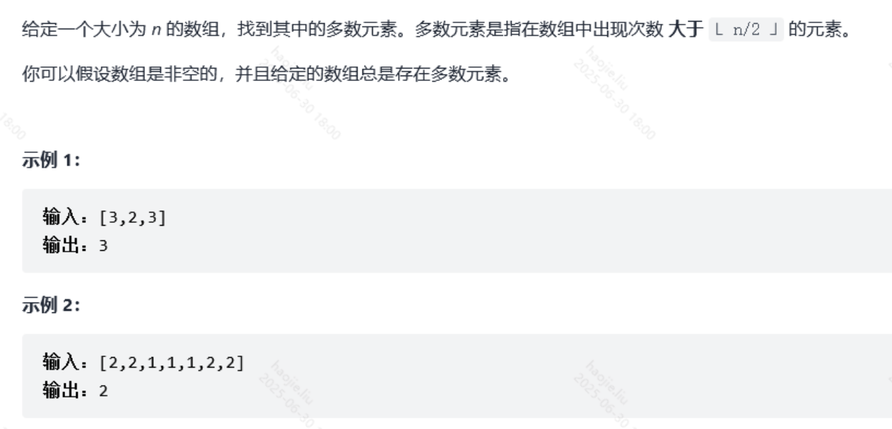

# 哈希表+前缀和+异或

### 两数之和【简单】

Hash映射

```java
class Solution {
    public int[] twoSum(int[] nums, int target) {
        Map<Integer, Integer> map = new HashMap<>();
        for(int i = 0; i < nums.length; i++){
            //此时说明target可以被这两个数正好减完，直接返回就好
            if(map.containsKey(target - nums[i]))
                return new int[]{map.get(target - nums[i]), i};
            map.put(nums[i], i);
        }
        //没有相对应的值
        return new int[]{0,0};
    }
}
```

### 有效的字母异位词

**真的是笨，看到题目要求就想不到原地哈希？**

```java
class Solution {
    public boolean isAnagram(String s, String t) {
        if(s == null || t == null || s.length() != t.length())
            return false;
        int[] hash = new int[26];
        //这里就是在让字母对应的位置，目标串有+1，模式串也有-1，这样一消一减的这个位置的字母
        //则一直保持为0
        for(int i = 0; i < s.length(); i++){
            hash[s.charAt(i) - 'a'] ++;
            hash[t.charAt(i) - 'a'] --;
        }
        //如果两个串的相同位置的字母数量不相等，那么在数组中对应位置肯定就不为0
        for(int i = 0; i < hash.length; i++){
            if(hash[i] != 0)
                return false;
        }
        return true;
    }
}
```

### 前 K 个高频元素

**优先队列**

```java
class Solution {
    public int[] topKFrequent(int[] nums, int k) {
        int[] res = new int[k];
        Map<Integer, Integer> map = new HashMap<>();
        for (int num : nums) {
            map.put(num, map.getOrDefault(num, 0) + 1);
        }
        //创建小根堆序列，我们这里直接用jdk自带的权重队列
        //这里切记要把key和value都存进去，因为我们需要value来做频率的排序，有需要key的结果回显
        Set<Map.Entry<Integer, Integer>> entries = map.entrySet();
        //我们根据value的值升序排列，即为小根堆
        //也许你会想直接大根堆，出来的就是频率由大到小啊，小根堆不是脱了裤子放屁？
        //其实就是跟队列的出队和入队配合罢了
        PriorityQueue<Map.Entry<Integer, Integer>> queue = new PriorityQueue<>((a, b) -> a.getValue() - b.getValue());
        //由于我们是大根堆，那么进入队列的数量跟k相等就出来就好
        /**
         * 这里不能用大根堆，因为这个队列的出队只有出对头的一种形式，由于map是无序的，所以我们需要遍历完整个map，
         * 才能得到k个完整的堆，如果使用大根堆，那么每次加入队列的entry都会因为在对头被淘汰，我们就需要频率高的
         * 留下了，反而给我们全部出队了
         */
        for(Map.Entry<Integer, Integer> entry: map.entrySet()){
            queue.offer(entry);
            if(queue.size() > k)
                queue.poll();
        }
        for (int i = k - 1; i >= 0; i--) {
            res[i] = queue.poll().getKey();
        }
        return res;

    }
}
```

**桶排序**

```java
class Solution {
    public int[] topKFrequent(int[] nums, int k) {
        int len = nums.length;
        List<Integer> res = new ArrayList();
        Map<Integer, Integer> map = new HashMap<>();
        for(int num : nums){
            map.put(num, map.getOrDefault(num, 0) + 1);
        }
        List<Integer>[] buckets = new List[nums.length+1];
        for(int key : map.keySet()){
            int count = map.get(key);
            if(buckets[count] == null)
                buckets[count] = new ArrayList<>();
            buckets[count].add(key);
        }

        for(int i = buckets.length - 1; i >= 0 && res.size() < k; i--){
            if(buckets[i] == null)
                continue;
            res.addAll(buckets[i]);
        }
        int[] res01 = new int[k];
        for(int i = 0; i < res.size(); i++){
            res01[i] = res.get(i);
        }
        return res01;
    }
}
```

### 多数元素/数组中出现次数超过一半的数字



```java
public class Solution {
    // 若题目保证一定存在多数元素（出现次数 > n/2），可不写兜底返回
    public int majorityElement(int[] nums) {
        Map<Integer, Integer> cnt = new HashMap<>();
        int n = nums.length;
        for (int x : nums) {
            int c = cnt.getOrDefault(x, 0) + 1;
            if (c > n / 2) return x;
            cnt.put(x, c);
        }
        return -1; // 若不保证存在多数元素，可保留兜底
    }
}
```

### 和为K的子数组

前缀和+hash

**前缀和就是求解一个数组的某个区间的数字之和， 下面直接简单举例**

数组 

`a[5]={0, 1, 2 ,3 ,4 }`

经过计算可以得到他的前缀和数组

`b[5] = {0, 1, 3 ,6, 10}`

简单观察可以发现前缀和数组是存在递推关系的

即：

`b[ i ] = b[ i - 1 ] + a[ i ]`

```java
    public int subarraySum(int[] nums, int k) {
        if(nums == null || nums.length == 0)
            return 0;
        //这个map用来存放前缀和与其个数
        // key：前缀和，value：key 对应的前缀和的个数
        Map<Integer, Integer> map = new HashMap<>();
        // 对于下标为 0 的元素，前缀和为 0，个数为 1
        map.put(0, 1);
        int preSum = 0;
        int count = 0;
        for(int num : nums){
            preSum += num;
            if(map.containsKey(preSum - k))
                count += map.get(preSum - k);

            //getOrDefault返回key对应的value，如果没有使用默认值
            map.put(preSum, map.getOrDefault(preSum, 0) + 1);

        }
        return count;
    }
```

### 和可被 K 整除的子数组

**使用前缀合进行优化**


```java
    public int subarraysDivByK(int[] nums, int k) {
        Map<Integer, Integer> map = new LinkedHashMap<>();
        int sum = 0;
        for(int i = 0; i < nums.length; i++){
            //计算前缀合
            sum += nums[i];
            //大于0就进行取余，放到取余数组中，前缀合中有有小于0的
            //进行转化然后得到余数
            int mod = sum >= 0 ? sum % k : (k - (-sum) % k) % k;
            //对于出现此余数的次数进行记录
            if(map.containsKey(mod))
                map.put(mod, map.get(mod) + 1);
            else
                map.put(mod, 1);
        }

        int res = 0;
        //前缀合相对应的余数遍历记录完后，取出进行计算
        for (Map.Entry<Integer, Integer> item : map.entrySet()) {
            //key对应的value值即有m个key（出现了m次的key值）
            //满足m*（m-1）/2
            res += item.getValue() * (item.getValue() - 1) / 2;
            //如果余数为0则要额外加上这个余数对应的出现次数
            if(item.getKey() == 0)
                res += item.getValue();
        }
        return res;
    }
```

### 连续数组

**前缀合的思想**

```java
class Solution {
    //使用前缀合思想，遇到1对当前值变量+1，遇到0对当前值变量-1，如果是一对会一直保持0
    public int findMaxLength(int[] nums) {
        //key是当前值，value是对应当前值的下标
        Map<Integer, Integer> map = new HashMap<>();
        map.put(0, -1);
        int len = nums.length;
        if(len <= 0)
            return 0;
        int cur = 0, maxLen = 0;
        for(int i = 0; i < len; i++){
            cur = nums[i] == 0 ? cur - 1 : cur + 1;
            if(map.containsKey(cur))
                maxLen = Math.max(maxLen, i - map.get(cur));
            else
                map.put(cur, i);
        }
        return maxLen;
    }
}
```

### 只出现一次的数字

**使用哈希的两种方式**

```java
class Solution {

    public int singleNumber(int[] nums) {
        Map<Integer, Integer> map = new HashMap<>();
        for(int num : nums){
            if(!map.containsKey(map))
                map.put(num, 1);
            else
                map.put(num, map.get(num) + 1);
        }
        for(int num : nums){
            if(map.get(num) == 1)
                return num;
        }
        return -1;
    }

    public int singleNumber_HashSet(int[] nums) {

        int len = nums.length;
        Set<Integer> set = new HashSet<>();

        for (int i = 0; i < len; i++) {
            // 尝试将当前元素加入 set
            if (!set.add(nums[i])) {
                // 当前元已经存在于 set，即当前元素第二次出现，从 set 删除
                set.remove(nums[i]);
            }
        }

        // 最后只剩一个不重复的元素
        return set.iterator().next();
    }
}
```

**异或**

是用异或来解决，异或规则是相同是0，不同是1
那么就有以下规则：a^b^a = a^a^b = b
但是只能用于成对出现的

```java
class solution{

    public int singleNumber(int[] nums) {
        int res = nums[0];
        for(int i = 1; i < nums.length; i++)
            res = res ^ nums[i];

        return res;
    }
}
```

### 只出现一次的数字 III

**用hash去重呗，或者异或被，只要相同了就为0，不同最后肯定不为0**

```java
class Solution {
    public int[] singleNumber(int[] nums) {
        int len = nums.length;
        if(len < 2)
            return null;
        Set<Integer> set = new HashSet<>();
        for(int i = 0; i < len; i++){
            if(!set.add(nums[i])){
                set.remove(nums[i]);
            }
        }
        int[] res = new int[2];
        int i = 0;
        for(int item : set){
            res[i++] = item;
        }
        return res; 
    }
}
```

**异或**

```java
class Solution {
    public int[] singleNumber(int[] nums) {
        int[] res = new int[2];
        int temp = 0;   //我们相异或的中间标志位
        for(int num : nums){
            temp ^= num;    //用所有num进行异或，不同的肯定不为0
        }
        //取异或值最后一个二进制位为 1 的数字作为 mask，如果是 1 则表示两个数字在这一位上不同。
        int mask = temp & (-temp);

        //通过与这个 mask 进行与操作，如果为 0 的分为一个数组，为 1 的分为另一个数组。
        //这样就把问题降低成了：“有一个数组每个数字都出现两次，有一个数字只出现了一次，
        //求出该数字”。对这两个子问题分别进行全异或就可以得到两个解。也就是最终的数组了。
        for (int num : nums) {
            if ( (num & mask) == 0) {
                ans[0] ^= num;
            } else {
                ans[1] ^= num;
            }
        }
    }
}
```

### 复制带随机指针的链表【复杂链表的复制】

**用哈希表，这个我觉得很绝**


```java
class Solution {
    public Node copyRandomList(Node head) {
        if(head==null) {
            return null;
        }
        //创建一个哈希表，key是原节点，value是新节点
        Map<Node,Node> map = new HashMap<Node,Node>();
        Node p = head;
        //将原节点和新节点放入哈希表中
        while(p!=null) {
            Node newNode = new Node(p.val);
            map.put(p,newNode);
            p = p.next;
        }
        p = head;
        //遍历原链表，设置新节点的next和random
        while(p!=null) {
            Node newNode = map.get(p);
            //p是原节点，map.get(p)是对应的新节点，p.next是原节点的下一个
            //map.get(p.next)是原节点下一个对应的新节点
            if(p.next!=null) {
                newNode.next = map.get(p.next);
            }
            //p.random是原节点随机指向
            //map.get(p.random)是原节点随机指向  对应的新节点 
            if(p.random!=null) {
                newNode.random = map.get(p.random);
            }
            p = p.next;
        }
        //返回头结点，即原节点对应的value(新节点)
        return map.get(head);
    }
}
```

### 最长连续序列

**当然还有利用先排序+动态规划做**


```java
public class Solution {
    public int longestConsecutive(int[] nums) {
        Set<Integer> set = new HashSet<>();
        for (int x : nums) set.add(x);

        int ans = 0;
        for (int x : set) {
            if (!set.contains(x - 1)) { // 只从序列起点开始数
                int y = x, len = 1;
                while (set.contains(y + 1)) {
                    y++;
                    len++;
                }
                ans = Math.max(ans, len);
            }
        }
        return ans;
    }
}
```

### 两个数组的交集

**这里简单提一嘴，复制数组方法效率的对比**

https://blog.csdn.net/zjkC050818/article/details/76098354?spm=1001.2101.3001.6661.1&utm_medium=distribute.pc_relevant_t0.none-task-blog-2%7Edefault%7ECTRLIST%7Edefault-1.pc_relevant_default&depth_1-utm_source=distribute.pc_relevant_t0.none-task-blog-2%7Edefault%7ECTRLIST%7Edefault-1.pc_relevant_default&utm_relevant_index=1

```java
class Solution {
    public int[] intersection(int[] nums1, int[] nums2) {
        Map<Integer, Integer> map = new HashMap<>();
        for(int i = 0; i < nums1.length; i++){
            if(map.containsKey(nums1[i]))
                continue;
            else
                map.put(nums1[i], 1);
        }
        //保存nums1对应的索引，因为我们要记录有几个重复的
        int j = 0;
        for(int i = 0; i < nums2.length; i++){
            //第二个数组也有可能有重复的，我们最终结果要去重
            if(map.containsKey(nums2[i]) && map.get(nums2[i]) == 1){
                nums1[j] = nums2[i];
                map.put(nums2[i], map.get(nums2[i]) + 1);
                j++;
            }else
                continue;
        }
        //把nums1前j个元素复制给一个新的元素
        return Arrays.copyOf(nums1, j);

    }
}
```

### 第一个只出现一次的字符

```java
public class Solution {
    public int firstUniqChar(String s) {
        Map<Character, Integer> cnt = new HashMap<>();
        for (int i = 0; i < s.length(); i++) {
            char c = s.charAt(i);
            cnt.put(c, cnt.getOrDefault(c, 0) + 1);
        }
        for (int i = 0; i < s.length(); i++) {
            if (cnt.get(s.charAt(i)) == 1) return i;
        }
        return -1;
    }
}

class Solution {
    public char firstUniqChar(String s) {
        int[] temp = new int[26];
        char[] charss = s.toCharArray();
        for(char item:charss)
            temp[item-'a']++;
        for(char item:charss)
            if(temp[item-'a']==1)
                return item;
        return ' ';
    }
}
```

### 缺失的第一个正数

**hash**

```java
class Solution {

    //利用hash的特性
    public int firstMissingPositive(int[] nums) {
        Set<Integer> set = new HashSet<>();
        for(int i = 0; i < nums.length; i++)
            set.add(nums[i]);
        for(int i = 0; i < Integer.MAX_VALUE; i++){
            if(!set.contains(i+1))
                return i+1;
            else
                continue;
        }
        return 1;
    }
```

**二分查找**

- 根据刚才的分析，这个问题其实就是要我们查找一个元素，而查找一个元素，如果是在有序数组中查找，会快一些；
- 因此我们可以将数组先排序，再使用二分查找法从最小的正整数 1 开始查找，找不到就返回这个正整数；
- **这个思路需要先对数组排序，而排序使用的时间复杂度是 O(NlogN),O(NlogN)，是不符合这个问题的时间复杂度要求。**

**原地哈希**

```java
//利用将每个元素nums[i]对应为i-1的位置，即索引0对1，所以1对2，如果该位置等于0即证明该位置就是缺失的
    public int firstMissingPositive(int[] nums) {    
        for(int i = 0; i < nums.length; i++){
            //这一行代码其实就是我们自己根据需求重新定义了一个类似于
            //hash的函数，我们将元素值从1到无穷排序，元素值为负数与0
            //跟大于数组长度的元素值全部丢弃，即他们没有自己的坑
            //其他的根据hash规则排好，然后重新遍历数组找坑位为空的值
            //就是最后的答案
            while(nums[i] > 0 && nums[i] <= nums.length && nums[nums[i] - 1] != nums[i])
                swap(nums, nums[i] - 1, i);
        }

        for(int i = 0; i < nums.length; i++){
            if(nums[i] != i + 1)
                return i + 1;
        }

        //如果全部找下来，坑位全部都是满的那么就证明是最后一个我们没有
        //纳入的坑位，正序的加入一个就好
        return nums.length + 1;
    }

    public void swap(int[] nums,int index1, int index2){
        int temp = nums[index1];
        nums[index1] = nums[index2];
        nums[index2] = temp;
    }
```

### 整数反转

**这个版本使用取余来反转和消除0，对于特殊值进行倒数第二位的判断，倒数第二位一旦比最大值的倒数第二位大后续就不用比了直接返回0，如果相等则比较最后一位**


```java
    public int reverse(int x) {
        int res = 0;
        while(x != 0) {
            //每次取末尾数字
            int tmp = x % 10;
            //判断是否 大于 最大32位整数
            //当res大于214748364时，前面的tmp不为空也就是说肯定是10位数，反转肯定大于
            //最大值了，如果正好相等，那么就比较剩余的这一位tmp，比7大肯定也大于了
            //因为最大值的结尾的数字为7
            if (res > 214748364 || (res == 214748364 && tmp > 7)) {
                return 0;
            }
            //判断是否 小于 最小32位整数
            //同理
            if (res < -214748364 || (res == -214748364 && tmp < -8)) {
                return 0;
            }
            res = res * 10 + tmp;
            x /= 10;
        }
        return res;
    }
}      
```

### 颜色分类

**使用快排就完事了，去看快排代码**

**使用哈希，时间复杂度很低**

```java
class Solution {
    public void sortColors(int[] nums) {
        if(nums.length <= 1)
            return;
        Map<Integer, Integer> map = new LinkedHashMap<>();
        map.put(0, 0);
        map.put(1, 0);
        map.put(2, 0);
        for(int num : nums){
            map.put(num, map.get(num) + 1);
        }

        for(int i = 0; i < map.get(0); i++){
            nums[i] = 0;
        }
        int start = map.get(0);
        for(int i = start; i < start + map.get(1); i++){
            nums[i] = 1;
        }

        start += map.get(1);
        for(int i = start; i < nums.length; i++){
            nums[i] = 2;
        }
    }
}
```

### 数组中重复的数据

**这道题由于给出的条件导致我们可以使用原地哈希，这里提供两个原地哈希的思路**


1. 对出现的数取相反数，因为相同的数来映射到相同的索引位置，那么在第二个数去检查位置的值肯定是负数，那么直接加入结果集汇总
2. 对于每个数我们在确定索引位置后加上数组的长度，那么第二个数会在同一个位置上面加两次，最后对比数组索引对应的值要是大于两倍的数组长度就是重复的

```java
//第一种方法
class Solution {
    public List<Integer> findDuplicates(int[] nums) {
        int n = nums.length;
        List<Integer> ans = new ArrayList<Integer>();
        for (int i = 0; i < n; ++i) {
            int x = Math.abs(nums[i]);
            if (nums[x - 1] > 0) {
                nums[x - 1] = -nums[x - 1];
            } else {
                ans.add(x);
            }
        }
        return ans;
    }
}

//第二种方法
     public List<Integer> findDuplicates(int[] nums) {
        List<Integer> ret = new ArrayList<>();

        int n = nums.length;
        for(int i = 0; i < n; i++){
            nums[(nums[i] - 1) % n] += n;
        }

        for(int i = 0; i < n; i++){
            if(nums[i] > 2 * n) ret.add(i+1);
        }
        return ret;
    }
```

### 按权重随机选择

**二分+前缀和**

```java
class Solution {
    int[] sum;  //【1,3】 -》【0,1,4】
    public Solution(int[] w) {
        int n = w.length;
        sum = new int[n + 1];
        for (int i = 1; i <= n; i++) 
            sum[i] = sum[i - 1] + w[i - 1];
    }

    public int pickIndex() {
        int n = sum.length;
        //Math.random()是令系统随机选取大于等于 0.0 且小于 1.0 的伪随机 double 值
        //根据上面的例子，这个t的产生范围就是【1,4】，可以发现2 3 4都会随机到原数组下标为1的地方，为1的时候会到0的位置
        //那么也就符合原数组百分之25的几率到0的位置，百分之75的几率到1的位置
        int t = (int) (Math.random() * sum[n - 1]) + 1;
        int left = 1, right = n - 1;
        while (left < right) {
            int mid = left + right / 2;
            if (sum[mid] >= t) 
                right = mid;
            else 
                left = mid + 1;
        }
        return right - 1;
    }
}
```