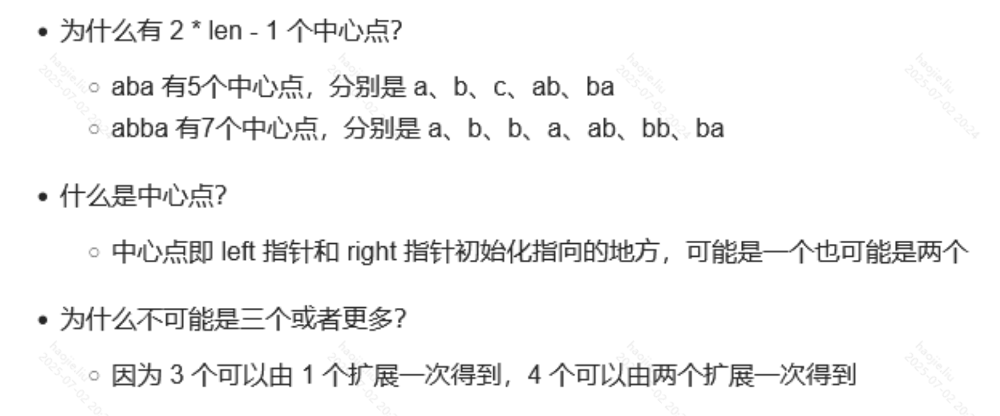

# 回文相关

### 回文子串

**动态规划**

```java
class Solution {
    public int countSubstrings(String s) {
        int len = s.length();
        //dp[i][j] 表示字符串s在[i,j]区间的子串是否是一个回文串。
        boolean[][] dp = new boolean[len][len];
        int ans = 0;

        //相当于双指针，前面的不能大于后面的指针
        for (int j = 0; j < len; j++) {
            for (int i = 0; i <= j; i++) {
                //前面的添加是吧i==j，算入就是本身自己也是一个回文串
                //后面的条件就是，要么两个指针包括的元素个数是1或者0个；另外的条件就是i+1到j-1是否为一个回文子串
                if (s.charAt(i) == s.charAt(j) && (j - i < 2 || dp[i + 1][j - 1])) {
                    dp[i][j] = true;
                    ans++;
                }
            }
        }
        return ans;
    }
}
```

**中心扩散法**



```java
class Solution {
    public int countSubstrings(String s) {
        int res = 0, len = s.length();
        //减一是因为索引从0开始
        for(int center = 0; center < len * 2 - 1; center++){
            //中心的起点
            int left = center / 2;
            //奇数偶数
            // 首先是left，有一个很明显的2倍关系的存在，其次是right，可能和left指向同一个（偶数时），也可能往后移动一个（奇数）
            // 大致的关系出来了，可以选择带两个特殊例子进去看看是否满足。
            int right = left + center % 2;
            while(left >= 0 && right < len && s.charAt(left) == s.charAt(right)){
                res++;
                left--;
                right++;
            }
        }
        return res;
    }
}
```

### 最长回文子串

**这里我们采用动态规划的方式解题**


```java
class Solution {
    public String longestPalindrome(String s) {
        int len = s.length();
        //串的长度小于2就失去了判断的意义
        if(len < 2)
            return s;

        int maxLen = 1;
        int begin = 0;
        //定义动态规划的状态，即最长字串dp[i...j]，注意这里是闭区间
        boolean[][] dp = new boolean[len][len];
        //二维数组的表格对角线全部默认初始化为true
        //横的代表右边界j，竖的代表左边界i
        for(int i = 0; i < len; i++)
            dp[i][i] = true;
        char[] chars = s.toCharArray();

        for(int j = 1; j < len; j++){
            for(int i = 0; i < j; i++){
                if(chars[i] != chars[j])
                    dp[i][j] = false;
                else{
                    if(j - i < 3)   //特殊情况当小于三肯定为一个回文
                        dp[i][j] = true;
                    else    //如果这个情况排除了，那么掐出首尾，判断其里面到串
                        dp[i][j] = dp[i+1][j-1];
                }
                //更新最大值
                if(dp[i][j] && j - i + 1 > maxLen){
                    maxLen = j - i + 1;
                    begin = i;
                }
            }
        }
        return s.substring(begin, begin + maxLen);

    }
}
```

**中心扩散法**

```java
class Solution {
    //中心扩散法，大概就是遍历每一个位置向外扩散除了首尾，因为首尾无法向外扩散了
    //由于回文串的特性，那么向外扩散
    //肯定是相等的然后记录最大长度
    //我们现在需要区分怎么选位置，对于奇数个字符，
    //那么自然而然我们选择中间位置向外扩散
    //对于偶数个就需要区别对待了
    public String longestPalindrome(String s) {
        int len = s.length();
        if(len < 2) return s;

        int maxLen = 0;
        // 数组第一位记录起始位置，第二位记录长度
        int[] res = new int[2];
        for (int i = 0; i < s.length() - 1; i++) {
            int[] odd = centerSpread(s, i, i);
            int[] even = centerSpread(s, i, i + 1);
            int[] max = odd[1] > even[1] ? odd : even;
            if (max[1] > maxLen) {
                res = max;
                maxLen = max[1];
            }
        }
        return s.substring(res[0], res[0] + res[1]);
    }

    private int[] centerSpread(String s, int left, int right) {
        int len = s.length();
        while (left >= 0 && right < len) {
            if (s.charAt(left) == s.charAt(right)) {
                left--;
                right++;
            } else {
                break;
            }
        }
        return new int[]{left + 1, right - left - 1};
    }
}
```

**极致版本中心扩散，与【回文子串】这道题的模板是一样的**

ababa 求最长公共子串

```java
class Solution {
    public String longestPalindrome(String s) {
        int len = s.length();
        String result = "";

        for (int i = 0; i < len * 2 - 1; i++) {
            int left = i / 2;
            int right = left + i % 2;
            while (left >= 0 && right < len && s.charAt(left) == s.charAt(right)) {
                String tmp = s.substring(left, right + 1);
                if (tmp.length() > result.length()) {
                    result = tmp;
                }
                left--;
                right++;
            }
        }
        return result;
    }
}
```

### 分割回文串

**这里有一个很明显的优化地方，就是先用动态规划把字符串每个位置的最大回文字串找出来，然后我们获取那个子串，这个过程是o1的。下面我们是每次都要去判断是否为子串**

```java
class Solution {
    List<List<String>> res = new ArrayList<>();
    Deque<String> list = new LinkedList<>();
    public List<List<String>> partition(String s) {
        dfs(s, 0);
        return res;
    }

    public void dfs(String s, int startIndex){
        //返回条件就是当起始位置大于等于串的长度，肯定就要返回了
        if(startIndex >= s.length()){
            res.add(new ArrayList<>(list));
            return;
        }
        for(int i = startIndex; i < s.length(); i++){
            //进来判断，如果是回文字串则开始记录
            if(isPalindrome(s, startIndex, i)){
                //因为substring是左闭右开
                String temp = s.substring(startIndex, i + 1);
                list.add(temp);
            }else
                continue;
            //然后开始下一层的递归
            dfs(s, i + 1);
            //回溯
            list.removeLast();
        }

    }
    //判断是否是回文串
    private boolean isPalindrome(String s, int startIndex, int end) {
        for (int i = startIndex, j = end; i < j; i++, j--) {
            if (s.charAt(i) != s.charAt(j)) {
                return false;
            }
        }
        return true;
    }
}
```

### 最长回文子序列

**这就就是利用创造一个反转后的字符串，然后两个字符串求最大公共子序列，其实就是利用回文的性质，正着倒着都一样，所以反转后还是存在**

```java
class Solution {
    public int longestPalindromeSubseq(String s) {
        int len = s.length();
        if(len == 0)
            return 0;
        if(len == 1)
            return 1;

        int[][] dp = new int[len+1][len+1];
        String s2 = reverse(s);
        for(int i = 1; i <= len; i++){
            for(int j = 1; j <= len; j++){
                if(s.charAt(i-1) == s2.charAt(j-1))
                    dp[i][j] = dp[i-1][j-1] + 1;
                else
                    dp[i][j] = Math.max(dp[i-1][j], dp[i][j-1]);
            }
        }
        return dp[len][len];
    }

    public String reverse(String s){
        char[] chars = s.toCharArray();
        int i = 0, j = chars.length - 1;
        while(i < j){
            char temp = chars[i];
            chars[i] = chars[j];
            chars[j] = temp;
            i++; j--;
        }
        return new String(chars);
    }
}

//上面反转使用数组的下标巧妙的替代了
class Solution {
    public int longestPalindromeSubseq(String s) {
        char c[]=s.toCharArray();
        int dp[][]=new int[c.length+1][c.length+1];
        //dp[i][j]可以看成是子串i...j的回文长度，
        //也可以看成是s的前i个字符和翻转串s2的前j个字符的最长公共子序列长度

        for(int i=1;i<=c.length;i++){
            for(int j=1;j<=c.length;j++){
                if(c[i-1]==c[c.length-j]){
                    dp[i][j]=dp[i-1][j-1]+1;
                }else{
                    dp[i][j]=Math.max(dp[i-1][j],dp[i][j-1]);
                }
            }
        }
        return dp[c.length][c.length];
    }
}
```

**通过新的状态定义，做出来的动态规划，题解简直神中神**

```java
class Solution {
    public int longestPalindromeSubseq(String s) {
        int len = s.length();
        //注意这里定义状态为：dp[i][j]：i到j的最长回文子序列为多少
        int[][] dp = new int[len][len];
        //初始化，我们这样初始化以及遍历规则其实就是把二维的下半部分格子全部都填了
        for(int i = 0; i < len; i++){
            dp[i][i] = 1;   //自己跟自己比回文肯定为1，i=j时就是i到i本身了呗
        }
        //从左到右，从下到上的遍历，因为我们格子的下半部分已知的已经填好了
        for(int i = len - 1; i >= 0; i--){
            for(int j = i + 1; j < len; j++){
                if(s.charAt(i) == s.charAt(j))
                    dp[i][j] = dp[i+1][j-1] + 2;
                else
                    dp[i][j] = Math.max(dp[i+1][j], dp[i][j-1]);
            }
        }
        //由于状态定义我们最后返回的也是整个字符串的最长回文子序列
        return dp[0][len - 1];
    }
}
```

### 验证回文串

**下面两种方法差不多，都是双指针，先判断是否为字母或数字，然后对字母进行额外处理**

```java
class Solution {
    public boolean isPalindrome(String s) {
        if(s == null)
            return false;
        int i = 0, j = s.length() - 1;
        while(i < j){
            while(i < j && !(isLetter(s.charAt(i)) || isNum(s.charAt(i))))
                i++;
            char a = s.charAt(i);
            while(i < j && !(isLetter(s.charAt(j)) || isNum(s.charAt(j))))
                j--;
            char b = s.charAt(j);
            if(i < j){
                if(isLetter(a) && isLetter(b))
                    if(!(a == b || (a - '32') == b || a == (b - '32')))
                        return false;
                else{
                    if(a != b)
                        return false;
                }
            }
            i++;
            j--;
        }
        return true;
    }

    public boolean isLetter(char ch){
        if((ch >= 'a' && ch <= 'z') || (ch >= 'A' && ch <= 'Z'))
            return true;
        else
            return false;
    }

    public boolean isNum(char ch){
        if(ch >= '0' && ch <= '9')
            return true;
        else
            return false;
    }
```

**使用API**

```java
    public boolean isPalindrome(String s) {
        char[] ss = s.toCharArray();
        int len = ss.length, i = 0, j = len - 1;
        while (i < j) {
            //过滤除了字母或数字以外的字符
            while (i < j && !Character.isLetterOrDigit(ss[i]))
                ++i;
            while (i < j && !Character.isLetterOrDigit(ss[j]))
                --j;
            //这个判断&是将大写转换成小写
            // ｜ 0x20   是小写转换成大写
            //当然你也可以直接将字母 - '32'
            if ((ss[i++] & 0xDF) != (ss[j--] & 0xDF))
                return false;
        }
        return true;
    }
```

**这里给个最基本的双指针判断回文**

```java
	private boolean isPalindrome(String s, int startIndex, int end) {
        for (int i = startIndex, j = end; i < j; i++, j--) {
            if (s.charAt(i) != s.charAt(j)) {
                return false;
            }
        }
        return true;
    }
```

### 验证回文字符串 Ⅱ

**与第一个种的区别就是如果判断当前不是回文，可以最多删除一个字符再去判断；我们采用首尾往中间聚集，获得关系，要么删除首要么删除尾；都不满足进行收紧首尾然后进行下一次循环**

```java
class Solution {
    public boolean validPalindrome(String s) {
        int begin = 0;
        int end = s.length() - 1;
        while(begin < end){
            if(isPalindrome(s, begin + 1, end) || isPalindrome(s, begin, end - 1)){
                return true;
            }
            begin++;
            end--;
        }
        return false;
    }

    //由于题目说明没有大小写以及数字的出现，全是小写，那么我们就用判断子串为回文串的最简单的方法
    private boolean isPalindrome(String s, int startIndex, int end) {
        for (int i = startIndex, j = end; i < j; i++, j--) {
            if (s.charAt(i) != s.charAt(j)) {
                return false;
            }
        }
        return true;
    }
}
```

### 回文数

**有暴力解法就是转换成字符串然后对比这里就不做赘述了**

**下面的第一种方法就是使用双指针，将一个数进行形式上的反转**

```java
class Solution {

    public boolean isPalindrome(int x) {
        if(x < 0 || x > Integer.MAX_VALUE)
            return false;
        int i = 0, j = 0;
        int temp = x;
        while(temp != 0){
            i = temp % 10;
            j = j * 10 + i;
            temp /= 10;
        }
        return j == x;
    }
```

**下面这种方法就是将回文数对半拆分，然后偶数直接比，奇数中间的数字落在了我们定义的变量上直接除10忽略就好**


```java
    public boolean isPalindrome(int x) {
        if(x < 0 || (x % 10 == 0 && x != 0))
            return false;
        //revertedNumber：倒数
        int revertedNumber = 0;
        while(x > revertedNumber){
            revertedNumber = revertedNumber * 10 + x % 10;
            x /= 10;
        }
        //偶数个直接相等，奇数把revertedNumber的最后一位去掉然后对比
        return revertedNumber == x || revertedNumber / 10 == x ;
    }
}
```

### 回文链表


```java
class Solution {
    ListNode firstNode;
    public boolean isPalindrome(ListNode head) {
        List<Integer> vals = new ArrayList<>();
        firstNode = new ListNode();
        firstNode = head;
        while(firstNode!=null){
            vals.add(firstNode.val);
            firstNode = firstNode.next;

        }
        int first = 0;
        int end = vals.size()-1;
        while(first<=end){
            if(vals.get(first)!=vals.get(end))
                return false;

            first++;
            end--;
        }

        return true;
    }
}
```

**双指针**

```java
class Solution {
    public boolean isPalindrome(ListNode head) {
        List<Integer> vals = new ArrayList<Integer>();

        // 将链表的值复制到数组中
        ListNode currentNode = head;
        while (currentNode != null) {
            vals.add(currentNode.val);
            currentNode = currentNode.next;
        }

        // 使用双指针判断是否回文
        int front = 0;
        int back = vals.size() - 1;
        while (front < back) {
            if (!vals.get(front).equals(vals.get(back))) {
                return false;
            }
            front++;
            back--;
        }
        return true;
    }
}
```