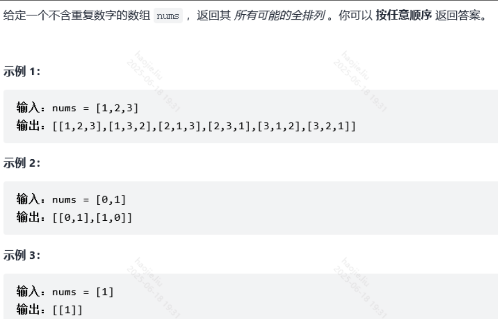

# 回溯法（递归枚举/剪枝）

### 全排列



```java
class Solution {
    /*
    result = []
    def backtrack(路径, 选择列表):
        if 满足结束条件:
            result.add(路径)
            return

        for 选择 in 选择列表:
            做选择
            backtrack(路径, 选择列表)
            撤销选择 
        */
    public List<List<Integer>> permute(int[] nums) {
        List<List<Integer>> res = new ArrayList<>();
        if(nums.length == 1){
            res.add(new ArrayList<Integer>(Arrays.asList(nums[0])));
            return res;
        }
        List<Integer> list = new ArrayList<>();
        backtrack(res, list, nums);
        return res;

    }

    //利用递归回溯的方式来解决
    public void backtrack(List<List<Integer>> res, List<Integer> list, int[] nums){
        if(list.size() == nums.length){ 
            //当我们list中的元素数量等于nums的时候我们就可以加入到res集合中去了
            //我们会将list中的元素进行添加或删除只要等于nums的长度那么就是一个全新的排列方式
            res.add(new ArrayList<>(list));
            return;
        }

        for(int num : nums){
            if(!list.contains(num)){
                list.add(num);  //如果不存在则添加这个元素，并进行再次递归到下一个索引位置再次做判断
                backtrack(res, list, nums);
                list.remove(list.size() - 1);   //从递归出来就将集合中最后一个元素除去，因为本次递归到头的这个回溯肯定将这个list添加到res中去了，我们需要将这个最后一个移除在进行下一轮的判断，
            }

        }
    }
}
```

### 全排列 II

全排列2跟1最大的区别就是存在了重复元素，那么会存在大量的重复递归，这时我们就要进行
回溯的剪枝来优化时间复杂度，也就是在for循环中多了一个去重操作
全排列1由于不存在重复数字，每个数字开头都是全新的排列，我们只需要关注重复遍历
但无需关注排列重复，
而全排列2存在重复数字，例如nums[1,1,2]，对于第一个1开头的 1 1 2 还是第二个1开头
的 1 1 2我们只需要一组就好了


```java
class Solution {
    List<List<Integer>> res = new ArrayList<>();
    public List<List<Integer>> permuteUnique(int[] nums) {
        if(nums.length == 1){
            res.add(new ArrayList<Integer>(Arrays.asList(nums[0])));
            return res;
        }

        List<Integer> list = new ArrayList<>();
        boolean[] used = new boolean[nums.length];
        //排序的目的
        Arrays.sort(nums);
        back(list, nums, used);
        return res;
    }

    public void back(List<Integer> list, int[] nums, boolean[] used){
        if(list.size() == nums.length){
            res.add(new ArrayList<>(list));
            return;
        }
        for(int i = 0; i < nums.length; i++){
            // used[i - 1] == true，说明同⼀树⽀nums[i - 1]使⽤过
            // used[i - 1] == false，说明同⼀树层nums[i - 1]使⽤过
            // 如果同⼀树层nums[i - 1]使⽤过则直接跳过
            if(i > 0 && nums[i] == nums[i - 1] && used[i - 1] == false)
                continue;
            if(used[i] == false){
                used[i] = true;   //标记同⼀树⽀nums[i]使⽤过，防止同一树支重复使用
                list.add(nums[i]);
                back(list, nums, used);
                //回溯，说明同⼀树层nums[i]使⽤过，防止下一树层重复
                list.remove(list.size() - 1);
                used[i] = false;    //回溯
            }
        }

    }
}
```

### 复原IP地址


```java
/**
 * @author lhj
 * @create 2022/3/10 11:11
 */
public class Test13 {
    public static void main(String[] args) {
        List<String> list = restoreIpAddresses("25525511135");
        System.out.println(list);
    }

    public static List<String> restoreIpAddresses(String s) {
        int len = s.length();
        List<String> res = new ArrayList<>();
        if (len > 12 || len < 4) {
            return res;
        }

        Deque<String> path = new ArrayDeque<>(4);
        dfs(s, len, 0, 4, path, res);
        return res;
    }

    // 需要一个变量记录剩余多少段还没被分割，residue残留物
    //如果residue为4则有四段还没分割，每一段对应树的一层，除根结点外最多有四层
    private static void dfs(String s, int len, int begin, int residue, Deque<String> path, List<String> res) {
        //无论是return还是break还是continue都是进行剪枝操作，即将无效的分割排除
        if (begin == len) {
            if (residue == 0) {
                res.add(String.join(".", path));
            }
            return;
        }

        for (int i = begin; i < begin + 3; i++) {
            //当开始的地方已经比len大了，证明位数多了
            if (i >= len) {
                break;
            }

            //这个判断是判断当begin到i的值如果取在此层，那么下一层的元素绝对会超过3
            if (residue * 3 < len - i) {
                continue;
            }

            if (judgeIpSegment(s, begin, i)) {

                String currentIpSegment = s.substring(begin, i + 1);
                path.addLast(currentIpSegment);

                //继续回溯判断下一层
                dfs(s, len, i + 1, residue - 1, path, res);
                //以i+1开始的某段如果不符合则要在path中删除
                path.removeLast();
            }
        }
    }

    //这个方法就是判断传过来的索引对应的数值是否为0~256，并且将其转换为int
    private static boolean judgeIpSegment(String s, int left, int right) {
        int len = right - left + 1;
        if (len > 1 && s.charAt(left) == '0') {
            return false;
        }

        int res = 0;
        while (left <= right) {
            res = res * 10 + s.charAt(left) - '0';
            left++;
        }

        return res >= 0 && res <= 255;

    }
}
```

**更简单移动的dfs**

```java
public class Main {
    public ArrayList<String> restoreIpAddresses (String s) {
        ArrayList<String> res = new ArrayList<>();
        dfs(s, res, 0, 0);
        return res;
    }

    private String nums = "";
    public void dfs(String s, ArrayList<String> res, int step, int index){
        String cur = "";
        if (step == 4) {
            if (index != s.length())  return ;
            res.add(nums);
            return;
        } else {
            for (int i = index;i <= index + 3 && i < s.length(); i++) {
                cur += s.charAt(i);
                int num = Integer.parseInt(cur);
                String temp = nums;
                if (num <= 255 && (cur.length() == 1 ||cur.charAt(0) != '0')) {
                    if (step - 3 != 0)
                        nums += cur + ".";
                    else
                        nums += cur;
                    dfs(s, res,step+1,i+1);
                    nums = temp;
                }
            }
        }
    }
}
```

### 括号生成

**回溯算法（深度优先遍历），还有广度优先算法**


```java
class Solution {
    List<String> list = new ArrayList<>();
    public List<String> generateParenthesis(int n) {
        if(n == 0)
            return list;

        dfs("",n,n);
        return list;
    }

    //left和right的量表示剩余可用的量
    public void dfs(String curRes, int left, int right){
        // 因为每一次尝试，都使用新的字符串变量，所以无需回溯
        // 在递归终止的时候，直接把它添加到结果集即可，注意与「力扣」第 46 题、第 39 题区分
        if(left == 0 && right == 0){
            list.add(curRes);
            return;
        }

        //如果左括号能用的量大于右括号的量，
        //也就是说右括号是没有左括号进行匹配的，这是最应该避讳的
        //这一步也就是我们俗称的剪枝
        if(left > right)
            return;

        if(left > 0){
            //注意不能写成下面这两条因为，会使本层的curRes改变
            dfs(curRes + "(", left - 1, right);
            //curRes += "(";
            //dfs(curRes, left - 1, right);
        }

        if(right > 0){
            dfs(curRes + ")", left, right - 1);
        }
    }
}
```

### 子集

```java
class Solution {
    //此题我觉得可以用动态规划，每一个状态dp[i]定义为以数组下表i为结尾
    //的字集为
    List<List<Integer>> res = new ArrayList<>();
    public List<List<Integer>> subsets(int[] nums) {
        List<Integer> list = new ArrayList<>();
        recall(nums, list, 0);
        return res;
    }

    public void recall(int[] nums, List<Integer> list, int start){
        res.add(new ArrayList<>(list));
        for(int i = start; i < nums.length; i++){
            list.add(nums[i]);
            recall(nums, list, i + 1);
            //这里注意浅拷贝和深拷贝的区别
            list.remove(list.size() - 1);
        }
    }

    //使用二进制和位运算

        public static List<List<Integer>> binaryBit(int[] nums) {
        List<List<Integer>> res = new ArrayList<List<Integer>>();
        for (int i = 0; i < (1 << nums.length); i++) {
            List<Integer> sub = new ArrayList<Integer>();
            for (int j = 0; j < nums.length; j++)
                if (((i >> j) & 1) == 1) sub.add(nums[j]);
            res.add(sub);
        }
        return res;
    }

    //利用枚举，逐个枚举，空集的幂集只有空集，每增加一个元素，让之前幂集中的每个集合，追加这个元素，就是新增的子集。

        /**
     * 循环枚举
     */
    public static List<List<Integer>> enumerate(int[] nums) {
        List<List<Integer>> res = new ArrayList<List<Integer>>();
        res.add(new ArrayList<Integer>());
        for (Integer n : nums) {
            int size = res.size();
            for (int i = 0; i < size; i++) {
                List<Integer> newSub = new ArrayList<Integer>(res.get(i));
                newSub.add(n);
                res.add(newSub);
            }
        }
        return res;
    }

    /**
     * 递归枚举
     */
    public static void recursion(int[] nums, int i, List<List<Integer>> res) {
        if (i >= nums.length) return;
        int size = res.size();
        for (int j = 0; j < size; j++) {
            List<Integer> newSub = new ArrayList<Integer>(res.get(j));
            newSub.add(nums[i]);
            res.add(newSub);
        }
        recursion(nums, i + 1, res);
    }
}
```

### 单词搜索

**回溯算法**

```java
class solution{
    private static final int[][] DIRECTIONS = {{-1, 0}, {0, -1}, {0, 1}, {1, 0}};
    private int rows;
    private int cols;
    private int len;
    private boolean[][] visited;
    private char[] charArray;
    private char[][] board;

    public boolean exist01(char[][] board, String word) {
        rows = board.length;
        if (rows == 0) {
            return false;
        }
        cols = board[0].length;
        //标记访问过的元素
        visited = new boolean[rows][cols];

        this.len = word.length();
        this.charArray = word.toCharArray();
        this.board = board;
        for (int i = 0; i < rows; i++) {
            for (int j = 0; j < cols; j++) {
                //循环遍历每个结点
                if (dfs(i, j, 0)) {
                    return true;
                }
            }
        }
        return false;
    }

    private boolean dfs(int x, int y, int begin) {
        //当begin等于最后一个字符时，加速判断邻近的四个元素
        if (begin == len - 1) {
            return board[x][y] == charArray[begin];
        }
        if (board[x][y] == charArray[begin]) {
            //如果相等，则标记为true，说明访问过并且符合条件
            visited[x][y] = true;
            for (int[] direction : DIRECTIONS) {
                //然后开始对他的上下左右，开始进行判断
                int newX = x + direction[0];
                int newY = y + direction[1];
                //如果符合边界条件并且没有访问过
                if (inArea(newX, newY) && !visited[newX][newY]) {
                    //则进入符合条件的节点的下一轮递归，开判断它的上下左右是否符合
                    /*
                    * 这里我们不能直接返回 return dfs(newX, newY, begin + 1)，因为这样就缺少判断了，
                    * 当当前结点不符条件我们要进行回溯
                    * */
                    if (dfs(newX, newY, begin + 1)) {
                        return true;
                    }
                }
            }
            visited[x][y] = false;
        }
        return false;
    }

    private boolean inArea(int x, int y) {
        return x >= 0 && x < rows && y >= 0 && y < cols;
    }
}
```

### 目标和

**这道题还是老老实实用DFS+记忆化吧，那个动态规划属实不好理解**

```java
class Solution {
    public int findTargetSumWays(int[] nums, int target) {
        return dfs(nums, target, 0, 0);
    }

    Map<String, Integer> cache = new HashMap<>();
    //target代表目标值，count代表现在用了几个数字，cur代表当前值
    public int dfs(int[] nums, int target, int count, int cur) {
        String key = count + "_" + cur;
        if (cache.containsKey(key)) 
            return cache.get(key);
        //当使用了全部的数字就去判断是否为结果
        if (count == nums.length) {
            cache.put(key, cur == target ? 1 : 0);
            return cache.get(key);
        }
        //有两个方向，一种是+，一种是-
        int left = dfs(nums, target, count + 1, cur + nums[u]);
        int right = dfs(nums, target, count + 1, cur - nums[u]);
        //统计结果
        cache.put(key, left + right);
        return cache.get(key);
    }
```

### 电话号码的字母组合

**DFS+回溯，用数组或者switch都可以**

```java
class Solution {
    List<String> list;
    String[] allWords = {" ","*","abc","def","ghi","jkl","mno","pqrs","tuv","wxyz"};
    public List<String> letterCombinations(String digits) {
        list = new ArrayList<>();
        if(digits==null || digits.length()==0) {
            return new ArrayList<>();
        }
        dfs(digits, 0);
        return list;

    }
    StringBuilder sb = new StringBuilder();
    public void dfs(String res, int index){
        if(res.length() == index){
            list.add(sb.toString());
            return;
        }
        char ch = res.charAt(index);
        int pos = ch - '0';
        //String words = getChar(pos);
        String words = allWords[pos];
        for(int i = 0; i < words.length(); i++){
            sb.append(words.charAt(i));
            dfs(res, index + 1);
            sb.deleteCharAt(sb.length() - 1);
        }

    }

    public String getChar(int num){
        if(num < 2 || num > 9)
            return null;
        switch(num){
            case 2:
                return "abc";
            case 3:
                return "def";
            case 4:
                return "ghi";
            case 5:
                return "jkl";
            case 6:
                return "mno";
            case 7:
                return "pqrs";
            case 8:
                return "tuv";
            case 9:
                return "wxyz";
            default:
                return "";
        }
    }
}
```

### 组合总和

**这道题就是用了begin变量来去重，而找零钱那个就用了一个数组来去重标记用过的**

**与第二类型最大不同就是允许一个数组的重复使用无限制**


```java
class Solution {
    List<List<Integer>> res = new ArrayList<>();
    Deque<Integer> list = new LinkedList<>();
    public List<List<Integer>> combinationSum(int[] candidates, int target) {
        Arrays.sort(candidates);
        dfs(candidates, 0, target, list);
        return res;
    }

    public void dfs(int[] nums,int begin, int target, Deque<Integer> list){

        if(target == 0){
            res.add(new ArrayList<>(list));
            return;
        }

        //设置开始索引，就能使其不从0开始，从而达到去重
        for(int i = begin; i < nums.length; i++){
            //由于会遍历很多已经知道结果的后续多余遍历，此时我们就可以将后面的过程省略来优化时间复杂度，
            //比如数组【2，3，6，7】当target值减去6已经小于0了我们就没必要让他再去减7了
            //所以在这里就进行判断
            if(target < nums[i])
                //减少后续已知循环
                break;
            list.addLast(nums[i]);
            dfs(nums, i, target - nums[i], list);
            list.removeLast();
        }

    }
}

```

### 组合总和 II

**与第一题的最大不同就是只允许相同位置的一个数字在同一个组合中用一次**

```java
class Solution {
    List<List<Integer>> res = new ArrayList<>();
    List<Integer> list = new ArrayList<>();
    public List<List<Integer>> combinationSum2(int[] candidates, int target) {
        int n = candidates.length;
        Arrays.sort(candidates);
        dfs(candidates, target, 0, list);
        return res;
    }

    public void dfs(int[] nums, int target, int begin, List<Integer> list){
        if(target == 0){
            res.add(new ArrayList<>(list));
            return;
        }

        for(int i = begin; i < nums.length; i++){
            //出现直接比target大的直接跳过
            if(target < nums[i])
                break;
            //这里的去重判断是三数之和中的，不过哪里的i大于0就符合条件，在这道题中如果也
            //这样设置就会把形如 1,1,6的结果去除掉，当换成当前递归层的开始结点就会解决
            if(i > begin && nums[i] == nums[i - 1])
                continue;
            list.add(list.size(), nums[i]);
            //这里规定了每个数字在每个组合中只能用一次，而不是无限使用，那么我们就要
            //将在组合问题一中的i改为i+1，避免当前值的重复使用
            dfs(nums, target - nums[i], i + 1, list);
            list.remove(list.size() - 1);
        }
    }
}
```

### 组合

**跟组合总和一样一样的**

```java
class Solution {
    List<List<Integer>> res = new ArrayList<>();
    Deque<Integer> queue = new LinkedList<>();
    public List<List<Integer>> combine(int n, int k) {
        int[] temp = new int[n];
        for(int i = 0; i < n; i++){
            temp[i] = i + 1;
        }
        dfs(temp, 0, k);
        return res;
    }

    public void dfs(int[] nums, int begin, int k){
        if(queue.size() == k){
            res.add(new ArrayList(queue));
            return;
        }
        for(int i = begin; i < nums.length; i++){
            queue.add(nums[i]);
            dfs(nums, i+1, k);
            queue.removeLast();
        }
    }
}
```

### 字典序排数


**递归方法**

```java
//递归的方法，如果你计较递归带来的额外空间，空间复杂度勉强可以算作On
    List<Integer> list = new ArrayList<>();
    public List<Integer> lexicalOrder(int n) {
        //注意这里的起始值为1，字典序最小为1，不存在0打头
        for(int i = 1; i <= 9; i++){
            dfs(i, n);
        }
        return list;
    }

    public void dfs(int cur, int limit){
        //字典序中的元素都是严格小于等于limit的
        if(cur > limit)
            return;
        list.add(cur);
        //注意这里的起始值，这是存在前缀1~9后的0~9
        for(int i = 0; i <= 9; i++)
            dfs(cur * 10 + i, limit);
    }
```

**迭代的方式**

```java
public List<Integer> lexicalOrder(int n) {
        List<Integer> list = new ArrayList<>();
        for(int i = 0, j = 1; i <= n; i++){
            list.add(j);
            if(j * 10 <= n){
                j *= 10;
            }else{
                //这里就是处理：例如大于10小于20中n的 1~2 之间的元素开始和结束
                while(j % 10 == 9 || j + 1 > n)
                    j /= 10;
                j++;
            }
        }
        return list;
    }
```

### 字符串的排列

**与全排列2的一模一样的代码模板，DFS+剪枝+回溯，但是切记一定要对目标数组进行排序，因为我们去重就是用了相同元素是邻近元素的特性**

```java
class Solution {
    List<String> res = new ArrayList<>();
    public String[] permutation(String s) {
        int len = s.length();
        if(len <= 0)
            return null;
        StringBuilder sb = new StringBuilder();
        boolean[] used = new boolean[len];
        char[] ch = s.toCharArray();
        Arrays.sort(ch);
        dfs(ch, sb, used);
        return res.toArray(new String[res.size()]);
    }

    public void dfs(char[] ch, StringBuilder sb, boolean[] used){
        if(sb.length() == ch.length){
            res.add(sb.toString());
            return;
        }
        for(int i = 0; i < ch.length; i++){
            if(i > 0 && ch[i] == ch[i-1] && used[i - 1] == false)
                continue;
            if(used[i] == false){
                used[i] = true;   //标记同⼀树⽀nums[i]使⽤过，防止同一树支重复使用
                sb.append(ch[i]);
                dfs(ch, sb, used);
                //回溯，说明同⼀树层nums[i]使⽤过，防止下一树层重复
                sb.deleteCharAt(sb.length() - 1);
                used[i] = false;    //回溯
            }

        }
    }
}
```

**另一个中使用set结果集去去重，时间复杂度没有我们那个优秀，因为最终回去尝试递归调用**

该题类似于 全排列2，本题使用set来去除重复元素

除了使用set去重外，还可以对数组进行排序，使用visited数组进行剪枝！

```java
class Solution {
    Set<String> res = new HashSet();
    public String[] permutation(String s) {
        int len = s.length();
        if(len <= 0)
            return null;
        StringBuilder sb = new StringBuilder();
        boolean[] used = new boolean[len];
        char[] ch = s.toCharArray();
        dfs(ch, sb, used);
        return res.toArray(new String[res.size()]);
    }

    public void dfs(char[] ch, StringBuilder sb, boolean[] used){
        if(sb.length() == ch.length){
            res.add(sb.toString());
            return;
        }
        for(int i = 0; i < ch.length; i++){
        // 剪枝，如果当前位置的元素已经使用过，则跳过进入下一个位置
            if(used[i])
                continue;
            used[i] = true;   //标记同⼀树⽀使⽤过，防止同一树支重复使用
            sb.append(ch[i]);
            dfs(ch, sb, used);
            //回溯，说明同⼀树层使⽤过，防止下一树层重复
            sb.deleteCharAt(sb.length() - 1);
            used[i] = false;    //回溯
        }
    }
}
```