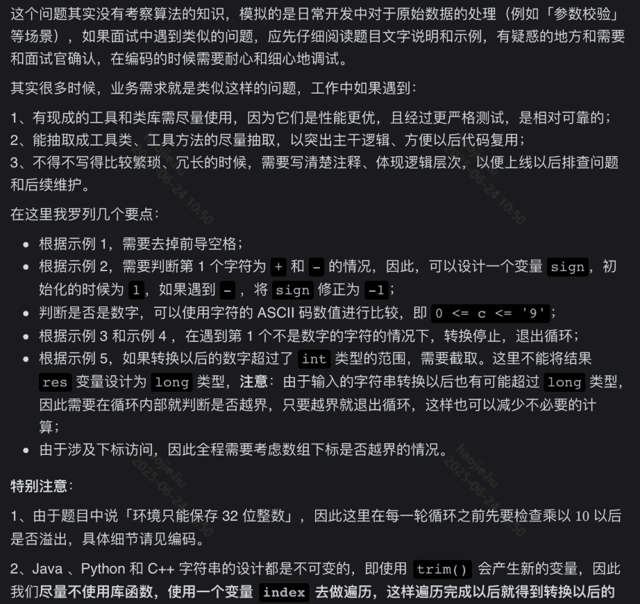

# 字符串处理 / 解析 / 模拟

### 字符串相加

**从末尾开始逐个相加**

```java
class Solution {
    public String addStrings(String num1, String num2) {
        StringBuilder res = new StringBuilder("");
        //定义两个指针和一个进位的标志位
        int i = num1.length() - 1, j = num2.length() - 1, carry = 0;
        while(i >= 0 || j >= 0 || carry != 0){
            //两个位如果是0，则默认为0
            int n1 = i >= 0 ? num1.charAt(i) - '0' : 0;
            int n2 = j >= 0 ? num2.charAt(j) - '0' : 0;
            //两个位加上进位的值
            int tmp = n1 + n2 + carry;
            //存在进位这里为1
            carry = tmp / 10;
            //将总和取余添加到末尾
            res.append(tmp % 10);
            //向前遍历移动
            i--; j--;
        }
        //如果最后的两个位（位数相同的两个或者位数多的最高位是9）存在进位，进行+1
        if(carry == 1) res.append(1);
        //如果对字符串进行反转即为最后的结果
        return res.reverse().toString();
    }
}
```

### 比较版本号

**使用分割，将每一段段数字转换成int 进行比较大小**

```java
class Solution {
    public int compareVersion(String version1, String version2) {
        String[] s1 = version1.split("\\.");
        String[] s2 = version2.split("\\.");
        for(int i = 0; i < s1.length || i < s2.length; ++i){
            int num1 = 0, num2 = 0;
            if(i < s1.length)
                num1 = Integer.parseInt(s1[i]);

            if(i < s2.length)
                num2 = Integer.parseInt(s2[i]);

            if(num1 > num2)
                return 1;

            if(num1 < num2)
                return -1;
        }
        return 0;
    }
}
```

**通过双指针优化空间复杂度，替代数组，大致思路与上面同理**

```java
class Solution {
    public int compareVersion(String version1, String version2) {
        int i = 0, j = 0;
        while(i < version1.length() || j < version2.length()){
            int num1 = 0;
            for(; i < version1.length() && version1.charAt(i) != '.'; ++i){
                num1 = num1 * 10 + version1.charAt(i) - '0';
            }
            ++i;//跳出这个循环就代表遇到.了，那么直接++跳过

            int num2 = 0;
            for(; j < version2.length() && version2.charAt(j) != '.'; ++j){
                num2 = num2 * 10 + version2.charAt(j) - '0';
            }
            ++j;
            if(num1 > num2)
                return 1;
            if(num1 < num2)
                return -1;
        }
        return 0;
    }
}

```

### 字符串转换整数 (atoi)



```java
public class Solution {
    //猪头麻烦以后记住，由字符串到整形的时候想想char
    public int myAtoi(String str) {
        int len = str.length();
        // str.charAt(i) 方法回去检查下标的合法性，一般先转换成字符数组
        char[] charArray = str.toCharArray();

        // 1、去除前导空格
        int index = 0;
        while (index < len && charArray[index] == ' ') {
            index++;
        }

        // 2、如果已经遍历完成（针对极端用例 "      "）
        if (index == len) {
            return 0;
        }

        // 3、如果出现符号字符，仅第 1 个有效，并记录正负
        int sign = 1;
        char firstChar = charArray[index];
        if (firstChar == '+') {
            index++;
        } else if (firstChar == '-') {
            index++;
            sign = -1;
        }

        // 4、将后续出现的数字字符进行转换
        // 不能使用 long 类型，这是题目说的
        int res = 0;
        while (index < len) {
            char currChar = charArray[index];
            // 4.1 先判断不合法的情况
            if (currChar > '9' || currChar < '0') {
                break;
            }

            // 题目中说：环境只能存储 32 位大小的有符号整数，因此，需要提前判断：乘以 10 以后是否越界
            if (res > Integer.MAX_VALUE / 10 || (res == Integer.MAX_VALUE / 10 && (currChar - '0') > Integer.MAX_VALUE % 10)) {
                return Integer.MAX_VALUE;
            }
            if (res < Integer.MIN_VALUE / 10 || (res == Integer.MIN_VALUE / 10 && (currChar - '0') > -(Integer.MIN_VALUE % 10))) {
                return Integer.MIN_VALUE;
            }

            // 4.2 合法的情况下，才考虑转换，每一步都把符号位乘进去
            //字符是以ASCII码存入电脑的 c1-‘0’表示将c1的ascii码值减去0的ascii码值，这样就得到了另一个字符的ascii码值
            res = res * 10 + sign * (currChar - '0');
            index++;
        }
        return res;
    }

}
```

### 字符串相乘


**最原始的方法，根据第二个乘数的每一位跟第一个乘数的每一位相乘最后想加**

```java
class Solution {
    public String multiply(String num1, String num2) {
        if(num1.equals("0") || num2.equals("0"))
            return "0";

        String res = "0";

        for(int i = num2.length() - 1; i >= 0; i--){
            int carry = 0;
            StringBuilder temp = new StringBuilder();
            //补0
            for(int j = 0; j < num2.length() - i - 1; j++){
                temp.append(0);
            }
            int n2 = num2.charAt(i) - '0';

            //这里就是循环乘
            //例如：123*456 -》123*6-》3*6｜2*6｜1*6
            for(int j = num1.length() - 1; j >= 0 
                || carry !=0; j--){
                int n1 = j >= 0 ? num1.charAt(j) - '0' : 0;
                int partSum = (n1 * n2 + carry) % 10;
                temp.append(partSum);
                carry = (n1 * n2 + carry) / 10;
            }
            res = addStrings(res, temp.reverse().toString());
        }
        return res;

    }

    //由于乘法存在竖式下面不同位数会进行分别的乘积并相加，除了第一次的相乘结果不补零，后面每一次都要对应补零，补零的位数每次+1
    //就是将123*6的结果跟123*5的结果想加，5开始就要补零了
    public String addStrings(String num1, String num2){
        StringBuilder res = new StringBuilder();
        int i = num1.length() - 1, j = num2.length() - 1, carry = 0;
        while(i >= 0 || j >= 0 || carry != 0){
            int n1 = i >= 0 ? num1.charAt(i) - '0' : 0;
            int n2 = j >= 0 ? num2.charAt(j) - '0' : 0;
            int temp = n1 + n2 + carry;
            carry = temp / 10;
            res.append(temp % 10);
            i--;
            j--;
        }
        //数的最后一位存在进位的情况
        if(carry == 1)
            res.append(1);
        return res.reverse().toString();
    }
}
```


**根据索引对应来解决，虽然时间复杂度和空间复杂度都与第一种一样，但是实际上来会比第一种性能更优，因为少了循环相加的过程**

该算法是通过两数相乘时，乘数某位与被乘数某位相乘，与产生结果的位置的规律来完成。具体规律如下：

> 乘数 num1 位数为 M，被乘数 num2 位数为 N， num1 x num2 结果 res 最大总位数为 M+N， num1[i] x num2[j] 的结果为 tmp(位数为两位，"0x","xy"的形式)，其第一位位于 res[i+j]，第二位位于 res[i+j+1]。
> 

```java
class Solution {
    public String multiply(String num1, String num2) {
        if(num1.equals("0") || num2.equals("0"))
            return "0";

        int[] res = new int[num1.length() + num2.length()];
        //例如 123 * 456
        //外层大循环控制123，三个数字的移动,以竖式就是
        //  456
        //* 123的形式
        for(int i = num1.length() - 1; i >= 0; i--){

            int n1 = num1.charAt(i) - '0';
            for(int j = num2.length() - 1; j >= 0; j--){
                //对于num1[j]*num2[i]相乘结果肯定是个两位数，从左到右第一位对应sum[i+j],
                //第二位对应sum[i+j+1]
                int n2 = num2.charAt(j) - '0';

                //处理重合部分
                int sum = (res[i + j + 1] + n1 * n2);

                //从左到右第一位就是进位 除10就好
                //这里+=是因为看那个示意图，前一位要承担将整个竖式的值全部都想加
                res[i + j] += sum / 10;
                //第二位就是剩余 取余10就好
                res[i + j + 1] = sum % 10;
            }

        }

        StringBuilder result = new StringBuilder();
        for(int i = 0; i < res.length; i++){
        //这里注意一定要res[i] == 0这个加上，因为遇到两个个位数相乘还是个位数时，我们在上面
        //一开始就会补零，这个判断就是讲这种情况剔除掉
            if(i == 0 && res[i] == 0)
                continue;
            result.append(res[i]);
        }
        return result.toString();
    }
}
```

### 翻转字符串里的单词

**暴力解法**

```java
class Solution {
    //这个就是用jdk自带的各种封装好的方法直接进行反转
    public String reverseWords(String s) {
        // 除去开头和末尾的空白字符
        s = s.trim();
        // 正则匹配连续的空白字符作为分隔符分割
        List<String> wordList = Arrays.asList(s.split("\\s+"));
        Collections.reverse(wordList);
        return String.join(" ", wordList);
    }
}
```

**队列**

```java
class Solution {
    //这里就是用队列的方式，将开始的单词入队，最后在从头部成逐个取出
    public String reverseWords(String s) {
        int left = 0, right = s.length() - 1;
        // 去掉字符串开头的空白字符
        while (left <= right && s.charAt(left) == ' ') {
            ++left;
        }

        // 去掉字符串末尾的空白字符
        while (left <= right && s.charAt(right) == ' ') {
            --right;
        }

        Deque<String> d = new ArrayDeque<String>();
        StringBuilder word = new StringBuilder();

        while (left <= right) {
            char c = s.charAt(left);
            if ((word.length() != 0) && (c == ' ')) {
                // 将单词 push 到队列的头部
                d.offerFirst(word.toString());
                word.setLength(0);
            } else if (c != ' ') {
                word.append(c);
            }
            ++left;
        }
        d.offerFirst(word.toString());

        //String的join方法就是在集合中的每个元素之间加入指定的字符串
        return String.join(" ", d);
    }
}
```

### 字符串解码

**栈**

```java
class Solution {
    public String decodeString(String s) {
        //存储当前拼接的字符
        StringBuilder str = new StringBuilder();

        //存储倍数的栈
        Deque<Integer> stack_num = new LinkedList<>();
        //临时存储倍数的变量
        int num = 0;
        //存储字符的栈
        Deque<String> stack_str = new LinkedList<>();

        for(Character c : s.toCharArray()){
            //遇到左括号将倍数跟字符入栈
            if(c == '['){
                stack_num.push(num);
                stack_str.push(str.toString());
                //将倍数置为0
                num = 0;
                //将字符置为空
                str = new StringBuilder();
                //遇到右括号则要将倍数、字符然后弹出栈
            }else if(c == ']'){
                StringBuilder temp = new StringBuilder();
                int cur_num = stack_num.pop();
                //循环将倍数*字符的添加到temp
                for(int i = 0; i < cur_num; i++)
                    temp.append(str);
                //然后将字符栈中的字符弹出栈后面跟上上面循环算出的字符
                str = new StringBuilder(stack_str.pop() + temp);
            }else if(c >= '0' && c <='9')
                num = num * 10 + Integer.parseInt(c + "");
            else
                str.append(c);

        }
        return str.toString();
    }
}
```

**递归方法**

```java
class Solution {
    public String decodeString(String s) {
        return dfs(s, 0)[0];
    }
    private String[] dfs(String s, int i) {
        StringBuilder res = new StringBuilder();
        int multi = 0;
        while(i < s.length()) {
            if(s.charAt(i) >= '0' && s.charAt(i) <= '9') 
                multi = multi * 10 + Integer.parseInt(String.valueOf(s.charAt(i))); 
            else if(s.charAt(i) == '[') {
                String[] tmp = dfs(s, i + 1);
                i = Integer.parseInt(tmp[0]);
                while(multi > 0) {
                    res.append(tmp[1]);
                    multi--;
                }
            }
            else if(s.charAt(i) == ']') 
                return new String[] { String.valueOf(i), res.toString() };
            else 
                res.append(String.valueOf(s.charAt(i)));
            i++;
        }
        return new String[] { res.toString() };
    } 
}
```

### 最长公共前缀

```java
class Solution {
    public String longestCommonPrefix(String[] strs) {
        if(strs == null || strs.length == 0)
            return "";

        String res = strs[0];
        //从1开始是因为我们将0作为模式串进行对比
        for(int i = 1; i < strs.length; i++){
            int resCount = 0;
            for(;resCount < res.length() && resCount < strs[i].length(); resCount++){
                if(res.charAt(resCount) 
                != strs[i].charAt(resCount)){
                    break;
                }
            }
            res = res.substring(0, resCount);
            if(res == "")
                return "";
        }
        return res;
    }
}
```

### 验证IP地址

正则

```java
class Solution {
    public String validIPAddress(String queryIP) {
        if (queryIP == null) {
            return "Neither";
        }

        String regex0 = "((\\d)|([1-9]\\d)|(1\\d\\d)|((25[0-5])|2[0-4]\\d))";
        String regexIPv4 = regex0 + "(\\." + regex0 + "){3}";
        String regex1 = "(\\d|[a-f]|[A-F]){1,4}";
        String regexIPv6 = regex1 + "(:" + regex1 + "){7}";
        String result = "Neither";
        if (queryIP.matches(regexIPv4)) {
            result = "IPv4";
        } else if (queryIP.matches(regexIPv6)) {
            result = "IPv6";
        }
        return result;
    }
}
```

不用正则

```java
class Solution {
    public String validIPAddress(String ip) {
        if (ip.indexOf(".") >= 0 && check4(ip)) return "IPv4";
        if (ip.indexOf(":") >= 0 && check6(ip)) return "IPv6";
        return "Neither";
    }
    boolean check4(String ip) {
        int n = ip.length(), cnt = 0;
        char[] cs = ip.toCharArray();
        for (int i = 0; i < n && cnt <= 3; ) {
            // 找到连续数字段，以 x 存储
            int j = i, x = 0;
            while (j < n && cs[j] >= '0' && cs[j] <= '9' && x <= 255) x = x * 10 + (cs[j++] - '0');
            // 非 item 字符之间没有 item
            if (i == j) return false;
            // 含前导零 或 数值大于 255
            if ((j - i > 1 && cs[i] == '0') || (x > 255)) return false;
            i = j + 1;
            if (j == n) continue;
            // 存在除 . 以外的其他非数字字符
            if (cs[j] != '.') return false;
            cnt++;
        }
        // 恰好存在 3 个不位于两端的 .
        return cnt == 3 && cs[0] != '.' && cs[n - 1] != '.';
    }
    boolean check6(String ip) {
        int n = ip.length(), cnt = 0;
        char[] cs = ip.toCharArray();
        for (int i = 0; i < n && cnt <= 7; ) {
            int j = i;
            while (j < n && ((cs[j] >= 'a' && cs[j] <= 'f') || (cs[j] >= 'A' && cs[j] <= 'F') || (cs[j] >= '0' && cs[j] <= '9'))) j++;
            // 非 item 字符之间没有 item 或 长度超过 4
            if (i == j || j - i > 4) return false;
            i = j + 1;
            if (j == n) continue;
            // 存在除 : 以外的其他非数字字符
            if (cs[j] != ':') return false;
            cnt++;
        }
        // 恰好存在 7 个不位于两端的 :
        return cnt == 7 && cs[0] != ':' && cs[n - 1] != ':';
    }
}
```

### 36进制加法


**本题与415非常相似，建议对比记忆**

```java
//36进制的数表示为 0~9正常表 10~36 用 a~z表示，例如1b = 47 2x = 105
    private char getChar(int n){
        if(n <= 9)
            return (char) (n + '0');
        else  //假设这里是11，那么11 - 10 = 1 ； 1 + 'a' = b
            return (char) (n - 10 + 'a');
    }

    private int getInt(char ch){
        if('0' <= ch && ch <= '9')
            return ch - '0';
        else    //例如这里ch是 b， b - a = 1,1 + 10 = 11
            return ch - 'a' + 10;
    }
    public String addStrings(String num1, String num2) {
        StringBuilder res = new StringBuilder("");
        //定义两个指针和一个进位的标志位
        int i = num1.length() - 1, j = num2.length() - 1, carry = 0;
        while(i >= 0 || j >= 0 || carry != 0){
            //两个位如果是0，则默认为0
            int n1 = i >= 0 ? getInt(num1.charAt(i)) : 0;
            int n2 = j >= 0 ? getInt(num2.charAt(j)) : 0;
            //两个位加上进位的值
            int tmp = n1 + n2 + carry;
            //存在进位这里为1
            carry = tmp / 36;
            //将总和取余添加到末尾
            res.append(getChar(tmp % 36));
            //向前遍历移动
            i--; j--;
        }
        //如果最后的两个位（位数相同的两个或者位数多的最高位是9）存在进位，进行+1
        if(carry == 1) res.append(getChar(1));
        //如果对字符串进行反转即为最后的结果
        return res.reverse().toString();
    }
```

### 至少有K个重复字符的最长子串

**递归**

```java
class Solution {
    public int longestSubstring(String s, int k) {
        //如果本次递归的字符串都小于k了，那么结束本层循环
        if(s.length() < k)
            return 0;
        //存放每个字符的出现频率
        Map<Character, Integer> map = new HashMap<>();
        for(int i = 0; i < s.length(); i++){
            map.put(s.charAt(i), map.getOrDefault(s.charAt(i), 0) + 1);
        }

        //开始遍历map的key，如果当前字符的出现的频率比k小，那么肯定不满足题意
        //我们以这个不满足条件的字符分割原字符串，然后继续递归下去找
        for(char ch : map.keySet()){
            if(map.get(ch) < k){
                int res = 0;
                for(String str : s.split(String.valueOf(ch)))
                    res = Math.max(res, longestSubstring(str, k));
                //等分隔出去的字符出去返回的结果就可以了
                return res;                
            }
        }
        //如果里面的字符都大于k，那么返回本字符就好了
        return s.length();
    }
}

```

### 压缩字符串

```java
class Solution {
    public int compress(char[] cs) {
        int n = cs.length;
        int i = 0, j = 0;
        while (i < n) {
            int idx = i;
            //后指针一直向后移动直到遇见不相等的，统计某个字符出现的频率
            while (idx < n && cs[idx] == cs[i]) idx++;
            int cnt = idx - i;
            //然后将频率的数字所占的索引位置置为j+1
            cs[j++] = cs[i];
            //出现频率大于1就要写数字了
            if (cnt > 1) {
                int start = j, end = start;
                while (cnt != 0) {
                    //出现次数小于10占1位，出现次数小于100占两位
                    //这里就是一个统计位数的固定公式
                    //取余的阈值就是发生位数变化的数值，十进制就是10
                    //然后就无限取余+整除阈值，就能得到位数
                    //以及对应位置的数值
                    cs[end++] = (char)((cnt % 10) + '0');
                    cnt /= 10;
                }
                //由于取余是按照逆序的方式设置的，那么我们就需要将
                //数值位置的每一位进行反转
                reverse(cs, start, end - 1);
                //对j进行重置，表明下次统计字符和字符频率的位置
                j = end;
            }
            //对i进行重置，开始下一个字符的遍历
            i = idx;
        }
        return j;
    }
    //数组位置的反转固定公式了
    void reverse(char[] cs, int start, int end) {
        while (start < end) {
            char t = cs[start];
            cs[start] = cs[end];
            cs[end] = t;
            start++; end--;
        }
    }
}
```

**还可以不用交换直接将间隔的数字转成字符串，然后一个一个归位输出**

```java
class Solution {
    public int compress(char[] cs) {
        int n = cs.length;
        int i = 0, j = 0;
        while (i < n) {
            int idx = i;
            //后指针一直向后移动直到遇见不相等的，统计某个字符出现的频率
            while (idx < n && cs[idx] == cs[i]) idx++;
            int cnt = idx - i;
            //然后将频率的数字所占的索引位置置为i
            cs[j++] = cs[i];
            //出现频率大于1就要写数字了
            if (cnt > 1) {
                int end = j;
                String str = String.valueOf(cnt);
                for (int k = 0; k < str.length(); k++){
                    cs[end++] = str.charAt(k);
                }

                j = end;
            }
            i = idx;
        }
        return j;
    }

}
```

### Z 字形变换

**指针迭代遍历就好**

```java
class Solution {
    public String convert(String s, int numRows) {
        if(numRows < 2) 
            return s;
        List<StringBuilder> rows = new ArrayList<StringBuilder>();
        for(int i = 0; i < numRows; i++)
            rows.add(new StringBuilder());
        int i = 0, flag = -1;   //遍历行指针和标志指针
        for(char ch : s.toCharArray()){
            rows.get(i).append(ch);     //得到当前元素加入对应的行
            if(i == 0 || i == numRows - 1)  //如果当前行是第一个或最后一个就要转换方向，在第一行向下，在最后一行向上
                flag = -flag;
            //开始肯定在第一行，那么flag就变成+1了，然后向下移动
            i += flag;
        }
        StringBuilder res = new StringBuilder();
        for(StringBuilder row : rows)
            res.append(row);
        return res.toString();
    }
}
```

### 找到字符串中所有字母异位词

**与【字符串的排列】交叉记忆**

```java
class Solution {
    public List<Integer> findAnagrams(String s, String p) {
        int[] window = new int[26], needs = new int[26];
        List<Integer> res = new ArrayList<>();
        int len1 = p.length(), len2 = s.length();
        //记录词频
        for(int i = 0; i < len1; i++){
            needs[p.charAt(i) - 'a']++;
        }
        //s1的字符种类个数
        int pCount = 0;
        for (int i = 0; i < 26; i++) {
            if (needs[i] > 0){
                pCount++;
            }
        }
        //左右指针的关系就是：移动右指针直到窗口中的字符包含我们所需要的全部字符，然后开始收紧左边界，直到不满足条件再去移动右边界
        int left = 0, right = 0;
        //满足一个字符就加一，
        int needCount = 0;
        while(right < len2){
            //获取新加入窗口的字符
            char ch = s.charAt(right);
            right++;
            //如果加入的字符是我们需要的，大于1就说明词频是存在的
            if(needs[ch - 'a'] > 0){
                //加入窗口
                window[ch - 'a']++;
                //只有当窗口的该字符数量等于我们需要的数量，当前种类字符才算匹配成功
                if(window[ch - 'a'] == needs[ch - 'a'])
                    needCount++;
            }

            //直到窗口的大小大于等于s1的长度才有可能匹配成功
            while(right - left >= len1){
                //切记这里不能跟len1比，而是应该跟s1中出现的字符的种类
                if(needCount == pCount)
                    res.add(left);
                //获取移出去的左边界字符
                char remove = s.charAt(left);
                left++;
                if(needs[remove - 'a'] > 0){
                    //只有当窗口的该字符数量小于等于我们需要的数量，当前字符才算匹配成功
                    if(window[remove - 'a'] == needs[remove - 'a'])
                        needCount--;
                    //加入窗口
                    window[remove - 'a']--;
                }
            }
        }
        return res;
    }
}
```

### IP地址与整数的转换

**Ip转换成整数**

```java
public long ipToInt(String ip){
    int len = ip.length();
    List<Integer> list = new ArrayList<>();
    for(int i = 0; i < len; i++){
        int j = i;
        while(j < len && ip.charAt(i) != '.')
            j++;
        list.add(Integer.valueOf(ip.substring(i, j - i)));
        i = j;
    }
    int llen = list.size();
    long res = 0;
    for(int i = 0; i < llen; i++){
        res <<= 8 | list.get(i);
    }
    return long;
}
```

**整数转IP**

```java
public String intToIp(long num){
    List<String> ipList = new ArrayList<>();
    StringBuilder sb = new StringBuilder();
    for(int i = 0; i < 4; i++){
        String temp = String.parseLong(num & 255);
        ipList.add(temp);
        num = num >> 8;
    }
    //此时高位的ip在地位，所以注意遍历顺序
    for(int i = 3; i >= 0; i--){
        if(i == 0) 
            res.append(ipList.get(i));
        else{
            res.append(ipList.get(i));
            res.append(".");
        }
        return res.toString();
    }
}
```