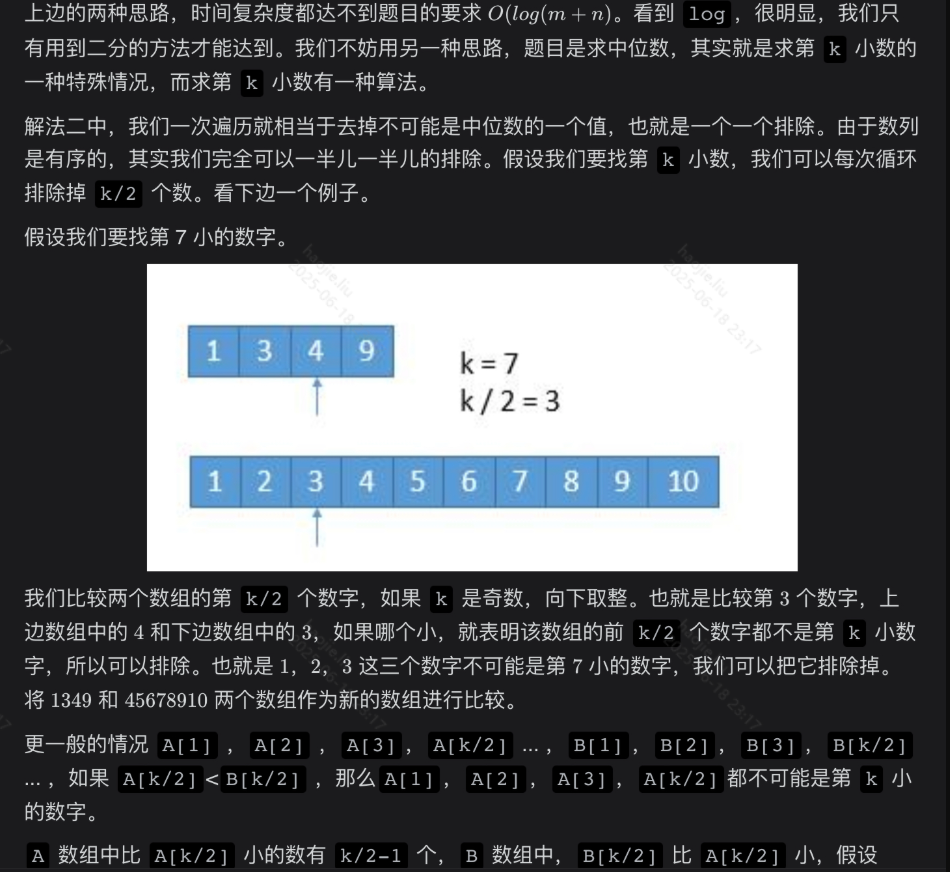

# 排序与查找（二分查找/基础排序）

### 搜索旋转排序数组

**二分——这道题要用二分查找也能体现出题者的意愿**

```java
class Solution {
    public int search(int[] nums, int target) {
        int len = nums.length;
        int left = 0, right = len - 1;
        //这里控制条件取等号，取等号大多是为了在while中直return mid，不取等号就跳出while返回l的值。
        while(left <= right){
            int mid = left + (right - left) / 2;
            if(nums[mid] == target)
                return mid;
            //左半部分是有序
            if(nums[0] <= nums[mid]){
                //如果在此范围内, target落在左半部分有序区域内
                if(nums[0] <= target && target < nums[mid])
                    right = mid - 1;
                //target落在右半部分无序区域内
                else    
                    left = mid + 1;
            }else{//如果nums[0] > nums[mid]，则说明后面肯定有一个升序（右半部分）
                //如果在右边的有序
                if(nums[mid] < target && target <= nums[right])
                    left = mid + 1;
                //如果在左边的无序
                els
                    right = mid - 1;
            }
        }
        return -1;
    }
}
```

### 搜索旋转数组

**这道题与【搜索旋转排序数组】题最大的不同就是有了重复元素了，返回目标索引值最小的一个。**

```java
class Solution {
    public int search(int[] nums, int target) {
        int len = nums.length;
        int left = 0, right = len - 1;
        int res = Integer.MAX_VALUE;
        while(left <= right){
            //略过重复元素
            while(left < right && nums[left] == nums[right])
                right--;
            int mid = left + (right - left) / 2;
            //当中间值等于目标值，将右边界移到中间，因为左边可能还有相等的值
            if(nums[mid] == target)
                res = Math.min(res, mid);
            if(nums[left] <= nums[mid]){
                if(nums[left] <= target && target <= nums[mid])
                    right = mid - 1;
                else
                    left = mid + 1;
            }else{
                if(nums[mid] <= target && target <= nums[right])
                    left = mid + 1;
                else
                    right = mid - 1;
            }
        }
        return res == Integer.MAX_VALUE ? -1 : res;
    }   
}
```

### 合并区间

**遍历就完事了**

```java
class Solution {
    public int[][] merge(int[][] intervals) {
        if(intervals.length == 0)
            return new int[0][2];
        //首先我们需要将如果乱序的每一行的二维数组排序，按照每行数组
        //索引为0的数字大小升序排序
        //这里就相当于重写了这个数组的比较方式
        Arrays.sort(intervals, (n1, n2) -> n1[0] - n2[0]);

        //然后循环数组的每一行，如果有数组符合条件咋加入到
        //范型为一维数组的list中，最后在转为二维数组
        //二维数组数组一维数组的时候就是输出当前一维数组代表
        //索引的那一行的所有值例如：nums[3][3],如果你输出nums[0]
        //就是输出nums[3][3]第一行的所有数据

        List<int[]> res = new ArrayList<>();

        //增强for循环遍历数组
        for(int[] interval : intervals){
            //如果列表为空，或者当前区间与上个区间不重合，直接添加
            if(res.size() == 0 || res.get(res.size() - 1)[1] < interval[0])
                res.add(interval);
            else
                //否则就是进行区间的合并了
                res.get(res.size() - 1)[1] = Math.max(res.get(res.size() - 1)[1], interval[1]);
        }

        return res.toArray(new int[0][]);

    }
}
```

### 寻找两个正序数组的中位数

**喜闻乐见的暴力解法，思路就是合并成一个数组，然后排序然后求中位数**




**二分**

```java
//使用寻找两个数组的第k个小的数，这样每次遍历都可以将集合数组一半的元素去除
    public double findMedianSortedArrays(int[] nums1, int[] nums2) {
    int n = nums1.length;
    int m = nums2.length;
    //这里就是奇数个长度k的情况
    int left = (n + m + 1) / 2;
    //偶数个长度k的情况
    int right = (n + m + 2) / 2;
    //将偶数和奇数的情况合并，如果是奇数，会求两次同样的 k 。
    return (getKth(nums1, 0, n - 1, nums2, 0, m - 1, left) + 
            getKth(nums1, 0, n - 1, nums2, 0, m - 1, right)) * 0.5;  
}

    private int getKth(int[] nums1, int start1, int end1, int[] nums2, int start2, int end2, int k) {
        int len1 = end1 - start1 + 1;
        int len2 = end2 - start2 + 1;
        //让 len1 的长度小于 len2，这样就能保证如果有数组空了，一定是 len1 ，这个约定就是数组先后关系，顺序反了就重新调用
        if (len1 > len2) return getKth(nums2, start2, end2, nums1, start1, end1, k);
        //其中一个数组为空，则进行直接返回的处理
        if (len1 == 0) return nums2[start2 + k - 1];

        //寻找第k=1个小的数，就是找最小的数，直接返回即可
        if (k == 1) return Math.min(nums1[start1], nums2[start2]);

        //定义两个数组的遍历指针开始循环寻找
        int i = start1 + Math.min(len1, k / 2) - 1;
        int j = start2 + Math.min(len2, k / 2) - 1;

        //找到k对应位置的元素，比较那个小就删除小的之前的全部元素，包括本元素
        if (nums1[i] > nums2[j]) {
            return getKth(nums1, start1, end1, nums2, j + 1, end2, k - (j - start2 + 1));
        }
        else {
            return getKth(nums1, i + 1, end1, nums2, start2, end2, k - (i - start1 + 1));
        }
    }
```


```java
//此方法就是用逻辑上两个数组是粘连的，但是物理上是分别遍历
    public double findMedianSortedArrays(int[] A, int[] B) {
    int m = A.length;
    int n = B.length;
    int len = m + n;
    int left = -1, right = -1;
    int aStart = 0, bStart = 0;
    for (int i = 0; i <= len / 2; i++) {
        //这行代码，就是对应偶数个长度时，需要两个数据，那么就可以在求出最后一个数据的同时，
        //left保存着上个数据
        left = right;
        if (aStart < m && (bStart >= n || A[aStart] < B[bStart])) {
            right = A[aStart++];
        } else {
            right = B[bStart++];
        }
    }
    if ((len & 1) == 0)
        return (left + right) / 2.0;    //偶数取两者的平均数
    else
        return right;    //奇数直接取最中间的
}
```

### 排序链表

递归


**归并迭代**

```java
class Solution {
    //看题目的时间空间复杂度要求想到二分法，紧接着想到归并排序，归并排序的大致思路就是将大的问题拆成小问题，然后在一一合并，
    //归并排序实现方式总计有这么两种：递归和迭代（两者的区别就是在拆分的时候使用的是递归还是迭代）
    //迭代
    public ListNode sortList(ListNode head) {
        // 归并的步长（即要拆分的单位长度）
        int intv = 1;
        // 链表长度
        int len = 0;
        // 归并的两个前后模块，遍历指针，辅助头结点
        ListNode h1, h2, pre, res;
        //dummy结点
        res = new ListNode(0);
        res.next = head;
        // 遍历链表
        ListNode h = head;
        // 获得链表长度
        while (h != null) {
            h = h.next;
            len++;
        }
        // 自底向上进行归并排序（拆分单位从小到大）
        while (intv < len) {
            pre = res;
            h = res.next;
            while (h != null) {
                int i = intv;
                h1 = h;
                // 遍历得到h1
                while (i > 0 && h != null) {
                    i--;
                    h = h.next;
                }
                // 如果i>0，则说明只有h1，没有后续的h2了
                if (i > 0) {
                    break;
                }
                // 重新更新i的值
                i = intv;
                h2 = h;
                // 获得h2部分的长度，有可能长度不到intv
                while (i > 0 && h != null) {
                    h = h.next;
                    i--;
                }
                // 分别得到h1部分和h2部分的长度
                int c1 = intv;
                int c2 = intv - i;
                // 对h1和h2进行排序
                while (c1 > 0 && c2 > 0) {
                    if (h1.val < h2.val) {
                        pre.next = h1;
                        h1 = h1.next;
                        c1--;
                    } else {
                        pre.next = h2;
                        h2 = h2.next;
                        c2--;
                    }
                    // 更新pre的值，这个值为已排序链表的指针
                    pre = pre.next;
                }
                // 其中一个为0，另一个不为0时，链接剩下的链表
                pre.next = c1 == 0 ? h2 : h1;
                // 更新pre指针的位置
                while (c1 > 0 || c2 > 0) {
                    pre = pre.next;
                    c1--;
                    c2--;
                }
                // 链接余下的链表，在下一次循环时，可能会直接break（h1的长度小于intv），不进行h1和h2归并（数量不够），这里就是为了将余下的链表连接起来。
                // 因为一次intv对应的一次循环，pre指针一定是从开始一直到结尾，整个链表的的长度不能变，如果缺少这一步，最后一部分h1会丢失
                pre.next = h;
            }
            // 更新归并的步长
            intv *= 2;
        }
        return res.next;
    }
```


**归并递归**

```java
class s{
    //递归
    public ListNode sortList(ListNode head) {
        if (head == null || head.next == null)
            return head;
        //定义快慢指针来寻找中点，慢指针奇数个结点直接找到，慢指针偶数个结点则找到对称轴的左边一个结点
        ListNode fast = head.next, slow = head;
        while (fast != null && fast.next != null) {
            slow = slow.next;
            fast = fast.next.next;
        }
        //定义tmp结点标记断裂后的第二条链表
        ListNode tmp = slow.next;
        //将链表断裂
        slow.next = null;
        //开始递归拆分，即将断裂后的链表继续断裂
        ListNode left = sortList(head);
        ListNode right = sortList(tmp);
        //定义两个临时结点（dummy）来进行合并，在迭代方法中也出现了
        ListNode h = new ListNode(0);
        ListNode res = h;
        //进行合并，比大小
        while (left != null && right != null) {
            if (left.val < right.val) {
                h.next = left;
                left = left.next;
            } else {
                h.next = right;
                right = right.next;
            }
            h = h.next;
        }
        //这一步很关键，当进行完本层的合并时，比完大小后会有遗漏的结点，即循环照应不到的，
        //我们此时将这个结点或链表加入合并的链表
        h.next = left != null ? left : right;
        return res.next;
    }

}
```

### 下一个排列


```java
//我还是理解错题意了，应该是从最后开始往前找，找到第一组数即前面比后面的小，前面的就是待换元素
    public static void nextPermutation01(int[] nums) {
        int len = nums.length;
        for (int i = len - 1; i > 0; i--) {
            //找到待换元素i-1，然后将包括i的后面的元素全部升序排列，这样就能得到差距最小的下一个排序
            if (nums[i] > nums[i - 1]) {
                Arrays.sort(nums, i, len);
                for (int j = i; j <len; j++) {
                    //在升序排序完，寻找替换位置该位置的元素应该是比待替换元素大，
                    // 但也是比他大之中的元素最小的即第一个比他大的元素
                    if (nums[j] > nums[i - 1]) {
                        int temp = nums[j];
                        nums[j] = nums[i - 1];
                        nums[i - 1] = temp;
                        return;
                    }
                }
            }
        }
        //如果找不到替换元素，就证明这个顺序就是这几个元素中最大的了，那么直接返回整个数组的升序即为答案，题目约定
        Arrays.sort(nums);
        return;
    }
```

### x 的平方根

**使用二分查找小于等于x的最大元素，与搜索插入位置那道题目正好相反，存储结果的初始值为最小的结果**

```java
class Solution {
    //此题就是找到小于等于x的最大元素，使用二分查找
    public int mySqrt(int x) {
        //定义左右端点，一定要用long，不然会越界
        long left = 0, right = 10000000;
        long res = 0;
        while(left <= right){
            long mid = (left + right) / 2;
            if(mid * mid <= x){
                res = mid;
                left = mid + 1;
            }else
                right = mid - 1;
        }
        return (int)res;
    }
```

**牛顿迭代法**

```java
class Solution {
    int temp;
    public int mySqrt(int x) {
        temp = x;
        if(x == 0)
            return 0;
        return ((int)(sqrts(x)));
    }

    public double sqrts(double x){
    //这个公式是关键
      double res = (x + temp / x) / 2;
        if (res == x) {
            return x;
        } else {
            return sqrts(res);
        }
    }
}
```

### 在排序数组中查找元素的第一个和最后一个位置

**很基础的方法**

```java
class Solution {
    public int[] searchRange(int[] nums, int target) {
        if(nums.length == 0){
            int[] res = new int[2];
            res[0] = -1;
            res[1] = -1;   
            return res;
        }
        List<Integer> list = new ArrayList<>();
        for(int i = 0; i < nums.length; i++){
            if(nums[i] == target)
                list.add(i);
        }
        if(list.size() == 0){
            int[] res = new int[2];
            res[0] = -1;
            res[1] = -1;   
            return res;
        }

        int[] res01 = {list.get(0), list.get(list.size() - 1)};
        return res01;
    }
}
```

范围查询规律
初始化:

- int left = 0;
- int right = nums.length - 1;

循环条件：left <= right
右边取值：right = mid - 1
左边取值：left = mid + 1
查询条件:

- >= target值，则 nums[mid] >= target 时，都减 right = mid - 1
- > target值，则 nums[mid] > target 时，都减 right = mid - 1
- <= target值，则 nums[mid] <= target 时，都加 left = mid + 1
- < target值，则 nums[mid] < target 时，都加 left = mid + 1

结果:

- 求大于(含等于)，返回 left
- 求小于(含等于)，返回 right

核心思想：要找某个值，则查找时遇到该值时，当前指针(例如 right 指针)要错过它，让另外一个指针(left 指针)跨过它(体现在 left <= right 中的 = 号)，则找到了

```java
class Solution {
    public int[] searchRange(int[] nums, int target) {
        if(nums.length == 0)
            return new int[]{-1, -1};
        int leftIndex = binarySearch(nums, target);

        //找到第一个比target大的值，他的位置索引-1就是我们target的最后一个
        int rightIndex = binarySearch(nums, target + 1) - 1;
        if(leftIndex <= rightIndex && rightIndex <  nums.length && target == nums[leftIndex] && target == nums[rightIndex])
            return new int[]{leftIndex, rightIndex};

        return new int[]{-1, -1};

    }
    //使用二分查找来满足排序数组的要求
    //这个二分就是查找这个target在这个数组第一个出现的位置
    public int binarySearch(int[] nums, int target){
        int left = 0;
        int right = nums.length - 1;
        while(left <= right){
            int mid = (left + right) / 2;
            //如果当前值大于等于的话，说明前面可能还有，我们需要将右指针往左移动
            if(nums[mid] >= target)
                right = mid - 1;
            //小于则移动左指针继续寻找
            else
                left = mid + 1;
        }

        return left;
    }

}
```

### 寻找峰值

二分

> 题目让我们实现一个 O(log⁡n)O(\log{n})O(logn) 算法，这是对使用「二分」的强烈暗示。 和往常的题目一样，我们应当从是否具有「二段性」来考虑是否可以进行「二分」。 不难发现，如果 在确保有解的情况下，我们可以根据当前的分割点 mid 与左右元素的大小关系来指导 lll 或者 rrr 的移动。 假设当前分割点 mid 满足关系 num[mid]>nums[mid+1] 的话，一个很简单的想法是 num[mid] 可能为峰值，而 nums[mid+1] 必然不为峰值，于是让 r=mid，从左半部分继续找峰值。 估计不少同学靠这个思路 AC 了，只能说做法对了，分析没对。
> 

上述做法正确的前提有两个：

- 对于任意数组而言，一定存在峰值（一定有解）；
- 二分不会错过峰值。

我们分别证明一下。

- 证明 1 ：对于任意数组而言，一定存在峰值（一定有解）

根据题意，我们有「数据长度至少为 1」、「越过数组两边看做负无穷」和「相邻元素不相等」的起始条件。

我们可以根据数组长度是否为 1 进行分情况讨论：

- 数组长度为 1，由于边界看做负无穷，此时峰值为该唯一元素的下标；
- 数组长度大于 1，从最左边的元素 nums[0] 开始出发考虑：
    
    > 如果 nums[0]>nums[1]，那么最左边元素 nums[0] 就是峰值（结合左边界为负无穷）；如果 nums[0]<nums[1]由于已经存在明确的 nums[0] 和 nums[1]大小关系，我们将 nums[0] 看做边界， nums[1] 看做新的最左侧元素，继续往右进行分析：如果在到达数组最右侧前，出现 nums[i]>nums[i+1]，说明存在峰值位置 i（当我们考虑到 nums[i]必然满足 nums[i] 大于前一元素的前提条件，当然前一元素可能是原始左边界）；到达数组最右侧，还没出现 nums[i]>nums[i+1]，说明数组严格递增。此时结合右边界可以看做负无穷，可判定 nums[n−1] 为峰值。
    > 

综上，我们证明了无论何种情况，数组必然存在峰值。

- 证明 2 ：二分不会错过峰值

> 其实基于「证明 1」，我们很容易就可以推理出「证明 2」的正确性。 整理一下由「证明 1」得出的推理：如果当前位置大于其左边界或者右边界，那么在当前位置的右边或左边必然存在峰值。 换句话说，对于一个满足 nums[x]>nums[x−1]的位置，x 的右边一定存在峰值；或对于一个满足 nums[x]>nums[x+1] 的位置，x 的左边一定存在峰值。 因此这里的「二段性」其实是指：在以 mid 为分割点的数组上，根据 nums[mid] 与 nums[mid±1] 的大小关系，可以确定其中一段满足「必然有解」，另外一段不满足「必然有解」（可能有解，可能无解）。
> 

> 如果不理解为什么「证明 2」的正确性可以由「证明 1」推导而出的话，可以重点看看「证明 1」的第 2 点的证明。 至此，我们证明了始终选择大于边界一端进行二分，可以确保选择的区间一定存在峰值，并随着二分过程不断逼近峰值位置。
> 

```java
public int findPeakElement(int[] nums) {
        int len = nums.length;
        if(len == 0)
            return -1;
        int left = 0, right = len - 1;
        while(left < right){
            int mid = (left + right) / 2;
            //可以看到一旦满足某个条件，那么会将大的那一边的反方向的指针赋值给这个大的值的索引
            if(nums[mid] > nums[mid+1]){
                right = mid;
            }else
                left = mid + 1;                            
        }
        return right;
    }
}
```

### 寻找旋转排序数组中的最小值

https://leetcode.cn/problems/find-minimum-in-rotated-sorted-array/solutions/126635/er-fen-cha-zhao-wei-shi-yao-zuo-you-bu-dui-cheng-z/


```java
	public int findMin(int[] nums) {
        int len = nums.length;
        if(nums == null || len == 0)
            return -5500;
        int left = 0;
        int right = nums.length - 1;
        while(left < right){
            //地板除，mid更靠近left
            int mid = left + (right - left) / 2;
            if(nums[mid] > nums[right])
                left = mid + 1;
            else
                right = mid;
        }
        return nums[left];
    }
```

### 删除排序数组中的重复项

**这是使用有序map，保证了去重打需求，两个for遍历，时间复杂度太高**

```java
class Solution {
    public int removeDuplicates(int[] nums) {
        if(nums.length <= 1)
            return nums.length;
        Map<Integer, Integer> map = new LinkedHashMap<>();
        for(int num : nums){
            map.put(num, 1);
        }
        int i = 0;
        for(Map.Entry<Integer, Integer> entry : map.entrySet()){
            nums[i] = entry.getKey();
            i++;
        }
        return map.size();
    }
}
```

**空间复杂度有点高，时间复杂度很优秀**

```java
class Solution {
    //双指针，一个原地节点，一个前进节点
    //直到前进节点到数组长度遍历完成
    //期间遇到重复的就进行交换
    //0 0 1 1 1 2 2 
    public int removeDuplicates(int[] nums) {
        if(nums.length <= 1)
            return nums.length;
        int i = 0, j = 1;
        while(j < nums.length){
            //这里if的判断条件可以换成 j - i > 1在进行更换
            //因为如果原数组是 0 1 2 3 4，就会每次都重复进入if中
            //进行没有意义的更换
            if(nums[i] != nums[j]){
                nums[i + 1] = nums[j];
                i++;
            }
            j++;
        }
        return i + 1;
    }
}
```

### 数组中的逆序对

**简便方法也是在nums[i]>nums[j]的地方加上 计数器 += mid - i + 1;**

```java
public class Test33 {
    public static void main(String[] args) {
        Test33 test33 = new Test33();
        System.out.println(test33.reversePairs(new int[]{7,3,2,6,0,1,5,4}));
    }

    //全局变量计数器
    int res = 0;
    public int reversePairs(int[] nums) {
        this.res = 0;
        sortArray(nums);
        return res;
    }

    public int[] sortArray(int[] nums) {
        if(nums == null || nums.length == 0)
            return nums;
        //二路归并排序
        int len = nums.length;
        //进行log以2为底的n 整体向上取整趟的归并
        for(int i = 1; i < len; i *= 2)
            mergePass(nums, i, len);
        return nums;
    }

    //这个length表示每次归并的数组长度，初始值为1，数组被分成无数个长度
    //为1的小数组开始两两归并，len表示数组长度

    //对整个排序序列进行一趟归并
    public void mergePass(int[] nums, int length, int len){
        int i;
        //归并length长的两个相邻子表
        for(i = 0; i + 2 * length - 1 < len; i = i + 2 * length)
            merge(nums, i, i + length - 1, i + 2 * length - 1);
        //奇数个子表，则剩最后一个需要归并，
        //偶数个子表，就要对最后两个余下的子表，后者的长度要小于length
        if(i + length - 1 < len - 1)
            //归并这两个子表
            merge(nums, i, i + length - 1, len - 1);
    }

    //归并low -- high
    //创建一个辅助数组，将两个数组分别比较的元素合并到这个辅助数组中
    //归并完成后再复制回来
    public void merge(int[] nums, int low, int mid, int high){
        int[] temp = new int[high - low + 1];
        //i和j分别代表两个子数组对比的元素
        int i = low, j = mid + 1, k = 0;
        while(i <= mid && j <= high){
            if(nums[i] <= nums[j]){
                temp[k] = nums[i];
                i++;
                k++;
            }else{
                //当左边数组的大与右边数组的元素时，
                //就对当前元素以及后面的元素的个数进行统计，
                //此时这个数就是，逆序数
                //定义一个计数器，记下每次合并中存在的逆序数。
                //如果mid前面的i大于了后面的某个值，那么这个子序列中mid这个位置肯定也大于这个值，因为子序列已经
                //是从小到大排好序的
                res += mid - i + 1;
                temp[k] = nums[j];
                j++;
                k++;
            }
        }
        //将第一段余下的部分复制到temp
        while(i <= mid){
            temp[k] = nums[i];
            i++;
            k++;
        }
        while(j <= high){
            temp[k] = nums[j];
            j++;
            k++;
        }

        //将辅助数组的值，复制到nums中去
        for(k = 0, i = low; i <= high; k++, i++)
            nums[i] = temp[k];

    }
}
```

### 轮转数组

**进行三次反转**

```java
    //整体反转一次，临界点k处两边的各反转一次
    public void rotate(int[] nums, int k) {
        int n = nums.length;
        if(n == 1)
            return;
        k = k % n;
        reverse(nums, 0, n - 1);
        reverse(nums, 0, k - 1);
        reverse(nums, k, n - 1);

    }

    public void reverse(int[] nums, int start, int end){
        int temp;
        while(start < end){
            temp = nums[start];
            nums[start] = nums[end];
            nums[end] = temp;
            start++;
            end--;
        }
    }
}
```