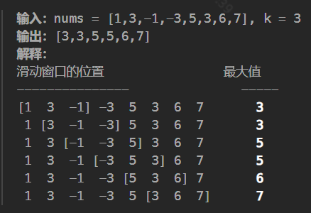

# 栈、队列与堆（模拟/应用）

### 有效的括号

**map+栈**

```java
class Solution {
    public boolean isValid(String s) {
        int n = s.length();
        if (n % 2 == 1) {
            return false;
        }

        Map<Character, Character> opers = new HashMap<>();
        opers.put(')', '(');
        opers.put(']', '[');
        opers.put('}', '{');

        Deque<Character> stack = new LinkedList<>();
        for(int i = 0; i < n; i++){
            char ch = s.charAt(i);
            if(opers.containsKey(ch)){
                //这里就是利用map键值对的结构，将反括号类型全部存为key，然后反过来判断正括号是否相符
                //首先就是先判断是否为反括号，只有反括号才会进入这个if，然后看栈顶和这个反括号对于的value是否一样就可以了
                if(stack.isEmpty() || stack.peek() != opers.get(ch))
                    return false;
                stack.pop();
            }else 
                stack.push(ch);
        }
        return stack.isEmpty();
    }
}
```

**栈**

```java
class Solution {
    public boolean isValid(String s) {
        if(s == null)
            return false;
        int len = s.length();
        Deque<Character> stack = new LinkedList<>();
        //加入相对应的反括号
        for(char ch : s.toCharArray()){
            if(ch == '(')
                stack.push(')');
            else if(ch == '[')
                stack.push(']');
            else if(ch == '{')
                stack.push('}');
            //如果遇到反括号就对应出栈消除，题目中规定一个遇到反括号要想成立前一个一定是对应的
            else if(stack.isEmpty() || ch != stack.pop())
                //不是就返回
                return false;
        }
        //最后栈如果不为空那么就是没消除干净
        return stack.isEmpty();
    }
}
```

### 合并K个排序链表

**这道题主要有两种方式：**

- 链表两两合并，链表合并的方式可以采用递归或者迭代，其实就是归并
- 采用小根堆的思想，每次加入的结点进行重新排列，在这里使用了java的排列器，使之每次的结点都在正确的位置，最小的结点在最前面

**小根堆**

```java
class Solution {
    public ListNode mergeKLists(ListNode[] lists) {
        //这里就是使用了小根堆的体现，让排序器自动排列
        Queue<ListNode> pq = new PriorityQueue<>((v1, v2) -> v1.val - v2.val);
        for (ListNode node: lists) {
            //将lists的所以链表遍历加到pq队列
            if (node != null) {
                pq.offer(node);
            }
        }
        //创建结果结点即头结点
        ListNode dummyHead = new ListNode(0);
        //创建遍历结点
        ListNode tail = dummyHead;
        while (!pq.isEmpty()) {
            //由于是小根堆，现在队首已经是最小的结点
            ListNode minNode = pq.poll();
            //下面两句就是将遍历结点一直跟随这待遍历的最小结点
            tail.next = minNode;
            tail = minNode;
            //如果当前遍历的最小结点的下个结点不为空，则加入该结点的下一个点
            if (minNode.next != null) {
                pq.offer(minNode.next);
            }
        }
        //返回结果结点
        return dummyHead.next;
    }
}
```

**两两合并：递归**

```java
class Solution {
    public ListNode mergeKLists(ListNode[] lists) {
        if (lists.length == 0) {
            return null;
        }
        return merge(lists, 0, lists.length - 1);
    }

    private ListNode merge(ListNode[] lists, int lo, int hi) {
        if (lo == hi) {
            return lists[lo];
        }
        int mid = lo + (hi - lo) / 2;
        ListNode l1 = merge(lists, lo, mid);
        ListNode l2 = merge(lists, mid + 1, hi);
        return merge2Lists(l1, l2);
    }

    //下面就是链表最简单的递归合并方式
    private ListNode merge2Lists(ListNode l1, ListNode l2) {
        if (l1 == null) {
            return l2;
        }
        if (l2 == null) {
            return l1;
        }
        if (l1.val < l2.val) {
            l1.next = this.merge2Lists(l1.next, l2);
            return l1;
        }
        l2.next = this.merge2Lists(l1, l2.next);
        return l2;
    }
}
```

**两两合并：迭代**

```java
class Solution {
    public ListNode mergeKLists(ListNode[] lists) {
        if (lists.length == 0) {
            return null;
        }
        return merge(lists, 0, lists.length - 1);
    }

    private ListNode merge(ListNode[] lists, int lo, int hi) {
        if (lo == hi) {
            return lists[lo];
        }
        int mid = lo + (hi - lo) / 2;
        ListNode l1 = merge(lists, lo, mid);
        ListNode l2 = merge(lists, mid + 1, hi);
        return merge2Lists(l1, l2);
    }

    //下面是简单的迭代合并链表的方法
    private ListNode merge2Lists(ListNode l1, ListNode l2) {
      ListNode dummyHead = new ListNode(0);
      ListNode tail = dummyHead;
      while (l1 != null && l2 != null) {
          if (l1.val < l2.val) {
              tail.next = l1;
              l1 = l1.next;
          } else {
              tail.next = l2;
              l2 = l2.next;
          }
          tail = tail.next;
      }

      tail.next = l1 == null? l2: l1;

      return dummyHead.next;
     }
}
```

### 用栈实现队列

偷懒做法：直接用官方的队列API实现

```java
class MyQueue {
    Deque<Integer> queue;

    public MyQueue() {
        queue = new LinkedList<>();
    }

    public void push(int x) {
        queue.add(x);
    }

    public int pop() {
        return queue.remove();
    }

    public int peek() {
        return queue.peekFirst();

    }

    public boolean empty() {
        if(queue.size()==0){
            return true;
        }
        return false;
    }
}
```

用官方提供的栈api实现

```java
class MyQueue {
    private Stack<Integer> A;
    private Stack<Integer> B;

    public MyQueue() {
        A = new Stack<>();
        B = new Stack<>();
    }

    public void push(int x) {
        A.push(x);
    }

    public int pop() {
        int peek = peek();
        B.pop();
        return peek;
    }

    public int peek() {
        if (!B.isEmpty()) return B.peek();
        if (A.isEmpty()) return -1;
        while (!A.isEmpty()){
            B.push(A.pop());
        }
        return B.peek();
    }

    public boolean empty() {
        return A.isEmpty() && B.isEmpty();
    }
}
```

### 滑动窗口最大值

给你一个整数数组 `nums`，有一个大小为 `k` **的滑动窗口从数组的最左侧移动到数组的最右侧。你只可以看到在滑动窗口内的 `k` 个数字。滑动窗口每次只向右移动一位。

返回 *滑动窗口中的最大值* 。



遍历数组，将 数 存放在双向队列中，并用 L,R 来标记窗口的左边界和右边界。队列中保存的并不是真的数，而是该数值对应的数组下标位置，并且数组中的数要从大到小排序。如果当前遍历的数比队尾的值大，则需要弹出队尾值，直到队列重新满足从大到小的要求。刚开始遍历时，L 和 R 都为 0，有一个形成窗口的过程，此过程没有最大值，L 不动，R 向右移。当窗口大小形成时，L 和 R 一起向右移，每次移动时，判断队首的值的数组下标是否在 [L,R] 中，如果不在则需要弹出队首的值，当前窗口的最大值即为队首的数。

> 输入: nums = [1,3,-1,-3,5,3,6,7], 和 k = 3
输出: [3,3,5,5,6,7]
> 
> 
> 解释过程中队列中都是具体的值，方便理解，具体见代码。
> 初始状态：L=R=0,队列:{}
> i=0,nums[0]=1。队列为空,直接加入。队列：{1}
> i=1,nums[1]=3。队尾值为1，3>1，弹出队尾值，加入3。队列：{3}
> i=2,nums[2]=-1。队尾值为3，-1<3，直接加入。队列：{3,-1}。此时窗口已经形成，L=0,R=2，result=[3]
> i=3,nums[3]=-3。队尾值为-1，-3<-1，直接加入。队列：{3,-1,-3}。队首3对应的下标为1，L=1,R=3，有效。result=[3,3]
> i=4,nums[4]=5。队尾值为-3，5>-3，依次弹出后加入。队列：{5}。此时L=2,R=4，有效。result=[3,3,5]
> i=5,nums[5]=3。队尾值为5，3<5，直接加入。队列：{5,3}。此时L=3,R=5，有效。result=[3,3,5,5]
> i=6,nums[6]=6。队尾值为3，6>3，依次弹出后加入。队列：{6}。此时L=4,R=6，有效。result=[3,3,5,5,6]
> i=7,nums[7]=7。队尾值为6，7>6，弹出队尾值后加入。队列：{7}。此时L=5,R=7，有效。result=[3,3,5,5,6,7]
> 

```java
class Solution {
    public int[] maxSlidingWindow(int[] nums, int k) {
        if(nums == null || nums.length < 2)
            return nums;
        int[] res = new int[nums.length - k + 1];
        //队列中存放的是当前窗口中的最后值对应的索引下标
        Deque<Integer> window = new LinkedList<>();
        for(int i = 0; i < nums.length; i++){
        //加入的元素大于队尾的元素，则弹出
            while(!window.isEmpty() && nums[window.peekLast()] <= nums[i])
                window.pollLast();
            window.addLast(i);

            //这个判断的作用就是看，当前i下标是否存在于窗口中，如果不在则需要将队首的值弹出，
            //其实这句话就是规定了左边界，i为右边界
            if(window.peek() <= i - k)
                window.poll();

            if(i + 1 >= k)
                res[i - k + 1] = nums[window.peek()];          

        }
        return res;
    }   
}
```

### 最长有效括号

**还有利用栈来实现，一对一对**


```java
class Solution {
    public int longestValidParentheses(String s) {
        if(s == "")
            return 0;
        int len = s.length();
        Deque<Integer> stack = new LinkedList<>();
        //这一步可以防止当第一个Character是')'的时候发生越界异常
        stack.push(-1);
        int res = 0;
        for(int i = 0; i < len; i++){
            //左括号入栈
            if(s.charAt(i) == '(')
                stack.push(i);
            else{   //右括号出栈做匹配
                stack.pop();
                //这里直观上就是子串之间出现了别的干扰符号，我们重新更新子串
                if(stack.isEmpty())
                    stack.push(i);
                else    //当前全部人数减去剩余无法配对的人数（单身）即res
                    res = Math.max(res, i - stack.peek());
            }
        }
        return res;
    }
}
```

### 最小栈


```java
class MinStack {
    List<Integer> list;
    int size;
    public MinStack() {
        list = new ArrayList<>();
        size = 0;
    }

    public void push(int val) {
        list.add(size++, val);
    }

    public void pop() {
        list.remove(size-1);
        size--;
    }

    public int top() {
        return list.get(size-1);
    }

    public int getMin() {
        return list.stream().min(Integer::compareTo).get();
}

/**
 * Your MinStack object will be instantiated and called as such:
 * MinStack obj = new MinStack();
 * obj.push(val);
 * obj.pop();
 * int param_3 = obj.top();
 * int param_4 = obj.getMin();
 */
```

用API

```java
class MinStack {
    Deque<Integer> xStack;
    Deque<Integer> minStack;

    public MinStack() {
        xStack = new LinkedList<Integer>();
        minStack = new LinkedList<Integer>();
        minStack.push(Integer.MAX_VALUE);
    }

    public void push(int x) {
        xStack.push(x);
        minStack.push(Math.min(minStack.peek(), x));
    }

    public void pop() {
        xStack.pop();
        minStack.pop();
    }

    public int top() {
        return xStack.peek();
    }

    public int getMin() {
        return minStack.peek();
    }
}
```

### 基本计算器 II

**这道题能同时应付**`+ - * / ^ % ( )`

```java
class Solution {
    // 使用 map 维护一个运算符优先级
    // 这里的优先级划分按照「数学」进行划分即可
    Map<Character, Integer> map = new HashMap<>(){{
        put('-', 1);
        put('+', 1);
        put('*', 2);
        put('/', 2);
        put('%', 2);
        put('^', 3);
    }};
    
    public int calculate(String s) {
        // 将所有的空格去掉
        s = s.replaceAll(" ", "");
        char[] cs = s.toCharArray();
        int n = s.length();
        // 存放所有的数字
        Deque<Integer> nums = new ArrayDeque<>();
        // 为了防止第一个数为负数，先往 nums 加个 0
        nums.addLast(0);
        // 存放所有「非数字以外」的操作
        Deque<Character> ops = new ArrayDeque<>();
        for (int i = 0; i < n; i++) {
            char c = cs[i];
            if (c == '(') {
                ops.addLast(c);
            } else if (c == ')') {
                // 计算到最近一个左括号为止
                while (!ops.isEmpty()) {
                    if (ops.peekLast() != '(') {
                        calc(nums, ops);
                    } else {
                        ops.pollLast();
                        break;
                    }
                }
            } else {
                if (isNumber(c)) {
                    int u = 0;
                    int j = i;
                    // 将从 i 位置开始后面的连续数字整体取出，加入 nums
                    while (j < n && isNumber(cs[j])) u = u * 10 + (cs[j++] - '0');
                    nums.addLast(u);
                    i = j - 1;
                } else {
                    //为防止 () 内出现的首个字符为运算符，
                    //将所有的空格去掉，并将 (- 替换为 (0-，(+ 
                    //替换为 (0+（当然也可以不进行这样的预处理，
                    //将这个处理逻辑放到循环里去做）
                    if (i > 0 && (cs[i - 1] == '(' || cs[i - 1] == '+' || cs[i - 1] == '-')) {
                        nums.addLast(0);
                    }
                    // 有一个新操作要入栈时，先把栈内可以算的都算了 
                    // 只有满足「栈内运算符」比「当前运算符」优先级高/同等，才进行运算
                    while (!ops.isEmpty() && ops.peekLast() != '(') {
                        char prev = ops.peekLast();
                        if (map.get(prev) >= map.get(c)) {
                            calc(nums, ops);
                        } else {
                            break;
                        }
                    }
                    ops.addLast(c);
                }
            }
        }
        // 将剩余的计算完
        while (!ops.isEmpty()) calc(nums, ops);
        return nums.peekLast();
    }
    
    void calc(Deque<Integer> nums, Deque<Character> ops) {
        if (nums.isEmpty() || nums.size() < 2) return;
        if (ops.isEmpty()) return;
        int b = nums.pollLast(), a = nums.pollLast();
        char op = ops.pollLast();
        int ans = 0;
        if (op == '+') ans = a + b;
        else if (op == '-') ans = a - b;
        else if (op == '*') ans = a * b;
        else if (op == '/')  ans = a / b;
        else if (op == '^') ans = (int)Math.pow(a, b);
        else if (op == '%') ans = a % b;
        nums.addLast(ans);
    }
    
    boolean isNumber(char c) {
        return Character.isDigit(c);
    }
}
```

### 每日温度

**使用最小栈来实现**

```java
    public int[] dailyTemperatures(int[] temperatures) {
        Stack<Integer> stack = new Stack<>();
        int[] res = new int[temperatures.length];
        //注意：我们存入的是数组的索引下标，说的元素时对应下标的元素值
        for(int i = 0; i < res.length; i++){
            //当栈顶元素比可能入栈的元素小，那么就将此栈顶元素弹出，然后将正在遍历的元素索引减去这个
            //小的元素索引就是高温间隔的天数
            while(!stack.isEmpty() && temperatures[stack.peek()] < temperatures[i]){
                int temp = stack.pop();
                res[temp] = i - temp;
            }
            //不满足小于条件的天数也就是说一直比当前温度要低，那么就一直入栈直到遇到小的
            stack.push(i);
        }
        return res;
    }
```

### 移掉K位数字


```java
class solution{
    public String removeKdigits(String num, int k) {
        if(num.length() == k)
            return "0";
        StringBuilder stack = new StringBuilder();

        for(int i = 0; i < num.length(); i++){
            char ch = num.charAt(i);
            while(k > 0 && stack.length() != 0 
            && stack.charAt(stack.length() - 1) > ch){
                stack.setLength(stack.length() - 1);
                k--;
            }

            if(ch == '0' && stack.length() == 0)
                continue;
            stack.append(ch);
        }
        //当遇到"10001" k=4这种时，会发现执行到下一句索引移除，原因是
        //k从头到尾就没怎么--过，这种特殊情况要对k进行处理

        String res = stack.substring(0, stack.length() - k < 1 ? 0 : stack.length() - k).toString();
        return res.length() == 0 ? "0" : res;
    }
}
```

### 用两个栈实现队列

```java
class CQueue {
    Deque<Integer> stack01;
    Deque<Integer> stack02;
    public CQueue() {
        stack01 = new LinkedList<>();
        stack02 = new LinkedList<>();
    }

    public void appendTail(int value) {
        stack01.add(value);
    }

    public int deleteHead() {
        if(stack02.isEmpty()){
            if(stack01.isEmpty())
                return -1;
            while(!stack01.isEmpty())
                stack02.add(stack01.pop());
            return stack02.pop();
        } else
            return stack02.pop();
    }
}
```

### 有效的括号字符串

**使用统计上界下界的方法**

```java
    public boolean checkValidString(String s) {
        // l: 左括号最少可能有多少个
        // r: 左括号最多可能有多少个
        int l = 0, r = 0;
        for (char c : s.toCharArray()) {
            // 遇到'('所有可能性加一
            // 遇到')'所有可能性减一
            // 遇到'*'，最少的可能性可以变少，最多的可能性也同样可以变多，这取决于这个星号最终我们看成什么，但是可能性都在
            if (c == '(') {
                l++; r++;
            } else if (c == ')') {
                l--; r--;
            } else {
                l--; r++;
            }
            // 当前左括号最少个数不能为负因为如果当前序列本身为不合法括号序列的话，增加 ( 必然还是不合法。
            //例如((((()))))))))，最后l、跟r肯定相等，然后重置l，l大于r了即右括号太多
            l = Math.max(l, 0);
            // 这种情况其实发生在r本身是负数的时候，也就是我们常见的右括号太多了
            if (l > r) return false;
        }
        // 能取到0个左括号才是满足平衡的
        return l == 0;
    }
```

**最后的防线 栈**

```java
class Solution {
    public boolean checkValidString(String s) {
        Stack<Integer> left = new Stack();
        Stack<Integer> star = new Stack();
        //这里不能只记数量，必须要将对于索引记进去，然后根据位置信息在进行判断
        //防止星星在剩余左括号前面
        for(int i = 0; i < s.length(); i++){
            char ch = s.charAt(i);
            if(ch == '(')
                left.push(i);
            else if(ch == '*')
                star.push(i);
            else{
                if(!left.isEmpty()){
                    left.pop();
                }else if(!star.isEmpty())
                    star.pop();
                else
                    return false;
            }
        }
        //如果有多余的左括号，那么就看我们的星星还有没有
        while(!left.isEmpty()){
            if(star.isEmpty())
                return false;
            int indexLeft = left.pop();
            int indexStar = star.pop();
            //星星要在左括号后面
            if(indexStar < indexLeft)
                return false;
        }

        return true;
    }
}
```

### 去除重复字母

**使用栈来辅助**

```java
class Solution {
    public String removeDuplicateLetters(String s) {
        if(s == null)
            return "";
        Deque<Character> stack = new LinkedList<>();
        for(int i = 0; i < s.length(); i++){
            char ch = s.charAt(i);
            if(stack.contains(ch))
                continue;
            //如果不为空并且栈顶的元素字典序大于当前遍历的元素，
            //并且栈顶的元素还存在与当前字符的后续字符中，那么就代表当前的这个字符不是最优的
            while(!stack.isEmpty() && stack.peek() > ch && 
                        s.indexOf(stack.peek(), i) != -1){
                stack.pop();
            }
            stack.push(ch);
        }

        StringBuilder sb = new StringBuilder();
        int len = stack.size();
        for(int i = 0; i < len; i++){
            sb.append(stack.pollLast());
        }
        return sb.toString();
    }
}
```

### 简化路径

```java
class Solution {
    public String simplifyPath(String path) {
        if(path == null)
            return null;
        String[] s = path.split("/");
        Stack<String> stack = new Stack<>();
        for(String item : s){
            //.就是当前目录的意思，直接跳过
            if (item.equals("") || item.equals(".")) 
                continue;
            if (item.equals("..")) {
                //如果是..  那么就是就看原先有没有目录的层级，如果有返回上一级
                //如果没有那么直接跳过这个符号，因为没有目录也就是说已经在根目录了
                if (!stack.isEmpty()) 
                    stack.pop();
            } else {
                stack.push(item);
            }

        }
        StringBuilder sb = new StringBuilder();
        while(!stack.isEmpty()){
            sb.append("/");
            sb.append(stack.pop());
        }
        //如果最后sb的长度为0，那么就证明又回到了最初的根目录直接返回/即可
        return sb.length() == 0 ? "/" : sb.toString();
    }
}
```

### 下一个更大元素 II

**在第二类型题中改为了循环数组，那么怎么在代码里体现循环数组呢**


**更好的办法使用单调栈**

```java
class Solution {
    public int[] nextGreaterElements(int[] nums) {
        int n = nums.length;
        int[] res = new int[n];
        Arrays.fill(res, -1);   //用-1填满结果数组，就说明如果最后找不到默认就是-1
        Stack<Integer> stack = new Stack<>();
        for(int i = 0; i < n * 2; i++){
            //这里i%n就是让i在数组末端不满足需要继续循环到0开始找
            //直到找到这个值比栈里面的大
            while(!stack.isEmpty() && nums[i % n] > nums[stack.peek()])
                res[stack.pop()] = nums[i % n];

            if(i < n)   //不满足上面的while并且 i < n的情况下再加入元素到栈中
                //因为i>n时，元素该加入到栈的早就进去了，那么后续循环寻找时就直接对比就好了
                stack.push(i % n);
        }
        return res;
    }
}
```

### 下一个更大元素 III

**这个方法就是下一个排列的翻版，代码都几乎一样；核心思路**

```java
class Solution {
    public int nextGreaterElement(int n) {
        char[] chars = String.valueOf(n).toCharArray();
        StringBuilder sb = new StringBuilder();
        int len = chars.length;
        //只有数字每个位存在升序的关系才会引发更换，要不然全是降序本身就是最大的
        for(int i = len - 1; i > 0; i--){
            //例如 1,3,2 找到 3大于1，那么将i之后数进行升序排列 -》1,2,3
            if(chars[i] > chars[i - 1]){
                Arrays.sort(chars, i, len);
                for(int j = i; j < len; j++){
                    //然后从i开始遍历，也就是2，与分界点i-1的元素比较，只要遇见比它大的，更换后
                    //就为答案了
                    if(chars[j] > chars[i - 1]){
                        char temp = chars[j];
                        chars[j] = chars[i - 1];
                        chars[i - 1] = temp;
                        for(int k = 0; k < len; k++){
                            sb.append(chars[k]);
                        }
                        //题目要求更换后如果比最大值都大那就返回-1
                        long res = Long.parseLong(sb.toString());
                        if(res > Integer.MAX_VALUE)
                            return -1;
                        else
                            return (int)res;
                    }
                }
            }
        }
        //找不到就是最大的了，直接返回-1
        return -1;
    }
}
```

### 栈的压入、弹出序列

**没啥好说的最简单栈的应用**

```java
class Solution {
    public boolean validateStackSequences(int[] pushed, int[] popped) {
        Deque<Integer> stack = new LinkedList<>();
        int i = 0;
        for(int num : pushed) {
            stack.push(num); // num 入栈
            while(!stack.isEmpty() && stack.peek() == popped[i]) { // 循环判断与出栈
                stack.pop();
                i++;
            }
        }
        return stack.isEmpty();
    }
}

```