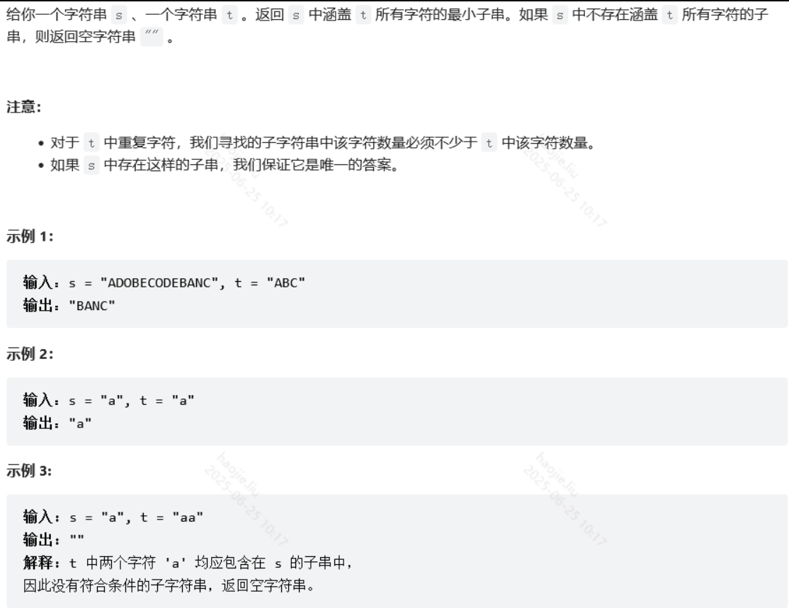

# 滑动窗口

### 最小覆盖子串



滑动窗口

```java
public String minWindow(String s, String t) {
        //首先创建的是need数组表示每个字符在t中需要的数量，用ASCII码来保存
        //加入need[76] = 2，表明ASCII码为76的这个字符在目标字符串t中需要两个，如果是负数表明当前字符串在窗口中是多余的，需要过滤掉
        int[] need = new int[128];
        //按照字符串t的内容向need中添加元素
        for (int i = 0; i < t.length(); i++) {
            need[t.charAt(i)]++;
        }
        /*
        left: 滑动窗口左边界
        right: 滑动窗口右边界
        size: 窗口的长度
        count: 当次遍历中还需要几个字符才能够满足包含t中所有字符的条件，最大也就是t的长度
        start: 如果有效更新滑动窗口，记录这个窗口的起始位置，方便后续找子串用
         */
        int left = 0, right = 0, size = Integer.MAX_VALUE, count = t.length(), start = 0;
        //循环条件右边界不超过s的长度
        while (right < s.length()) {
            char c = s.charAt(right);
            //表示t中包含当前遍历到的这个c字符，更新目前所需要的count数大小，应该减少一个
            if (need[c] > 0) {
                count--;
            }
            //无论这个字符是否包含在t中，need[]数组中对应那个字符的计数都减少1，
            //利用正负区分这个字符是多余的还是有用的
            need[c]--;
            //count==0说明当前的窗口已经满足了包含t所需所有字符的条件
            if (count == 0) {
                //如果左边界这个字符对应的值在need[]数组中小于0，说明他是一个多余元素，
                //不包含在t内
                while (left < right && need[s.charAt(left)] < 0) {
                    //在need[]数组中维护更新这个值，增加1
                    need[s.charAt(left)]++;
                    //左边界向右移，过滤掉这个元素
                    left++;
                }
                //如果当前的这个窗口值比之前维护的窗口值更小，需要进行更新
                if (right - left + 1 < size) {
                    //更新窗口值
                    size = right - left + 1;
                    //更新窗口起始位置，方便之后找到这个位置返回结果
                    start = left;
                }
                //先将l位置的字符计数重新加1
                need[s.charAt(left)]++;
                //重新维护左边界值和当前所需字符的值count
                left++;
                count++;
            }
            //右移边界，开始下一次循环
            right++;
        }
        return size == Integer.MAX_VALUE ? "" : s.substring(start, start + size);
    }
```

### 长度最小的子数组

使用一个队列来实现（类似于滑动窗口），也可以用两个指针来代替队列。
让元素不断进入窗口，直到窗口内的和符合条件，记录当前窗口的 size。
然后不断移出元素，直到窗口内的和小于 target，再继续让新元素进入窗口，直到再次满足条件，比较并取最小的 size。
在这个解法中，我们用的是累加的方式。当然，也可以采用反向减法，直到窗口内的和满足条件（小于等于 0）。

```java
    public int minSubArrayLen(int s, int[] nums) {
        //定义两个指针
        int left = 0, right = 0, sum = 0, min = Integer.MAX_VALUE;
        while (right < nums.length) {
            //开始入队
            sum += nums[right++];
            //直到符合条件
            while (sum >= s) {
                //记录size
                min = Math.min(min, right - left);
                //开始出队，直到不满足条件
                sum -= nums[left++];
            }
        }
        return min == Integer.MAX_VALUE ? 0 : min;
    }
```

使用一个真正的窗口来由小到大逐渐筛选，先固定一个窗口大小比如 leng，然后遍历数组，查看在数组中 leng 个元素长度的和是否有满足的，如果没有满足的我们就扩大窗口的大小继续查找，如果有满足的我们就记录下窗口的大小 leng，因为这个 leng 不一定是最小的，我们要缩小窗口的大小再继续找……

```java
    public int minSubArrayLen(int s, int[] nums) {
        int lo = 1, hi = nums.length, min = 0;
        while (lo <= hi) {
            int mid = (lo + hi) >> 1;
            if (windowExist(mid, nums, s)) {
                hi = mid - 1;//找到就缩小窗口的大小
                min = mid;//如果找到就记录下来
            } else
                lo = mid + 1;//没找到就扩大窗口的大小
        }
        return min;
    }

    //size窗口的大小
    private boolean windowExist(int size, int[] nums, int s) {
        int sum = 0;
        for (int i = 0; i < nums.length; i++) {
            if (i >= size)
                sum -= nums[i - size];
            sum += nums[i];
            if (sum >= s)
                return true;
        }
        return false;
    }
```

### 最大连续1的个数 III

**滑动窗口**

```java
class Solution {
    //将原题意转化为窗口中最多存在的0为k
    //未到之前更新窗口大小，到了更新窗口起点
    public int longestOnes(int[] nums, int k) {
        int len = nums.length;
        if(len == 0)
            return 0;
        int zero = 0, res = 0, start = 0;
        for(int end = 0; end < len; end++){
            //当前遍历元素为0，则更新记录数
            if(nums[end] == 0)
                zero++;
            //注意这里：我们放过了zero==k的情况，为了就是当正好等于k时
            //去更新最大长度，大于k了就说明要更新start
            while(zero > k){    //一直小于等于k时就更新end边界
                if(nums[start++] == 0)
                    zero--;
            }
            res = Math.max(res, end - start + 1);
        }
        return res;
    }
}
```

### 字符串的排列

**移动窗口**

```java
class Solution {
    public boolean checkInclusion(String s1, String s2) {
        int len1 = s1.length();
        int len2 = s2.length();
        if(len1 > len2)
            return false;
        //统计两个字符串的词频，对应的字母出现就在位置上+1
        int[] targetCount1 = new int[26];
        int[] targetCount2 = new int[26];
        for (int i = 0; i < len1; i++) {
            targetCount1[s1.charAt(i) - 'a']++;
            targetCount2[s2.charAt(i) - 'a']++;
        }
        //保证窗口的长度一致是s1的长度，然后在这个长度区间比两者的字母出现位置以及频次是否相等
        for (int i = len1; i < len2; i++) {
            if (Arrays.equals(targetCount1, targetCount2)) {
                return true;
            }
            //不满足就移动窗口
            targetCount2[s2.charAt(i) - 'a']++;
            targetCount2[s2.charAt(i - len1) - 'a']--;

        }
        // 整个算法采用左闭右开区间，因此最后还有一个窗口没有判断
        return Arrays.equals(targetCount1, targetCount2);
    }
}
```

**细致版滑动窗口，可以与438题通用**

```java
class Solution {
    public boolean checkInclusion(String s1, String s2) {
        int[] window = new int[26], needs = new int[26];
        int len1 = s1.length(), len2 = s2.length();
        //记录词频
        for(int i = 0; i < len1; i++){
            needs[s1.charAt(i) - 'a']++;
        }
        //s1的字符种类个数
        int pCount = 0;
        for (int i = 0; i < 26; i++) {
            if (needs[i] > 0){
                pCount++;
            }
        }
        //左右指针的关系就是：移动右指针直到窗口中的字符包含我们所需要的全部字符，然后开始收紧左边界，直到不满足条件再去移动右边界
        int left = 0, right = 0;
        //满足一个字符就加一，
        int needCount = 0;
        while(right < len2){
            //获取新加入窗口的字符
            char ch = s2.charAt(right);
            right++;
            //如果加入的字符是我们需要的，大于1就说明词频是存在的
            if(needs[ch - 'a'] > 0){
                //加入窗口
                window[ch - 'a']++;
                //只有当窗口的该字符数量等于我们需要的数量，当前种类字符才算匹配成功
                if(window[ch - 'a'] == needs[ch - 'a'])
                    needCount++;
            }

            //直到窗口的大小大于等于s1的长度才有可能匹配成功
            while(right - left >= len1){
                //切记这里不能跟len1比，而是应该跟s1中出现的字符的种类
                if(needCount == pCount)
                    return true;
                //获取移出去的左边界字符
                char remove = s2.charAt(left);
                left++;
                if(needs[remove - 'a'] > 0){
                    //只有当窗口的该字符数量小于等于我们需要的数量，当前字符才算匹配成功
                    if(window[remove - 'a'] == needs[remove - 'a'])
                        needCount--;
                    //加入窗口
                    window[remove - 'a']--;
                }
            }
        }
        return false;
    }
}
```