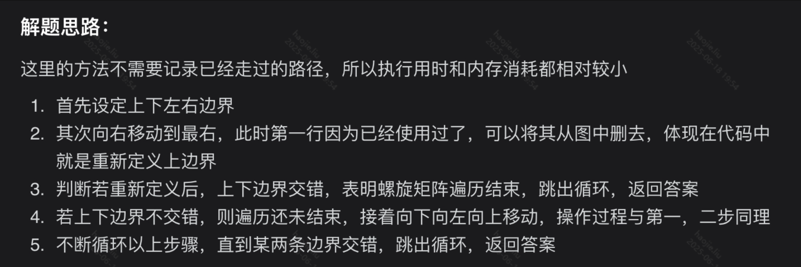

# 矩阵

### 有序矩阵中第K小的元素

**小根堆+归并思想**

```java
class Solution {
    //使用优先队列和题目给的矩阵性质，每一行的第一个都是本行最小的
    //那我们选最小的肯定也是这里面，每次选择所有行中最小的
    //被选择的行则更新最小值，向右移动就是新的最小值
    public int kthSmallest(int[][] matrix, int k) {
        //我们使用小根堆把每行的第一个放进去
        //放进去的形式是一个数组，0索引代表第几行，1索引位置固定代表当前的最小元素的索引
        //即行、列
        PriorityQueue<int[]> queue = new PriorityQueue<>((n1, n2) -> matrix[n1[0]][n1[1]] - matrix[n2[0]][n2[1]]);
        int len = matrix.length;
        for(int i = 0; i < len; i++)
            queue.offer(new int[]{i, 0});
        while(--k > 0){
            int[] min = queue.poll();
            int x = min[0], y = min[1] + 1;
            //没超过那个值在更新
            if(y < len)
                queue.offer(new int[]{x, y});
        }
        int[] min = queue.poll();
        return matrix[min[0]][min[1]];
    }
}
```

### 省份数量（原朋友圈）【中等】

**查并集：查找、合并、集合**

并查集典型例题:目的是求连通分量的个数

1. 构造并查集基本数据结构UnionFind{}:成员变量:Map<Integer, Integer>father保存每一个节点的父亲;numsOfProvince保存连通域数量。方法:add()添加节点;merge()合并节点;findAnc()寻找祖宗节点;isConnected()判断是两个节点是否否连通，getProvinces()获取连通域个数
2. 遍历邻接矩阵,因为1与2的连接关系必定和2与1的一致,因此只遍历左下角的矩阵即可;而对角线的必定为1(自己与自己必定是连通的);每遍历一行,就把i加入到uf,然后看看[0,i-1]之中哪个和i连通的,有则合并;没有则跳过
3. 最后返回连通域个数就是省份数量

```java
class Solution {
    public int findCircleNum(int[][] isConnected) {
        // 创建并查集
        UnionFind uf = new UnionFind();
        int n = isConnected.length;
        // 遍历左下角矩阵
        for(int i = 0; i < n; i++) {
            // 先将city[i]加入uf
            uf.add(i);
            // 再遍历city[0,i-1]看看哪个与city[i]相连的
            for(int j = 0; j < i; j++) {
                // 若矩阵显示city[i]与city[j]相连
                if(isConnected[i][j] == 1) {
                    // 在uf中将他们合并
                    uf.merge(i, j);
                }
            }
        }
        // 最后返回uf中连通域的数目就是省份数量
        return uf.getProvinces();
    }

    /*
    并查集基本数据
    */
    class UnionFind{
        // 保存每个节点的父亲
        Map<Integer, Integer> father;
        // 连通域数量
        int numsOfProvince;
        // 构造器
        public UnionFind() {
            this.father = new HashMap<>();
            this.numsOfProvince = 0;
        }
        // 添加节点进uf
        public void add(int x) {
            // 若不含某个节点,则加入并设置父亲为空(孤立状态)
            // 若含有就不进行操作了
            if(!father.containsKey(x)) {
                father.put(x, null);
                // 连通域数量+1
                numsOfProvince++;
            }
        }
        // 连接x与y两个节点
        public void merge(int x, int y) {
            // 先找出他们的祖先节点
            int rootX = findAnc(x);
            int rootY = findAnc(y);
            // 判断是否为同一个祖先
            // 若不是同一个祖先,则要将他们祖先合并,从而使得x与y连通
            if(rootX != rootY) {
                father.put(rootX, rootY);
                // 连通域数量-1
                numsOfProvince--;
            }
        }
        // 查找x的祖先节点
        public int findAnc(int x) {
            // 这里最简单的可以一直通过迭代进行查找(但是当树高h很大时效率会极低)
            // 因此采用路径压缩算法
            // 1.先找到x的祖先节点
            int rootX = x;
            // 说明x有父亲节点
            while(father.get(rootX) != null) {
                // 向上移动
                rootX = father.get(rootX);
            }
            // 2.将每一个不是rootX的子节点全部直接挂到rootX
            //路径压缩            
            while(father.get(x) != null) {
                // 保留旧的父亲节点
                int old_father = father.get(x);
                // 将x挂到rootX下
                father.put(x, rootX);
                // x向上移动
                x = old_father;
            }
            // 返回祖先节点
            return rootX;
        }
        // 判断两个节点是否连通:判断祖先节点是否相同即可
        public boolean isConnected(int x, int y) {
            return findAnc(x) == findAnc(y);
        }
        // 获取连通域数量
        public int getProvinces() {
            return numsOfProvince;
        }
    }
}
```

### 矩阵置零【中等】

**O1的空间复杂度优化**

> 用matrix第一行和第一列记录该行该列是否有0,作为标志位。但是对于第一行,和第一列要设置一个标志位,为了防止自己这一行(一列)也有0的情况.注释写在代码里,直接看代码很好理解!
> 

```java
class Solution {
    public void setZeroes(int[][] matrix) {
        int m = matrix.length, n = matrix[0].length;
        boolean rowZero = false, colZero = false;
        //标记第一列是否有0
        for(int i = 0; i < m; i++){
            if(matrix[i][0] == 0)
                colZero = true;
        }
        //标记第一行是否有0
        for(int j = 0; j < n; j++){
            if(matrix[0][j] == 0)
                rowZero = true;
        }
        //然后开始标记除了第一行和第一列之外的元素是否有0，有的话 对应行列的第一行第一列同样标记为0
        for(int i = 1; i < m; i++){
            for(int j = 1; j < n; j++){
                if(matrix[i][j] == 0){
                    matrix[0][j] = matrix[i][0] = 0;
                }
            }
        }

        //开始将四面八方的方向置0
        for(int i = 1; i < m; i++){
            for(int j = 1; j < n; j++){
                if(matrix[i][0] == 0 || matrix[0][j] == 0){
                    matrix[i][j] = 0;
                }  
            }
        }
        //将原本第一行的对应位置也要补齐
        if(rowZero){
            for(int j = 0; j < n; j++)
                matrix[0][j] = 0;
        }

        //将原本第一列的对应位置也要补齐
        if(colZero){
            for(int i = 0; i < m; i++)
                matrix[i][0] = 0;
        }
    }

}
```

**两次遍历，也可以原始0的行列坐标各为一个集合，然后第二次遍历，只要当前的行列坐标中的任一一个在集合内就置为0**

> 空间复杂度是 O (m+n)
> 

```java
class Solution {
    public void setZeroes(int[][] matrix) {
        int m = matrix.length, n = matrix[0].length;
        List<int[]> zero = new ArrayList<>();
        for(int i = 0; i < m; i++){
            for(int j = 0; j < n; j++){
                if(matrix[i][j] == 0){
                    zero.add(new int[]{i, j});
                }  
            }
        }
        for(int i = 0; i < m; i++){
            for(int j = 0; j < n; j++){
                if(zero.size() > 0){
                    int[] temp = zero.get(0);
                    if(matrix[i][j] == 0 && i == temp[0] && j == temp[1]){
                        toZero01(matrix, 0, j);
                        toZero02(matrix, i, 0);
                        zero.remove(0);
                    }  
                }

            }
        }
    }
    //纵向
    public void toZero01(int[][] matrix, int row, int col){
        if(row < 0 || row >= matrix.length || col < 0 || col >= matrix[0].length)
            return;
        if(matrix[row][col] != 0)
            matrix[row][col] = 0;
        toZero01(matrix, row + 1, col);
    }
    //横向
    public void toZero02(int[][] matrix, int row, int col){
        if(row < 0 || row >= matrix.length || col < 0 || col >= matrix[0].length)
            return;
        if(matrix[row][col] != 0)
            matrix[row][col] = 0;
        toZero02(matrix, row, col + 1);
    }
}
```

### 搜索二维矩阵【中等】

**跟搜索二维矩阵2的思路一样，从右上角，开始遇到比target小的删除行，大的删除列**

```java
class Solution {
    public boolean searchMatrix(int[][] matrix, int target) {
        if(matrix.length == 0 && matrix[0].length == 0)
            return false;
        int i = 0, j = matrix[0].length - 1;
        while(i < matrix.length && j >= 0){
            if(target < matrix[i][j])
                j--;
            else if(target > matrix[i][j])
                i++;
            else 
                return true;
        }
        return false;
    }
}
```

### 搜索二维矩阵 II【中等】

**最好想的方法，就是每一行进行二分查找**

```java
public boolean searchMatrix(int[][] matrix, int target) {
        for(int i = 0; i < matrix.length; i++){
            boolean res = binarySearch(matrix[i], target);
            if(res)
                return true;
        }
        return false;

    }

    public boolean binarySearch(int nums[], int target){
        int start = 0;
        int end = nums.length - 1;
        while(start < end){
            int mid = (start + end) / 2;
            if(nums[mid] < target)
                start = mid + 1;
            else 
                end = mid;
        }
        if(nums[start] == target)
            return true;
        else 
            return false;
    }
```

**第二种方法，从右上角往下看就是一个二叉搜索树即二叉查找树，那么就很好办了，我们从右上角开始遍历遇到比target大的元素，也就是说当前元素的当前列就可以全部排除；如果遇到小的元素，那么当前元素的当前行就可以排除，依次来找target**

```java
public boolean searchMatrix(int[][] matrix, int target) {
        if(matrix.length == 0 && matrix[0].length == 0)
            return false;
        int i = 0, j = matrix[0].length - 1;
        while(i < matrix.length && j >= 0){
            if(matrix[i][j] > target){
                j--;
            }else if(matrix[i][j] < target){
                i++;
            }else{
                return true;
            }
        }
        return false;
    }
```

### 岛屿数量【中等】

由于表格的本质就是一个图，那么会出现重复遍历死循环的效果 防止重复遍历的方法就是标记已经遍历过的

> 一定要区分已遍历到陆地，不能将其直接设置成0，这样会导致意外的bug
> 
- 0---》海洋
- 1---》未遍历陆地
- 2---》已遍历陆地

```java
class Solution {
  //利用深度递归解决，可以看图，并加记住这个模板，他可以解决岛屿中的问题，还有一题岛屿面积问题也是这个模板。
  public int numIslands(char[][] grid) {
      //定义一个表示岛屿数量的变量
      int count = 0;
      //这个两层for循环是用来遍历整张二维表格中所有的陆地
      //其中 i 表示行，j 表示列
      for(int i = 0; i < grid.length; i++){
          for(int j = 0; j < grid[0].length; j++){
              //取出所有的陆地
              if(grid[i][j] == '1'){
                  //深度递归，遍历所有的陆地
                  dfs(grid,i,j);
                  //用来统计有多少岛屿，岛屿是由多个陆地组成的，概念不一样
                  //利用递归和回溯的效果，每次dfs(grid,i,j);跳出来执行count++
                  //正好就是一个岛
                  count++;
              }
          }
      }
      //返回岛屿的数量
      return count;
  }
  public void dfs(char[][] grid,int i, int j){
      //防止 i 和 j 越界，也就是防止超出岛屿（上下左右）的范围。
      //特别注意当遍历到海洋的时候和已遍历到陆地也退出循环
      if(i < 0 || j < 0 || i >= grid.length || 
          j >= grid[0].length || grid[i][j] == '0' ||
          grid[i][j] == '2') 
          return;
      //将遍历过的陆地改为海洋，防止重复遍历
      grid[i][j]='2';
      //上，
      dfs(grid,i+1,j);
      //下
      dfs(grid,i-1,j);
      //右
      dfs(grid,i,j+1);
      //左
      dfs(grid,i,j-1);
  }
}
```

### 螺旋矩阵【中等】



```java
class Solution {
    public List<Integer> spiralOrder(int[][] matrix) {
        if(matrix == null || matrix[0].length == 0)
            return null;
        List<Integer> list = new ArrayList<>();

        //定义上下左右边界
        int up = 0;
        int under = matrix.length - 1;
        int left = 0;
        int right = matrix[0].length - 1;

        while(true){
            //向右移动到边界
            for(int i = left; i <= right; i++)
                list.add(matrix[up][i]);
            //移动到右边界以后，将上边界更新，也就是标记遍历完的第一行
            //重新设定上边界，若上边界大于下边界，则遍历遍历完成，下同
            if(++up > under)
                break;
            //向下
            for(int i = up; i <= under; i++)
                list.add(matrix[i][right]);

            //同理更新右边界，重合即返回
            if(--right < left)
                break;

            //向左
            for(int i = right; i >= left; i--)
                list.add(matrix[under][i]);

            //同理更新下边界，重合即返回
            if(--under < up)
                break;

            //向上
            for(int i = under; i >= up; i--)
                list.add(matrix[i][left]);

            //更新左边界
            if(++left > right)
                break;
        }
        return list;
    }
}
```

### 螺旋矩阵 II【中等】


```java
class Solution {
    public int[][] generateMatrix(int n) {
        //定义上下左右边界
        int left = 0, right = n - 1, top = 0, low = n - 1;
        int[][] res = new int[n][n];
        //定义当前遍历的值和目标值
        int num = 1, target = n * n;
        //当前的值只要小于等于目标值就一直遍历
        while(num <= target){
            //严格遵循，从左到右，从上到下，从右到左，从下到上
            //到从左到右到达右边界，要更新上边界,同理更新左右下边界

            //从左到右
            for(int i = left; i <= right; i++)
                res[top][i] = num++;
            //更新上边界
            top++;
            //从上到下
            for(int i = top; i <= low; i++)
                res[i][right] = num++;
            //更新右边界
            right--;
            //从右到左
            for(int i = right; i >= left; i--)
                res[low][i] = num++;
            //更新下边界
            low--;
            //从下到上
            for(int i = low; i >= top; i--)
                res[i][left] = num++;
            //更新左边界
            left++;
        }
        return res;
    }
}
```

### 最小路径和【中等】

**动态规划**

使用动态规划，dp[i][j] 表示到达 grid[i][j] 所用的最小路径和。

这个最小路径和等于当前的值加上从上面来的 grid[i-1][j] 或从左边来的 grid[i][j-1] 中较小的那个。

可以分为四种情况（2 的 2 次方）：

动态转移方程为：

1. 当左边和上面都不是边界值时，dp[i][j] = grid[i][j] + Math.min(dp[i-1][j], dp[i][j-1])
2. 当只有左边是边界时（i=0, j!=0），这时只能从上面来，dp[i][j] = grid[i][j] + dp[i][j-1]
3. 当只有上面是边界时（i!=0, j=0），这时只能从左边来，dp[i][j] = grid[i][j] + dp[i-1][j]
4. 当两边都是边界，即起点，dp[i][j] = grid[i][j]

其实我们完全不需要建立 dp 矩阵浪费额外空间，直接遍历 grid[i][j] 并修改即可。这是因为 grid[i][j] = min(grid[i - 1][j], grid[i][j - 1]) + grid[i][j]；原 grid 矩阵元素在被覆盖为 dp 元素后（都处于当前遍历点的左上方），不会再被使用到。

这个思路同理适用于类似问题。

```java
class Solution {
    public int minPathSum(int[][] grid) {
        for(int i = 0; i < grid.length; i++){
            for(int j = 0; j < grid[0].length; j++){
                if(i != 0 && j != 0)
                    grid[i][j] = grid[i][j] + Math.min(grid[i-1][j], grid[i][j-1]);
                else if(i == 0 && j != 0)
                    grid[i][j] = grid[i][j] + grid[i][j-1];
                else if(i != 0 && j == 0)
                    grid[i][j] = grid[i][j] + grid[i-1][j];
                else
                    continue;
            }
        }
        return grid[grid.length - 1][grid[0].length - 1];
    }
}
```

### 二维数组中的查找

**这道题还是从右上角看成一个搜索二叉树，然后就是遇到小的排除列，遇到大的排除行**

```java
class Solution {
    public boolean findNumberIn2DArray(int[][] matrix, int target) {
        if(matrix.length == 0 || matrix[0].length == 0)
            return false;
        int i = 0, j = matrix[0].length - 1;
        while(i < matrix.length && j >= 0){
            if(matrix[i][j] < target)
                i++;
            else if(matrix[i][j] > target)
                j--;
            else 
                return true;
        }
        return false;
    }
}
```

### 旋转图像


```java
public void rotate(int[][] matrix) {
        int len = matrix.length;
        //如果是4*4则会进行两次大循环
        for (int i = 0; i < len / 2; i++) {
            int start = i;
            int end = len - i - 1;
            for (int j = 0; j < end - start; j++) {
                int temp = matrix[start][start + j];
                matrix[start][start + j] = matrix[end - j][start];
                matrix[end - j][start] = matrix[end][end - j];
                matrix[end][end - j] = matrix[start + j][end];
                matrix[start + j][end] = temp;
            }
        }      
    }
```

**先沿右上 - 左下的对角线翻转（270°+270° +270°+ 一次镜像），再沿水平中线上下翻转（−180°+-180° +−180°+ 一次镜像），可以实现顺时针 909090 度的旋转效果**


```java
 public void rotate(int[][] matrix){
        if(matrix.length == 0 || matrix.length != matrix[0].length) {
            return;
        }
        int nums = matrix.length;
        for (int i = 0; i < nums; ++i){
            for (int j = 0; j < nums - i; ++j){
                int temp = matrix[i][j];
                matrix[i][j] = matrix[nums - 1 - j][nums - 1 - i];
                matrix[nums - 1 - j][nums - 1 - i] = temp;
            }
        }
        for (int i = 0; i < (nums >> 1); ++i){
            for (int j = 0; j < nums; ++j){
                int temp = matrix[i][j];
                matrix[i][j] = matrix[nums - 1 - i][j];
                matrix[nums - 1 - i][j] = temp;
            }
        }
    }
```

### 对角线遍历

观察规律

1. 每一趟对角线中元素的坐标（x, y）相加的和是递增的。
2. 每一趟都是 x 或 y 其中一个从大到小（每次-1），另一个从小到大（每次+1）。
3. 确定初始值。例如这一趟是 x 从大到小， x 尽量取最大，当初始值超过 x 的上限时，不足的部分加到 y 上面。
4. 确定结束值。例如这一趟是 x 从大到小，这一趟结束的判断是， x 减到 0 或者 y 加到上限。
5. 这一趟是 x 从大到小，那么下一趟是 y 从大到小，循环进行。 并且方向相反时，逻辑处理是一样的，除了x，y和他们各自的上限值是相反的。


```java
class Solution {
    public int[] findDiagonalOrder(int[][] mat) {
        if (matrix == null || matrix.length == 0) return new int[0];

        int m = matrix.length;
        int n = matrix[0].length;
        int[] nums = new int[m * n];

        int k = 0;
        boolean bXFlag = true;
        for (int i = 0; i < m + n; i++){
            int pm = bXFlag ? m : n;
            int pn = bXFlag ? n : m;

            int x = (i < pm) ? i : pm - 1;
            int y = i - x;                

            while (x >= 0 && y < pn){
                nums[k++] = bXFlag ? matrix[x][y] : matrix[y][x];
                x--;
                y++;
            }

            bXFlag = !bXFlag;
        }     

        return nums;
    }
}
```

### 不同路径 II

**普通递归+记忆化（个人的跑不通+别人优化）**

```java
class Solution {
    //这是别人的记忆化，看着对比记录下
    public int uniquePathsWithObstacles(int[][] obstacleGrid) {
        return dfs(new HashMap<Pair,Integer>(), obstacleGrid, 0, 0);
    }

    private int dfs(Map<Pair,Integer> cache, int[][] arr, int i, int j) {
        Pair p = new Pair(i,j);
        if(cache.containsKey(p)) {
            return cache.get(p);
        }
        //边界/障碍物检查
        if(i >= arr.length || j >= arr[0].length || arr[i][j] == 1) {
            return 0;
        }
        //达到终点了
        if(i == arr.length - 1 && j == arr[0].length - 1) {
            return 1;
        }
        //继续往右(i,j+1)、往下(i+1,j)递归调用
        int res = dfs(cache, arr, i + 1, j) + dfs(cache, arr, i, j + 1);
        cache.put(p, res);
        return res;
    }
}
```

**动态规划**

```java
class Solution {
    //当前的状态取决于上面来的或者左边来的，或者是当前为障碍物
    public int uniquePathsWithObstacles(int[][] grid) {
        if(grid == null || grid.length == 0)
            return 0;
        int m = grid.length;
        int n = grid[0].length;
        int[][] dp = new int[m][n];
        //因为只能向下或右走
        //给动态规划数据赋初值，由于第一行跟第一列其实都只能有一种方式能被走到
        //如果第一行或第一列原本就有障碍那么就不需要在初始化了
        //第一列的初值全部为1
        for(int i = 0; i < m && grid[i][0] == 0; i++){
            dp[i][0] = 1;
        }
        //第一行的初值全部为1
        for(int j = 0; j < n && grid[0][j] == 0; j++){
            dp[0][j] = 1;
        }

        for(int i = 1; i < m; i++){
            for(int j = 1; j < n; j++){
                if(grid[i][j] != 1)
                    dp[i][j] = dp[i-1][j] + dp[i][j-1];
            }
        }
        return dp[m-1][n-1];
    }
}
```

### 被围绕的区域

**DFS**

```java
class Solution {
    public void solve(char[][] board) {
        int m = board.length;
        int n = board[0].length;
        for(int i = 0; i < m; i++){
            for(int j = 0; j < n; j++){
                //我们从边缘开始，如果边缘遇到O全部转换成别的符号作占位，因为我们不能动边界的O
                boolean isEdge = i == 0 || j == 0 || i == m - 1 || j == n - 1;
                if(isEdge && board[i][j] == 'O')
                dfs(board, i , j);
            }
        }

        for (int i = 0; i < m; i++) {
            for (int j = 0; j < n; j++) {
                //将标记后的还剩的O就是被包围的，因为我们只让边界为O的进去递归了
                if (board[i][j] == 'O') {
                    board[i][j] = 'X';
                }
                //让标记的回复原样
                if (board[i][j] == '*') {
                    board[i][j] = 'O';
                }
            }
        }
    }

    public void dfs(char[][] board, int i, int j){
        //对于大于边界，或者已经遍历过得直接跳过
        if(i < 0 || j < 0 || i >= board.length || j >= board[0].length 
            || board[i][j] == 'X' || board[i][j] == '*')
            return;
        board[i][j] = '*';
        dfs(board, i - 1, j);
        dfs(board, i + 1, j);
        dfs(board, i, j - 1);
        dfs(board, i, j + 1);
    }
}
```