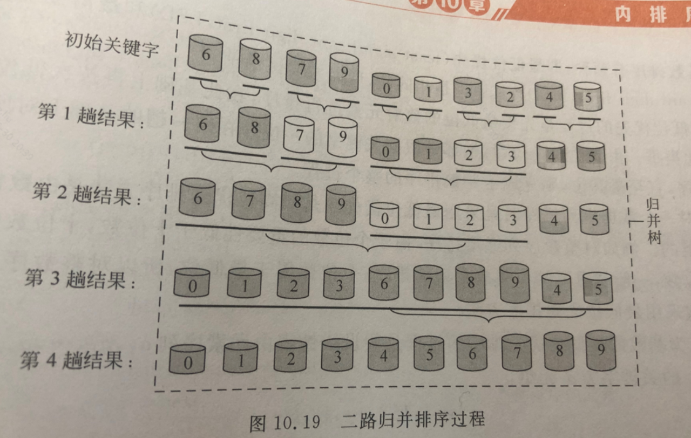

# Template

### **手写堆（大根小根）**

```java
/**
 * @author lhj
 * @create 2022/6/10 20:57
 * 小根堆的实现：堆其实就是完全二叉树，按照底层连续存储的结构，从左向右，从上到下构建二叉树
 */
public class IndexMinHeap<T> {
    private List<T> heap;  //堆本身元素实际存放的，原本是数组，我们需要自动扩容的
    private Map<T, Integer> indexMap;   //存放元素和存放结构位置的索引关系
    //private int capacity;   //指定初始化的容量，可要可不要
    private int heapSize;  //节点数量
    private Comparator<? super T> comparator;   //比较器，支持创建小根堆或者大根堆

    public IndexMinHeap(Comparator<? super T> comparator) {
        heap = new ArrayList<>();
        indexMap = new HashMap<>();
        heapSize = 0;
        this.comparator = comparator;
    }

    public boolean isEmpty(){
        return heapSize == 0;
    }

    public int size(){
        return heapSize;
    }

    public boolean contains(T key){
        return indexMap.containsKey(key);
    }
    //加入堆
    public void offer(T value){
        heap.add(value);
        //从这里可以看到，每次对应的索引位置是最后的位置，也就意味着我们要根据比较器来让该value上浮或者下沉
        indexMap.put(value, heapSize);
        //上面我们heap加入了元素，索引heap的大小更换
        heapInsert(heapSize++);
    }

    private void heapInsert(int index) {
        //(index - 1) / 2就是得到对应位置的父节点
        //根据比较器的规则，例如创建的时候显式构造：new IndexMinHeap((a,b)->a-b)，就是小根堆
        //new IndexMinHeap((a,b)->b-a)，就是大根堆
        //根据比较，如果两个值有差值关系即要交换！！！
        while (comparator.compare(heap.get(index), heap.get((index - 1) / 2)) < 0){
            swap(index, (index - 1) / 2);
            index = (index - 1) / 2;    //更新当前操作的元素
        }
    }

    //更换位置，更新索引关系
    private void swap(int i, int j) {
        T t1 = heap.get(i);
        T t2 = heap.get(j);
        heap.set(i, t2);
        heap.set(j, t1);
        indexMap.put(t1, j);
        indexMap.put(t2, i);
    }

    //出顶部元素，并调整堆（具体就是将屁股元素调整至顶部，然后下沉）
    public T pull(){
        T res = heap.get(0);
        int end = heapSize - 1;
        swap(0, end);
        heap.remove(end);
        indexMap.remove(res);
        //调整堆的方法
        heapify(0, --heapSize);
        return res;
    }

    //这个方法就是将元素的值改变，让堆的结构在进行调整，一般API不提供此方法，因为一般系统不会记indexMap这张表
    public void resign(T value){
        int valueIndex = indexMap.get(value);
        heapInsert(valueIndex);
        heapify(valueIndex, heapSize);
    }
    //其实就是堆排序，我们从下往上看
    private void heapify(int index, int heapSize) {
        //父节点以及其左孩子
        int parent = index, left = parent * 2 + 1;
        while(left < heapSize){
            //下面两步就是选个三者中最大或最小的元素出来
            //根据传入的比较器，如果是小根堆这三个就是在选最小的元素，传入的这个index元素时当前堆的最大元素
            //如果是大根堆，传入的index就是当前堆的最小元素，那么三者就是找最大，移动堆顶

            //这里面就是要找到左孩子和右孩子那个大，还是根据传入的比较器
            int largest = left + 1 < heapSize &&
                    (comparator.compare(heap.get(left + 1), heap.get(left)) < 0) ?
                    left + 1 : left;
            //在对比传入的这个父节点，其实就是当前层的那个元素
            largest = comparator.compare(heap.get(largest), heap.get(index)) < 0 ? largest : index;
            //这个的时候就是index确定好位置了，你可以理解为在叶子结点上了
            if(largest == index)
                break;
            //交换
            swap(largest, index);
            //更新当前节点，下次比较其左右孩子继续下沉
            index = largest;
            //left直到会更新到没有左孩子为止
            left = index * 2 + 1;
        }
    }
}
```

### 反转链表

```java
    public ListNode reverse(ListNode head){
		  if(head == null || head.next = null){
			  return head;
		  }
		  ListNode pre = null;
		  ListNode cur = head;
		  ListNode tail = null;
		  while(cur != null){
			  tail = cur.next;
			  cur.next = pre;
			  pre = cur;
			  cur = tail;
		  }
		  return pre;
    
    }
```

### 手撕快速排序

**快排，快排也可以不使用递归**

**注意，为了避免最坏情况，你可以随机一个数然后每次快排跟数组第一个数进行交换然后在开始**

**可千万别写成while(i < j && nums[left] <= nums[j--])**

```java
class Solution {
    public int[] sortArray(int[] nums) {
        if(nums == null || nums.length == 0)
            return null;
        quickSort(nums, 0, nums.length - 1);
        return nums;
    }

    public int partition(int[] nums, int start, int end){
        //设置两个指针，他们的初值指向无序区的第一个和最后一个元素
        int left = start;
        int right = end;
        //以每一段的第一个元素为基准，这个变量十分重要这个基准一直存放在
        //这里直到落位
        int finalNum = nums[left];
        //现在让right从右到左开始扫描，直到出现nums[right] < finalNum时
        //将nums[right]移动到left的位置
        //然后让left从左向右扫描 直到出现nums[left] > finalNum时
        //将nums[left]移动到right的位置，周而复始
        //直到left == right
        while(left < right){
            //注意一定要先从右往左扫描
            while(right > left && nums[right] >= finalNum)
                right--;
            nums[left] = nums[right];
            while(left < right && nums[left] <= finalNum)
                left++;
            nums[right] = nums[left];
        }
        //当两个指针重合了，肯定有两个位置的值是相等的，我们把重合位置的
        //值换成这个基准就算落位了
        nums[left] = finalNum;
        //把基准的索引返回，即配合分段
        return left;
    }

    public void quickSort(int[] nums, int start, int end){
        //这个i返回的就是这个基准的位置，以这个基准的位置分成两段，
        //然后在以两段继续进行段内排序，每次排完 这个基准的位置就定下来了
        int i;
        if(start < end){
            i = partition(nums, start, end);//返回基准索引
            quickSort(nums, start, i - 1);//左区间无序
            quickSort(nums, i + 1, end);//右区间无序
        }
    }
}
```

简略版本

```java
class Solution {
    private final static Random RANDOM = new Random(System.currentTimeMillis());
    public int[] sortArray(int[] nums) {
        quickSort(nums, 0, nums.length-1);
        return nums;
    }

    public void quickSort(int[] arr, int left, int right){
        if(left >= right)
            return;
        //以每次是随机数，然后跟左边的第一个数进行交换，这样可以分的更广一点
        int randomIndex = RANDOM.nextInt(right - left + 1) + left;
        swap(arr, left, randomIndex);

        int i = left, j = right;
        //以每次数组的第一个为基准
        while(i < j){
            //注意一定要先从右往左扫描
            while(j > i && arr[j] >= arr[left])
                j--;
            while(i < j && arr[i] <= arr[left])
                i++;

            swap(arr, i, j);
        }
        //这里填left，j或left，i都可以，因为最后i，j指向同一个位置，
        //这个位置就是left的最终位置
        swap(arr, left, i);
        //最基准最后位置的左右两个数组进行进行递归排序
        quickSort(arr, left, i - 1);
        quickSort(arr, i + 1, right);
    }

    public void swap(int[] arr, int i, int j){
        int temp = arr[i];
        arr[i] = arr[j];
        arr[j] = temp;
    }
}
```

### 手撕堆排序

一般写法

```java
class Solution {
    public int[] sortArray(int[] nums) {
        if(nums.length == 0)
            return null;
        //那么我们应该进行多少次的筛选呢，我们只用进行nums.length/2的次数
        //并且循环从nums.length/2 ~ 1开始，
        //即从最后一个分支结点开始，让大的浮上去，让小的落下来
        //这样完以后就建立了初始堆
        int i;
        int n = nums.length;
        int temp;
        for(i = n / 2 - 1; i >= 0; i--)
            sift(nums, i, n - 1);
        //然后进行n-1次趟完成堆排序，每一趟堆中元素个数减1
        for(i = n - 1; i >= 1; i--){
            //将最后一个元素与根R[0]交换
            temp = nums[0];
            nums[0] = nums[i];  
            nums[i] = temp;
            //然后对每次数组减1长度的进行筛选
            sift(nums, 0, i - 1);
        }
        return nums;

    }

    //堆排序就是把序列看成一颗完全二叉树，通过其性质逐个替换
    //使用大根堆，n个元素序列 k1 k2 ...kn，满足ki >= k2i && ki >= k2i+1

    //堆排序的核心是筛选，即假如完全二叉树的根结点是R[i]，
    //左右子树都满足大根堆，
    //然后用R[i]对R[2i]与R[2i+1]这个两个值的最大值进行对比，
    //（i、2i、2i+1）正好符合完全二叉树与数组索引下标的对应关系
    //如果孩子大则进行交换，然后继续循环构造下一层的二叉树
    public void sift(int[] nums, int low, int high){
        //定义两个指针指向根结点和左孩子
        int i = low, j = 2 * i + 1;
        int temp = nums[i];
        while(j <= high){   //从j到high就是无序区的范围，即左孩子到最后
            //先比较左孩子右孩子 跳出一个大的
            if(j < high && nums[j] < nums[j+1])
                j++;
            //如果较大的孩子大于根结点就进行交换
            if(temp < nums[j]){
                nums[i] = nums[j];  //此时根节点的值在temp保存着
                i = j;  //此时进入下一层的筛选
                j = 2 * i + 1;  //下一层根节点的左孩子
            }else 
                break;
        }
        //最后数组序列也就是二叉树中肯定有两个数值是相同的，最终i的位置
        //就是一开始temp的归宿，即我们将temp的值定死了
        nums[i] = temp;
    }
}
```

简便写法

```java
class Solution {
    public int[] sortArray(int[] nums) {
        int n = nums.length;

        //建立初始堆，让大的浮上来，小的下去
        //让数组前一半的数进行初始堆的创建，创建完，堆顶绝对是全数组最大的
        //将数组整理成堆，其实就是把数组转换成堆的形式
        for(int i = n / 2 - 1; i >= 0; i--)
            heapify(nums, i, n - 1);

        //循环进行n-1次排序，每一趟堆中元素减1
        //让[0,i]有序，然后就开始每次跟最后一个交换去确定位置，每次移动到最后就能带动一次
        //结构调整。让堆顶的元素永远为最大的
        for(int i = n - 1; i >= 1; i--){
            //将最后一个元素与根R[0]即最大交换
            swap(nums, 0, i);
            //然后对每次数组减1长度的进行筛选
            heapify(nums, 0, i - 1);
        }
        return nums;
    }

    //其实这里low和high要更换以下才符合，这里的命名其实就是索引从大到小
    public void heapify(int[] nums, int low, int high){
        int i = low, j = 2 * i + 1;
        while(j <= high){
            //若右孩子大，则指向右孩子
            if(j < high && nums[j] < nums[j + 1])
                j++;
             //根节点与两个孩子中的最大孩子比较
            if(nums[i] < nums[j]){
                //比根节点大就交换
                swap(nums, i, j);
                i = j;    //修改i j的值，也就是更换根节点继续想下遍历，更换成最新的根节点
                j = 2 * i + 1;
            }else 
                break;
        }
    }

    public void swap(int[] nums, int i, int j){
        int temp = nums[i];
        nums[i] = nums[j];
        nums[j] = temp;
    }
}
```

### 手撕归并排序

**由图可以看到为什么奇数偶数个剩余时需要特殊处理**



```java
class Solution {
    public int[] sortArray(int[] nums) {
        if(nums == null || nums.length == 0)
            return nums;
        //二路归并排序
        int len = nums.length;
        //进行log以2为底的n 整体向上取整趟的归并
        for(int i = 1; i < len; i *= 2)
            mergePass(nums, i, len);
        return nums;
    }

    //这个length表示每次归并的数组长度，初始值为1，数组被分成无数个长度
    //为1的小数组开始两两归并，len表示数组长度

    //对整个排序序列进行一趟归并
    public void mergePass(int[] nums, int length, int len){
        int i;
        //归并length长的两个相邻子表
        for(i = 0; i + 2 * length - 1 < len; i = i + 2 * length)
            merge(nums, i, i + length - 1, i + 2 * length - 1);
        //奇数个子表，则剩最后一个需要归并，
        //偶数个子表，就要对最后两个余下的子表，后者的长度要小于length
        if(i + length - 1 < len - 1)
            //归并这两个子表
            merge(nums, i, i + length - 1, len - 1);
    }

    //归并low -- high
    //创建一个辅助数组，将两个数组分别比较的元素合并到这个辅助数组中
    //归并完成后再复制回来
    public void merge(int[] nums, int low, int mid, int high){
        int[] temp = new int[high - low + 1];
        //i和j分别代表两个子数组对比的元素
        int i = low, j = mid + 1, k = 0;
        while(i <= mid && j <= high){
            if(nums[i] <= nums[j]){
                temp[k] = nums[i];
                i++;
                k++;
            }else{
                temp[k] = nums[j];
                j++;
                k++;
            }
        }
        //将第一段余下的部分复制到temp
        while(i <= mid){
            temp[k] = nums[i];
            i++;
            k++;
        }
        while(j <= high){
            temp[k] = nums[j];
            j++;
            k++;
        }

        //将辅助数组的值，复制到nums中去
        for(k = 0, i = low; i <= high; k++, i++)
            nums[i] = temp[k];

    }
}
```

**简略版本（配合图看很清晰）**

```java
class Solution {
    int[] nums, tmp;
    public int[] sortArray(int[] nums) {
        this.nums = nums;
        tmp = new int[nums.length];
        mergeSort(0, nums.length - 1);
        return nums;
    }

    public void mergeSort(int l, int r) {
        // 终止条件
        if (l >= r) return 0;
        // 递归划分
        int m = l + (r - l) / 2;
        int res = mergeSort(l, m) + mergeSort(m + 1, r);
        // 合并阶段
        int i = l, j = m + 1;
        for (int k = l; k <= r; k++)
            tmp[k] = nums[k];
        for (int k = l; k <= r; k++) {
            //直到i增加到m+1时就去赋值剩下的k
            if (i == m + 1)
                nums[k] = tmp[j++];
             //然后j增加到r+1，此时就让后面的临时值复制到k之后
            else if (j == r + 1 || tmp[i] <= tmp[j])
                nums[k] = tmp[i++];
             //i从地位，然后让后半部分的第一位开始在k起始位置复制
            else {
                nums[k] = tmp[j++];
            }
        }       
    }
}
```

**简略版本二**

```java
class Solution {
    int[] nums, temp;
    public int[] sortArray(int[] nums) {
        this.nums = nums;
        temp = new int[nums.length];
        mergeSort(0, nums.length - 1);
        return nums;
    }

    public void mergeSort(int left, int right) {
        // 终止条件
        if (left >= right) return;
        // 递归划分
        int mid = left + (right - left) / 2;
        mergeSort(left, mid);
        mergeSort(mid + 1, right);
        // 合并阶段
        int i = left, j = mid + 1, k = 0;
        while (i <= mid && j <= right){
            if (nums[i] <= nums[j])
                temp[k++] = nums[i++];
            else
                temp[k++] = nums[j++];
        }
        while (i <= mid) temp[k++] = nums[i++];
        while (j <= right) temp[k++] = nums[j++];
        for (i = left, k = 0; i <= right; i++)
            nums[i] = temp[k++];     
    }
}
```

### 手撕冒泡排序

```java
private int[] bubbleSort(int[] array) {
    int temp;
    for (int i = 0; i < array.length - 1; i++) {
        boolean Flag = false; // 是否发生交换。没有交换，提前跳出外层循环
        for (int j = 0; j < array.length - 1 - i; j++) {
            if (array[j] > array[j + 1]) {
                temp = array[j];
                array[j] = array[j + 1];
                array[j + 1] = temp;
                Flag = true;
            }
        }
        if (!Flag)
        {
            break;
        }
    }
    return array;
}
```

### **二叉树路径问题分类**

> 顾名思义，就是从某一个节点(不一定是根节点)，从上向下寻找路径，到某一个节点(不一定是叶节点)结束就是从任意节点到任意节点的路径，不需要自顶向下
> 

### **DFS注意事项(自顶向下)**

1. 如果是找路径和等于给定target的路径的，那么可以不用新增一个临时变量cursum来判断当前路径和， 只需要用给定和target减去节点值，最终结束条件判断target==0即可
2. 是否要回溯：二叉树的问题大部分是不需要回溯的，原因如下： 二叉树的递归部分：dfs(root->left),dfs(root->right)已经把可能的路径穷尽了, 因此到任意叶节点的路径只可能有一条，绝对不可能出现另外的路径也到这个满足条件的叶节点的;而对比二维数组(例如迷宫问题)的DFS,for循环向四个方向查找每次只能朝向一个方向，并没有穷尽路径， 因此某一个满足条件的点可能是有多条路径到该点的。并且visited数组标记已经走过的路径是会受到另外路径是否访问的影响，这时候必须回溯
3. 找到路径后是否要return: 取决于题目是否要求找到叶节点满足条件的路径,如果必须到叶节点,那么就要return; 但如果是到任意节点都可以，那么必不能return,因为这条路径下面还可能有更深的路径满足条件，还要在此基础上继续递归
4. 是否要双重递归(即调用根节点的dfs函数后，继续调用根左右节点的pathsum函数)：看题目要不要求从根节点开始的，还是从任意节点开始

### **非自顶向下**

1. 设计一个辅助函数maxpath，调用自身求出以一个节点为根节点的左侧最长路径left和右侧最长路径right，那么经过该节点的最长路径就是left+right 接着只需要从根节点开始dfs,不断比较更新全局变量即可
2. left,right代表的含义要根据题目所求设置，比如最长路径、最大路径和等等
3. 全局变量res的初值设置是0还是INT_MIN要看题目节点是否存在负值,如果存在就用INT_MIN，否则就是0
4. 注意两点之间路径为1，因此一个点是不能构成路径的

### 二分查找

**简洁版本**

```java
class Solution {
    public int search(int[] nums, int target) {
        int left = 0, right = nums.length - 1;
        while(left <= right){
            int mid = (left + right) / 2; 
            if(target < nums[mid])
                right = mid - 1;
            else if(target > nums[mid])
                left = mid + 1;
            else 
                return mid;
        }
        return -1;
    }
```

**书上的太重复，递归**

```java
public int search(int[] nums, int target) {
        return recursion(nums, 0, nums.length - 1, target);
    }

    public int recursion(int[] nums, int left, int right, int target){
        int low = left;
        int high = right;
        int mid = (left + right) / 2;
        if(left > right)
            return -1;
        if(nums[mid] == target){
            //这里应该加强代码的健壮性，就是有可能寻找的target在数组中是重复出现的，那么我们就需要输出多个索引了
            return mid;
        }else if(nums[mid] > target){
            high = mid - 1;
            return test(nums, low, high, target);
        }else if(nums[mid] < target){
            low = mid + 1;
            return test(nums, low, high, target);
        }else
            return -1;
    }
}
```

这道题可以利用动态规划的思路做出来 一般动态规划的思考步骤分为以下几步：

1. 确定状态
    
    > 研究最优策略的最后一步,化为子问题
    > 
2. 转移方程
    
    > 根据子问题定义得到
    > 
3. 初始条件和边界情况
4. 计算顺序
5. 空间优化

### 滑动窗口

滑动窗口的思想：

- 用i,j表示滑动窗口的左边界和右边界，通过改变i,j来扩展和收缩滑动窗口，可以想象成一个窗口在字符串上游走，当这个窗口包含的元素满足条件，即包含字符串T的所有元素，记录下这个滑动窗口的长度j-i+1，这些长度中的最小值就是要求的结果。

步骤一

- 不断增加j使滑动窗口增大，直到窗口包含了T的所有元素

步骤二

- 不断增加i使滑动窗口缩小，因为是要求最小字串，所以将不必要的元素排除在外，使长度减小，直到碰到一个必须包含的元素，这个时候不能再扔了，再扔就不满足条件了，记录此时滑动窗口的长度，并保存最小值

步骤三

- 让i再增加一个位置，这个时候滑动窗口肯定不满足条件了，那么继续从步骤一开始执行，寻找新的满足条件的滑动窗口，如此反复，直到j超出了字符串S范围。

面临的问题：

如何判断滑动窗口包含了T的所有元素？

- 我们用一个字典need来表示当前滑动窗口中需要的各元素的数量，一开始滑动窗口为空，用T中各元素来初始化这个need，当滑动窗口扩展或者收缩的时候，去维护这个need字典，例如当滑动窗口包含某个元素，我们就让need中这个元素的数量减1，代表所需元素减少了1个；当滑动窗口移除某个元素，就让need中这个元素的数量加1。 记住一点：need始终记录着当前滑动窗口下，我们还需要的元素数量，我们在改变i,j时，需同步维护need。 值得注意的是，只要某个元素包含在滑动窗口中，我们就会在need中存储这个元素的数量，如果某个元素存储的是负数代表这个元素是多余的。比如当need等于{'A':-2,'C':1}时，表示当前滑动窗口中，我们有2个A是多余的，同时还需要1个C。这么做的目的就是为了步骤二中，排除不必要的元素，数量为负的就是不必要的元素，而数量为0表示刚刚好。
- 回到问题中来，那么如何判断滑动窗口包含了T的所有元素？结论就是当need中所有元素的数量都小于等于0时，表示当前滑动窗口不再需要任何元素。 优化如果每次判断滑动窗口是否包含了T的所有元素，都去遍历need看是否所有元素数量都小于等于0，这个会耗费O(k)的时间复杂度，k代表字典长度，最坏情况下，k可能等于len(S)。 其实这个是可以避免的，我们可以维护一个额外的变量needCnt来记录所需元素的总数量，当我们碰到一个所需元素c，不仅need[c]的数量减少1，同时needCnt也要减少1，这样我们通过needCnt就可以知道是否满足条件，而无需遍历字典了。 前面也提到过，need记录了遍历到的所有元素，而只有need[c]>0大于0时，代表c就是所需元素

**滑动窗口模版**

```
public int findSubArray(int[] nums) {
    int N = nums.length; // 数组长度
    int left = 0, right = 0; // 双指针，表示当前遍历的区间[left, right]，闭区间
    int sums = 0; // 用于统计子数组是否有效，根据题目可能会改成求和/计数
    int res = 0; // 保存最大的满足题目要求的子数组长度

    while (right < N) { // 当右指针没有到数组结尾
        sums += nums[right]; // 增加当前右指针的数字的求和/计数

        // 这里需要根据具体题意判断区间[left, right]是否符合要求
        while (!isValid(sums, left, right, nums)) { // 需要你实现isValid方法
            sums -= nums[left]; // 移动左指针前减少left位置的数字
            left++; // 移动左指针
        }

        // 到 while 结束时，找到了一个符合题意的子数组
        res = Math.max(res, right - left + 1); // 更新结果
        right++; // 移动右指针，探索新区间
    }
    return res;
}

// 你需要根据实际题目实现这个方法
private boolean isValid(int sums, int left, int right, int[] nums) {
    // 例如：return sums <= k;
    return true; // 这里只是占位
}
```

**原地哈希**


### 递归与回溯


### DFS


