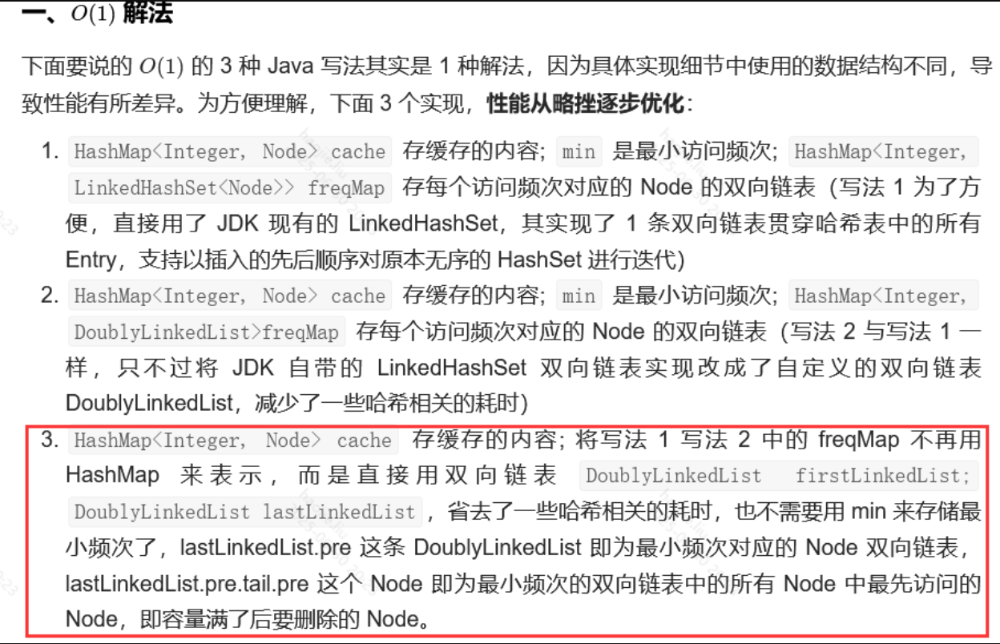

# 设计类（缓存 / 哈希表 / 前缀树）

### LRU缓存机制

LRU（The Least Recently Used，最近最久未使用算法）

- LRU算法的思想是：**如果一个数据在最近一段时间没有被访问到，那么可以认为在将来它被访问的可能性也很小。因此，当空间满时，最久没有访问的数据最先被置换（淘汰）**。

LFU（Least Frequently Used ，最近最少使用算法）也是一种常见的缓存算法。

- 顾名思义，LFU算法的思想是：**如果一个数据在最近一段时间很少被访问到，那么可以认为在将来它被访问的可能性也很小。因此，当空间满时，最小频率访问的数据最先被淘汰**。

**自定义链表+自定义节点+hashmap**

```java
//我们使用双向链表（插入删除方便）+哈希表（查找方便）的结合来解决
//这里我们使用自己创建双向列表类，当然也可以使用linkedhashmap来实现
//队列的特性和map的特性

class LRUCache {
    //定义结点的内部类
    private class Node{
        Node pre,next;
        int key,value;

        private Node(){
            this.pre = this.next = null;
        }

        private Node(int k, int v){
            this.key = k;
            this.value = v;
            this.pre = this.next = null;
        }
    }

    //定义双向列表的类
    private class DoubleList{
        Node head = new Node(0, 0);
        Node tail = new Node(0, 0);
        int size;

        private DoubleList(){
            head.next = tail;
            tail.pre = head;
            size = 0;
        }

        //添加结点到队头
        private void addFirst(Node node){
            //这一句防止链表中已经有结点了

            Node headNext = head.next;
            head.next = node;
            headNext.pre = node;
            node.pre = head;
            node.next = headNext;

            size++;
        }

        //删除队尾的结点
        private Node rmLast(){
            Node last = tail.pre;
            rm(last);
            return last;
        }

        //删除指定结点
        private void rm(Node node){
            node.next.pre = node.pre;
            node.pre.next = node.next;

            size--;
        }

        private int size() {
            return size;
        }

    }

    // key -> Node(key, val)
    private HashMap<Integer, Node> map;
    // Node(k1, v1) <-> Node(k2, v2)...
    private DoubleList cache;
    // 最大容量
    private int cap;

    public LRUCache(int capacity) {
        this.cap = capacity;
        cache = new DoubleList();
        map = new HashMap<>();
    }

    public int get(int key) {
        //get就意味着使用，将get到的key要移动到对头哦
        //如果key不存在，返回-1
        if(!map.containsKey(key))
            return -1;
        int value = map.get(key).value;
        //调用put方法移动到队头
        put(key, value);
        return value;
    }

    //放入分别有两种操作：
    //一是：放入已存在结点到队头，如果结点到value改变要更新map中到value；
    //二是：如果size已满，要将队尾的结点删除，并将新的结点加入到队头，并且要更改map中的映射
    public void put(int key, int value) {
        Node node = new Node(key, value);

        if(map.containsKey(key)){
            cache.rm(map.get(key));
            cache.addFirst(node);
            //更新map中的value值（这里就是将新的结点更新到map中）
            map.put(key, node);
        }else {
            if(cap == cache.size()){
                Node last = cache.rmLast();
                map.remove(last.key);
            }
            cache.addFirst(node);
            map.put(key, node);
        }
    }
}
```

**其实上面的链表和节点，能合二为一成一个单独的节点类**

```java
public class LRUCache {

    /**
     * 容量
     */
    private int capacity;

    /**
     * 存储缓存
     */
    private Map<Integer, Node<Integer, Integer>> map;

    /**
     * 虚拟头结点
     */
    private Node<Integer, Integer> head;

    /**
     * 虚拟尾结点
     */
    private Node<Integer, Integer> tail;

    public LRUCache(int capacity) {
        this.capacity = capacity;
        map = new HashMap<>((int)(capacity / 0.75 + 1), 0.75f);
        head = new Node<>();
        tail = new Node<>();
        head.next = tail;
        tail.pre = head;
    }

    public int get(int key) {
        Node<Integer, Integer> node = map.get(key);
        if (node == null) {
            return -1;
        }
        deleteNode(node);
        addToTail(node);
        return node.value;
    }

    public void put(int key, int value) {
        Node<Integer, Integer> node = map.get(key);
        if (node != null) {
            deleteNode(node);
        }
        node = new Node<>(key, value);
        addToTail(node);
        map.put(key, node);
        if (map.size() > capacity) {
            removeHead();
        }

    }

    /**
     * 删除节点
     * @param node
     */
    private void deleteNode(Node node) {
        node.pre.next = node.next;
        node.next.pre = node.pre;
    }

    /**
     * 将节点移动到尾部
     * @param node
     */
    private void addToTail(Node node) {
        node.next = tail;
        node.pre = tail.pre;
        tail.pre.next = node;
        tail.pre = node;
    }

    /**
     * 删除第一个节点
     */
    private void removeHead() {
        Node node = head.next;
        head.next = node.next;
        node.next.pre = head;
        map.remove(node.key);
    }

    /**
     * 定义节点，双向链表
     * @param <k>
     * @param <v>
     */
    private static class Node<k, v> {
        k key;
        v value;

        Node<k, v> next;

        Node<k, v> pre;

        public Node() {
        }

        public Node(k key, v value) {
            this.key = key;
            this.value = value;
            next = null;
            pre = null;
        }
    }
}
```

### LFU缓存



```java
class LFUCache {
    private class Node{
        int key, value;
        Node pre;
        Node next;
        //其实这里就可以看出来每个双向列表就代表一个map的entry
        DoublyLinkedList doublyLinkedList;  // Node所在频次的双向链表

        private Node(int key, int value){}
        private Node(int key, int value){
            this.key = key;
            this.value = value;
            this.count = 0;
        }
    }

    int capacity;
    Map<Integer, Node> cache;
    DoublyLinkedList firstLinkedList; 
    // firstLinkedList.next 是频次最大的双向链表

    DoublyLinkedList lastLinkedList;  
  // lastLinkedList.pre 是频次最小的双向链表，满了之后删除 lastLinkedList.pre.tail.pre 这个Node即为频次最小且访问最早的Node

    int size;

    public LFUCache(int capacity) {
        this.capacity = capacity;
        cache = new HashMap<>(capacity);
        firstLinkedList = new DoublyLinkedList();
        firstLinkedList.next = lastLinkedList;
        lastLinkedList = new DoublyLinkedList();
        lastLinkedList.pre = firstLinkedList;
    }

    public int get(int key) {
        Node node = cache.get(key);
        //为空缓存中没有
        if(node == null)
            return -1;
        //有的话增加频次，更新位置
        freqInc(node);
        return node.value;

    }

    public void put(int key, int value) {
        if(capacity == 0)
            return;

        Node node = cache.get(key);
        //如果node命中，则要更新频次和更新位置
        if(node != null){
            node.value = value;
            freqInc(node);
        }else{      //如果不存在
            //此时缓冲的大小满了
            //删除lastLinkedList.pre这个链表（即表示最小频次的链表）中的tail.pre这个Node（即最小频次链表中最先访问的Node），如果该链表中的元素删空了，则删掉该链表。
            if(cache.size() == capacity){
                cache.remove(lastLinkedList.pre.tail.pre.key);

                lastLinkedList.removeNode(lastLinkedList.pre.tail.pre);

                size--;
                if(lastLinkedList.pre.head.post == lastLinkedList.pre.tail) {
                   removeDoublyLinkedList(lastLinkedList.pre);
                }
            }
            // cache中put新Key-Node对儿，并将新node加入表示freq为1的DoublyLinkedList中，若不存在freq为1的DoublyLinkedList则新建。

      Node newNode = new Node(key, value);

      cache.put(key, newNode);

      if (lastLinkedList.pre.freq != 1) {

        DoublyLinkedList newDoublyLinedList = new DoublyLinkedList(1);

        addDoublyLinkedList(newDoublyLinedList, lastLinkedList.pre);

        newDoublyLinedList.addNode(newNode);

      } else {

        lastLinkedList.pre.addNode(newNode);

      }

      size++;

    }

    }

    /**
    node 的访问频次加1
     */
    public void freqInc(Node node){
    // 将node从原freq对应的双向链表里移除, 如果链表空了则删除链表。

        DoublyLinkedList linkedList = node.doublyLinkedList;

        DoublyLinkedList preLinkedList = linkedList.pre;

        linkedList.removeNode(node);

        if (linkedList.head.post == linkedList.tail) { 

          removeDoublyLinkedList(linkedList);

        }

        // 将node加入新freq对应的双向链表，若该链表不存在，则先创建该链表。

        node.freq++;

        if (preLinkedList.freq != node.freq) {

          DoublyLinkedList newDoublyLinedList = new DoublyLinkedList(node.freq);

          addDoublyLinkedList(newDoublyLinedList, preLinkedList);

          newDoublyLinedList.addNode(node);

        } else {

          preLinkedList.addNode(node);

        }

    }

     /**
   * 增加代表某1频次的双向链表
   */
    public void addDoublyLinkedList(DoublyLinkedList newDoublyLinedList, DoublyLinkedList preLinkedList) {

        newDoublyLinedList.post = preLinkedList.post;

        newDoublyLinedList.post.pre = newDoublyLinedList;

        newDoublyLinedList.pre = preLinkedList;

        preLinkedList.post = newDoublyLinedList; 

  }

  /**
   * 删除代表某1频次的双向链表
   */
    public void removeDoublyLinkedList(DoublyLinkedList doublyLinkedList) {

        doublyLinkedList.pre.post = doublyLinkedList.post;

        doublyLinkedList.post.pre = doublyLinkedList.pre;

  }

}

class DoublyLinkedList {

  int freq; // 该双向链表表示的频次

  DoublyLinkedList pre;  // 该双向链表的前继链表（pre.freq < this.freq）

  DoublyLinkedList next; // 该双向链表的后继链表 (next.freq > this.freq)

  Node head; // 该双向链表的头节点，新节点从头部加入，表示最近访问

  Node tail; // 该双向链表的尾节点，删除节点从尾部删除，表示最久访问

  public DoublyLinkedList() {

    head = new Node();

    tail = new Node();

    head.next = tail;

    tail.pre = head;

  }

  public DoublyLinkedList(int freq) {

    head = new Node();

    tail = new Node();

    head.next = tail;

    tail.pre = head;

    this.freq = freq;

  }

  void removeNode(Node node) {

    node.pre.next = node.next;

    node.next.pre = node.pre;

  }

  void addNode(Node node) {

    node.next = head.next;

    head.next.pre = node;

    head.next = node;

    node.pre = head;

    node.doublyLinkedList = this;

  }

}
```

### 实现 Trie (前缀树)


```java
class Trie {
    private class TrieNode{
        private boolean isEnd;
        private TrieNode[] next;

        public TrieNode() {
            isEnd  = false;
            //除了根节点外每个节点有26个分支
            next = new TrieNode[26];
        }

    }
    //root是一个空节点
    private TrieNode root;
    public Trie() {
        root = new TrieNode();
    }

    //对于某个字符串就是依次遍历添加字符，每个节点为一个字符，直到最后一个结点并为其结点
    //将结束标识符设置为true
    public void insert(String word) {
        TrieNode cur = root;
        //这种写法就不行，不懂..
        /*
        char[] c = word.toCharArray();
        for(int i = 0; i < c.length; i++){

            char ch = c[i] - 'a';
            if(cur.next[ch] == null)
                cur.next[ch] = new TrieNode();
            cur = cur.next[ch];
        }
        */
        //这里之所以减a，是因为我们要将字符按照数组从0到25即a~z添加，但是底层a~z的
        //的ASCII码都不是0~25，那么我们就要减去a，就是0~25了
        for(char ch : word.toCharArray()){
            if(cur.next[ch - 'a'] == null)
                cur.next[ch - 'a'] = new TrieNode();
            cur = cur.next[ch - 'a'];
        }
        //循环后将结尾的结束标识设置为true
        cur.isEnd = true;
    }

    //注意在添加完apple后，如果搜寻app这个是不能搜寻成功的，原因是在第二个p上面没有结束
    //标识，那么就认为搜寻不到，但如果先插入就会将结尾标识设置上去
    public boolean search(String word) {
        TrieNode cur = root;
        for(char ch : word.toCharArray()){
            cur = cur.next[ch - 'a'];
            //等于null就证明没有建立过此字符
            if(cur == null)
                return false;
        }
        return cur.isEnd;
    }

    public boolean startsWith(String prefix) {
        TrieNode cur = root;
        for(char ch : prefix.toCharArray()){
            cur = cur.next[ch - 'a'];
            //等于null就证明没有建立过此字符
            if(cur == null)
                return false;
        }
        return true;
    }
}
```

### 常数时间插入、删除和获取随机元素

**这道题跟381的区别就是不允许放重复元素**

```java
class RandomizedSet {
    static int[] nums;
    Random random;
    Map<Integer, Integer> map;
    int index;

    public RandomizedSet(){
        nums = new int[200010];
        random = new Random();
        map = new HashMap<>();
        index = -1;
    }
    //map映射值与索引，我们不能加重复的
    public boolean insert(int val) {
        if (map.containsKey(val)) 
            return false;
        nums[++index] = val;
        map.put(val, index);
        return true;
    }

    public boolean remove(int val) {
        if (!map.containsKey(val)) 
            return false;
        //返回删除元素对应索引位置
        int loc = map.remove(val);
        //下面两步就是在修改映射关系和将被删除元素的值用后一个值给覆盖
        //例如 1 2 3 删除1后就变成 3 2 3 index变为1，下次插入新的会把 索引2的3给覆盖
        if (loc != index) 
            map.put(nums[index], loc);
        nums[loc] = nums[index--];
        return true;
    }

    public int getRandom() {
        return nums[random.nextInt(index + 1)];
    }
}

```

### 设计循环队列

**数组**

```java
class MyCircularQueue {
    //用数组模拟
    int[] items;
    int front;  //前进指针
    int rear;   //末端指针
    int size;    //需要的数组长度

    public MyCircularQueue(int k) {
        items = new int[k];
        front = 0;
        rear = 0;
        size = k;
    }

    public boolean enQueue(int value) {
        if(front - rear == size)    //如果前进指针到达最后一个位置，末尾指针还在起点就说明装满了
            return false;
        //循环在数组中添加
        items[front % size] = value;
        front++;
        return true;
    }

    public boolean deQueue() {
        if(front == rear)   //说明没有元素
            return false;
        rear++;
        return true;
    }

    public int Front() {
        //注意这里返回是末端的指针，是因为数组的存放顺序是不满足队列的先进先出，所以我们需要调整
        return front == rear ? -1 : items[rear % size];
    }

    public int Rear() {
        //之所以-1，是因为最后添加成功front会+1
        if(front % size == 0)
            return front == rear ? -1 : items[size-1];
        return front == rear ? -1 : items[(front % size) - 1];
    }

    public boolean isEmpty() {
        return front == rear;
    }

    public boolean isFull() {
        return size == front - rear;
    }
}
```

**链表**

```java
class MyCircularQueue {
    private class Node{
        int val;
        Node next, prev;
        Node(){}
        Node(int val){
            this.val = val;
        }
        Node(int val, Node next, Node prev){
            this.val = val;
            this.next = next;
            this.prev = prev;
        }
    }

    Node head, tail;    //头节点和尾节点
    int size, count;
    public MyCircularQueue(int k) {
        head = new Node();  //头节点
        tail = new Node();
        head.next = tail;
        tail.prev = head;
        this.size = k;
        count = 0;
    }
    //头插法
    public boolean enQueue(int value) {
        if(count == size)
            return false;
        Node node = new Node(value);
        Node temp = head.next;
        node.next = temp;
        head.next = node;
        temp.prev = node;
        node.prev = head;
        count++;
        return true;
    }
    //我们采取将尾部的节点删除，也就是对头的节点
    public boolean deQueue() {
        if(count == 0)
            return false;
        tail.prev = tail.prev.prev;
        tail.prev.next = tail;
        count--;
        return true;
    }
    //这里注意我们采用头插法，那么对头就是尾部的前一个
    public int Front() {
        return count == 0 ? -1 : tail.prev.val;
    }

    public int Rear() {
        return count == 0 ? -1 : head.next.val;
    }

    public boolean isEmpty() {
        return count == 0;
    }

    public boolean isFull() {
        return count == size;
    }
}
```

### 设计哈希映射

```java
class MyHashMap {
    private class Node{
        int val;
        int key;
        Node next;
        Node(int x, int y){
            val = y;
            key = x;
        }
    }

    private static final int BASE = 769;
    //设置桶，根据key算出索引值
    LinkedList[] buckets;
    public MyHashMap() {
        buckets = new LinkedList[BASE];
        for(int i = 0; i < BASE; i++){
            buckets[i] = new LinkedList<Node>();
        }
    }

    public void put(int key, int value) {
        int hash = hash(key);
        List<Node> nodes = buckets[hash];
        for(Node node : nodes){
            if(node.key == key){
                node.val = value;
                return;
            }     
        }
        //尾插法
        buckets[hash].offerLast(new Node(key, value));  
    }

    public int get(int key) {
        int hash = hash(key);
        List<Node> nodes = buckets[hash];
        for(Node node : nodes){
            if(node.key == key){
                return node.val;
            }     
        }
        return -1;

    }

    public void remove(int key) {
        int hash = hash(key);
        List<Node> nodes = buckets[hash];
        for(Node node : nodes){
            if(node.key == key){
                buckets[hash].remove(node);
                return;
            }     
        }  
    }

    public int hash(int key){
        //这是哈希函数构造四种方法中的除留余数法：key%p(key是输入关键字，p是一个小于但接近表长m的质数) （建议看书不然难以理解）
        return key % BASE;
    }
}
```

### 实现 strStr()

**暴力算法**

```java
class Solution {
    public int strStr(String haystack, String needle) {
        if(needle == null)
            return 0;
        int n = haystack.length(), m = needle.length();
        char[] target = haystack.toCharArray(), pattern = needle.toCharArray();
        for(int i = 0; i <= n - m; i++){
            //前者就是目标串的指针，当前匹配逐个向后遍历，如果当前不匹配换出发点
            //后者是模式串的指针，不匹配会被下一轮重置为0
            int begin = i, reStart = 0;
            while(reStart < m && target[begin] == pattern[reStart]){
                begin++;
                reStart++;
            }
            //// 如果能够完全匹配，返回原串的「发起点」下标
            if(reStart == m)
                return i;
        }
        return -1;
    }
}
```

**KMP**

> 上述的朴素解法，不考虑剪枝的话复杂度是 O(m∗n)O(m * n)O(m∗n) 的，而 KMP 算法的复杂度为 O(m+n)O(m + n)O(m+n)。
> 

```java
class Solution {
    public int strStr(String target, String pattern) {
        if(pattern == null)
            return 0;
        int n = target.length(), m = pattern.length();

        // 原串和匹配串前面都加空格，使其下标从 1 开始
        target = " " + target;
        pattern = " " + pattern;
        char[] targets = target.toCharArray(), patterns = pattern.toCharArray();

        //构建next数组，指明当前模式串与目标船不匹配，模式串回溯到那个索引继续匹配
        int[] next = new int[m+1];
        //构造过程 i = 2，j = 0 开始，i 小于等于匹配串长度 【构造 i 从 2 开始】
        for(int i = 2, j = 0; i <= m; i++){
            // 匹配不成功的话，j = next(j)
            while (j > 0 && patterns[i] != patterns[j + 1]) 
                j = next[j];
            // 匹配成功的话，先让 j++
            if (patterns[i] == patterns[j + 1]) 
                j++;
            // 更新 next[i]，结束本次循环，i++
            next[i] = j;
        }
        // 匹配过程，i = 1，j = 0 开始，i 小于等于原串长度 【匹配 i 从 1 开始】
        for(int i = 1, j = 0; i <= n; i++){
             // 匹配不成功 j = next(j)
            while (j > 0 && targets[i] != patterns[j + 1]) 
                j = next[j];
            // 匹配成功的话，先让 j++，结束本次循环后 i++
            if (targets[i] == patterns[j + 1]) 
                j++;
            // 整一段匹配成功，直接返回下标
            if (j == m) 
                return i - m;
        }
        return -1;
    }
}
```