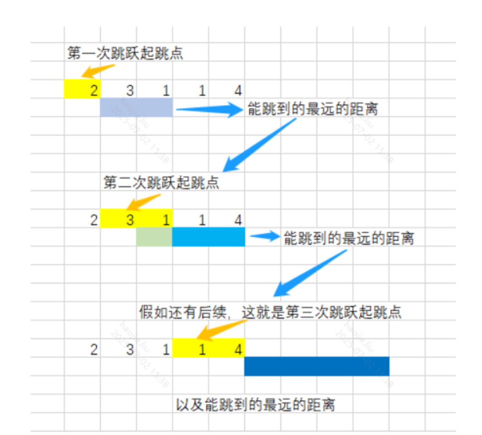

# 贪心算法

### 跳跃游戏

```java
class solution{    
    public boolean canJump(int[] nums) {
        int i = 0, temp = 0, n = nums.length;
        while(i < n){
            if(i > temp)
                return false;
            //这一步就是可以防止有循环0的出现
            //出现了循环0，temp就得不到更新，那么i就会大于temp返回
            //false了
            //又能允许形似【2，5，0，0】的数组通过
            temp = Math.max(temp, i + nums[i++]);
        }
        return true;
    }
}

```

### 跳跃游戏 II

**与一的区别就是，一只管你最后能不能到，我们可以每一个都走以下，如果没有那种0的情况，看累加的值最后就可以了**

**而二是看你最后能走到的话就返回能走到需要跳的最小次数，甭管你跳了几个格子，最少次数就行**



**贪心的思路**

```java
class Solution {
    public int jump(int[] nums) {
        //无论怎么样我们第一次起跳的起点都是第一个，
        //然后根据第一个的跳跃距离，我们在第二次起跳的距离里面选最大的
        //例如：[2,3,1,1,4]，我们第一次最多能跳两格子，所以我们第二次起跳的起点可以是
        // 3 或者 1，在第二次开始我们就要开始贪心选跳最远的，所以肯定选3
        int start = 0, end = 0, n = nums.length, res = 0;

        while(end < n - 1){
            int maxPos = 0;
            for(int k = start; k <= end; k++){
                //k + nums[k]：当前位置+最大的跳动距离就是最后的落点
                maxPos = Math.max(k + nums[k], maxPos);
            }  
            //下一次起跳范围的起点
            start = end + 1;
            //下一次起跳范围的终点
            end = maxPos;
            res++;
        }
        return res;
    }
}
```

**优化**

```java
	public int jump(int[] nums) {
        int end = 0, res = 0, maxPos = 0;
        //这里之所以不让i等于最后一个最值，会在已经到达终点的情况下重复计算一次
        for(int i = 0; i < nums.length - 1; i++){
            maxPos = Math.max(maxPos, i + nums[i]);

            if(end == i){
                end = maxPos;
                res++;
            }
        }
        return res;
    }
```

### 整数转罗马数字

**贪心**

> 我们先说 题目中隐含的条件，这是我在调试的时候发现的：900（CM）、400（CD），90、40、9、4 这些数字只允许出现一次，即：1800 不能对应 CMCM，应该对应 MDCCC，也就是说，如果能拆分 4、9、40、90、400、900 作为加法因子，它们只能出现一次。
> 
- 规律
    
    > 可以发现 规律：数字 1、5、10、50、100、500、1000 是分水岭，转换的时候默认使用加法，如果一个字符超过 3 次重复使用，就改成减法，这样就可以用两个字符表示一个罗马数字（数量更少），所以 4 应该看成 5−1，即 IV。
    > 

```java
class Solution {
    public String intToRoman(int num) {
        //组成罗马数字的最基本的字符组成单元罗列如下
        // 把阿拉伯数字与罗马数字可能出现的所有情况和对应关系，放在两个数组中，并且按照阿拉伯数字的大小降序排列
        int[] nums = {1000, 900, 500, 400, 100, 90, 50, 40, 10, 9, 5, 4, 1};
        String[] romans = {"M", "CM", "D", "CD", "C", "XC", "L", "XL", "X", "IX", "V", "IV", "I"};

        StringBuilder stringBuilder = new StringBuilder();
        int index = 0;
        while (index < 13) {
            // 特别注意：这里是等号
            while (num >= nums[index]) {
                stringBuilder.append(romans[index]);
                num -= nums[index];
            }
            index++;
        }
        return stringBuilder.toString();
    }
}
```

### 划分字母区间

**双指针分割**

```java
class Solution {
    public List<Integer> partitionLabels(String s) {
        int[] farthestPos = new int[26];
        int len = s.length();
        //记录字符出现的最后位置（最远位置）
        for(int i = 0; i < len; i++){
            farthestPos[s.charAt(i) - 'a'] = i;
        }

        List<Integer> res = new ArrayList<>();
        int start = 0;                        // 待切割的起始位置
        int scannedCharMaxPos = 0;            // 已扫描的字符中最远的位置

        for(int i = 0; i < len; i++){
            int curCharMaxPos = farthestPos[s.charAt(i) - 'a'];
            //取几个字符中最远的，因为当前字符段要包含某个字符的全部字符
            // 更新「已扫描的字符中最远的位置」
            scannedCharMaxPos = Math.max(scannedCharMaxPos, curCharMaxPos);
            if(i == scannedCharMaxPos){
                res.add(i - start + 1);
                start = i + 1;
            }
        }
        return res;
    }
}
```

### 加油站

**这道题一样要跟图一起理解，只要图中出现了最低值，那么就证明是可以成环的**

> 以这个为例gas = [1,2,3,4,5], cost = [3,4,5,1,2]
> 

> gas数组表示到达索引的加油站给的油升，cost表示从索引从第 i 个加油站开往第i+1个加油站需要消耗汽油cost[i]升。
> 


**反例**


```java
class Solution {
    public int canCompleteCircuit(int[] gas, int[] cost) {
        if(gas.length == 0 || cost.length == 0)
            return -1;
        int len = gas.length;
        //剩余油量
        int spare = 0;
        int minSpare = Integer.MAX_VALUE;
        int minIndex = 0;
        for(int i = 0; i < gas.length; i++){
            spare += gas[i] - cost[i];
            //记录剩余油量的最小值
            if(spare < minSpare){
                minSpare = spare;
                minIndex = i;
            }
        }    
        //如果最后剩余油量小于0，那么也就是说不成环了
        //不小于0，则返回更新加油站的索引，此时按照题目的例子应该是3号，但是
        //我们的索引2点意思就是2到3，所以需要额外处理
        return spare < 0 ? -1 : (minIndex + 1) % len;
    }
}
```

### 最大数

**这题建议再去看看题解，与【把数组排成最小的数】刚好相反**

对于 nums 中的任意两个值 a 和 b，我们无法直接从常规角度上确定其大小/先后关系。

但我们可以根据「结果」来决定 a 和 b 的排序关系：

如果拼接结果 ab 要比 ba 好，那么我们会认为 a 应该放在 b 前面。


```java
public class Test24 {
    public static String largestNumber(int[] nums) {
        if(nums == null || nums.length == 0)
            return "";
        int len = nums.length;
        String[] sa = new String[len];
        for(int i = 0; i < len; i++)
            sa[i] = "" + nums[i];
        //这里就是使用贪心算法，比较两个元素组合起来的最大值
        Arrays.sort(sa, (a, b) -> {
            String ab = a + b, ba = b + a;
            return ba.compareTo(ab);
        });

        StringBuilder sb = new StringBuilder();
        for(String num : sa)
            sb.append(num);

        int length = sb.length();
        int k = 0;
        while (k < length - 1 && sb.charAt(k) == '0') k++;
        return sb.substring(k);

    }
}
```

### 把数组排成最小的数

```java
class Solution {
    public String minNumber(int[] nums) {
        if(nums == null || nums.length == 0)
            return null;
        int n = nums.length;
        String[] strArr = new String[n];
        StringBuilder sb = new StringBuilder();
        for(int i = 0; i < n; i++){
            strArr[i] = "" + nums[i];
        }

        //比较两个值的大小
        //这里就是使用贪心算法，比较两个元素组合起来的最小值
        /**
         * 这里说一下compareTo方法的返回值，是返回两个字符串的ASCII码差值
         * 这里ab.compareTo(ba)就相当于ab - ba 即返回ASCII差值的升序
         * 反之ba.compareTo(ab)则为降序
         */
        Arrays.sort(strArr,(a, b) -> {
            String ab = a + b, ba = b + a;
            //这里如果是ab在前就是升序，也就是最小值，根据上面的解释我们就需要升序
            return ab.compareTo(ba);
        });

        for(String item : strArr)
            sb.append(item)
        return sb.toString();

    }
}
```

### 最大交换

**贪心**

```java
class Solution {
    public int maximumSwap(int num) {
        char[] chars = String.valueOf(num).toCharArray();
        for(int i = 0; i < chars.length; i++){
            //当前字符
            int cur = chars[i] - '0';
            //找到暂时最大的：例如98368来说，你如果只找到9的话不进行更换，最后还有一个第二大
            //的8呢
            int max = Integer.MIN_VALUE;
            //记录暂时那个最大的值的索引
            int index = -1;
            //第二个指针开始从i的后面继续遍历，这里如果是前一段已经是升序排列的就直接跳过
            //那么max和index都没得到更新也就进入不了下面的循环
            for(int j = i + 1; j < chars.length; j++){
                int cmp = chars[j] - '0';
                //比较当前的和j对应的元素值
                //在拿上面的98368，一直会跳过98，直到i=2和j=4就会循环得到更新
                if(cmp > cur && cmp >= max){
                    //符合条件就更新最大的值
                    max = cmp;
                    //将最大的值的索引记录
                    index = j;
                }
            }
            //这个符合max被更新过，index也被更新过，防止到最后直接什么都没变就不会进入循环
            if(max != Integer.MIN_VALUE && index != -1){
                char temp = chars[i];
                chars[i] = chars[index];
                chars[index] = temp;
                StringBuilder sb = new StringBuilder();
                for(int k = 0; k < chars.length; k++)
                    sb.append(chars[k]);
                return Integer.parseInt(sb.toString());
            }
        }
        return num;
    }
}
```

**巧解：将数字降序排列，与源数字进行比较，第一个位不匹配的，那两个值，在排序完的那个数字在元数字找到对应，在原数之中找肯定要在匹配到的位开始向后找，前面的就不用管了**

> 例子：原：98358 排列后：98853 即在第三个位出现不匹配，那么我们拿着数字8去原数字的匹配失败的索引向后找，9和8就不用管了；在原数字中找到这个8的索引位置，就可以让不匹配位置和这个8的位置进行交换
> 

### 最长连续递增序列

**动态规划**

```java
class Solution {
    public int findLengthOfLCIS(int[] nums) {
        int len = nums.length;
        if(len <= 0)
            return 0;
        //dp[i]是以nums[i]结尾的最长连续递增序列的长度
        int[] dp = new int[len];
        //初始化值为1，没有连续的自身为1
        Arrays.fill(dp, 1);
        int res = 0;
        for(int i = 1; i < len; i++){
            //如果没有满足条件就直接跳过，该值在下一次被用到也是原始值，相当于分隔了
            if(nums[i] > nums[i-1])
                dp[i] = dp[i-1] + 1;
            res = res > dp[i] ? res : dp[i];
        }
        return res;
    }
}
```

**贪心的思想，就是当不满足直接将当前长度置成1**

```java
class Solution{
    public int findLengthOfLCIS(int[] nums) {
        int curLength = 1;
        int ans = 1;
        for (int i = 1; i < nums.length; i++) {
            if (nums[i] > nums[i - 1]){
                curLength++;
            }else {        
                curLength = 1;
            }
            ans = Math.max(ans, curLength);
        }
        return ans;
    }
}
```