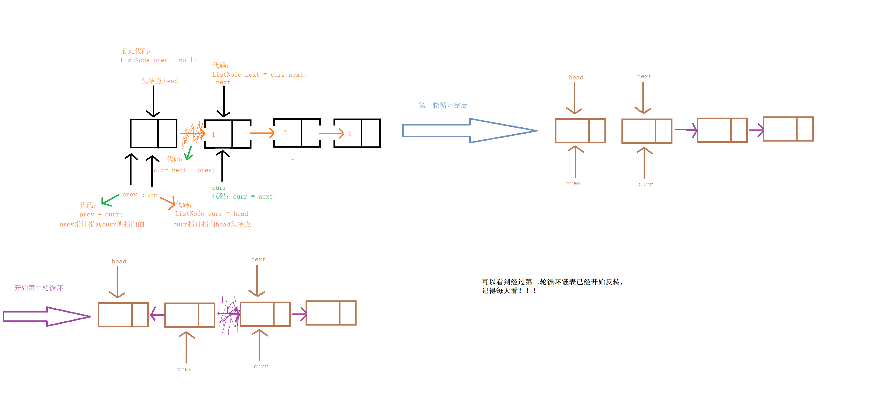
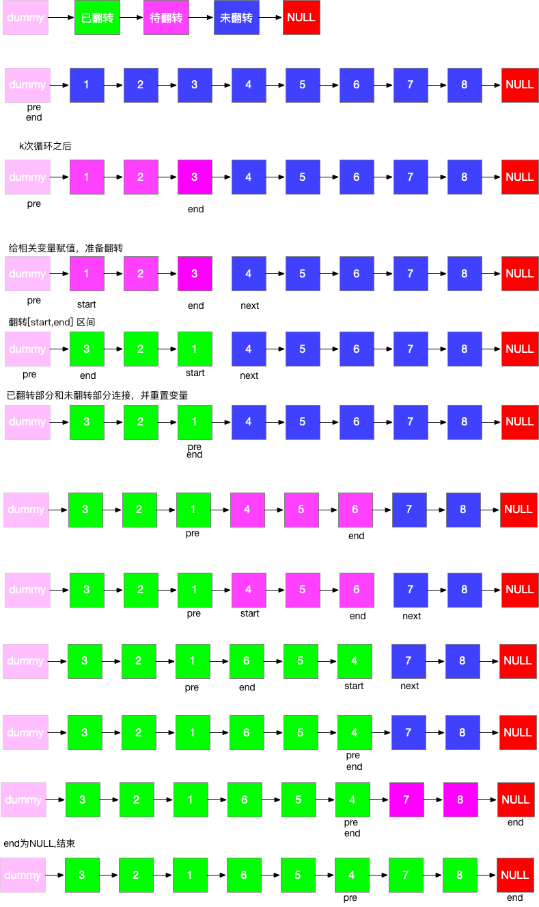

# 链表操作（迭代 / 递归）

### 反转链表

**反转大致有四种，其中有一种我们这里没有列出来是通过建立一个头指针，然后通过头插法一个一个插入节点**



```java
class Solution {
    //链表翻转——双指针解法
    // 例子：   head： 1->2->3->4
    public ListNode reverse(ListNode head) {
         //单链表为空或只有一个节点，直接返回原单链表
        if (head == null || head.next == null){
            return head;
        }
        //前一个节点指针
        ListNode preNode = null;
        //当前节点指针
        ListNode curNode = head;
        //下一个节点指针
        ListNode nextNode = null;
        while (curNode != null){
            nextNode = curNode.next;//nextNode 指向下一个节点,保存当前节点后面的链表。
            curNode.next=preNode;//将当前节点next域指向前一个节点   null<-1<-2<-3<-4
            preNode = curNode;//preNode 指针向后移动。preNode指向当前节点。
            curNode = nextNode;//curNode指针向后移动。下一个节点变成当前节点
        }
        //这里一定要返回pre，而不是cur 因为循环代码最后会将cur移动到tail的位置
        return preNode;
    }

    //递归解法
    public ListNode reverseList(ListNode head) {
        if(head == null || head.next == null)
            return head;
        //这里开始递归，其实就是循环遍历到链表的最后一个结点，使cur一直事最后一个结点，也就是反转完的第一个结点
        ListNode cur = reverseList(head.next);
        //这就是将后一个结点指向前一个结点，注意遍历到最后一个结点时，这个时候到head结点是最后一个结点的前一个，那么head.next.next就指明当前head结点后一个结点的指向
        head.next.next = head;
        //这里就是将原先head结点的指向置空
        head.next = null;
        return cur;
    }
}
```

**通过头指针原地进行反转**


```java
 public ListNode reverseList(ListNode head) {
        if(head == null || head.next == null)
            return head;
        ListNode cur = head;

        while(head.next != null){
            ListNode tail = head.next.next;
            head.next.next = cur;
            cur = head.next;
            head.next = tail;
        }

        return cur;
    }
```

### 反转链表 II


```java
public ListNode reverseBetween(ListNode head, int m, int n) {
        ListNode res = new ListNode(0);
        res.next = head;
        ListNode node = res;
        //找到需要反转的那一段的上一个节点。
        for (int i = 1; i < m; i++) {
            node = node.next;
        }
        //node.next就是需要反转的这段的起点。
        ListNode nextHead = node.next;
        ListNode next = null;
        ListNode pre = null;
        //反转m到n这一段
        for (int i = m; i <= n; i++) {
            next = nextHead.next;
            nextHead.next = pre;
            pre = nextHead;
            nextHead = next;
        }
        //将反转的起点的next指向next。
        node.next.next = next;
        //需要反转的那一段的上一个节点的next节点指向反转后链表的头结点
        node.next = pre;
        return res.next;
    }
```

### 合并两个有序链表

**迭代**

```java
class Solution {
    public ListNode mergeTwoLists(ListNode list1, ListNode list2) {
        if(list1 == null && list2 == null)
            return null;
        ListNode dummy = new ListNode(0);
        ListNode res = dummy;

        ListNode cur1 = list1;
        ListNode cur2 = list2;
        while(cur1 != null && cur2 != null){
            if(cur1.val < cur2.val){
                dummy.next = cur1;
                cur1 = cur1.next;
            }else{
                dummy.next = cur2;
                cur2 = cur2.next;
            }
            /*
            改成这样就去重
            else if(cur1.val > cur2.val){
                dummy.next = cur2;
                cur2 = cur2.next;
            }else{
                cur2 = cur2.next;
                continue;
            }
            */
            dummy = dummy.next;
        }
        dummy.next = cur1 == null ? cur2 : cur1;
        return res.next;
    }
}
```

递归

```java
class Solution {
    public ListNode mergeTwoLists(ListNode list1, ListNode list2) {
        if (list1 == null) {
            return list2;
        }
        if (list2 == null) {
            return list1;
        }
        if (list1.val < list2.val) {
            list1.next = mergeTwoLists(list1.next, list2);
            return list1;
        }
        list2.next = mergeTwoLists(list1, list2.next);
        return list2;
    }
}
```

### K 个一组翻转链表

**没啥好说的 理解清楚就是，保存断开节点，和保存反转前的首节点**

```java
class Solution {
    public ListNode reverseKGroup(ListNode head, int k) {
        if (head == null || head.next == null){
            return head;
        }
        //定义一个假的节点。
        ListNode dummy = new ListNode(0);
        //假节点的next指向head。
        // dummy->1->2->3->4->5
        dummy.next = head;
        //初始化pre和cur都指向dummy。pre指每次要翻转的链表的头结点的上一个节点。end指每次要翻转的链表的尾节点
        ListNode pre = dummy;
        ListNode cur = dummy;

        while(cur.next != null){
            //循环k次，找到需要翻转的链表的结尾,这里每次循环要判断cur是否等于空,因为如果为空，end.next会报空指针异常。
            //dummy->1->2->3->4->5 若k为2，循环2次，end指向2
            for(int i = 0; i < k && cur != null; i++){
                cur = cur.next;
            }
            //如果cur==null，即需要翻转的链表的节点数小于k，不执行翻转。
            if(cur == null){
                break;
            }
            //先记录下cur.next,方便后面链接链表
            ListNode next=cur.next;
            //然后断开链表
            cur.next=null;
            //记录下要翻转链表的头节点
            ListNode start=pre.next;
            //翻转链表,pre.next指向翻转后的链表。1->2 变成2->1。 temp->2->1
            pre.next=reverse(start);
            //翻转后头节点变到最后。通过.next把断开的链表重新链接。
            start.next=next;
            //将pre换成下次要翻转的链表的头结点的上一个节点。即start
            pre=start;
            //翻转结束，将cur置为下次要翻转的链表的头结点的上一个节点。即start
            cur=start;
        }
        return dummy.next;
    }
    
    
    public ListNode reverse(ListNode head){
		  if(head == null || head.next = null){
			  return head;
		  }
		  ListNode pre = null;
		  ListNode cur = head;
		  ListNode tail = null;
		  while(cur != null){
			  tail = cur.next;
			  cur.next = pre;
			  pre = cur;
			  cur = tail;
		  }
		  return pre;
    
    }
}
```



### 重排链表

**暴力解法**

```java
class Solution {
    //暴力方法，由于链表缺乏随机存储的特性，那么每次我们都需要遍历一遍链表去寻找尾结点，那么我们可以将全部结点存到一个顺序表中
    public void reorderList(ListNode head) {
        if(head == null)
            return;

        List<ListNode> list = new ArrayList<>();
        while(head != null){
            list.add(head);
            head = head.next;
        }

        //定义双指针
        int left = 0, right = list.size() - 1;

        while(left < right){
            //将第一个结点指向最后一个结点
            list.get(left).next = list.get(right);
            left++;
            //偶数个结点时提前相遇
            if(left == right)
                break;

            //将最后一个结点指向第二个结点，这样一轮一轮来循环
            list.get(right).next = list.get(left);
            right--;
        }
        //奇数个结点时，左指针先到达最后一个待指向结点，置为空即可
        list.get(left).next = null;
    }
}
```

**递归方法：感觉和暴力解法结构一样，只不过把尾结点的寻找用递归来替代了**


```java
public void reorderList(ListNode head) {

    if (head == null || head.next == null || head.next.next == null) {
        return;
    }
    int len = 0;
    ListNode h = head;
    //求出节点数
    while (h != null) {
        len++;
        h = h.next;
    }

    reorderListHelper(head, len);
}

private ListNode reorderListHelper(ListNode head, int len) {
    if (len == 1) {
        ListNode outTail = head.next;
        head.next = null;
        return outTail;
    }
    if (len == 2) {
        ListNode outTail = head.next.next;
        head.next.next = null;
        return outTail;
    }
    //得到对应的尾节点，并且将头结点和尾节点之间的链表通过递归处理
    ListNode tail = reorderListHelper(head.next, len - 2);
    ListNode subHead = head.next;//中间链表的头结点
    head.next = tail;
    ListNode outTail = tail.next;  //上一层 head 对应的 tail
    tail.next = subHead;
    return outTail;
}
```

**第三种方法：将链表平分,并将第二个链表倒置**


```java
public void reorderList(ListNode head) {
    if (head == null || head.next == null || head.next.next == null) {
        return;
    }
    //找中点，链表分成两个
    ListNode slow = head;
    ListNode fast = head;
    while (fast.next != null && fast.next.next != null) {
        slow = slow.next;
        fast = fast.next.next;
    }

    ListNode newHead = slow.next;
    slow.next = null;

    //第二个链表倒置
    newHead = reverseList(newHead);

    //链表节点依次连接
    while (newHead != null) {
        ListNode temp = newHead.next;
        newHead.next = head.next;
        head.next = newHead;
        head = newHead.next;
        newHead = temp;
    }

}

private ListNode reverseList(ListNode head) {
    if (head == null) {
        return null;
    }
    ListNode tail = head;
    head = head.next;
    tail.next = null;

    while (head != null) {
        ListNode temp = head.next;
        head.next = tail;
        tail = head;
        head = temp;
    }

    return tail;
}
```

### 删除排序链表中的重复元素

迭代遍历

```java
class Solution {
    public ListNode deleteDuplicates(ListNode head) {
        if (head == null) {
            return head;
        }

        ListNode cur = head;
        while (cur.next != null) {
            if (cur.val == cur.next.val) {
                cur.next = cur.next.next;
            } else {
                cur = cur.next;
            }
        }

        return head;
    }
}
```

### 删除排序链表中的重复元素 II

递归

```java
class Solution {
    //使用递归的方式
    public ListNode deleteDuplicates(ListNode head) {
        //如果头结点为空或者头结点的下一个为空就结束本层递归
        if(head == null || head.next == null)
            return head;
        if(head.val != head.next.val)
            head.next = deleteDuplicates(head.next);
        else{
            //两者相等的情况，就要看有几个结点是相等的，然后全部删除
            ListNode temp = head.next.next;
            while(temp != null && head.next == temp.next)
                temp = temp.next;
            //开始循环遍历删除重复结点
            return deleteDuplicates(temp);
        }
        return head;
    }
 }
```

迭代一

```java
class Solution {
    public ListNode deleteDuplicates(ListNode head) {
        //使用迭代的方式，一遍遍历一遍记录，到到达本结点与下个结点不想等
    //是，下个结点就是一个边界，然后直接将不重复的结点指向这个边界就好
        if(head == null)
            return null;
        //这个就是链表中经常出现的dummy结点，防止头结点重复被删除后，链表断裂的情况
        ListNode dummy = new ListNode(0);
        dummy.next = head;
        ListNode pre = dummy;
        ListNode cur = head;
        while(cur != null){
            //一直遍历到达要删除的右边界
            while(cur.next != null && cur.val == cur.next.val)
                cur = cur.next;
            //如果下一个节点是cur，说明cur的下一个并不相等，更新左边界
            if(pre.next == cur)
                pre = cur;
            else    //不相等则说明，右边界是在更新的，那么我们直接将左右边界中间的元素跳过删除
                pre.next = cur.next;
            cur = cur.next;
        }
        return dummy.next;
    }
}
```

**迭代二**

```java
//第二种迭代方式，就是利用map的性质，把结点的值出现的次数统计，然后在第二次遍历的时候，把次数不为一对结点删除
    public ListNode deleteDuplicates(ListNode head) {
        if(head == null || head.next == null)
            return head;
        Map<Integer, Integer> map = new HashMap<>();
        ListNode cur=head;
        List<Integer> l1=new ArrayList<Integer>();
        while(cur != null){
            //返回 key 相映射的的 value，如果给定的 key 在映射关系中找不到，则返回指定的默认值(就是第二个参数上的值)。
            map.put(cur.val, 
                    map.getOrDefault(cur.val, 0)+1);
            cur=cur.next;
        }

        //二次遍历
        Iterator<Map.Entry<Integer, Integer>> entries = map.entrySet().iterator();
        //找到次数大于0的map的key
        while(entries.hasNext()){
            Map.Entry<Integer, Integer> entry = entries.next();
            if(entry.getValue() > 1) 
                l1.add(entry.getKey());
        }
        //dummy结点，指向头指针
        ListNode pre = new ListNode(0);
        cur = head;
        pre.next = head;
        //开始遍历
        while(cur != null){
            if(l1.contains(cur.val)){
                if(cur.val == head.val) 
                    head = head.next;
                pre.next = cur.next;
            }else 
                pre = cur;
            cur = cur.next;
        }
        return head;
    }
}
```

### 两两交换链表中的节点

```java
class Solution {
    public ListNode swapPairs(ListNode head) {
        //递归结束条件就是当前为空或者只有一个剩余
        //因为一个就没办法换了啊
        if(head == null || head.next == null)
            return head;
        //咱们自己写出来了下面的逻辑，但没想到用递归，只实现了
        //单次递归的逻辑结构，其实写递归本来就是着眼于宏观，对于
        //单次的递归只需拿到我们想要的效果和返回值即可

        //先将两个节点的第二个节点记录
        ListNode tail = head.next;
        //然后将head的next指向后面换的链表，将第三个节点传入
        //作为新一层递归的第一个节点
        head.next = swapPairs(tail.next);
        //本层第二个节点换位成第一个节点指向原本第一个节点换位成
        //第二个节点
        tail.next = head;   

        //返回交换完后的节点
        return tail;
    }
}
```

### 旋转链表


```java
class Solution {
    public ListNode rotateRight(ListNode head, int k) {
        if(head == null || k == 0)
            return head;
        ListNode tail = head;   //尾节点
        int count = 1;  //记录链表长度，这里初始化为1，是因为下面的循环会少记录一个
        while(tail.next != null){
            tail = tail.next;
            count++;
        }
        //将k进行取余，好处当初始k大于链表的长度，是存在重复移动的，那么这等于将那些重复
        //移动消除
        k %= count; 
        ListNode p = head;
        //我们需要将p节点移动到n-k的位置，这个节点之后的所有结点都是需要进行反转的
        for(int i = 0; i < count - k - 1; i++){
            p = p.next;
        }
        tail.next = head;
        head = p.next;
        p.next = null;

        return head;
    }
}
```

### 奇偶链表


```java
class Solution {
    public ListNode oddEvenList(ListNode head) {
        if(head == null)
            return head;
        //奇数列表的头节点
        ListNode dummy = head;
        //偶数链表的头节点
        ListNode evenHead = head.next;
        ListNode even = evenHead;

        while(even != null && even.next != null){
            //让dummy的next指向下一个奇数
            dummy.next = even.next;
            //dummy移动到下一个奇数
            dummy = dummy.next;
            //同理
            even.next = dummy.next;
            even = even.next;

        }
        //两个链表相连接
        dummy.next = evenHead;
        return head;
    }
}
```

### 排序奇升偶降链表【**反转链表+合并两个有序列表+奇偶链表**】

题目描述：https://mp.weixin.qq.com/s/0WVa2wIAeG0nYnVndZiEXQ

**题干：链表，奇数位置按序增长，偶数位置按序递减，如何能实现链表从小到大？**

> 形如：给定一个奇数位升序，偶数位降序的链表，将其重新排序。
> 

`输入: 1->8->3->6->5->4->7->2->NULL` `输出: 1->2->3->4->5->6->7->8->NULL`

```java
class Solution {
    public ListNode oddEvenList(ListNode head) {
        if(head == null)
            return head;
        //奇数列表的头节点
        ListNode dummy = head;
        //偶数链表的头节点
        ListNode evenHead = head.next;
        ListNode even = evenHead;

        while(even != null && even.next != null){
            //让dummy的next指向下一个奇数
            dummy.next = even.next;
            //dummy移动到下一个奇数
            dummy = dummy.next;
            //同理
            even.next = dummy.next;
            even = even.next;

        }
        //反转偶数链表，因为偶数列表是降序，所以反转后是升序
        //合并两个有序的链表，两个链表的序列升降要一致
        evenHead = reverse(evenHead);

        //合并奇序列和偶序列，要按照顺序的
        head = mergeTwoLists(evenHead, head);

        return head;
    }

    //双指针反转链表
    public ListNode reverse(ListNode node){
        ListNode pre = null;
        ListNode cur = node;
        ListNode tail = null;
        while(cur != null){
            tail = cur.next;
            cur.next = pre;
            pre = cur;
            cur = tail;
        }
        return pre;
    }

    public ListNode mergeTwoLists(ListNode l1, ListNode l2) {
        ListNode res = new ListNode(-1);
        ListNode preNode = res;

        if(l1 == null && l2 == null)
            return null;
        //创建两个临时指向节点
        ListNode temp01 = l1;
        ListNode temp02 = l2;

        while(temp01 != null && temp02 != null){
            if(temp01.val < temp02.val){
                preNode.next = temp01;
                //这里别直接将大的连接到小的后面，因为还有可能有比大的节点
                //小的节点
                temp01 = temp01.next;
            }else{
                //同理
                preNode.next = temp02;
                temp02 = temp02.next;
            }
            preNode = preNode.next;
        }
        //处理最后一个剩余节点
        preNode.next = temp01 == null ? temp02 : temp01;
        return res.next;

    }
}
```

### 分隔链表

```java
class Solution {
    public ListNode partition(ListNode head, int x) {
        //设置两个节点，一个存放比x值要小的，一个存放大于等于x值的表， 所有都要按顺序加入
        //因为要保持相对位置
        ListNode dummy01 = new ListNode(0);
        //01存放小于x的链表
        ListNode curNodeDummy01 = dummy01;
        //02存放大于等于x的链表
        ListNode dummy02 = new ListNode(0);
        ListNode curNodeDummy02 = dummy02;

        while(head != null){
            //这里切记head = head.next，要在条件判断里面curNodeDummy01.next = head;的后面
            //如果不在curNodeDummy01.next = null;这一句就会把head也指向null
            //对于 = 用在对象上面，是把引用的指向改变了，而不是又创建了一份
            if(head.val < x){
                curNodeDummy01.next = head;
                head = head.next;
                curNodeDummy01 = curNodeDummy01.next;
                //一个一个加，加入进来整个head后，要把不需要的节点全部置为null
                curNodeDummy01.next = null;
            }
            else{
                curNodeDummy02.next = head;
                head = head.next;
                curNodeDummy02 = curNodeDummy02.next;
                curNodeDummy02.next = null;
            }                            
        }
        //拼接
        curNodeDummy01.next = dummy02.next;
        return dummy01.next;
    }
}
```

### 链表求和

```java
class Solution {
    //如果是正向的，对于我们从最低位加，但又是单链表前继节点找不到，
    //所以我们倒置就完事了，就是原本就是倒置的
    public ListNode addTwoNumbers(ListNode l1, ListNode l2) {
        if(l1 == null || l2 == null)
            return null;
        ListNode res = new ListNode(0);
        ListNode cur = res;
        int one = 0;
        while(l1 != null || l2 != null){
            int num1 = l1 != null ? l1.val : 0;
            int num2 = l2 != null ? l2.val : 0;
            cur.next = new ListNode((num1 + num2) % 10 + one);
            //进位
            one = (num1 + num2) / 10;

            l1 = l1.next;
            l2 = l2.next;
            cur = cur.next;
        }
        if(one == 1)
            cur.next = new ListNode(1);
        return res.next;
    }

    //如果是正向存放就是先将两个链表反转，然后把结果也反转，写一个反
    public ListNode reverse(ListNode root){
        if(root == null || root.next == null)
            return null;
        ListNode cur = reverse(root.next);
        root.next.next = root;
        root.next = null;
        return cur;
    }
}
```

### 两数相加


```java
class Solution {
    public ListNode addTwoNumbers(ListNode l1, ListNode l2) {
        //定义一个新联表伪指针，用来指向头指针，返回结果
        ListNode prev = new ListNode(0);
        //定义一个进位数的指针，用来存储当两数之和大于10的时候，
        int carry = 0;
        //定义一个可移动的指针，用来指向存储两个数之和的位置
        ListNode cur = prev;
        //当l1 不等于null或l2 不等于空时，就进入循环
        while(l1 != null || l2 != null){
            //如果l1 不等于null时，就取他的值，等于null时，就赋值0，保持两个链表具有相同的位数
            int x = l1 != null ? l1.val : 0;
             //如果l1 不等于null时，就取他的值，等于null时，就赋值0，保持两个链表具有相同的位数
            int y = l2 != null ? l2.val : 0;
            //将两个链表的值，进行相加，并加上进位数
            int sum = x + y + carry;
            //计算进位数
            carry = sum / 10;
            //计算两个数的和，此时排除超过10的请况（大于10，取余数）
            sum = sum % 10;
            //将求和数赋值给新链表的节点，
            //注意这个时候不能直接将sum赋值给cur.next = sum。这时候会报，类型不匹配。
            //所以这个时候要创一个新的节点，将值赋予节点
            cur.next = new ListNode(sum);
            //将新链表的节点后移
            cur = cur.next;
            //当链表l1不等于null的时候，将l1 的节点后移
            if(l1 != null){
                l1 = l1.next;
            }
            //当链表l2 不等于null的时候，将l2的节点后移
            if(l2 != null){
                l2 = l2.next;
            } 
        }
        //如果最后两个数，相加的时候有进位数的时候，就将进位数，赋予链表的新节点。
        //两数相加最多小于20，所以的的值最大只能时1
        if(carry == 1){
            cur.next = new ListNode(carry);
        }
        //返回链表的头节点
        return prev.next;
    }
}
```

### 两数相加 II

**这道题跟 1 的区别就是不要求数据时反向加了，但是我们相加是从低位往上加的，不反转反而不好处理，那么我们就可以先进行反转，在相加套用以前的逻辑**

```java
class Solution {
    //与 1 的区别就是没有逆序相加，而是头节点就是最高位，那么我们就要先遍历，然后逐步向前
    //但是由于题目所给的链表不是双向链表，所以我们可以采用反转后再一次遍历相加
    //同样也可以用栈的思想来形成一个隐形的前置节点
    public ListNode addTwoNumbers(ListNode l1, ListNode l2) {
        //定义一个新联表伪指针，用来指向头指针，返回结果
        ListNode prev = new ListNode(0);
        //定义一个进位数的指针，用来存储当两数之和大于10的时候，
        int carry = 0;
        //定义一个可移动的指针，用来指向存储两个数之和的位置
        ListNode cur = prev;
        //当l1 不等于null或l2 不等于空时，就进入循环
        l1 = reverse(l1);
        l2 = reverse(l2);
        while(l1 != null || l2 != null){
            //如果l1 不等于null时，就取他的值，等于null时，就赋值0，保持两个链表具有相同的位数
            int x = l1 != null ? l1.val : 0;
             //如果l1 不等于null时，就取他的值，等于null时，就赋值0，保持两个链表具有相同的位数
            int y = l2 != null ? l2.val : 0;
            //将两个链表的值，进行相加，并加上进位数
            int sum = x + y + carry;
            //计算进位数
            carry = sum / 10;
            //计算两个数的和，此时排除超过10的请况（大于10，取余数）
            sum = sum % 10;
            //将求和数赋值给新链表的节点，
            //注意这个时候不能直接将sum赋值给cur.next = sum。这时候会报，类型不匹配。
            //所以这个时候要创一个新的节点，将值赋予节点
            cur.next = new ListNode(sum);
            //将新链表的节点后移
            cur = cur.next;
            //当链表l1不等于null的时候，将l1 的节点后移
            if(l1 != null){
                l1 = l1.next;
            }
            //当链表l2 不等于null的时候，将l2的节点后移
            if(l2 != null){
                l2 = l2.next;
            } 
        }
        //如果最后两个数，相加的时候有进位数的时候，就将进位数，赋予链表的新节点。
        //两数相加最多小于20，所以的的值最大只能时1
        if(carry == 1){
            cur.next = new ListNode(carry);
        }
        //返回链表的头节点
        return reverse(prev.next);
    }

    public ListNode reverse(ListNode node){
        ListNode pre = null;
        ListNode cur = node;
        ListNode tail = null;
        while(cur != null){
            tail = cur.next;
            cur.next = pre;
            pre = cur;
            cur = tail;

        }
        return pre;
    }
}
```

### 删除链表中的节点


```java
class Solution {
    public ListNode deleteNode(ListNode head, int val) {
        if(head==null)
            return null;
        if(head.val==val)
            return head.next;
        ListNode temp = head;
        ListNode pre = head;
        while(temp!=null){
            if(temp.val!=val){
                pre = temp;
                temp = temp.next;
            }else 
                break;
        }
        pre.next = temp.next;
        temp.next=null;
        return head;
    }
}
```

### 从尾到头打印链表

```java
class Solution {
    public int[] reversePrint(ListNode head) {
        Deque<Integer> stack = new LinkedList<>();
        ListNode curNode = head;
        //如果判断next是否为null，最后一个结点就扫描不到
        while(curNode!=null){
            stack.push(curNode.val);
            curNode = curNode.next;
        }
        int[] res = new int[stack.size()];
        //这里要切记stack.size()是会随着出栈而变化的
        int length = stack.size();
        for(int i = 0;i<length;i++){
            res[i] = stack.pop();
        }
        return res;
    }
}
```